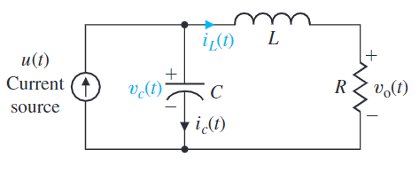
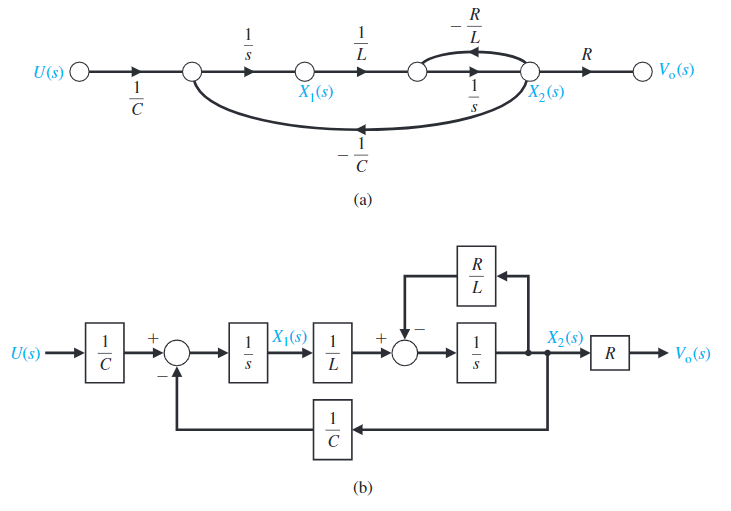

#! https://zhuanlan.zhihu.com/p/467039497
# ACnD 1. 状态空间 -- 练习

下方的 RLC 电路图为例。其输入量为一个恒流电源，输出量是电阻两端的电压。



我们首先我们来确定系统的状态量。这里我们选择两个状态量 $X(t) = (x_1(t), x_2(t))$，其中 $x_1(t)$ 是电容电压 (capacitor voltage) $v_c(t)$，$x_2(t)$ 是电感电流 (inductor  current) $i_L(t)$。这样选择是因为系统所储存的能量可以被这两个状态量所描述：

$$
E = \frac{1}{2}L\,i_L^2(t) + \frac{1}{2}C\,V_c^2(t)
$$

> 一般来说，系统状态量的数量与系统中储能元件的数量一致。

对系统，在节点处应用基尔霍夫电流定律可以得到流经电容的电流量 $i_c(t)$：

$$
i_c(t) = C\frac{dv_c(t)}{dt} = + u(t) - i_L(t)
$$

在对右侧的回路使用基尔霍夫电压定律可以得到等式：

$$
L\frac{di_L(t)}{dt} = -Ri_L(t) + v_c(t)
$$

系统的输出量可以被表示为：

$$
v_o(t) = Ri_L(t)
$$

由上面的三个等式，我们可以推导处系统的状态变化方程，以及输出方程：

$$
\begin{aligned}
    \frac{dx_1(t)}{dt} &= -\frac{1}{C}x_2(t)  + \frac{1}{C}u(t)\\
    \frac{dx_2(t)}{dt} &= +\frac{1}{L}x_1(t) - \frac{R}{L}x_2(t)\\
    y(t) &= v_o(t) = Rx_2(t) 
\end{aligned}
$$


写成矩阵形式就是：

$$
\begin{aligned}
\begin{bmatrix}
    \dot{x_1} \\ \dot{x_2}
\end{bmatrix} &= 
\begin{bmatrix}
    0 & -\frac{1}{C}\\
    \frac{1}{L} & -\frac{R}{L}
\end{bmatrix} 
\begin{bmatrix}
    x_1(t) \\ x_2(t)
\end{bmatrix}+ 
\begin{bmatrix}
    \frac{1}{C} \\ 0
\end{bmatrix}
u(t)
\\
y(t) &= 
\begin{bmatrix}
    0 & R
\end{bmatrix}
\begin{bmatrix}
    x_1(t) \\ x_2(t)
\end{bmatrix}
\end{aligned}
$$


由状态方程可以计算出系统的拉普拉斯变换方程：

$$
G(s) =  C(SI -A)^{-1}B + D = \frac{R/(LC)}{s^2 + (R/L)s + 1/(LC)}
$$

由拉普拉斯变换方程，我们可以画出系统的信号流动图以框图：



将变量输入 Matlab，并构建系统

由于 Matlab 中的函数 `ss( )` 不支持符号语言，所以这里给令 C = 1, R = 2, L = 3。


```matlab
% Define system parameters
C = 1;
R = 2;
L = 3;

A = [0 -1/C; 1/L -R/L];
B = [1/C; 0];
C = [0 R];
D = [0];

% Create state space system
sys = ss(A,B,C,D);
```

    
    


```matlab
% Convert to transfer functions
G = tf(sys)
```

    
    G =
     
              0.6667
      -----------------------
      s^2 + 0.6667 s + 0.3333
     
    Continuous-time transfer function.
    
    
    

- 上篇： [ACnD 1. 状态空间模型 (State Space Model)](https://zhuanlan.zhihu.com/p/466790657)
- 下篇： [ACnD 2. 稳定性 (Stability)](https://zhuanlan.zhihu.com/p/467088278)
