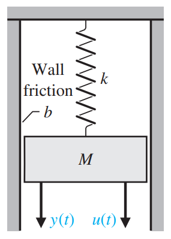
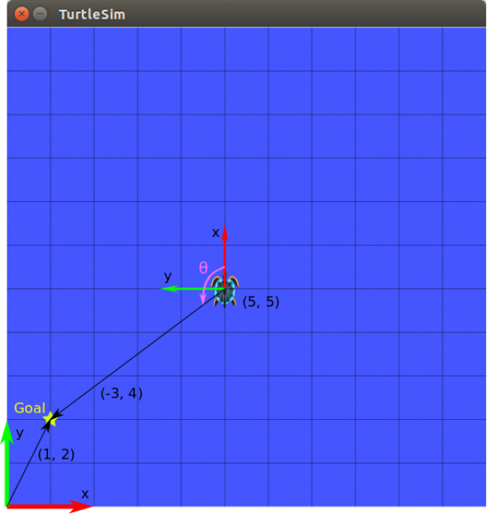
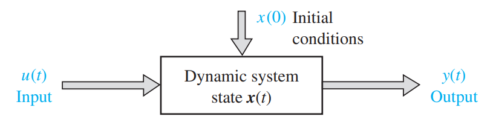
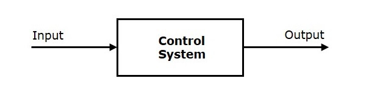
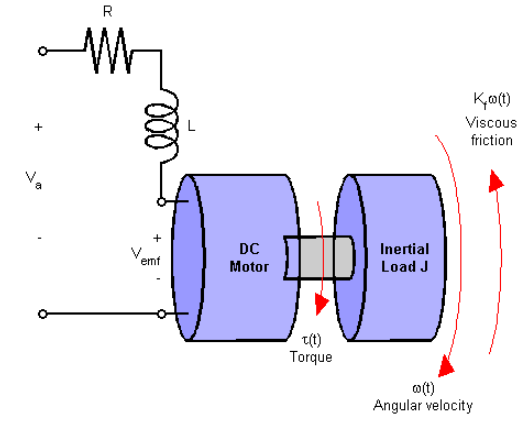
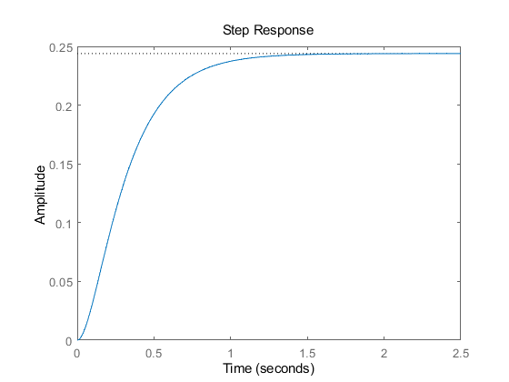

#! https://zhuanlan.zhihu.com/p/466790657
# ACnD 1. 状态空间模型 (State Space Model)
  

> 参考：

>- UWE 的课程视频以及笔记（非公开链接）
>-  [Matlab Tech Talk State Space](https://www.youtube.com/watch?v=hpeKrMG-WP0\&t=53s\&ab_channel=MATLAB)
>- 书籍 [Modern Control Systems](https://www.amazon.co.uk/Modern-Control-Systems-Global-Richard/dp/1292152974/ref=sr_1_1?crid=J0DQPEBQ2PXP\&keywords=modern+control+systems\&qid=1644591893\&sprefix=modern+control+system%2Caps%2C39\&sr=8-1)

  
# 1. 引例
  

这里我们暂时不讲状态空间模型的定义是什么，先来看一个简单的状态空间模型的例题：




现在我们来研究图一的 弹簧-质量-阻尼系统 (SMD)，我们想要知道，在给定一个力 $f(t)$ 作为系统输入量 $u(t)$ 的时候， 以及质量块 M 随时间变化的位移 x，速度 $\dot{x}$ 的方程。其中我们设置位移 $x$ 作为系统的输出量 $y\left(t\right)\;$。

我们将 $x$ 和 $\dot{x}$ 作为向量 $X$ 的两个基。这里的 $X$ 就是系统的状态向量，而 $x$ 和 $\dot{x}$ 就是这个系统两个状态分量，用向量的形式写出来就是：

$$
X=\begin{bmatrix}
    x_1 \\ x_2
\end{bmatrix}=
\begin{bmatrix}
    x \\ \dot{x}
\end{bmatrix}
$$

$X$ 与 $y$ 的关系则为：

$$
X=\begin{bmatrix}
    x_1(t) \\ x_2(t)
\end{bmatrix}=
\begin{bmatrix}
    y(t) \\ \frac{dy(t)}{dt}
\end{bmatrix}
$$

关于系统，可以写出下面的微分方程，即该模型的数学表达式：

$$M\frac{dx_2 (t)}{dt}+bx_2 (t)+kx_1(t)=u(t)$$

由这个微分方程我们可以解出系统状态的变化量 $\dot{x_1 }$和 $\dot{x_2 }$ 关于当前状态的方程：

$$\begin{array}{l} \dot{x_1 } =x_2 \\ \dot{x_2 \;} =\frac{u\left(t\right)-{\textrm{bx}}_2 \left(t\right)-{\textrm{kx}}_1 \left(t\right)}{M} \end{array}$$

即：

$$\dot{X} =\left\lbrack \begin{array}{cc} 0 & 1\\ -\frac{k}{M} & -\frac{b}{M} \end{array}\right\rbrack \left\lbrack \begin{array}{c} x_1 \\ x_2  \end{array}\right\rbrack +\left\lbrack \begin{array}{c} 0\\ \frac{1}{M} \end{array}\right\rbrack u\left(t\right)$$

而系统的输出量$y\left(t\right)$ 也可以写成关于当前状态的方程：

$$y=\left\lbrack \begin{array}{cc} 1 & 0 \end{array}\right\rbrack \left\lbrack \begin{array}{c} x_1 \\ x_2  \end{array}\right\rbrack +\left\lbrack 0\right\rbrack u\left(t\right)$$

到此，我们就完成了对该例题的状态空间建模。

# 2. 概念解释
  
## 2.1 状态：

这里的状态，是一个$n$ 维向量：$X\in \mathbb{R} ^n$。我们要求由这个状态量的 $n$ 足够描述模型当前的输出量以及未来某个时刻的状态。比如一个乌龟模型，我们想知道的输出量是乌龟在一个二维空间中某一时刻的方位。那么对于模型状态来说，我们就需要知道乌龟的坐标位置$\left(x,y\right)$，乌龟的朝向$\;\theta \;$，以及乌龟的前进速度 $v$，转向速度 $\omega$。



  
## 2.2 模型：

对于状态空间模型而言，我们将模型由输入$u\left(t\right)$，状态 $x\left(t\right)$，和输出$y\left(t\right)$构成：



  

对于此模型，我们可以写出以下两个方程：

$$\begin{array}{l} \dot{X} =\textrm{AX}+\textrm{Bu}\\ y=\textrm{CX}+\textrm{Du} \end{array}$$

即模型的输出量，以及状态的变换量都可以由当前状态和输入量计算出来。

## 2.3 与传统模型的关系：

对于传统控制论来说，我们并不考虑当前的状态，而是将系统作为一个由输入变换到输出的方程：



$$G\left(s\right)=\frac{Y\left(s\right)}{U\left(s\right)}$$

传统模型与状态模型之间的关系可以写成（省略推导过程）：

$$G\left(s\right)={C\left(\textrm{SI}-A\right)}^{-1} B+D$$

其中：$\textrm{ABCD}$ 都是状态空间模型中的参数。而$\;S$ 为拉普拉斯变换后的输入，$I$ 为单位矩阵。

由此，我们可知，状态空间中的 $A$ 矩阵的特征值，就是 $G\left(s\right)$ 的极点。

# 3. Matlab：
## 3.1 常用函数：

当我们知道系统的  A B C D 时，可以用 `ss( )` 函数快速创建系统：

```matlab:Code
% Define A, B, C, D matrices
A = [0 1; -5 -6];
B = [0; 2];
C = [0 1; 0 1];
D = [0;0];

% Create state space model
sys = ss(A,B,C,D)
```

```text:Output
sys =
 
  A = 
       x1  x2
   x1   0   1
   x2  -5  -6
 
  B = 
       u1
   x1   0
   x2   2
 
  C = 
       x1  x2
   y1   0   1
   y2   0   1
 
  D = 
       u1
   y1   0
   y2   0
 
Continuous-time state-space model.
```

由状态空间模型也可以用 `tf( )` 做拉普拉斯变换：

```matlab:Code
% Convert to transfer functions
G = tf(sys)
```

```text:Output
G =
 
  From input to output...
            2 s
   1:  -------------
       s^2 + 6 s + 5
 
            2 s
   2:  -------------
       s^2 + 6 s + 5
 
Continuous-time transfer function.
```

## 3.2 示例 - 直流电机控制：

在电枢控制的直流电机中，施加的电压 $V_a$ 控制轴的角速度 $\omega$。



模型的物理参数如下：

```matlab:Code
R = 2.0;                % Ohms
L = 0.5;                % Henrys
Km = 0.1;               % torque constant
Kb = 0.1;               % back emf constant
Kf = 0.2;               % Nms
J = 0.02;               % kg.m^2/s^2
```

首先构建具有两个输入 $V_a \;,T_d$ 和一个输出 $\omega$ 的直流电机的状态空间模型：

```matlab:Code
h1 = tf(Km,[L R]);            % armature
h2 = tf(1,[J Kf]);            % eqn of motion

dcm = ss(h2) * [h1 , 1];      % w = h2 * (h1*Va + Td)
dcm = feedback(dcm,Kb,1,1);   % close back emf loop
```

现在绘制角速度对电压 Va 阶跃变化的响应：

```matlab:Code
stepplot(dcm(1));
```



- 下篇：[ ]()