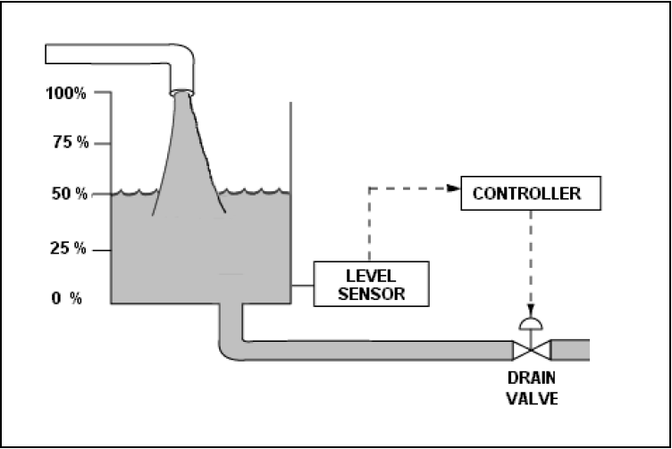

#! https://zhuanlan.zhihu.com/p/467542401
# ACnD 3. 可控性与可观测性 (Controllablity and Obeservablity)

## 1. 可控性 (Controllablity)

### 1.1. 直观的理解

对于一个状态空间系统来说，我们说一个系统是可控的，就是说系统的状态可以被输入量控制到我们想到的位置。

比如，下面的一个水池灌水的例子：



这里的输入量是水的净流入量 $u$（流入-流出）。而系统的状态是水池的深度 $x$。那么系统的状态方程就可以被写成：

$$
\dot{x} = Ax + Bu
$$

对于该系统来说，我们可以直观的感受到，水池的深度可以被输入量直接控制，所以是一个可控系统。

关于可控性更加准确的定义是：

**如果存在一个不受约束的控制量 $u(t)$，使得系统的初始状态 $x(t_0)$ 在有限时间 $t_0 \leq t \leq T$ 转变到一个我们期望的状态 $x(t)$，则称系统是可控的。**

###  1.2 判断方法

对于系统：

$$
\dot{x} = Ax + Bu
$$

我们可以使用一个矩阵 $P$ 来判断：

$$
P = 
\begin{bmatrix}
    B &AB &A^2B &... & A^{n-1}B
\end{bmatrix}
$$

当 $P$ 满秩，则说明系统是可控的。

我们来看一个例子：

$$
\begin{bmatrix}
    \dot{x_1}\\
    \dot{x_2}
\end{bmatrix} = 
\begin{bmatrix}
    0 & 1\\
    0 & 2
\end{bmatrix}
\begin{bmatrix}
    x_1 \\ x_2
\end{bmatrix}+
\begin{bmatrix}
    0 \\ 1
\end{bmatrix}u
$$

可以计算出 $P$:

$$
P =
\begin{bmatrix}
    B & AB
\end{bmatrix}=
\begin{bmatrix}
    \begin{bmatrix}
        0 \\ 1
    \end{bmatrix}
    &\begin{bmatrix}
        1 & 0\\
        0 & 2\\
    \end{bmatrix}
    \begin{bmatrix}
        0 \\ 1
    \end{bmatrix}
\end{bmatrix}=
\begin{bmatrix}
    0 & 0\\
    1 & 2\\
\end{bmatrix}
$$

该矩阵的秩为 $Rank = 1$。因此该系统是不可控的。我们从系统状态方程也可以直观的感受出来，系统的 $\dot{x_2}$ 是可以被 $u$ 影响的，但 $x_1$ 并不被影响。因此我们说系统不受控制。

对于不受控的系统，我们也可以通过计算 $P$ 的行列式。如果 $det(P) = 0$，就说明 $P$ 不是满秩的。

### 1.3 Matlab 实现

我们举一个稍微复杂一点的例子：

$$
\begin{bmatrix}
    \dot{x_1}\\
    \dot{x_2}\\
    \dot{x_3}
\end{bmatrix} =
\begin{bmatrix}
    0 & 1 & 0\\
    0 & 0 & 1\\
    -2 & -3 & -5
\end{bmatrix}
\begin{bmatrix}
    x_1 \\ x_2 \\ x_3
\end{bmatrix} +
\begin{bmatrix}
    0\\0\\1
\end{bmatrix}u
$$

下面，我们用 Matlab 来判断该系统是否是可控的。


```matlab
A = [0 1 0; 0 0 1; -2 -3 -5];
B = [0; 0; 1];

P = ctrb(A,B)

[c,r] = size(P);
if rank(P) == min(c,r)
    disp('The system is controllable');
else
    disp('The system is not controllable');
end
```

    
    P =
    
         0     0     1
         0     1    -5
         1    -5    22
    
    The system is controllable
    
    

当然，我们也可以来计算一下 $P$ 的行列式


```matlab
det(P)

if det(P) == 0
    disp('The system is not controllable');
else
    disp('The system is controllable');
end
```

    
    ans =
    
        -1
    
    The system is controllable
    
    

系统是可控的！现在我们回看该系统。我们发现，该系统只有一个输入输入量 $u_3$，且只能直接控制 $x_3$。但实际上，我们只用了着一个输入量控制了整个系统的三个状态量。因为其他两个状态也会影响到 $x_3$ 的变化，因此，$u_3$ 可以间接控制其他两个状态量。

## 2. 可观测性 (Obeservablity)

### 2.1 定义与判断：

**当且仅当一个系统的初始状态 $x_0$ ，在给定控制量 $u(t)$ 的情况下，可以被在有限时间范围内的历史输出量 $y(t) \quad 0  \leq t \leq T$ 得到。则说明该系统是可观测的。**

要判读一个状态系统

$$
\begin{aligned}
\dot{x} = Ax + Bu\\
y = Cx + Du    
\end{aligned}
$$

是否可观测，可以通过 $R$ 矩阵实现。

$$
R = \begin{bmatrix}
    C\\
    CA\\
    \vdots\\
    CA^{n-1}
\end{bmatrix}
$$

如果 $R$ 矩阵是满秩的则说明系统是可观测的，相反则不可观测。

### 2.2 例子

这里我们依然用之前的三阶系统为例，用 Matlab 判断系统是否可观测。

$$
   \begin{bmatrix}
    \dot{x_1}\\
    \dot{x_2}\\
    \dot{x_3}
\end{bmatrix} =
\begin{bmatrix}
    0 & 1 & 0\\
    0 & 0 & 1\\
    -2 & -3 & -5
\end{bmatrix}
\begin{bmatrix}
    x_1 \\ x_2 \\ x_3
\end{bmatrix} +
\begin{bmatrix}
    0\\0\\1
\end{bmatrix}u\\
$$

$$
y =
\begin{bmatrix}
    1 & 0& 0
\end{bmatrix}x
$$


```matlab
A = [0 1 0; 0 0 1; -2 -3 -5];
C = [1 0 0];

R = obsv(A,C)

[c,r] = size(R);

if rank(R) == min(c,r)
    disp('The system is observable');
else
    disp('The system is not observable');
end
```

    
    R =
    
         1     0     0
         0     1     0
         0     0     1
    
    The system is observable
    
    

- 上篇：[ACnD 2. 稳定性 (Stability)](https://zhuanlan.zhihu.com/p/467088278)
- 下篇：[ACnD 4. 设计控制器 (Contorller Design)](https://zhuanlan.zhihu.com/p/470029508)
