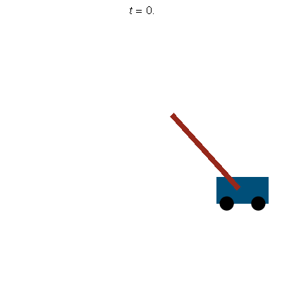
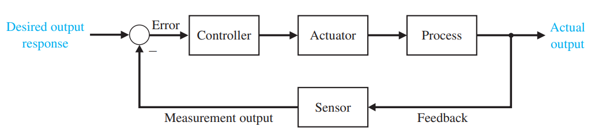
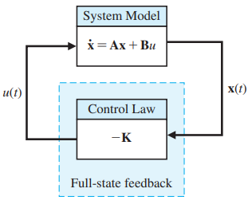
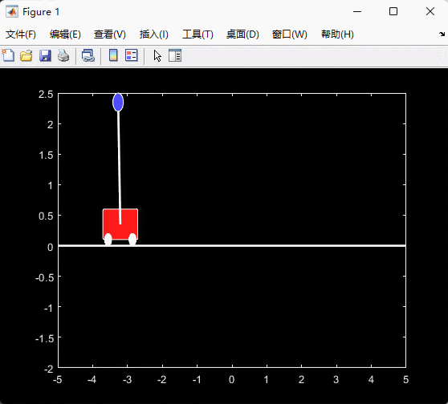
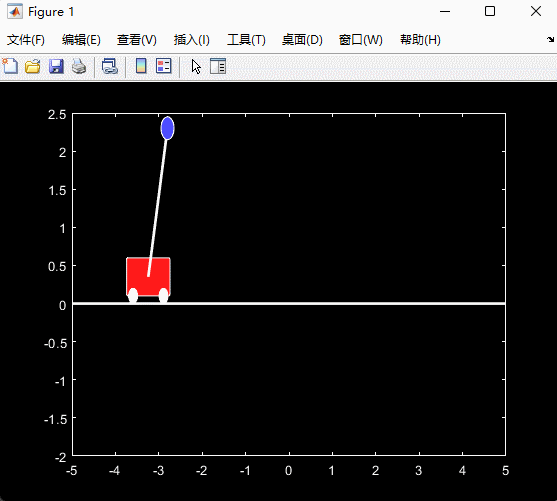
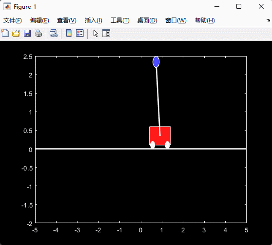
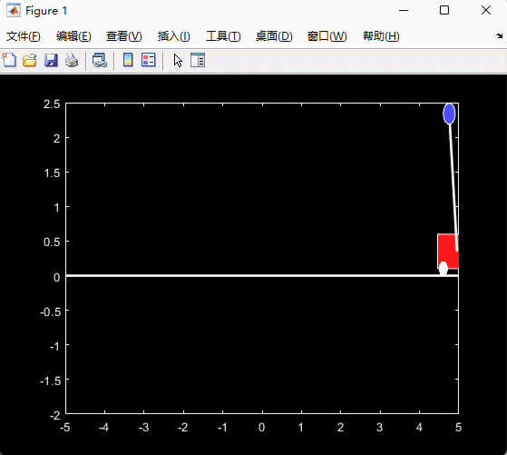
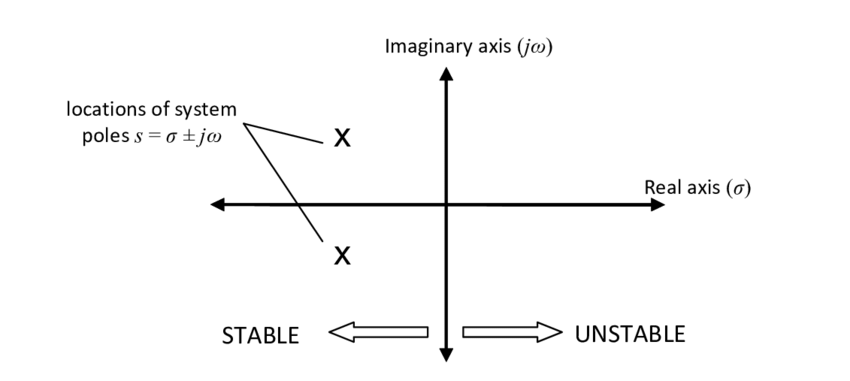
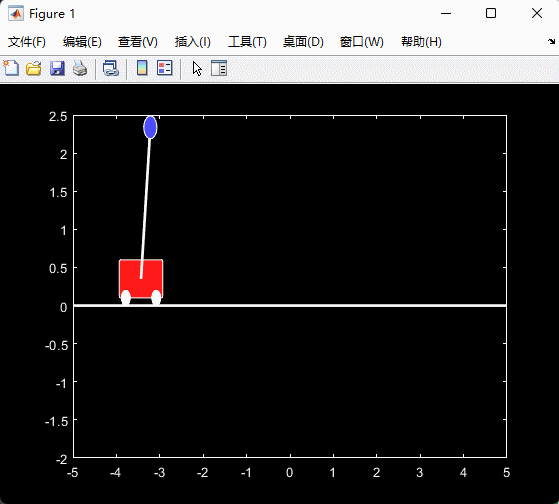

#! https://zhuanlan.zhihu.com/p/470029508
# ACnD 4. 设计控制器 (Contorller Design)

## 1. 引例

### 1.1 问题描述

现在我们要设计一个控制器，使一个小车上的倒单摆 (Inverted Pendulum) 可以保持平衡（不倒）。该示例如下图所示：


参数描述：

|符号|描述|量|
| - | - | - |
|(M)       |车的质量             |5 kg|
|(m)       |摆的质量             |1 kg|
|(b)       |推车摩擦系数         |1 N/m/sec|
|(l)       |到摆质心的长度        |2 m|
|(g)       |重力                 |-10 m/s^2|
|(F)       |施加在推车上的力| |
|(x)       |车位置坐标| |
|(theta)   |摆角| |

### 1.2 问题分析和建模

该例题的状态可以由车的位置，速度，摆的角度和角速度来描述：

$$
x = \begin{bmatrix}
    x \\ \dot{x} \\ \theta \\ \dot{\theta}
\end{bmatrix}
$$

现在我们对系统进行力学分析，可以得到以下的非线性方程：

$$
\begin{aligned}
    &\dot{x} = v\\
    &\ddot{x} = \frac{-m^2L^2gcos(\theta)+mL^2(mL\omega^2sin(\theta)-\delta v)+mL^2u}{mL^2(M+m(1-cos(\theta)^2))}\\
    &\dot{\theta} = \omega\\
    &\ddot{\theta} = \frac{(M+m)mgLsin(\theta)-mLcos(\theta)(mL\omega^2sin(\theta)-\delta v)+mLcos(\theta)u}{mL^2(M+m(1-cos(\theta)^2))}
\end{aligned}
$$

> 想要了解具体怎么算出来的同学可以查看:
> - [MIT Opencourseware | R8. Cart and Pendulum, Lagrange Method](https://www.youtube.com/watch?v=-QVENB3aEvY&ab_channel=MITOpenCourseWare)
> - [Control Tutorials for Matlab](https://ctms.engin.umich.edu/CTMS/index.php?example=InvertedPendulum&section=SystemModeling)


然后我们来找一下此问题的平衡点(Fixed points)。很明显的，当单摆垂直向下且静止或垂直向上且静止的时候，该系统处于平衡状态。且该状态不论小车在哪里都可能存在，即 $x$ 在不受约束。现在我们设定，当单摆向上静止的时候，$\theta = \pi$，向下为 $\theta = 0$。此时，其他的状态量为：$\dot{\theta} = 0, \dot{x} = 0$。

除此之外，系统在此平衡点附近时，可以较为轻松将非线性的状态方程转换成线性的。因为，在 $\theta = \pi$ 附近，三角函数有以下的近似关系：

$$
\begin{aligned}
&cos\theta = cos(\pi + \Phi) \approx -1\\
&sin\theta = sin(\pi + \Phi) \approx -\Phi\\
&\dot{\theta}^2 = \dot{\Phi}^2 \approx 0
\end{aligned}
$$

在 $\theta = 0$ 附近时：

$$
\begin{aligned}
&cos\theta = cos(\Phi) \approx 1\\
&sin\theta = sin(\Phi) \approx \Phi\\
&\dot{\theta}^2 = \dot{\Phi}^2 \approx 0
\end{aligned}
$$

由此我们可以得到系统的状态方程：

$$
\frac{d}{dt}\begin{bmatrix}
    x_1 \\ x_2 \\ x_3 \\ x_4
\end{bmatrix} = 
\begin{bmatrix}
    0 & 1 & 0 & 0\\
    0 & -\frac{\delta}{M} & b\frac{mg}{M} & 0\\
    0 & 0 & 0 & 1\\
    0 & -b\frac{\delta}{ML} & -b\frac{(m+M)g}{ML} & 0
\end{bmatrix}
\begin{bmatrix}
    x_1 \\ x_2 \\ x_3 \\ x_4
\end{bmatrix} + 
\begin{bmatrix}
    0 \\ \frac{1}{M} \\ 0 \\ b\frac{1}{ML}
\end{bmatrix} u, \,
for \,
\begin{bmatrix}
    x_1 \\ x_2 \\ x_3 \\ x_4
\end{bmatrix} = 
\begin{bmatrix}
    x \\ v \\ \theta \\ \omega
\end{bmatrix}
$$

其中当 b = 1 时，代表 $\theta \approx \pi$，即接近上平衡点； b = -1 时，代表 $\theta \approx 0$，即接近下平衡点。

### 1.3 Matlab 实现

> 在进行下面的部分之前，请先下载 [本例题的代码仓库](https://github.com/rsatwik/Steve_Brunton_Control_Bootcamp)。后续代码中的一些函数会直接从该仓库中调用。


下面将之前已经得出的式子输入到 Matlab 中：

首先是非线性的系统方程：


```matlab
function dy = cartpend(y,m,M,L,g,d,u)

    Sy = sin(y(3));
    Cy = cos(y(3));
    D = m*L*L*(M+m*(1-Cy^2));
    
    dy(1,1) = y(2);
    dy(2,1) = (1/D)*(-m^2*L^2*g*Cy*Sy + m*L^2*(m*L*y(4)^2*Sy - d*y(2))) + m*L*L*(1/D)*u;
    dy(3,1) = y(4);
    dy(4,1) = (1/D)*((m+M)*m*g*L*Sy - m*L*Cy*(m*L*y(4)^2*Sy - d*y(2))) - m*L*Cy*(1/D)*u +.01*randn;
```

然后是在上平衡点附近的系统方程：


```matlab
clear all, close all, clc
m = 1; M = 5; L = 2; g = -10; d = 1;
b = 1; % Pendulum up (b=1)
A = [0 1 0 0;
    0 -d/M b*m*g/M 0;
    0 0 0 1;
    0 -b*d/(M*L) -b*(m+M)*g/(M*L) 0];
B = [0; 1/M; 0; b*1/(M*L)];
```

    
    

然后，我们可以通过之前学过的知识，查看开环系统的稳定性和可控性：


```matlab
lambda = eig(A)
```

    
    lambda =
    
             0
       -2.4311
       -0.2336
        2.4648
    
    
    

由于 $\lambda$ 的最后一项为正，因此开环系统是不稳定的。

再看其可控性：


```matlab
P = ctrb(A,B);

[c,r] = size(P);
if rank(P) == min(c,r)
    disp('The system is controllable');
else
    disp('The system is not controllable');
end
```

    The system is controllable
    
    

很好，系统是可控的，那么接下来我们就要设计一个控制器使得系统可以稳定在上平衡点。如下图所示：




## 2. 控制器的设计

设计控制器，实际上就是找到一个合适的输入量 $u(t)$ 使得系统在指定时间或限定能量下达到我们预期的状态或输出。



本文主要介绍**全状态反馈控制** (full state feedback control)

其框图如下：



全状态反馈控制，顾名思义就是将系统的所有状态量输入到反馈环节，经过一定程度的放大后再作为系统的输入量，输入模型。因此模型输入量的表达式为：$u = -kx$。那么系统的状态方程就可以写作：

$$
\begin{aligned}    
\dot{x} &= Ax - Bkx\\
\dot{x} &= (A-Bk)x
\end{aligned}
$$

而，$A-Bk$ 即为闭环系统 (Closed loop system) 的状态矩阵，记作：$A_{cl}=A-Bk$。

### 2.1 极点布置 (Pole Placement)

之前讲稳定性的时候提到过，当系统的特征值 $\lambda$ 都为负数时，系统便是稳定的。而极点布置的意思，就是通过改变 $k$ 值，从而将 $A_{cl}$ 的特征值转变为我们需要的值，从而改变系统的稳定性和时域表现。

依然以上面的倒单摆为例，之前我们的特质值为：


```matlab
lambda
```

    
    lambda =
    
             0
       -2.4311
       -0.2336
        2.4648
    
    
    

现在我们通过极点布置的方法让特征值变成：[-1.1; -1.2; -1.3; -1.4]。在 Matlab 中，我们只需要使用方程 `K = place(A,B,eigs)` 便可以求出一个能改变特征值的 `K` 值。


```matlab
eigs = [-1.1; -1.2; -1.3; -1.4];
K = place(A,B,eigs)
```

    
    K =
    
       -1.7160   -6.5357  156.9320   61.0714
    
    
    

现在我们再来看一下闭环系统的特征值：


```matlab
eig(A-B*K)
```

    
    ans =
    
       -1.4000
       -1.3000
       -1.2000
       -1.1000
    
    
    

我们之所以能做到通过修改 k 而改变特征值，是因为我们的系统是可控的。

> 这里我也不知道为什么的出来的值与我设置的顺序相反。

下面，我们就利用这个控制器，设置初始条件为：

$$
x_0 = 
\begin{bmatrix}
    x \\ v \\ \theta \\ \omega
\end{bmatrix}=
\begin{bmatrix}
    -3\\ 0\\ \pi+0.1(rad)\\ 0
\end{bmatrix}
$$


```matlab
tspan = 0:.001:10;
if(s==-1)
    y0 = [0; 0; 0; 0];
    [t,y] = ode45(@(t,y)cartpend(y,m,M,L,g,d,-K*(y-[4; 0; 0; 0])),tspan,y0);
elseif(s==1)
    y0 = [-3; 0; pi+.1; 0];
%     [t,y] = ode45(@(t,y)cartpend(y,m,M,L,g,d,-K*(y-[1; 0; pi; 0])),tspan,y0);
    [t,y] = ode45(@(t,y)cartpend(y,m,M,L,g,d,-K*(y-[1; 0; pi; 0])),tspan,y0);
else 
end

for k=1:100:length(t)
    drawcartpend_bw(y(k,:),m,M,L);
end
```

> - 这里我们调用的 `cartpend()` 是非线性方程
> - 因此我们使用 `ode45` 来求解非线性方程
> - 最后使用 `drawcartpend_bw()` 将模型的演示画出来
> - 其中 `cartpend()` 和 `drawcartpend_bw()` 来自 [本例题的代码仓库](https://github.com/rsatwik/Steve_Brunton_Control_Bootcamp)，后文中也有类似情况，不再注释。



看起来效果很不错，那么我们修改一下特征值再试一下：

- eigs = [-2; -2.1; -2.2; -2.3]





- eigs = [-0.3; -0.4; -0.5; -0.6]



- eigs = [-0.01; -0.02; -0.03; -0.04]



由上面的几次测试可以看出，当我们布置的极点的实部越靠左，系统稳定的就越快，而越靠近虚轴，则稳定性越差。因此我们通常会选择一个速度合适的可以收敛到稳定状态的极点。



> 值得注意的是，极值越靠左，对电脑性能的要求越高，我的 12 代 i7 在 p = -8 的时候就算不出来。由于模型系统的非线性，过猛的操作在现实中可能会使得模型坏掉。

### 2.2. LQR 控制器

在使用极点布置的过程中，我们说要选择一个合适的极点。但选择合适极点的方式则是通过不断的试错。最后虽然找到了不错的极点，但这种试错的方式实在不雅观。所以，为了量化这个这个过程，我们引入了LQR 控制器。 LQR 是 Linear Quadratic Regulator 的缩写，中文意思是线性二次型调节器。之所以这么叫是因为该控制器的核心是一个代价函数：

$$
min(J) = \int_0^\infty(x^TQx+u^TRu)dt
$$

其中 $Q$ 是一个非负的对角矩阵，比如：

$$
Q = \begin{bmatrix}
    1 & & &\\
    & 1 & &\\
    & & 10 &\\
    & & & 100
\end{bmatrix}
$$

我们越看重某一个状态量，我们就应该给那个状态量越大的 Q 值。

$R$ 是一个矢量，比如 $R = 0.001$。这个值用于衡量输入量/能量，对我们的价值。如果我们的能力非常的贵，比如一枚火星探测器的能量，那我们就会给系统一个较大的 $R$。

通过对 $R$ 和 $Q$ 的设置，我们可以计算出一个 $K$ 矩阵，使得我们的代价函数 $J$ 最小。

在 Matlab 中，我们只需要使用函数 `K = lqr(A,B,Q,R)` 便可以得到我们想要的 K 值。

现在我们将 $Q$ 和 $R$ 分别按照上面示例的数值进行设置，然后计算 K 值


```matlab
Q = [1 0 0 0;
    0 1 0 0;
    0 0 10 0;
    0 0 0 100];

R = .0001;

K = lqr(A,B,Q,R);

disp(K)
```

       1.0e+03 *
    
       -0.1000   -0.2280    2.9670    1.5006
    
    
    

在将 K 输入到我们的模拟器中，便可以得到一个效果不错的仿真动画：



此外，我们也可以通过计算出的 K 值，找到当前参数下系统的特征值：


```matlab
eigs = eig(A-B*K)
```

    
    eigs =
    
       1.0e+02 *
    
      -1.0204 + 0.0000i
      -0.0088 + 0.0090i
      -0.0088 - 0.0090i
      -0.0087 + 0.0000i
    
    
    

> 但 LQR 的计算量很大，其时间复杂度为 $O(n^3)$，其中 $n$ 是状态量 $x$ 的维度。所以，假如我们的系统有 1000 个状态量，那么计算这个值还是比较耗时的。

- 上篇：[ACnD 3. 可控性与可观测性 (Controllablity and Obeservablity)](https://zhuanlan.zhihu.com/p/467542401)
- 下篇：[ACnD 5. 状态观测器 (State Observer)](https://zhuanlan.zhihu.com/p/476786539)