#! https://zhuanlan.zhihu.com/p/461904298
# BIONIC.1 神经系统(Neurla System)

## 1. Intro to the course

本门课程的全称是《受生物启发的人工智能》([Bio-Inspired Artificial Intelligence](https://baibook.epfl.ch/contents.html)), 简称 BIONIC, 仿生智能。

此课题在 [Science - Robotics](https://www.science.org/journal/scirobotics) 杂志上是一个比较热门的领域。

## 2. 大脑(Brain)

人类和动物的大脑是非常强大的硬件，目前人类设计的超级计算机，其运算速度也达不到小鼠大脑的水平。

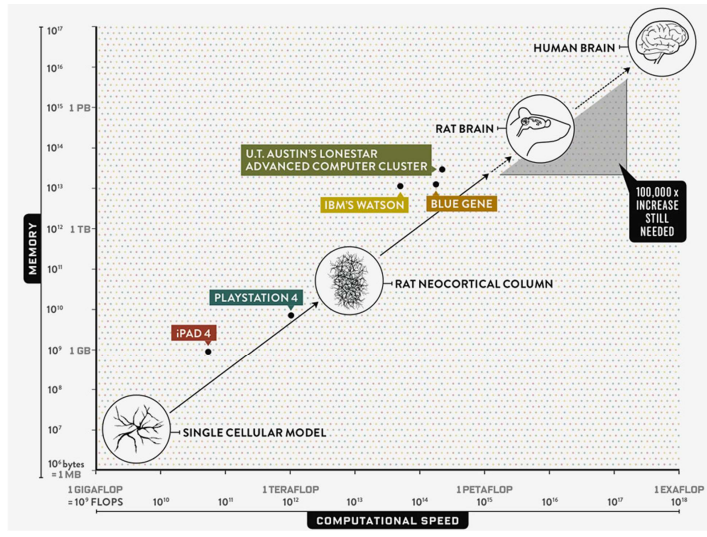

大脑之所以有这么强的计算能力，是因为其中有大量的神经元组成的网络。信息可以在神经元中高速的传递，从而进行运算。

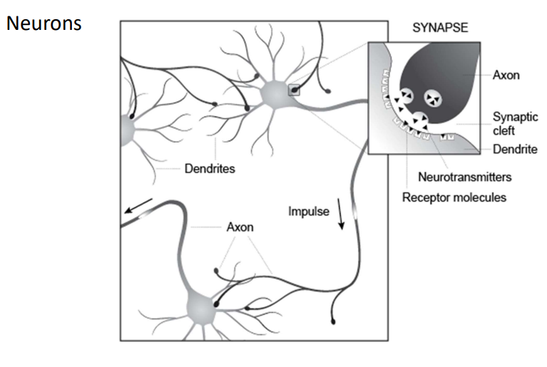

想要进一步的了解可以查看关于脑科学的研究项目：

- [BRAIN Initiative](https://www.braininitiative.org/)
- [Human Brain Project](https://www.humanbrainproject.eu/en/)
- [Human Connectome Project](http://www.humanconnectomeproject.org/)
- [Blue Brain Project](https://bbp.epfl.ch/nmc-portal/welcome.html)
- [Allen Brain Atlas](http://casestudies.brain-map.org/celltax)

从脑神经科学领域受到启发，便产生了的人工神经网络(ANN)，目前基于 ANN 又出现机器学习，强化学习等人工智能课题。

## 3. 人工神经元 (Artificial neurons)

> 这里只是大致的介绍一下，具体的内容还是看 CS229

类似于生物的神经元，人类设计了很多种相似的人工神经元:

- 激活方程(Activation functions)

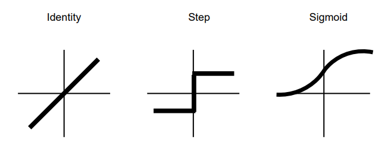

- 偏置输入(Bias input)

$$
y_i = \Phi(A_i) = \Phi(\sum_{j=1}^nw_{ij}x_j-b_i)
$$

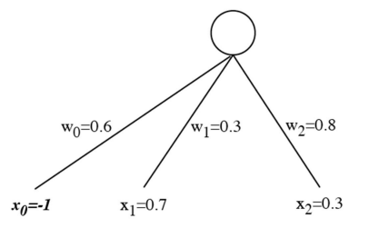

- 感知器(Perceptron)

对于只有一层的神经网络，我们称其为感知器

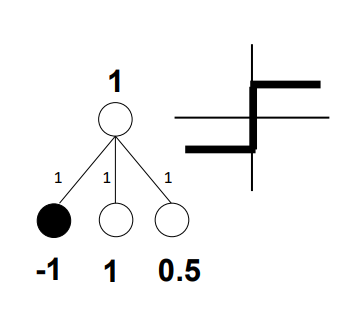

这一样的网络，加上一个 step 方程作为激活方程，便可以达到分类效果。

比如下图的情况：

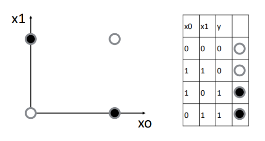

## 4. 人工神经网络(Artificial neural network)

神经网络通过输入单元和输出单元与环境进行通信。所有其他元素称为内部或隐藏单元。单元通过单向连接链接。连接的特征在于权重和转换信号的符号。其一般结构如下图所示：

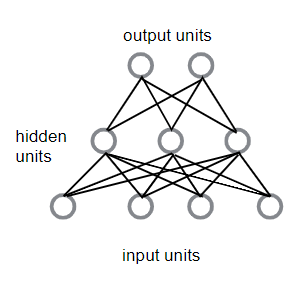

还有其他结构的神经网络，比如：

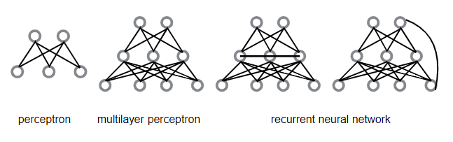

## 5. 学习范式

人工智能又叫做机器学习。通常来说分为三个种类：

- 监督学习(Supervised Learning): 即训练时输入的数据都带有标签，通过这样的数据来学习从而预测同类型的事件。
- 无监督学习(Unsupervised Learning)：不对数据进行标注，由机器自行找到数据的规律。
- 强化学习(Reinforcement Learning): 强化学习是通过正负反馈对模型进行优化迭代的算法。

这里我们重点来学习监督学习：

对于带有标签的数据，我们通过模型计算后得到的输出量 $\hat{y_i}$ 与标签中的 $y_i$ 之间可能会有一定的差距。通过此差距便可以对模型中的参数不断的调整，从而使得模型对于某个数据集的拟合程度越来越好。

这个不断优化参数的过程又叫做反向传播(Backpropagation)

在此之前先总结一下正向传播，也就是从$x \rightarrow y$ 的过程：

以下面的这个四层的神经网络为例：

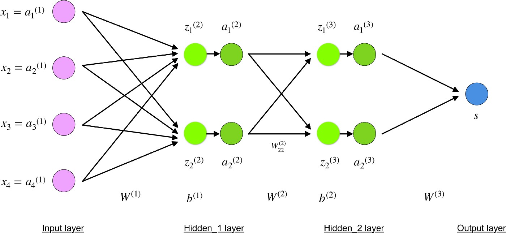

其输入为：

$$
x_i = a_i^{(1)}, \quad i\in {1,2,3,4}
$$

那么对于第二层（也叫做隐藏层）来说：

$$
z^{(2)} = W^{(1)}x + b^{(1)}
a^{(2)} = f(z^{(2)})
$$

其中：

$a^{(2)}$ 是经过激活方程计算后的结果。

第三层：

$$
z^{(3)} = W^{(2)}a^{(2)} + b^{(2)}
a^{(3)} = f(z^{(3)})
$$

最后的输出为：

$$
\hat{y} = W^{(3)}a^{(3)}
$$

这个过程就是正向传播，讲所有的参数矩阵化后便可以得到：

$$
\begin{aligned}
    &x = \begin{bmatrix}
    x_1\\x_2\\x_3\\x_4\\
\end{bmatrix}\\
\,
\\
    &W^{(1)} = \begin{bmatrix}
        W_{11}^{(1)} & W_{12}^{(1)} & W_{13}^{(1)}& W_{14}^{(1)}\\
        W_{21}^{(1)} & W_{22}^{(1)} & W_{23}^{(1)} & W_{24}^{(1)}
    \end{bmatrix}\\
\,
\\
&b^{(1)} = \begin{bmatrix}
    b_1^{(1)}    \\
    b_2^{(1)}
\end{bmatrix}\\
\,
\\
&z^{(2)}=W^{(1)}x+b^{(1)}
\end{aligned}
$$

对于反向传播来说，就是从右到左。具体的公式如下：

$$
C = cost(\hat{y},y)
$$

> 这个 cost function 有很多种，其中比较基础的是利用二小乘公式来做。

为了使得 $\hat{y}$ 接近 $y$，就要使得 C 最小。

对于权重 $W$ 的调整，就是用 $W$ 对 $C$ 进行偏导：

$$
\begin{aligned}
    &\frac{\partial C}{\partial w^l_{jk}} = 
    \frac{\partial C}{\partial z_j^l} \frac{\partial z_j^l}{\partial w_{jk}^l}\, \quad chain\,\,rule\\
    \,
    \\
    &z_j^l = \sum_{k=1}^m w_{jk}^l a_k^{l-1} + b_j^l\\
    \,
    \\
    &\frac{\partial z_j^l}{\partial w_{jk}} = a_k^{l-1}\\
    \,
    \\
    &\frac{\partial C}{\partial w^l_{jk}} =\frac{\partial C}{\partial z_j^l} a_k^{l-1}
\end{aligned}
$$

对于偏重 $b$ 的调整，就是用 $b$ 对 $C$ 进行偏导：

$$
\begin{aligned}
    &\frac{\partial C}{\partial b^l_{j}} = 
    \frac{\partial C}{\partial z_j^l} \frac{\partial z_j^l}{\partial b_{j}^l}\, \quad chain\,\,rule\\
    \,
    \\
    &\frac{\partial z_j^l}{\partial b_{j}} = 1\\
    \,
    \\
    &\frac{\partial C}{\partial b^l_{j}} =\frac{\partial C}{\partial z_j^l}
\end{aligned}
$$

由此就可以推导出每一次迭代，$b$ 和 $w$ 的算法：

$$
\begin{aligned}
& \text{While (termination condition not met):}\\
\,
\\
    &\qquad w:=w - \alpha\frac{\partial C}{\partial w}\\
    &\qquad b:=b - \alpha\frac{\partial C}{\partial b}\\
\,
\\
& \text{end}
\end{aligned}
$$

其中：

- $w$ 和 $b$ 的初始值是随机选择的
- $\alpha$ 是学习率。它决定了梯度的影响
- $w$ 和 $b$ 是权重和偏差的矩阵表示。可以使用 $C$ 在各个权重或偏差中的偏导数来计算 $C$ 在 $w$ 或 $b$ 中的导数
- 一旦成本函数最小化，就满足终止条件

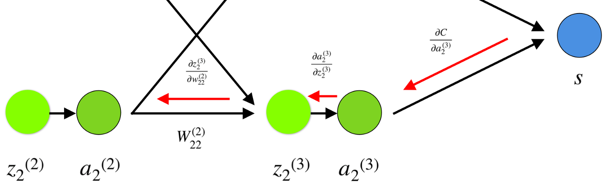

在训练的过程中，可能会发生很多不如我们意料的事情，比如：过度拟合

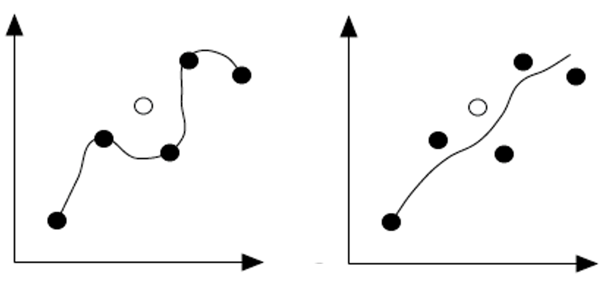

其表现就是我们的数据在训练的过程中表现的很好，但是在测试的过程中，表现不佳。

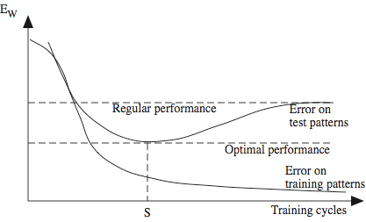

为了防止这样的现象，在选择数据集的时候要注意不能有偏向。以及在训练的时候，将数据分成两组，一组为训练集另外一组为测试集。

- 下篇：