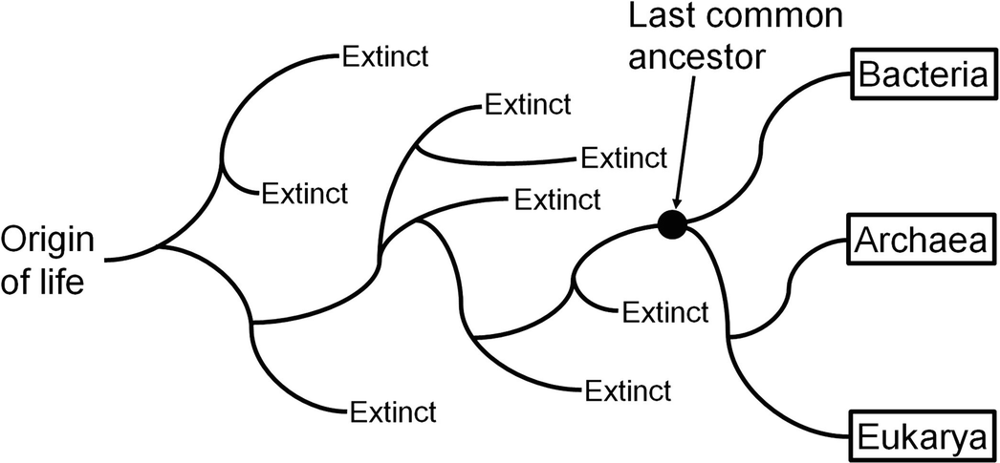
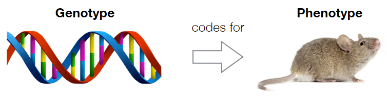
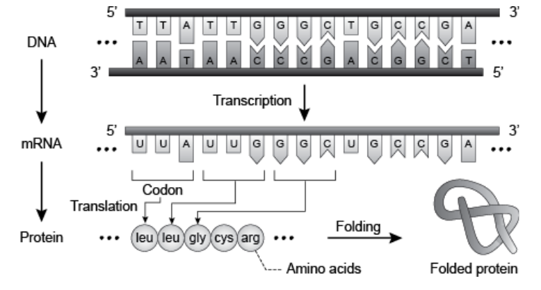
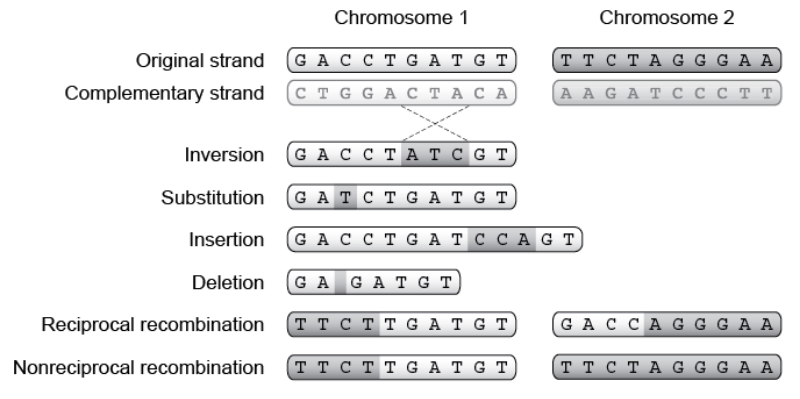

# BIONIC.2 人工进化(Artificial evolution)

> 前言：
> 
> 进化算法目前有一些应用，但并没有像深度学习一样有那么大范围的应用。主要原因是进化算法的前提是我们需要知道环境的具体参数。但现实生活的环境是一个复杂的动态系统，且存在混沌因素。因此我们很难准确的利用进化算法在现实生活上使用。但在简化模型的模拟环境中使用进化算法，对于现实生活也会有一些启发。
> -  用进化算法做仿真的 Youtuber：[Primer](https://www.youtube.com/channel/UCKzJFdi57J53Vr_BkTfN3uQ)

## 1. 生物学启发

### 1.1 物竞天择

在自然界中，生物遵循自然选择的规律发展。物种的诞生，繁衍，和灭绝都是为了更好的适应环境。1859 年 Charles Darwin 在 《关于物种的起源》 (On the Origins of Species) 一书中提到，所有的物种都来自于同一个祖先，随后由于基因的变异以及自然选择，而产生如今物种丰富的生态系统。物种之间的变化，我们称之为进化。

生物的进化需要满足以下四个条件：
- 物种数量 (Population): 同一个物种的多个不同个体
- 多样性 (Diversity)：个体之间存在不同的特性
- 遗传 (Heredity)：这些特性是可以遗传的
- 选择 (Selection)：个体产生的后代比环境所能支持的多。这意味着，一些个体之间存在竞争，而更适合生存的个体能够将其基因保留下来。

### 1.2 基因型和表现型

- 基因型： 该生物体的遗传物质。 
  - 它在繁殖过程中传播； 
  - 它受突变的影响； 
  - 自然选择不直接操作基因

- 表现型：有机体的表现（外观、行为等）
  - 自然选择直接作用于表现型；
  - 它受环境、发展和学习的影响。

遗传物质(Genetic Material): DNA 由 ATCG 四种物种不同的排序方式编码而成。不同的编码方式，会生产出不同的蛋白质，不同的蛋白质进而产生不同的生理特性。

基因突变发生在细胞复制过程中（每年每个核苷酸 4-10 个）。发生在性细胞中的基因突变会影响进化，基因重组会影响两条同源染色体的突变。

## 2. 人工进化 (Artificial Evolution)

人工进化被用于自动生成难题的解决方案。人工进化与神经网络之间的不同点在于：适应度是对问题的单个解决方案性能的度量。根据性能标准（适应度函数）选择最佳解决方案。从初始方案不断迭代到最终方案。

### 2.1 进化算法 (Evolutionary algorithm)

