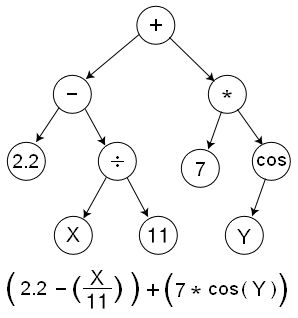
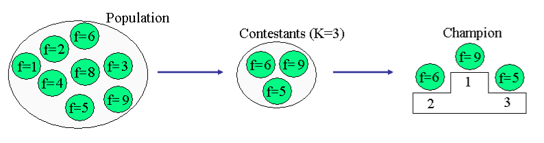
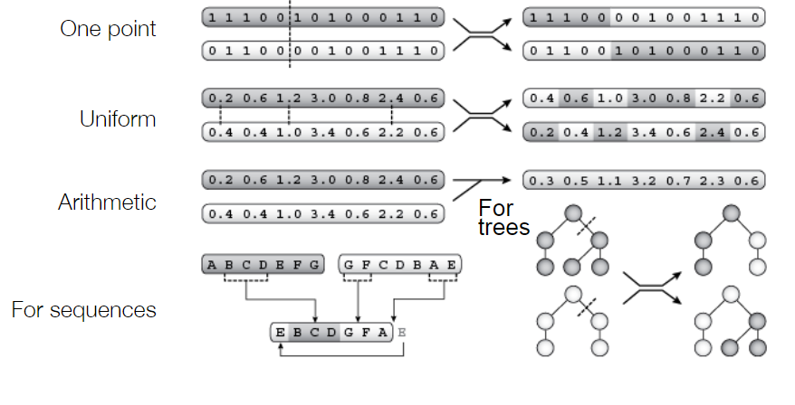
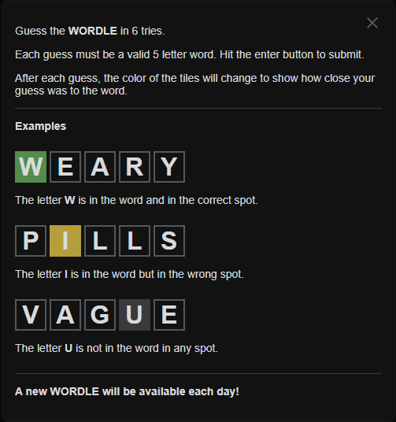

#! https://zhuanlan.zhihu.com/p/465160379
# BIONIC.2 人工进化(Artificial evolution) -- 1

> 前言：
> 
> 这里所说的进化算法其实就是遗传算法。
> 
> -  用进化算法做仿真的 Youtuber：[Primer](https://www.youtube.com/channel/UCKzJFdi57J53Vr_BkTfN3uQ)

## 1. 生物学启发

### 1.1 物竞天择

在自然界中，生物遵循自然选择的规律发展。物种的诞生，繁衍，和灭绝都是为了更好的适应环境。1859 年 Charles Darwin 在 《关于物种的起源》 (On the Origins of Species) 一书中提到，所有的物种都来自于同一个祖先，随后由于基因的变异以及自然选择，而产生如今物种丰富的生态系统。物种之间的变化，我们称之为进化。

生物的进化需要满足以下四个条件：
- 物种数量 (Population): 同一个物种的多个不同个体
- 多样性 (Diversity)：个体之间存在不同的特性
- 遗传 (Heredity)：这些特性是可以遗传的
- 选择 (Selection)：个体产生的后代比环境所能支持的多。这意味着，一些个体之间存在竞争，而更适合生存的个体能够将其基因保留下来。

### 1.2 基因型和表现型

- 基因型： 该生物体的遗传物质。 
  - 它在繁殖过程中传播； 
  - 它受突变的影响； 
  - 自然选择不直接操作基因

- 表现型：有机体的表现（外观、行为等）
  - 自然选择直接作用于表现型；
  - 它受环境、发展和学习的影响。

遗传物质(Genetic Material): DNA 由 ATCG 四种物种不同的排序方式编码而成。不同的编码方式，会生产出不同的蛋白质，不同的蛋白质进而产生不同的生理特性。

基因突变发生在细胞复制过程中（每年每个核苷酸 4-10 个）。发生在性细胞中的基因突变会影响进化，基因重组会影响两条同源染色体的突变。

## 2. 人工进化 (Artificial Evolution)

> 以下方法都是人工进化的基础方法。不同类型的问题，需要的方法也不一样。

人工进化被用于自动生成难题的解决方案。人工进化与神经网络之间的不同点在于：适应度是对问题的单个解决方案性能的度量。根据性能标准（适应度函数）选择最佳解决方案。从初始方案不断迭代到最终方案。

### 2.1 进化算法 (Evolutionary algorithm)

进化算法的流程：
- 设计遗传表示
- 建立种群
- 设计一个适应度函数
- 自然选择方法
- 选择交叉和突变
- 选择数据分析方法

重复生成循环直到：
- 找到最大适应度值
- 找到的解决方案足够好
- 连续几代的适应性都没有提升

只要选择了合适的遗传表示、适应度和遗传算子，进化算法就适用于任何问题领域。

### 2.2 基因型表达方式

- 二进制表达式 (One-hot array):

比如选择问题，现在要从 A B C D E F G 中选择一些人去完成某项工作，每个人的工资不同。我们需要在有限的成本先，找到能够完成任务的最佳人选。那么我们就可以使用 One-hot array 来表示，比如我们选择了 ABC 参加，其表达式就为：

| A | B | C | D | E | F | G |
| - | - | - | - | - | - | - |
| 1 | 1 | 1 | 0 | 0 | 0 | 0 |

可以直接写成：[111000]

- 顺序表达式：

比如路径规划问题，以最低的运输成本遍历以下的几个地方:

对于这样的问题，我们可以先将地名用 A B C D E F 表示，并且给段路程设计成本。

之后用数列 [D C A B F E] 来表示旅行顺序，并计算该顺序下的旅行成本。

- 树状表达式：

比如，现在要设计一个计算程序，就可以使用如下所示的树状结构来表示：

### 2.3 初始种群

初始种群的大小要足够大以覆盖问题空间，但对于评估成本来说足够小（典型规模：10 到 1000 个个体）

先前进化的基因型或人工设计的基因型的突变克隆：
- 遗传多样性的可能丧失 
- 可能无法恢复的偏差

### 2.4 适应性方程

用数字分数评估表型的表现，比如：
- 工作例子中的，员工成本以及员工水平；
- 路径问题中的旅行成本。

我们也可以用主观适应度：通过目测选择表型
- 当种群特征难以被量化的时候；
- 主管适应度可以结合目标适应度函数。

### 2.5 自然选择

在自然选择的时候，我们需要设计一套能够确保更好的个体产生相对更多的后代的方法。基因选择过程不能过度施压（基因多样性快速减少）。应该保证优良基因能够大量产生后代的同时，较差的基因也能产生一定数量的后代，以保存基因多样性。

其中一种方式是**比例选择**：个体产生后代的概率与其适应度相对于群体适应度的好坏成正比。

$$
p(i) = \frac{f(i)}{\sum f(i)}
$$

**等级选择**是按照基因组表现分数来对基因进行排名。而后通过排名对种群基因进行选择。比如：

|individual|fitness|rank|
| -        | -     | -  |
| A        | 5     | 5  |
| B        | 7     | 3  |
| C        | 8     | 2  |
| D        | 2     | 8  |
| E        | 3     | 7  |
| F        | 9     | 1  |
| G        | 7     | 4  |
| H        | 4     | 6  |

$$
p(i) = 1 - \frac{r(i)}{\sum r(i)}
$$

那么对于 F 来说，其存活下来的概率就是：

$$
p(i) = 1 - \frac{1}{8} = \frac{7}{8}
$$

对于等级选择来说，还可以进行改良，只有最好的 x 个个体被允许产生后代，并且每个个体产生相同数量的后代：N/x，其中 N 是种群大小。

例如，在 100 个人的群体中，制作 20 个最佳个体的 5 个副本。

**锦标赛选择**：

对于要生成的每个后代：

从总体中随机选择 k 个个体，选择适合度最高的个体并复制。之后将所有个体放回人群中。

k 是锦标赛规模（规模越大 = 选择压力越大）

### 2.6 基因变异与交换

自然选择幸存下来的个体之间会产生后代，其后代的基因由一对优良基因交叉互换得来。

并且在此过程中，基因也会发生随机的突变：

### 2.7 监视图

为了直观的看到种群的演变，我们可以创建以下的一些监视图：

- **适应性总览**：

- **世代表现：**

- **种群多样性：**

## 3. 进化算法的应用

进化算法最适合的就是做一些自然选择的仿真。下面有一个模拟器，感兴趣的同学可以试着玩一下：

[自然选择模拟器](https://labs.minutelabs.io/evolution-simulator/#/s/42/stats)

以及一个非常火的应用， AI 马里奥 [Mario](https://www.youtube.com/watch?v=qv6UVOQ0F44&ab_channel=SethBling)

> 源码: [Mario](https://pastebin.com/ZZmSNaHX)

Uber 也有一个叫做 [Deep Neuroevolution](https://eng.uber.com/deep-neuroevolution/) 的工程。

这种算法甚至可以用于设计硬件，比如芯片设计。

## 4. 代码示例：

> 谷歌 Colab 文件 [Artificial Evolution and Evolutionary Robotics – Skills Session](https://colab.research.google.com/drive/1jxq70Ah3SvIc8SIsxUi2HFyY43bEZDMX?usp=sharing)

本示例为字谜游戏 [wordle](https://www.powerlanguage.co.uk/wordle/) 的解密代码。

这个游戏最近(2022/02/08) 风靡欧美，很多程序员都在做此类 AI 解密程序。[3Blue1Brown](https://www.youtube.com/watch?v=v68zYyaEmEA&t=1413s&ab_channel=3Blue1Brown) 也做了一期视频视频，讲解 Wordle 游戏解题代码的数学思路。

> 3Blue1Brown 的 [代码](https://github.com/3b1b/videos/blob/master/_2022/wordle.py)

布里斯托提供的遗传算法的代码实现在下一篇。

- 上篇：[BIONIC.1 神经系统(Neurla System)](https://zhuanlan.zhihu.com/p/461904298)
- 下篇：[BIONIC.2 人工进化(Artificial evolution) -- 2](https://zhuanlan.zhihu.com/p/465160895)
