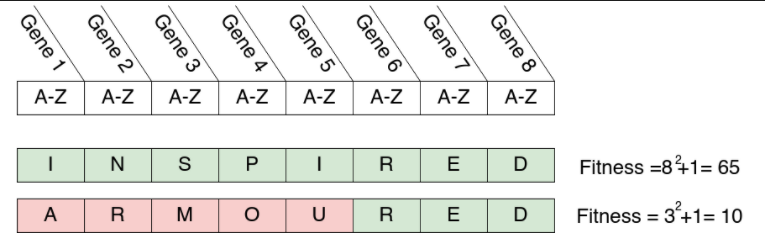

#! https://zhuanlan.zhihu.com/p/465160895
# BIONIC.2 人工进化(Artificial evolution) -- 2

## 4. 代码示例 -1 字谜游戏

本示例为字谜游戏的遗传算法解密器，字谜游戏的规则类似下方图片所示：


###  4.1 设计拟合函数

首先创建一个用于计算两个字符串之间字符差异的函数


```python
import numpy as np 

def hamming_distance(string1,string2): 
    """Returns the hamming distance between two strings"""    
    #The hamming distance between two strings of equal length is the number of positions 
    #at which characters in the string vary.
    #Eg. AAA and BAB have a hamming distance of 2 as two characters 
    #(the first and last characters) are different.

    if len(string1)!= len(string2):
        print("Cannot calculate hamming distance, strings {} are different lengths {}".format((string1,string2),(len(string1),len(string2))))
    different_chars = 0        
    for i in range(len(string1)):
        if string1[i] != string2[i]:
            different_chars+=1
    return different_chars
```

下面用 INSPIRED 和 ARMOURED 为例测试该函数。


```python
#Calculating the length of a string
string_A = "INSPIRED"
string_B = "ARMOURED"

#Calculating the difference betweeen two strings
#hamming_distance(string1,string2) returns the number of characters that are different between two strings 
diff_chars = hamming_distance(string_A,string_B)
print("There are {} characters that are different between strings A and B".format(diff_chars))
same_chars = len(string_A) - hamming_distance(string_A,string_B)
print("There are {} characters that are the same between strings A and B".format(same_chars))
```

    There are 5 characters that are different between strings A and B
    There are 3 characters that are the same between strings A and B
    

测试通过。接下来计算一下两个字符串之间的拟合度。拟合度是用来评估遗传算法中样本好坏的指标。拟合度公式为：

$$
f(i) = L(i)^2 + 1
$$

其中 L 是与目标字符中字母一致的个数。比如：



下面来构建评估函数：


```python
def evaluate(individual_string):
    """Returns the value of the fitness function f(i) = L(i)^2 +1 when applied to a genome
    
    Parameters:
      individual_string - A string genome representing a word
    Returns:
      The fitness according to the fitness function (float)
    """
    
    correct_word = "INSPIRED"
    matching_letters = (len(correct_word) - hamming_distance(individual_string,correct_word)) #Take away the number of letter that are wrong from the length of the word to give how many letters are correct
    ####################Enter your code here###################
    fitness = matching_letters**2 + 1
    ###########################################################
    return fitness

population = np.array(["ABCPIRBE","ABCCAREA","INSPIABC","AAAAAAAA","IABABABA","AAAPIREA"])
#Loop through the population of solutions and display their fitness. Use this to verify your fitness function is working correctly.
for individual in population:
  print("The fitness of {} as calculated is evaluate() is {}".format(individual,evaluate(individual)))
```

    The fitness of ABCPIRBE as calculated is evaluate() is 10
    The fitness of ABCCAREA as calculated is evaluate() is 5
    The fitness of INSPIABC as calculated is evaluate() is 26
    The fitness of AAAAAAAA as calculated is evaluate() is 1
    The fitness of IABABABA as calculated is evaluate() is 2
    The fitness of AAAPIREA as calculated is evaluate() is 17
    

由此我们便得到了下表：

|Individual|Fitness|
|:-|:-:|
|ABCPIRBE|10|
|ABCCAREA|5|
|INSPIABC|26|
|AAAAAAAA|1|
|IABABABA|2|
|AAAPIREA|17|


<p><center>Table 1 - 遗传算法的原始种群与拟合度.</center></p>

### 4.2 创建初始种群

一般来说，初始种群是随机生成的。可以使用下面的代码完成此项任务：


```python
def generate_population(population_size,genome_size = 8):
  """
  Generates a new population of genomes of letter strings

  Parameters:
    population_size - The size of the new population
    genome_size (optional) (default = 8) - The size of each genome string
  
  Returns:
    The new population
  """

  #Adds randomly generated individuals to a list representing the population
  population = []
  for i in range(population_size):

    new_individual = "" #The genome starts as an empty string
    for c in range(genome_size):#loops through each gene in the genome
      random_char =  generate_random_char()#generates a random gene and appends it to the new genome
      new_individual+= random_char
    #Once created the genome is added to the population
    population.append(new_individual)

  return np.array(population) #Convert the list into a numpy array as this is what the other functions expect

generate_population(6)
```


    array(['UNKKYMCX', 'ZDKCHUYW', 'TEAIUHUV', 'XZWIYAYY', 'XCIWYDEE',
           'HHJHNLQY'], dtype='<U8')


但是，为了减小计算量，这里我们人为的创建一个初始种群。并且将种群的拟合度储存在一个数列中，便于以后的操作。


```python
def get_fitnesses(population):
    """Returns an array of the fitnesses of each individual in the population"""
    return np.array([evaluate(individual)  for individual in population],dtype = 'float')


population = np.array(["ABCPIRBE","ABCCAREA","INSPIABC","AAAAAAAA","IABABABA","AAAPIREA"])
get_fitnesses(population)
```


    array([10.,  5., 26.,  1.,  2., 17.])


### 4.3 设计遗传算子 

选择算子在 GA 中用于选择应该将哪些解决方案传递到下一代。

应用选择算子后，在对幸存者使用交叉和变异算子，便可以得到新一代解决方案。这些练习将演示选择操作员的工作方式，并将比较他们的特点。

首先使用**比例算子**来做选择。比例算子的公式为：

$$
p(i) = \frac{f(i)}{\sum_{n=1}^{N} f(n)} 
$$

下面由拟合度来计算个体存活的可能性：


```python
def get_proportionate_select_prob(population,fitnesses):
    """ Returns the selection probabilities for individuals in a population 
    according to proportianate selection
    Parameters:
      population - the population to calculate selection probabilities
      fitnesses - array of fitnesses assocoiated with the individuals in old_population
    
    Returns
      The selection probabilities for each individual
    """    

    total_fitness = np.sum(fitnesses)
    prob_of_selection = fitnesses/total_fitness
    return prob_of_selection

fitness = get_fitnesses(population)

proportionate_prob = get_proportionate_select_prob(population,fitness)

print(proportionate_prob)


```

    [0.16393443 0.08196721 0.42622951 0.01639344 0.03278689 0.27868852]
    

|Individual|Fitness|Probability of selection (proportionate)|
|:-       |:-:|:-:|
|ABCPIRBE |10 |0.16|
|ABCCAREA |5  |0.08|
|INSPIABC |26 |0.42|
|AAAAAAAA |1  |0.02|
|IABABABA |2  |0.03|
|AAAPIREA |17 |0.28|
|**Total**|61 |  1 |

<p><center>Table 2 - 根据比例选择的初始总体的选择概率。</center></p>

然后使用**等级算子**来做选择：

$$
p(i) = \frac{N - R_i + 1}{\sum_{n = 1}^{N} R(n)}
$$

具有最高适应度的个人有一个排名
$R(i)$=1
对于最不适合的人
$R(i)=N$


```python
def get_rank_select_prob(population,fitnesses):
    """ Returns the selection probabilities for individuals in a population 
    according to rank based selection
    Parameters:
      population - the population to calculate selection probabilities
      fitnesses - array of fitnesses assocoiated with the individuals in old_population
    
    Returns
      The selection probabilities for each individual
    """    
    #NOTE: This code does not work correctly for instances where fitnesses are exactly equal. 
    #      Idealy two indentical solutions would be ranked equally such that they have an equal chance of being selected.
    #      However for the porposes of this excerise the code performs correctly 
    
    if np.isnan(fitnesses).any():#If the fitness values aren't valid return an array filled with NaNs for the probabilities
      prob_of_selection = np.full(fitnesses.shape,fill_value = np.nan)
      return prob_of_selection
    
    order = np.array(-fitnesses).argsort() #returns indexes which would sort the array highest to lowest 
    ranks = (order.argsort() +1).astype('float')#sorting the indexes lowest to highest gives us the rank, add one to account for first index being zero
                            
    prob_of_selection = (population.size - ranks + 1.0)/np.sum(ranks)
    return prob_of_selection

rank_prob = get_rank_select_prob(population,fitness)
print(rank_prob)

```

    [0.19047619 0.14285714 0.28571429 0.04761905 0.0952381  0.23809524]
    

|Individual|Fitness|Rank|Probability of selection (Rank-based)|
|:-       |:-:|:-:|:-:|
|ABCPIRBE |10 |3|0.19|
|ABCCAREA |5  |4|0.14|
|INSPIABC |26 |1|0.29|
|AAAAAAAA |1  |6|0.05|
|IABABABA |2  |5|0.10|
|AAAPIREA |17 |2|0.24|
|**Total**|61|15| 1  |

<p><center>Table 3 - 基于秩选择的初始总体的选择概率</center></p>

### 4.4 遗传过程

下面将展示三种选择方式，分别是概率选择，秩选择，锦标赛选择：

首先是概率选择，在获取上一个种群后，先判断其是否还能进行迭代，如何可以就使用 `np.random.choice()` 根据每一个个体的存活率随机生成新一代的种群。


```python
def proportionate_selection(old_population,fitnesses):
    """Performs proportional based selection on a population, returns the new population
    Parameters:
        old_population - the population to perform selection on
        fitnesses - array of fitnesses assocoiated with the individuals in old_population
    
    Returns:
        The new population
    """
    if np.isnan(fitnesses).any():
      print("ERROR - Some fitnesses are NaN. Cannot calculate selection probabilities returning original population")
      return old_population

    prob_of_selection = get_proportionate_select_prob(old_population,fitnesses)
    new_population = np.random.choice(old_population, size = len(old_population),p = prob_of_selection)
    return new_population

#Demostrates selection
population = np.array(["ABCPIRBE","ABCCAREA","INSPIABC","AAAAAAAA","IABABABA","AAAPIREA"])
print("Original population: {}".format(population))

new_population = proportionate_selection(population,get_fitnesses(population))

#probabilities = get_proportionate_select_prob(population,get_fitnesses(population))
#print("Selection probabilities {}".format(probabilities))

print("Population after proportionate selection {}".format(new_population))
```

    Original population: ['ABCPIRBE' 'ABCCAREA' 'INSPIABC' 'AAAAAAAA' 'IABABABA' 'AAAPIREA']
    Population after proportionate selection ['AAAPIREA' 'IABABABA' 'INSPIABC' 'INSPIABC' 'INSPIABC' 'INSPIABC']
    

秩选择与概率选择类似。代码如下：


```python
def rank_based_selection(old_population,fitnesses):
    """Performs rank based selection on a population, returns the new population
    Parameters:
        old_population - the population to perform selection on
        fitnesses - array of fitnesses assocoiated with the individuals in old_population
    Returns:
        The new population
    """

    if np.isnan(fitnesses).any():
      print("ERROR - Some fitnesses are NaN. Cannot calculate selection probabilities returning original population")
      return old_population
    
    prob_of_selection = get_rank_select_prob(old_population,fitnesses)
    new_population = np.random.choice(old_population, size = len(old_population),p = prob_of_selection)

    return new_population
  
#Demostrates selection
population = np.array(["ABCPIRBE","ABCCAREA","INSPIABC","AAAAAAAA","IABABABA","AAAPIREA"])
print("Original population: {}".format(population))

new_population = rank_based_selection(population,get_fitnesses(population))

#probabilities = get_rank_select_prob(population,get_fitnesses(population))
#print("Selection probabilities {}".format(probabilities))

print("Population after rank-based selection {}".format(new_population))
```

    Original population: ['ABCPIRBE' 'ABCCAREA' 'INSPIABC' 'AAAAAAAA' 'IABABABA' 'AAAPIREA']
    Population after rank-based selection ['AAAPIREA' 'INSPIABC' 'INSPIABC' 'AAAPIREA' 'INSPIABC' 'IABABABA']
    

最后是锦标赛选择，这种方法不需要计算个体的生存概率，只需要随机选择一组组个体进行比较，让拟合度较大的个体存活。然后生成新一代的种群：


```python
def tournament_selection(old_population,fitnesses,t_size = 2):
    """Performs tournament based selection on a population, returns the new population
    Parameters:
        old_population - the population to perform selection on
        fitnesses - array of fitnesses assocoiated with the individuals in old_population
        t_size - the tournament size
    Returns:
        The new population
    """
    if np.isnan(fitnesses).any():
      print("ERROR - Some fitnesses are NaN. Returning original population")
      return old_population
    new_population = []
    pop_size = old_population.size
    if t_size > pop_size:
        print("Tournament size too big, larger than population size")
        t_size = pop_size
    for i in range(pop_size):
        #pick contentenders for tournament
        contender_indexs = np.random.choice(range(pop_size), replace = False,size = t_size)
        #pick winner aka one with largest fitness of the contenders
        winner_index = contender_indexs[np.argmax(fitnesses[contender_indexs])]

        new_population.append(old_population[winner_index])
    return np.array(new_population)

#Demostrates selection
population = np.array(["ABCPIRBE","ABCCAREA","INSPIABC","AAAAAAAA","IABABABA","AAAPIREA"])
tournament_size = 2

print("Original population: {}".format(population))
new_population = tournament_selection(population,get_fitnesses(population),t_size = tournament_size)
print("Population after tournament selection (t_size = {}) {}".format(tournament_size,new_population))
```

    Original population: ['ABCPIRBE' 'ABCCAREA' 'INSPIABC' 'AAAAAAAA' 'IABABABA' 'AAAPIREA']
    Population after tournament selection (t_size = 2) ['ABCPIRBE' 'ABCPIRBE' 'AAAPIREA' 'ABCPIRBE' 'ABCPIRBE' 'AAAPIREA']
    

为了使我们能够轻松地在选择方法之间切换，我们将编写一个选择函数，其中选择方法是一个参数。


```python
def perform_selection(old_population,fitnesses,selection_method,selection_params=None):
    """Applies a selection operator on a population, returns the new population
    Parameters:
        old_population - the population to perform selection on
        selection_method - The selection operator to be applied, valid values are:
                           "proportionate","rank" or "tournament"
        selection_params - Dictionary of parameters for selection operators 
    Returns:
        The new population
    """ 
    if selection_method == "proportionate":
        new_population = proportionate_selection(old_population,fitnesses)
    elif selection_method == "rank":
        new_population = rank_based_selection(old_population,fitnesses)
    elif selection_method == "tournament":
        new_population = tournament_selection(old_population,fitnesses,selection_params["tournament_size"])
    else:
        print("\"{}\" is not recognised as a selection method. Returning original population".format(selection_method))
        new_population = old_population
    return new_population
```

### 4.5 种群衡量指标

我们还将提供种群多样性的衡量标准。 这衡量了种群中所有个体的差异程度：


```python
def get_diversity(population):
    """Returns the diversity measure of a population (pair-wise sum of hamming distances)
    Parameters:
      population - The population to calculate the diversity for
    Returns
      The diversity in the population
    """
    #One diversity measure is the all-possible-pairs diversity. 
    #For our genotype this can be defined as the sum of hamming distances between every possible pair of individauls in the population
    sum_of_hamming = 0
    for individual1 in population:
         for individual2 in population:
            sum_of_hamming+=hamming_distance(individual1,individual2)
    return sum_of_hamming

prop_population = perform_selection(population,fitness,selection_method = "proportionate")
diversity1 = get_diversity(prop_population)

rank_population = perform_selection(population,fitness,selection_method = "rank")
diversity2 = get_diversity(rank_population)

tournament_population = perform_selection(population,fitness,selection_method = "tournament",selection_params = {"tournament_size":2})
diversity3 = get_diversity(tournament_population)

print("Diversity of proportionate selection {}".format(diversity1))
print("Diversity of rank based selection {}".format(diversity2))
print("Diversity of tournament selection {}".format(diversity3))

```

    Diversity of proportionate selection 116
    Diversity of rank based selection 156
    Diversity of tournament selection 142
    

下面的代码单元将选择运算符应用于群体以创建新群体。 然后显示每个种群的适应度、多样性和个体。


```python
selection_method = "proportionate" #valid values are "proportionate","rank" or "tournament"
selection_params = {"tournament_size" : 2}

#The old population and their fitnesses
population = np.array(["ABCPIRBE","ABCCAREA","INSPIABC","AAAAAAAA","IABABABA","AAAPIREA"])
fitnesses  = get_fitnesses(population)

#The new population is formed by applying the selection operator
new_population = perform_selection(population,fitnesses,selection_method,selection_params)
new_fitnesses = get_fitnesses(new_population)

print("----------- Selection method: {} -----------".format(selection_method))

print("Original population: {}    Diversity  : {:4.2f}".format(population,get_diversity(population)))
print("Original fitnesses : {}    Avg fitness: {:4.2f}".format(fitnesses,np.mean(fitnesses)))    

print("New population     : {}    Diversity  : {:4.2f}".format(new_population,get_diversity(new_population)))
print("New fitnesses      : {}    Avg fitness: {:4.2f}".format(new_fitnesses,np.mean(new_fitnesses)))

```

    ----------- Selection method: proportionate -----------
    Original population: ['ABCPIRBE' 'ABCCAREA' 'INSPIABC' 'AAAAAAAA' 'IABABABA' 'AAAPIREA']    Diversity  : 166.00
    Original fitnesses : [10.  5. 26.  1.  2. 17.]    Avg fitness: 10.17
    New population     : ['AAAPIREA' 'AAAPIREA' 'INSPIABC' 'INSPIABC' 'INSPIABC' 'INSPIABC']    Diversity  : 96.00
    New fitnesses      : [17. 17. 26. 26. 26. 26.]    Avg fitness: 23.00
    

### 4.6 交叉互换和突变

经过上面的操作之后，新一代的种群平均拟合度要高于上一代，但是多样性减少了。为了增加一些多样性，我们引入了交叉互换和突变。以 INSPRIABC 与 AAAPIREA 为例，按下图的方式交叉互换后，我们便得到了 AAAPRIABC 与 INSPIREA。


下面我们使用代码实现这个功能：


```python
def one_point_crossover(individual1,individual2,crossover_point = -1):
  """Applies one point crossover to two individual genomes
  Parameters:
    individual1 - Genome1
    individual2 - Genome2
    crossover_point (optional, default = -1) - The crossover point in the genome string ie. the position in the string before which the crossover is applied. 
                                               If set to -1 a random crossover point will be used. 
  Returns:
     The two individuals 
  """ 
  if (len(individual1)!=len(individual2) or len(individual1) == 0 or len(individual2) == 0):
    print("Individual genome sizes must be equal and larger than zero")
    return individual1,individual2
  if crossover_point == -1:#No crossover point set, generate a random one
    crossover_point = np.random.randint(1,len(individual1))

  if crossover_point > len(individual1) or crossover_point > len(individual2):
    print("Crossover point {} larger than genome sizes ({})".format(crossover_point,individual1,individual2))
  
  #Select the appropriate sections of the genome string and exchange them
  new_individual1 = individual1[:crossover_point] + individual2[crossover_point:]
  new_individual2 = individual2[:crossover_point] + individual1[crossover_point:]
  
  return new_individual1,new_individual2


#The two genomes to apply crossover to
individual1 = "AAAAAAAA"
individual2 = "BBBBBBBB"

#Applies one point crossover to the individuals new_individual1 and new_individual2
#Note: A crossover point between the 1st and 2nd characters in genome would be 1
new_individual1,new_individual2 = one_point_crossover(individual1,individual2,-1)

print("Results of crossover = {}".format((new_individual1,new_individual2)))
print("New fitnesses = {}".format(get_fitnesses([new_individual1,new_individual2])))
```

    Results of crossover = ('AAABBBBB', 'BBBAAAAA')
    New fitnesses = [1. 1.]
    

下面是用于产生突变的函数：


```python
def generate_random_char():
  """Returns a random capital letter character"""
  random_char = chr(np.random.randint(65,91))#First a random number above 65 and including 90 is generated then covertted to an ASCII symbol
                                             #ASCII character 65 = A ASCII character 90 = Z, symbols between these are all capital letters
  return random_char
def mutate(individual):
  #Generates a random number between zero and eight, this is the gene we will mutate
  gene_num = np.random.randint(0,8)

  #puts a randomly generated genome (character) at the position specified by gene_num
  individual = individual[:gene_num] + generate_random_char() + individual[gene_num+1:] 
  return individual

mutate("INSPIAAA")
```


    'INSPIWAA'


### 4.7 完整程序


```python
#How many generations the GA will be run for
generation_num = 50000

selection_method = "rank" #valid values are "proportionate","rank" and "tournament"
selection_params = {"tournament_size" : 2}#parameters for the selection method 

#These probabilities decide how often to apply the crossover and mutation operators to the selected population
#In this implimentation crossover and mutation occur sequentially
crossover_rate = 0.1 #The probability of performing crossover on a individual per generation
mutation_rate = 0.01 #The probability of performing mutation on an individual per generation

#Initialise the population

# population = np.array(["ABCPIRBE","ABCCAREA","INSPIABC","AAAAAAAA","IABABABA","AAAPIREA"]) # The population examined in the previous excersises
population = generate_population(6) #Uncomment this line to generate a random population of 6 individuals

print("-----------Initial population-----------")
print(population)
# print_population_stats(population)

#Begin the evolution loop
for g in range(generation_num):

  #Evaluate the individuals
  fitnesses = get_fitnesses(population)
  if np.isnan(fitnesses).any():#Breaks the loop if the fitness function isn't implimented
    print("ERROR - Fitness function not implimented!")
    break
  #Select the fitest individuals
  population = perform_selection(population,fitnesses,selection_method,selection_params)
  
  #Apply crossover operations
  for individual1_index in range(population.size):

    if np.random.random() < crossover_rate: #Crossover happens with a certain probability
      
      #Select an individual to do crossover with
      potential_individuals = list(range(population.size))
      potential_individuals.remove(individual1_index)     #can't do crossover with the same individual (nothing would change)
      individual2_index = np.random.choice(potential_individuals)

      #Apply one point crossover to produce new individuals
      new_individual1,new_individual2 = one_point_crossover(population[individual1_index],population[individual2_index])
      
      #Insert the new individuals back into the population
      population[individual1_index] = new_individual1
      population[individual2_index] = new_individual2

  
  #Apply mutation operations
  for individual_index in range(population.size):
    if np.random.random() < mutation_rate:#Decide to apply a mutation or not   
      population[individual_index] = mutate(population[individual_index])


print("-----------End population-----------")
print(population)
# print_population_stats(population)
```

    -----------Initial population-----------
    ['CVSHNXVB' 'YZKQXTUU' 'KKRKSTUN' 'PPSBBNWL' 'HLDQQXPJ' 'GBRFSXSF']
    -----------End population-----------
    ['INSPIRED' 'INSPIRED' 'INSPIRED' 'INSPIRED' 'INSPIRED' 'INSPIRED']
    

希望本节能让您更深入地了解 GA 的内部工作原理。 在本练习中检查的 GA 相当简单，因为我们已经知道我们想要发展的解决方案是什么。 但是，当我们不知道问题的解决方案是什么时，GA 会更加有用。

- 上篇：[BIONIC.2 人工进化(Artificial evolution) -- 1](https://zhuanlan.zhihu.com/p/465160379)
- 下篇：[]()
