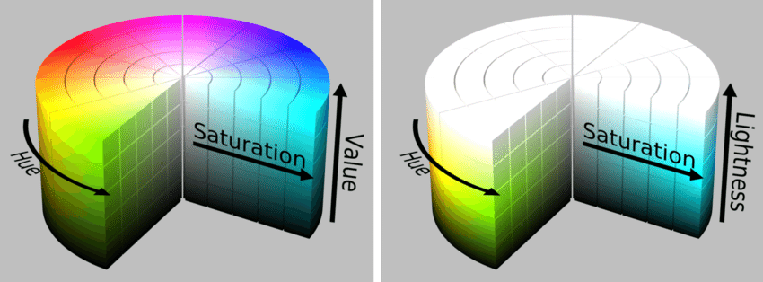

#! https://zhuanlan.zhihu.com/p/438616510
#  计算机视觉基础 (Basic Knowlege of Machine Vision) -- 1

> 本篇笔记基于 CS131 课程笔记。课程的笔记仓库位于 [Github](https://github.com/StanfordVL/CS131_notes)

## 1. 色域 (Color Space)

> 一个有趣可交互的颜色模型网站：[Color models and color spaces](https://programmingdesignsystems.com/color/color-models-and-color-spaces/index.html)

### 1.1 定义

色域，也称为颜色模型（或颜色系统），是一种抽象的数学模型，它将颜色范围描述为数字元组，通常为 3 或 4 个值或颜色分量（例如 RGB）。 颜色空间可以是任意的，也可以是数学结构的。 色域是用来解释颜色的一种系统。

### 1.2 线性色域空间

> 本节图片来源均为[维基百科](https://en.wikipedia.org/wiki/RGB_color_spaces)

之所以被称为线性色域，是因为在 1920 年左右， CIE 组织的科学家设计出了下面的色度图。从下面的色度图中随便选取两点，其融合后的颜色为两点连线的中点。这张图的 x 轴为红色，y 轴为绿色。外面一圈数字为颜色的亮度。看到这里你可能会产生很多疑惑，但请慢慢往下看。

比较常用的线性色域空间有 RGB 色域。即由三原色组成的色域空间，颜色的坐标由其所匹配的原色权重所给出。如下图所示，这个蓝色是由坐标 `RGB=[1/5, 3/5, 4/5]` 所形成。

但实际上，如果仅使用 RBG 色域来合成其他颜色，会出现一个奇怪的现象。有一些颜色的合成需要红色所占比例竟然为`负数`。从下面的颜色合成表 (Color Matching Table) 可以看出来，波长为 450-520 左右的颜色的光，需要红色光为负数才可以合成。因此这一些颜色在上面的颜色方块中其实是不存在的。

由于 RGB 色域存在上面的问题，因此另外一种线性色域： CIE XYZ 色域，被提出，用于解决这个问题。CIE XYZ 色域实际上是 RGB 色域的一种线性变换。

将 XYZ 色域用立方体的形式画出来，然后分别取，点(1,0,0), (0,1,0), (0,0,1) 做一个标准化平面。

然后将平面投影到 xy 轴（蓝色和绿色轴），便之前看到的马蹄形色度图，也这是根据 CIE XYZ 色域画出来的。稍微懂一点几何的小老弟这时候可能就要跳起来说，不对！这个平面的投影应该是个三角形啊，怎么可能是马蹄形呢？这时候，请看一下 下面的 XYZ 颜色合成表你就会发现，我们的坐标刻度已经不是单纯的等比例了。因此在经过一些变换之后，我们的可见光色度图就变成了上面那个马蹄形的样子了。

> 一些有趣的拓展视频，哈勃望远镜下的宇宙：
> - [B站视频](https://www.bilibili.com/video/BV1fK4y1D7z2?from=search&seid=7878969096241951395&spm_id_from=333.337.0.0)
> - [Youtube 视频](https://www.youtube.com/watch?v=WSG0MnmUsEY&ab_channel=Vox)

### 1.3 非线性色域

非线性色域，即色域中两种颜色的连线中点并不是那两种颜色混合后的实际颜色。比较常用的非线性色域有 HSV 颜色模型 (H: Hue 色调， S: saturation 饱和度， V: Value 值) 和 HSL 颜色模型 (H: Hue 色调， S: saturation 饱和度，L: Lightness 亮度)

这两种模型都是比较直观的，人类对于颜色的理解。其中色轮就是非线性模型圆柱的其中一层。

## 2. 白平衡 (White Balancing)

### 2.1 定义

白平衡是调整传感器接收到的图像数据以正确渲染中性颜色（白色、灰色等）的处理。 这种调整是由数码相机自动进行的（针对不同光线的自定义设置），胶片相机为不同的拍摄条件提供了多种滤镜和胶片类型。

### 2.2 白平衡的重要性

由于一些原因，未经调整的图像具有不自然的“色偏”，这使得白平衡非常重要：
- 相机或胶卷中的传感器与我们眼睛中的传感器不同
- 不同的显示媒体渲染图像的方式不同，这需要考虑
- 拍摄图像时的观看条件通常与图像观看条件不同图

只有在获得正确白平衡的照片后，再继续进行图像处理才是有效的。

> 拓展阅读：
> - [Cambrige in Color](https://www.cambridgeincolour.com/)

下篇：[计算机视觉基础 (Basic Knowlege of Machine Vision) -- 2]()