#! https://zhuanlan.zhihu.com/p/444536065
#  计算机视觉基础 (Basic Knowlege of Machine Vision) -- 2

## 1. 图像采样和量化 (Image sampling and quantization)

### 1.1 图像的总类 (Image Types)

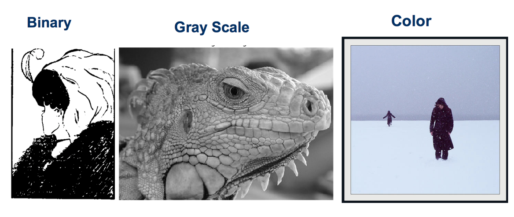

- 二进制图像 (Binary Images)
  - 像素矩阵种只有 0 和 1 的图像，即黑白图像。
  - 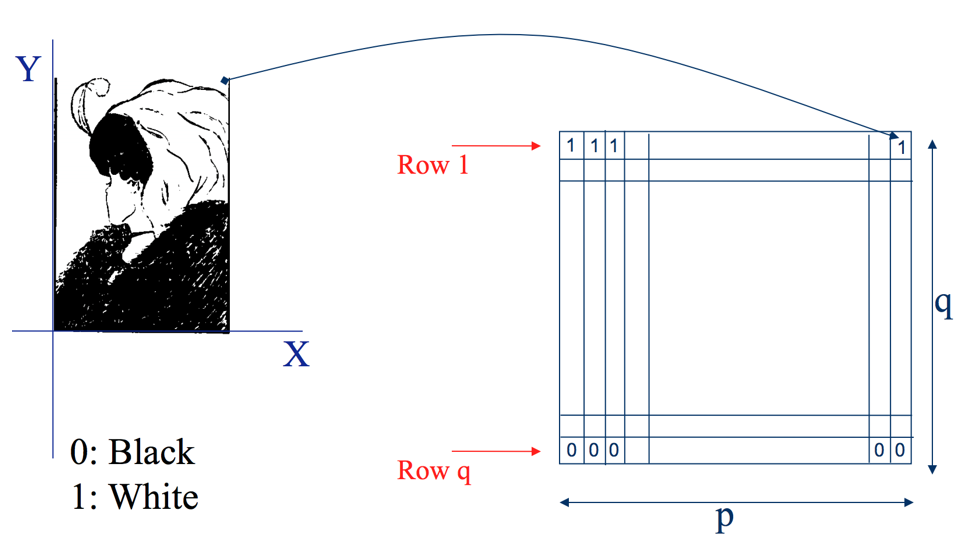
- 灰度图像 (Grayscale Images)
  - 灰度图相比于黑白图像而言，像素有着更广泛的取值范围。它依据亮度，将黑与白分成 0 到 255 这 256 个等级。
  - 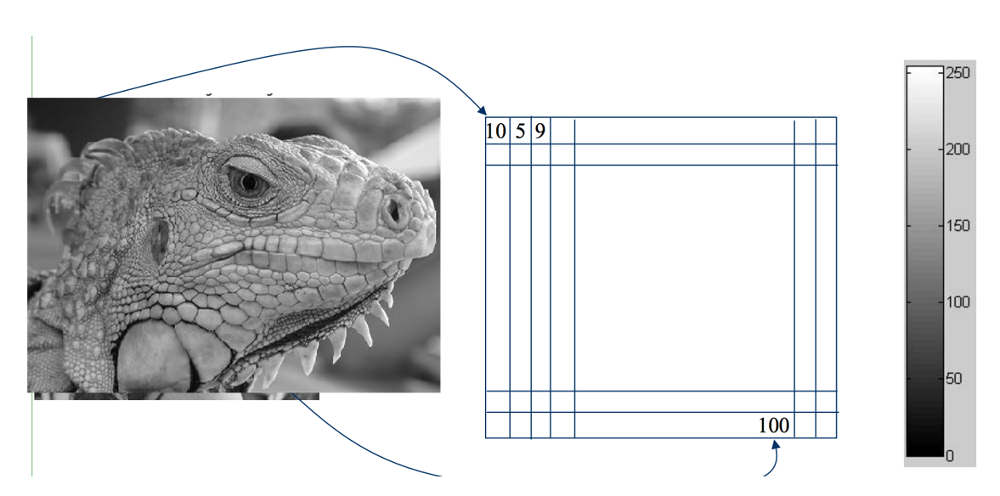
- 彩色图像 (Color Images)
  - 彩色图像相比与灰度图像，又依据颜色模型（RGB, LAB, HSV等）添加了颜色通道。每个颜色通道依然是由 0 到 255 等级的强度值构成像素点。以 RGB 为例，彩色照片是由三张只含有 红，绿，蓝 单色的照片叠加出来的。因此，一张RGB彩色照片的一个像素，包含有3个颜色通道的值。
  - 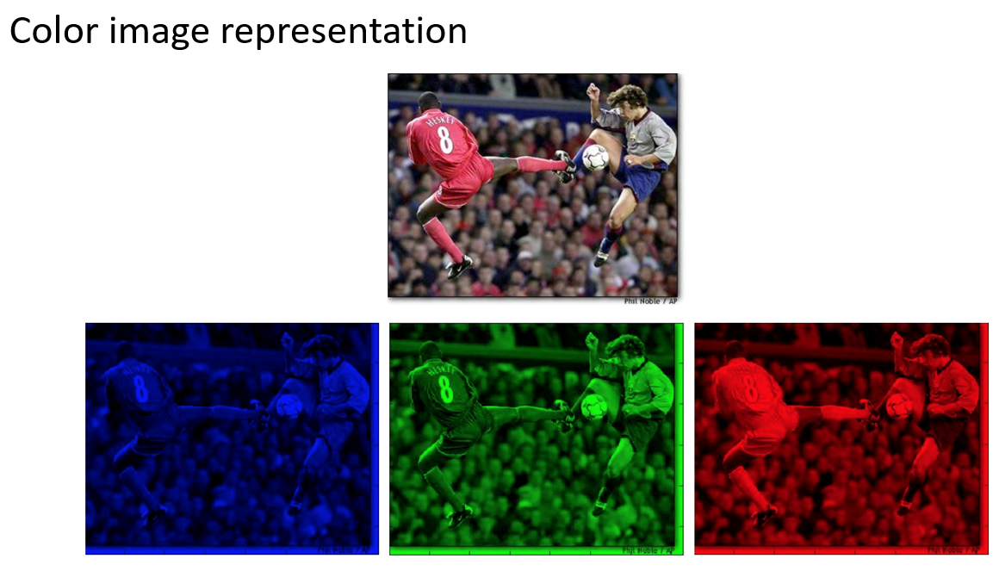

### 1.2 采样和分辨率 (Sampling and Resolution)

- 采样 (Sampling):  图片与真实世界的物体不同，图片不是连续的，它们由一定大小和密度的离散像素（样本）组成。这可能会导致错误（或颗粒感），因为像素密度只能以特定分辨率测量，并且必须近似。

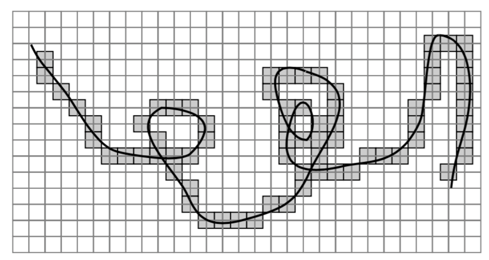

- 分辨率 (Resolution): 是一个采样参数，以每英寸点数 (DPI) 为单位定义。以下图为例，分辨率越低，我们就越容易看出来圆形边缘的方块感觉，分别率越高，圆形的曲线也就越圆滑。这个效果类似于微分。
  
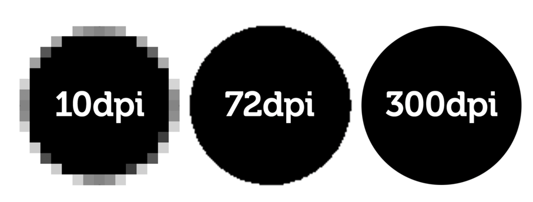

- 像素(Pixels): 是用来量化样本元素的值，通常我们会使用[0,2] 来描述图像的通道 和 [0,255] 的数值来描述该点位的强度。

我们使用上述方面获得的图像，本质是来说是真实世界元素经过压缩损失后的映射。它在一定程度上还原了世界在二维图像中的样子。

## 2. 直方图 (mage Histograms)

直方图测量了图像中亮度的频率：即特定像素值在图像中出现的次数。

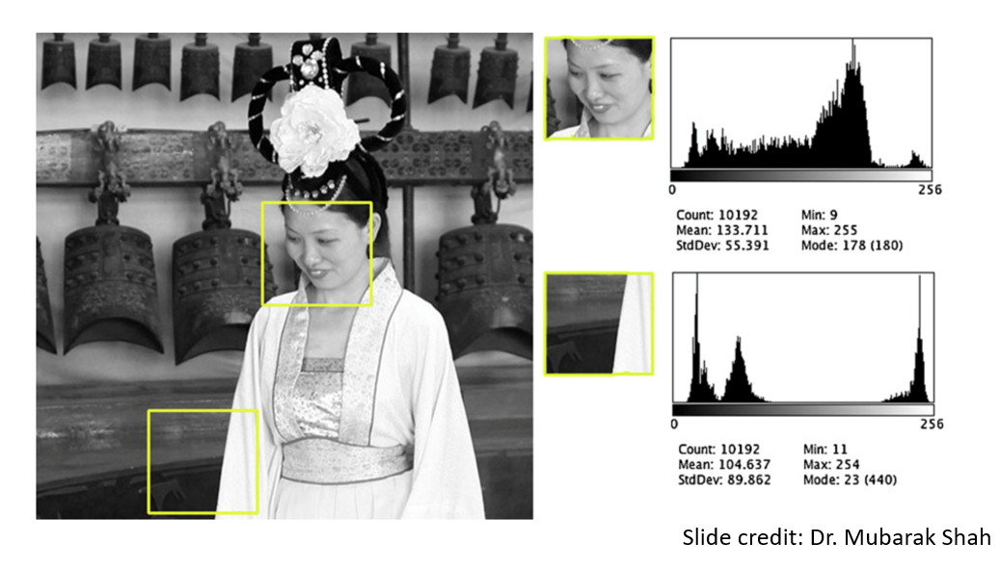

以上图中的亚洲女性为例，图像中人脸区域的直方图与其他区域的直方图有着明显的区别。不同场景或物体的直方图之间会有区别，因此可以作为区分不同物体的分类器指标之一。

## 3. 图片方程 (mages as Functions)

在采样和分辨率一节中，我们提到了数字图像的本质，即通过在二维空间采样映射到规则网格上的离散的数值点。他们最终表现为整数值组成的二维矩阵。

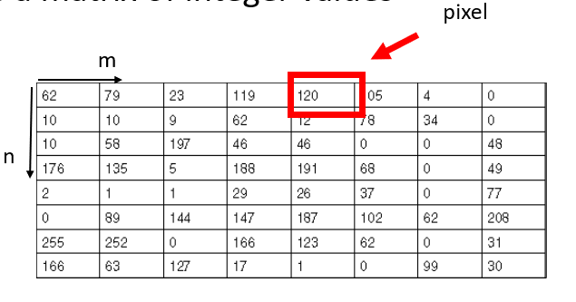

因此，我们可以将图片放在一个只取整数的笛卡尔坐标系中，该坐标系中的每一个点都表示了一个像素所在的位置。对于一张灰度图片来说，只要我们输入坐标点的位置，便可以获得该点所表示的 [0,255] 的像素值。从而，获得了以下映射关系。

$$f[x,y] = n \in [0,255]$$

对于灰度图片的一个横坐标为 [a,b] ，纵坐标为 [c,d] 的区域来说有来说，有：

$$f:[a,b]\times[c,d] \rightarrow [0,255]$$

以之前用过的蜥蜴为例，该图片的坐标表示为：

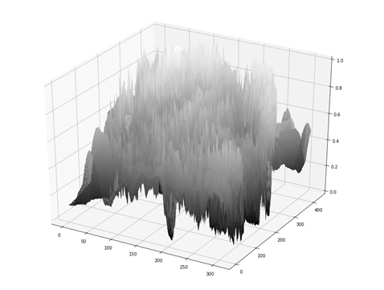

对于一张彩色图片则有：

$$f[x,y] = 
\left[
\begin{matrix}
        r[x,y]\\
        g[x,y]\\
        b[x,y]\\
\end{matrix}
\right]$$

r,g,b 分别对应其颜色的强度方程。

## 4. 滤镜 (Filters)

术语图像过滤是指形成新图像的过程，其像素值是原始像素值的变换。 通常，应用滤镜的目的是提取有用信息（例如，边缘检测）或调整图像的视觉属性（例如，降噪），比如下面的磨皮滤镜。

从上一节，图像方程中，可知，图像就是坐标到值的映射方程。将原始的 $f[x,y]$ 方程，转变为 $g[x,y]$ 的过程便是过滤。在计算过程中，使用算子(system operator) $S$ 来表示滤镜，比如：

$$S[f] = g\\
S{f[m,n]} = g[m,n]\\
f[m,n] \stackrel{S}{\longrightarrow} g[m,n]$$

### 4.1 线性系统滤镜的例子

#### 移动平均值滤镜 （Moving Average)

移动平均值滤镜可以将图片模糊，或者将锐利的物体边缘变得平滑，如下图所示。

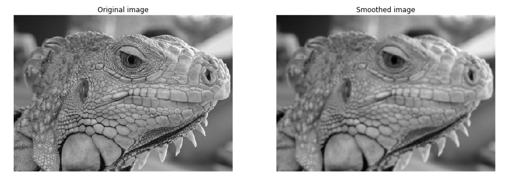

具体的做法是将一个 $3\times 3$ 的像素区域求取平均值，并将该平均值放置在这9个格子的中间位置，作为新图像的像素点。这个$3\times 3$ 的像素区域会沿着图像的 x,y 轴一格一格的移动，直到执行完原图像所有的像素。

$$g[m,n] = \frac{1}{9}\sum_{i=-1}^{1}\sum_{j=-1}^{1}f[m-i,n-j]$$

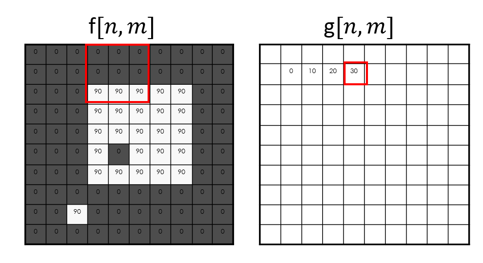

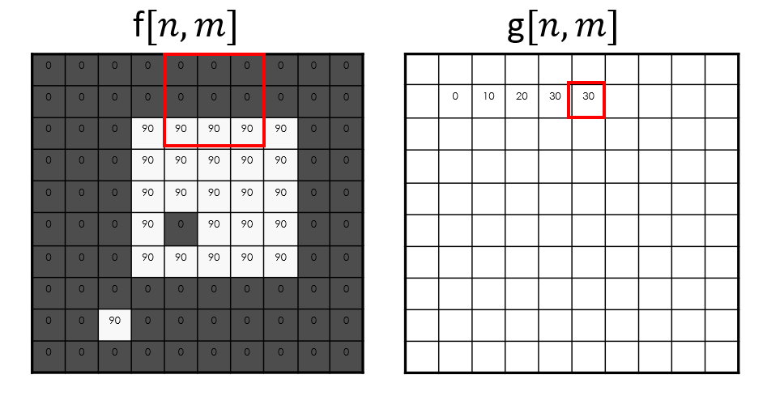

#### 图像分割 (Image Segmentation)

我们还可以使用过滤器基于简单的阈值系统执行基本的图像分割。 在这种情况下，过滤器将像素值设置为极高或极低值，具体取决于它是否满足阈值。 在数学上，我们将其写为：

$$g[m,n] = 
\left\{
\begin{matrix}
    255 && f[m,n] \geq t\\
    0   && otherwise
\end{matrix}
\right.$$

通过这样的方式我们可以将一个灰度图转变为一个黑白图(Binary Images):

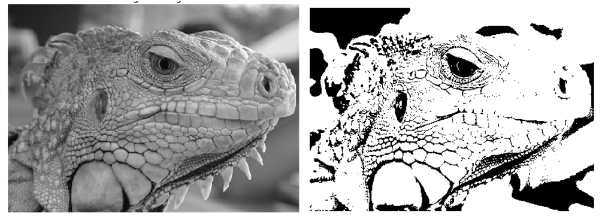

### 4.2 系统性质 (roperties of Systems)

> 目前不知道有什么用，等真的用到的时候再回来看这段话吧

#### 幅度特性 (Amplitude Properties)

- 相加性 (Additivity): 
  - $$S[f_i[m,n] + f_j[m,n]] = S[f_i[m,n]] + S[f_j[m,n]]$$
- 同质性 (Homogeneity): 
  - $$S[\alpha f_i[m,n]] = \alpha S[f_i[m,n]]$$
- 叠加 (Superposition): 
  - $$S[\alpha f_i[m,n] + \beta f_j[m,n]] = \alpha S[f_i[m,n]] + \beta S[f_j[m,n]]$$
- 稳定性 (Stability): 
  - $$|f[m,n]| \leq k \leftarrow |g[m,n]| \leq ck$$
- 可逆性 (Invertibility): 
  - $$S^{-1}[S[f[m,n]]] = f[m,n]$$

#### 空间属性 (Spatial Properties)

- 因果关系(Causality): 
  - $$f[m,n] = 0 \leftarrow g[m,n] = 0$$
- 移位不变性(Shift Invariance):
  - $$f[m-m_0,n-n_0] \stackrel{S}{\longrightarrow} g[m-m_0,n-n_0]$$

### 4.3 线性系统 (Linear Systems)

一个线性系统需要满足叠加性和位移不变性。

线性系统也有所谓的冲击响应(为下一节的卷积做铺垫)。要确定系统 S 的脉冲响应，首先考虑 $\delta_2[m,n]$。这是一个定义如下的函数:

$$\delta_2[m,n] = 
\left\{
\begin{matrix}
    1  && m=0\ and\ n=0\\
    0  && otherwise
\end{matrix}$$

脉冲响应就是像上式一样的非0即1的函数。这样的函数通常也用作触发函数，即在满足一定条件的时候为真值(True)，其余时候为假(Flase)。

## 5. 卷积和相关 (Convolution and Correlation)

### 5.1 卷积

> 关于卷积的[拓展阅读](http://www.songho.ca/dsp/convolution/convolution.html)

将卷积视为一种使用来自相邻像素的信息来过滤目标像素的系统最简单的方法。之前的移动平均值算法就是一个很好的例子。

卷积的的运算符号是 *:

$$f[n,m]*h[n,m]$$

一般来说，$f[n,m]$ 代表的是图像，$h[n,m]$ 被称为 kernel（直译过来就是核心，这里我们称它为核函数）。在图像处理中，我们可以将 kernel 理解为滤镜。已之前的移动平均值为例，其核函数就是一个 $3\times 3$矩阵窗口，这个窗口中每一个格子的值都是$\frac{1}{9}$。在 f,h 矩阵中的同一个位置的值相乘后，对所有值求和，并放在原图窗口的中心位置。

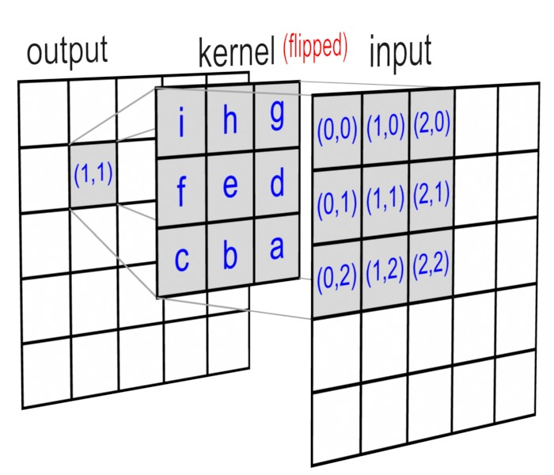

通常来说，在卷积计算过程中，需要将 Kernel 关于原点翻转，如下图所示，对 Kernel 进行了一次 x 轴翻转又对 y 轴进行了一次反转。那么对于移动平均值滤镜来说，公式可以写成：

$$S[f] = \sum_{n=-\infin}^{\infin}\sum_{m=-\infin}^{\infin} f[n,m]*h[-n,-m]$$

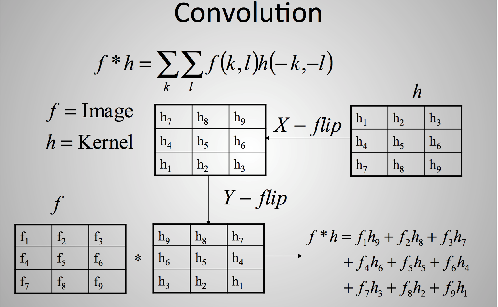

通过改变 Kernel 的大小，比如从 $3\times 3$ 改为 $5\times 5$ 可以改变滤镜效果的强弱。如果改变 Kernel 中的值，便可以改变滤镜的功能。

### 5.2 互相关 (Correlation)

互相关与卷积相同，只是滤波器内核没有翻转。二维互相关表示为：

$$S[f] = \sum_{n=-\infin}^{\infin}\sum_{m=-\infin}^{\infin} f[n,m]*h[n,m]$$

它被用来查看 Kernel 与图像之间的相关性 (similarity)，即通过使用包含目标特征的内核来查找图像中的已知特征。

- 卷积是一个积分，表示一个函数在另一个函数上移动时的重叠量。卷积是一种过滤操作。
- 互相关比较两组数据的相似性。 互相关计算两个输入信号相互移动时的相似性度量。 相关结果在两个信号最佳匹配时达到最大值。互相关是衡量两个信号的相关性。

上篇：[计算机视觉基础 (Basic Knowlege of Machine Vision) -- 1](https://zhuanlan.zhihu.com/p/438616510)
下篇：