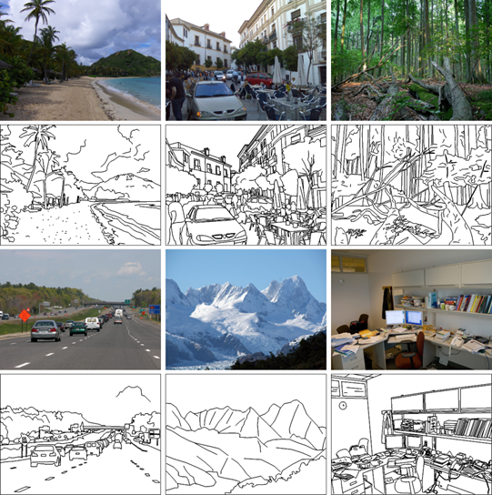
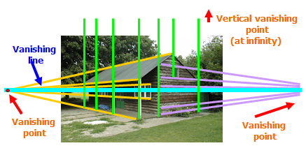
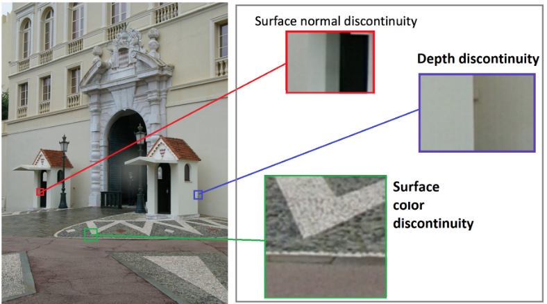
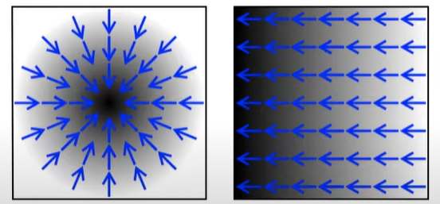
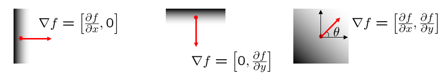
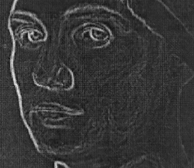

#  CV3. 边缘检测 (Edge Detection)

## 1. 边缘检测

### 1.1 边缘检测的动机(Motivation)

对于哺乳动物来说， 大脑中的某些神经元擅长识别直线。 来自这些神经元的信息被放在大脑中以识别物体。 对于人类来说，边缘对于人类识别物体来说非常重要，线条图几乎和原始图像一样可识别。

直观地说，图像中的大部分语义和形状信息都可以在边缘进行编码。相比于像素而言，边缘信息更加简洁高效。边缘检测的目的是希望能够提取信息、识别对象并恢复图像的几何形状和视点。

### 1.2 构成边缘的基础(dge Basics)

图像中有四种可能的边缘来源：表面法线不连续性（表面急剧改变方向）、深度不连续性（一个表面在另一个表面后面）、表面颜色不连续性（单个表面改变颜色）、照明不连续性（阴影/照明）。

当图片中上述元素的梯度的大小很高时，图像中会出现边缘。

### 1.3 找到坡度(Finding the Gradient)

什么是 Gradient 直观的说就是图像中一道道由白指向黑(值逐渐减小)的向量。

查找坡度是为了判断灰度图中的像素是否发生了数值上的突变。如果发生了突变，即出现了坡度，也可以认为这里是物体的边界。

如何判断 Gradient 呢？首先看一个一维中的数学例子：

对于函数：

$$y = x^2 + x^4$$

其坡度就是其在每一个点处的倒数值：

$$y' = 2x + 4x^3$$

在$x=1$处的坡度就是 6.

上面的例子是连续的取值的，但图像是由一个个像素组成的不连续的方程。那么它的坡度应该用下面的式子进行计算：

$$\frac{df}{dx} = f(x)-f(x-1) = f'(x)$$

对于二维数组来说，就是：

$$\bigtriangledown{f(x,y)} = 
\left[
\begin{matrix}
    \frac{\partial{f(x,y)}}{\partial{x}}\\
    \frac{\partial{f(x,y)}}{\partial{y}}
\end{matrix}
\right]=
\left[
\begin{matrix}
    f_x\\ f_y
\end{matrix}
\right]$$

对于这个坡度的大小，可以用：

$$|\bigtriangledown{f(x,y)}|=
\sqrt{f_x^2+f_y^2}$$

其方向为：

$$\theta = atan(\frac{f_y}{f_x})$$

将上面的数学方法应用于图片中，便会产生下面的效果：

即生成了一条垂直于边界的法线。

### 1.4 索贝尔边缘检测(Sobel Detector)

>推荐视频：[Finding the Edges (Sobel Operator) - Computerphile](https://www.youtube.com/watch?v=uihBwtPIBxM&ab_channel=Computerphile)

通过将上面的方法与卷积结合，便是索贝尔边缘检测法了。

常用到的 Sobel Kernel 是两个 $3\times 3$ 的矩阵，分别用于检测 x,y 方向的边缘：

$$G_x=
\left[
\begin{matrix}
    1 &0 &-1\\
    2 &0 &-2\\
    1 &0 &-1\\
\end{matrix}
\right],\ 
G_y=
\left[
\begin{matrix}
    1 &2 &1\\
    0 &0 &0\\
    -1 &-2 &-1\\
\end{matrix}
\right]$$

这两个式子比较直观，一个只在x方向出现数值突变时起作用，另外一个只在y方向上数值突变时起作用。其余无变化的区域均为0。其效果如下：

依照坡度原理结合卷积的思想的方法不止索贝尔一种，还有 Laplace 和 Prewitt 等方法，其 Kernel 分别如下：

- Laplace：
$$G_x=
\left[
\begin{matrix}
    0 &1 &0\\
    1 &-4 &1\\
    0 &1 &0\\
\end{matrix}
\right]$$

- Prewitt：

$$G_x=
\left[
\begin{matrix}
    1 &0 &-1\\
    1 &0 &-1\\
    1 &0 &-1\\
\end{matrix}
\right],\ 
G_y=
\left[
\begin{matrix}
    1 &1 &1\\
    0 &0 &0\\
    -1 &-1 &-1\\
\end{matrix}
\right]$$

但是效果均不及 索贝尔。

这里值得一提的是，图片中的噪点对于索贝尔法的影响非常大。比如将上图放大，就可以发现图片中还有很多细小的白线。这些白线就是由于图片中的噪点导致的，这会导致我们得到的图片并不是一张干净的图片。

要想获得更加干净的边界图，我们需要在检测边缘之前对图片进行模糊(Blur)处理。

但除了噪点问题之外，索贝尔还有一些问题，比如更加倾向于水平和竖直的边缘，对于斜边的处理比较差。

### 1.5 图像模糊(Bluring)

在上一章中，介绍了使用移动平均值的卷积模糊算法，这里再介绍另外一种更常用的模糊算法：高斯模糊。

