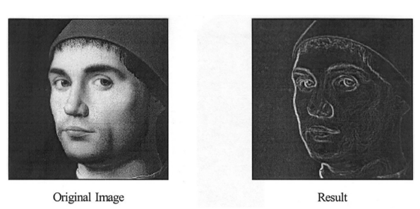

#! https://zhuanlan.zhihu.com/p/446867045
#  CV3. 边缘检测 (Edge Detection)

## 1. 边缘检测

### 1.1 边缘检测的动机(Motivation)

对于哺乳动物来说， 大脑中的某些神经元擅长识别直线。 来自这些神经元的信息被放在大脑中以识别物体。 对于人类来说，边缘对于人类识别物体来说非常重要，线条图几乎和原始图像一样可识别。

直观地说，图像中的大部分语义和形状信息都可以在边缘进行编码。相比于像素而言，边缘信息更加简洁高效。边缘检测的目的是希望能够提取信息、识别对象并恢复图像的几何形状和视点。

### 1.2 构成边缘的基础(dge Basics)

图像中有四种可能的边缘来源：表面法线不连续性（表面急剧改变方向）、深度不连续性（一个表面在另一个表面后面）、表面颜色不连续性（单个表面改变颜色）、照明不连续性（阴影/照明）。

当图片中上述元素的梯度的大小很高时，图像中会出现边缘。

### 1.3 找到坡度(Finding the Gradient)

什么是 Gradient 直观的说就是图像中一道道由白指向黑(值逐渐减小)的向量。

查找坡度是为了判断灰度图中的像素是否发生了数值上的突变。如果发生了突变，即出现了坡度，也可以认为这里是物体的边界。

如何判断 Gradient 呢？首先看一个一维中的数学例子：

对于函数：

$$y = x^2 + x^4$$

其坡度就是其在每一个点处的倒数值：

$$y' = 2x + 4x^3$$

在$x=1$处的坡度就是 6.

上面的例子是连续的取值的，但图像是由一个个像素组成的不连续的方程。那么它的坡度应该用下面的式子进行计算：

$$\frac{df}{dx} = f(x)-f(x-1) = f'(x)$$

对于二维数组来说，就是：

$$\bigtriangledown{f(x,y)} = 
\left[
\begin{matrix}
    \frac{\partial{f(x,y)}}{\partial{x}}\\
    \frac{\partial{f(x,y)}}{\partial{y}}
\end{matrix}
\right]=
\left[
\begin{matrix}
    f_x\\ f_y
\end{matrix}
\right]$$

对于这个坡度的大小，可以用：

$$|\bigtriangledown{f(x,y)}|=
\sqrt{f_x^2+f_y^2}$$

其方向为：

$$\theta = atan(\frac{f_y}{f_x})$$

将上面的数学方法应用于图片中，便会产生下面的效果：

即生成了一条垂直于边界的法线。

### 1.4 索贝尔边缘检测(Sobel Detector)

>推荐视频：[Finding the Edges (Sobel Operator) - Computerphile](https://www.youtube.com/watch?v=uihBwtPIBxM&ab_channel=Computerphile)

通过将上面的方法与卷积结合，便是索贝尔边缘检测法了。

常用到的 Sobel Kernel 是两个 $3\times 3$ 的矩阵，分别用于检测 x,y 方向的边缘：

$$G_x=
\left[
\begin{matrix}
    1 &0 &-1\\
    2 &0 &-2\\
    1 &0 &-1\\
\end{matrix}
\right],\ 
G_y=
\left[
\begin{matrix}
    1 &2 &1\\
    0 &0 &0\\
    -1 &-2 &-1\\
\end{matrix}
\right]$$

这两个式子比较直观，一个只在x方向出现数值突变时起作用，另外一个只在y方向上数值突变时起作用。其余无变化的区域均为0。其效果如下：

依照坡度原理结合卷积的思想的方法不止索贝尔一种，还有 Laplace 和 Prewitt 等方法，其 Kernel 分别如下：

- Laplace：
$$G_x=
\left[
\begin{matrix}
    0 &1 &0\\
    1 &-4 &1\\
    0 &1 &0\\
\end{matrix}
\right]$$

- Prewitt：

$$G_x=
\left[
\begin{matrix}
    1 &0 &-1\\
    1 &0 &-1\\
    1 &0 &-1\\
\end{matrix}
\right],\ 
G_y=
\left[
\begin{matrix}
    1 &1 &1\\
    0 &0 &0\\
    -1 &-1 &-1\\
\end{matrix}
\right]$$

但是效果均不及 索贝尔。

这里值得一提的是，图片中的噪点对于索贝尔法的影响非常大。比如将上图放大，就可以发现图片中还有很多细小的白线。这些白线就是由于图片中的噪点导致的，这会导致我们得到的图片并不是一张干净的图片。

要想获得更加干净的边界图，我们需要在检测边缘之前对图片进行模糊(Blur)处理。

但除了噪点问题之外，索贝尔还有一些问题，比如更加倾向于水平和竖直的边缘，对于斜边的处理比较差。

### 1.5 图像模糊(Bluring)

在上一章中，介绍了使用移动平均值的卷积模糊算法，这里再介绍另外一种更常用的模糊算法：高斯模糊(Gaussian Blur)。

首先来看一下高斯分布：

这个大家都比较熟悉，所以也不多介绍了，直接来看高斯模糊。它的本质是离散化的二维高斯分布，数学公式为:

$$G(x,y) = \frac{1}{x\pi \sigma ^2}e^{- \frac{x^2+y^2}{2 \sigma ^2}}$$

用 Kernel 表示就是：

$$G = \frac{1}{273}
\left[
    \begin{matrix}
        1 & 4 & 7 & 4 & 1\\
        4 & 16 & 26 & 16 & 4\\
        7 & 26 & 41 & 26 & 7\\
        4 & 16 & 26 & 16 & 4\\
        1 & 4 & 7 & 4 & 1\\
    \end{matrix}
\right]$$

### 1.6 Canny Edge Detector

> 推荐视频： [Canny Edge Detector](https://www.youtube.com/watch?v=sRFM5IEqR2w&list=PLzH6n4zXuckoRdljSlM2k35BufTYXNNeF&index=3&ab_channel=Computerphile)

Canny 是最常用的一种边缘检测器，它与 Sobel 的原理类似，但要比 Sobel 多一些步骤。

1. 抑制噪音(Suppress noise)
2. 计算梯度大小和方向(Compute gradient magnitude and direction)
3. 应用非极大值抑制(Apply non-maximum suppression)
4. 滞后阈值(Hysteresis thresholding)
5. 检测边缘的连通性分析(Connectivity analysis to detect edges)

#### 1.6.1 抑制噪音和计算梯度大小和方向

前两个步骤比较简单，就是先使用高斯模糊消除噪点，之后使用与 Sobel 相同的方法计算梯度大小和方向。

#### 1.6.2 应用非极大值抑制

非极大值抑制的目的是在图片像素比较高的情况下，减小边缘的宽度。方法是比较一个像素处的坡度与周围的其他像素的坡度，只有这个像素比周围其他像素的坡度都高的时候，才会将这个像素留下。否则将其设置为0.

#### 1.6.3 滞后阈值与检测边缘的连通性分析

在这里我们使用两个阈值来处理图片的边缘强度。任何边缘强度高于最高阈值的边缘将会保留，而低于最低阈值的边缘将会被清除。而两个阈值中间部分的边缘与被查看是否与已经被保留的边缘相连，如果相连则也会被保留，否则将被清除。应用这种方法，可以将有效边缘边缘保留的同时清除掉噪声带来的无效边缘。

下图展示了该原理在一维边缘强度反应中的应用，绿色的部分是被保留的边缘，红色部分是被清除掉的边缘。

在 Opencv_python 中使用函数 `Canny(image, edges, threshold1, threshold2)`即可。

效果如下：

## 2. 霍夫变换(Hough Transforms)

> 推荐视频：
> - [How Hough Transform works](https://www.youtube.com/watch?v=4zHbI-fFIlI&ab_channel=ThalesSehnK%C3%B6rting)
> - [How Circle Hough Transform works](https://www.youtube.com/watch?v=Ltqt24SQQoI&ab_channel=ThalesSehnK%C3%B6rting)

霍夫变换是一种检测图像中特定结构的方法。然而，霍夫变换可用于检测参数方程已知的任何结构。它在噪声和部分遮挡下提供了一个鲁棒的检测器。

比如，当一个物体被另外一个物体遮挡住了，我们可以利用剩余物体的边缘补全被遮挡的部分。

### 2.1 直线检测

通常我们将直线的数学方程定义为：

$$y_i = ax_i + b$$

当我们只知道直线中的一个点$(x_i,y_i)$时，将会有无数条直线通过这个点。要找到这些直线，可以使用方程：

$$b = -ax_i + y_i$$

将 a,b 作为变量，而$(x_i,y_i)$作为已知量，便可以找到所有的过点$(x_i,y_i)$的直线。而这些所有的直线，在以 a,b 为坐标轴的空间中，也表示为一条直线。

假如，现在知道了直线上的另外一点$(x_j,y_j)$，并用同样的方法，将其转换到了 ab 空间，得到了一条直线。那么这条直线将和之前的直线相交于一点，这一点便是原先 x,y 空间中的直线。也就是说，无论 x,y 空间的直线上取多少点，取在哪里，他们转换到 ab 空间中的直线都会相交于一点。

那么，要想找到被断开的直线，还需要经过以下的步骤：

为了更好的表现 ab 空间，我们 ab 的表达式转为极坐标，即 $\theta$ 和 $\rho$.

$$x cos\theta + y cos\theta = \rho$$

然后一次遍历所有边缘点，并将其转换到ab 空间，形成了下图左侧的图像。此图像中有4个点为白色的，这四个点是有最多曲线交叉的点位。这表示了这右侧图像中共有4条直线组成。

通过这个方法，可以帮助我们将原本不相连的线段连接成一条直线。这就很好的解决了噪点和遮罩对直线的影响。
### 2.2 圆形检测

了解圆形检测的霍夫变换之前，先看一下圆的数学表达式：

$$r^2 = (x-a)^2 + (y-b)^2$$

对于圆来说，最关键的是找到其圆心和半径。

那么，在使用霍夫变换之前，除了要确定 xy，还需要确定 半径 r。这样通过一次次在白色的边缘处画圆便可以找到圆心所在的位置，从而将不完整的圆形补齐。

> 个人觉得这并不是一个非常好的方法，因为图像中圆的半径应该不太好找。

- 上篇：[计算机视觉基础 (Basic Knowlege of Machine Vision) -- 2](https://zhuanlan.zhihu.com/p/444536065)
- 下篇：[CV4. 特征提取 (Features) -- 1](https://zhuanlan.zhihu.com/p/448798850)