#! https://zhuanlan.zhihu.com/p/448798850
# CV4. 特征提取 (Features) -- 1

> 为何要进行特征提取？
> 
> 经过之前的学习，我们已经可以将一张图片中物体的边缘提取出来了。但即使是我们用 Canny 提取出来的物体边界图依然存在很多对于识别物体来说并不重要的线条。这些线条反而会影响到我们对物体的识别。因此我们有必要将有利于我们识别物体的这些特征提取出来。
> 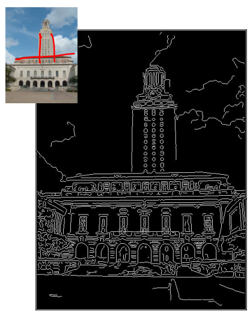

## 1. RANSAC 比例算法

### 1.1 动机

RANdom SAmple Consensus (RANSAC) 直译过来就是随机样本共识，是一种利用比例来确定特征的算法。它相比如边缘检测来说，可以在物体较多的情况下保持高效和准确。但是在噪声较大的图片中可能会失败或者产生不准确的结果。

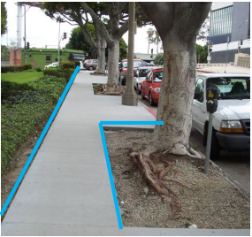

### 1.2 方法

RANSAC 简单来说就是对边缘进行随机采样获取到一组点，然后寻找最佳拟合线。需要找到一条可以使尽可能多的点都靠近这条的模型，这条模型便很可能是这个边缘的最佳拟合线。将靠近模型的点叫做 内群点(inliers)，不靠近的叫做 离群点(outliers)。

下面是 RANSAC 的一般过程循环：

1. 从数据集中选择出可以估计出模型的最小数据集；(对于直线拟合来说就是两个点，对于计算Homography矩阵就是4个点)
2. 使用这个数据集来计算出数据模型。
3. 计算在模型范围内的点的个数，即内群点的个数。
4. 一直重复上面的步骤，直到找到最多内群点的直线。

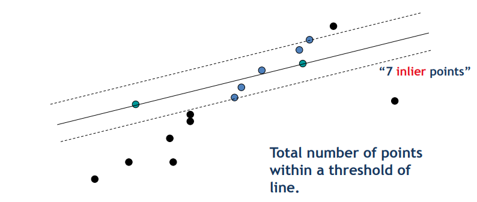
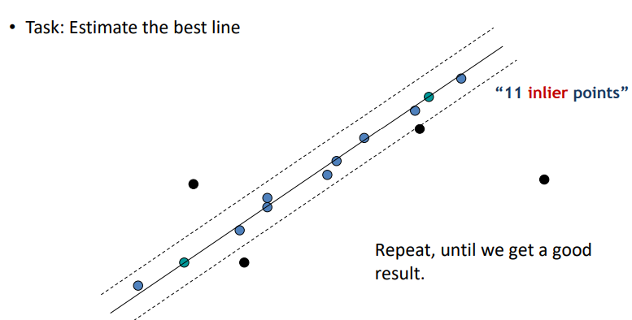

这种算法不止可以用于检测直线，三角形，矩形也都可以由这个方法检验出来。

### 1.3 迭代次数计算

在使用算法之前，需要先设置这个算法的迭代次数。

假设内群点占比为 t:

$$t = \frac{n_{inliers}}{n_{inliers}+n_{outliers}}$$

每一次计算模型需要用到 n 个点（对于直线来说 n=2 )，那么选取的点中至少有一个是外点的概率为：

$$1-t^n$$

对于 k 次迭代来说，全都失败的可能性是 $(1-t^n)^k$。那么正确采样的概率就是：

$$P = 1-(1-t^n)^k$$

由上式可得：

$$k = \frac{log(1-P)}{log(1-t^n)}$$

> 其中：内群点的概率 t 通常是一个先验值。而 P 是我们希望 ransac 的正确率。

### 1.4 RANSAC 总结

- RANSAC 的好处：
  - 适用于各种模型拟合问题的通用方法。
  - 易于实施且易于计算其故障率。
- RANSAC 的坏处：
  - 只处理中等比例的异常值时不会增加成本。
  - 许多实际问题的异常值率很高（但有时选择性地选择随机子集会有所帮助）。

## 2. 局部不变特征(Local Invariant Features)

### 2.1 动机

对于一个物体来说，可能有很多种情况使得这个物体变得难以辨认，比如：物体被遮挡住了一部分；拍着物体的角度发生了改变；或者同一个物种不同各地之间的差异。但即使这样，大多数情况下，人类都可以轻易的辨别出那个物体或者物种。这是因为物体中有一些局部不变的特征。因此只要找到这些局部不变的特征，上述那些情况就会变得较为容易了。并且还可以做到比如跟踪、运动估计、全景拼接和图像配准等功能

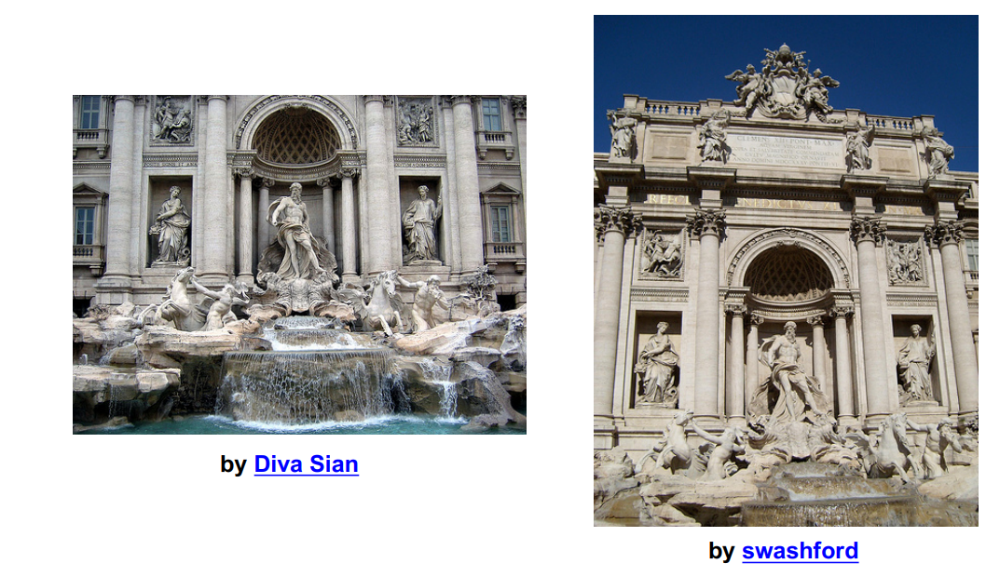

### 2.2 方法(Approach)

1. 找到并定义一组独特的关键点。
2. 获取关节点周围的像素区域。
3. 从该区域中提取和规范化区域内容。
4. 从归一化区域计算局部描述符（即像素强度的函数）。
5. 匹配本地描述符。

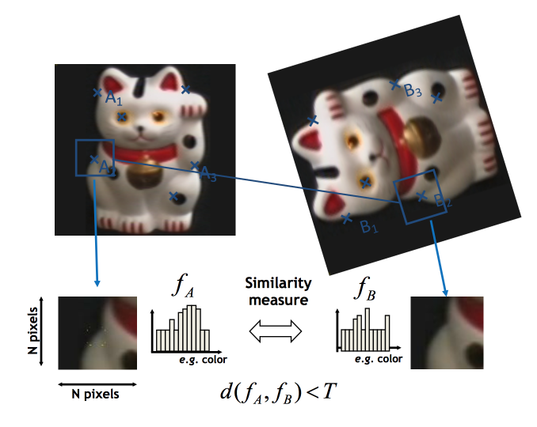

### 2.3 要求

好的局部特征应该具有以下特性：
- 可重复性：给定在不同图像条件（例如光照或视点变化）下的相同对象或场景，在比较的两个图像中应该可以检测到大量特征。换句话说，特征检测应该对旋转和视点变化保持不变，并稳健地处理光照变化、噪声和模糊。
- 局部性：特征应该是局部的，以避免由遮挡和噪点引起的问题。
- 数量：应选择足够多的特征，以确保依赖于对象检测等描述符的技术的准确性。
- 独特性：结果需要包含表现出大量变化的“显着”图像特征； 这确保了检测到的特征可以相互区分并在不同图像之间正确匹配。
- 效率：新图像中的特征匹配应该有利于实时应用

### 2.4 检测器

现在有很多可以帮助我们找到物体特征的检测器：

- Hessian & Harris
- Laplacian, DoG
- Harris-/Hessian-Laplace
- Harris-/Hessian-Affine
- EBR and IBR 
- MSER
- Salient Regions

## 3. 关键点定位(Keypoint Localization)

### 3.1 动机

关键点定位的目标是一致和重复地检测特征，以实现更精确的定位，并在图像中找到有用的内容。

### 3.2 角关键点(Corners)

拐角是高重复性且独特的。拐角的特点是在拐角区域，图像梯度有两个或多个主导方向。

> 梯度在上一章中已经介绍过了。对于平面来说，没有梯度方向。对于边缘来说有一个梯度方向。

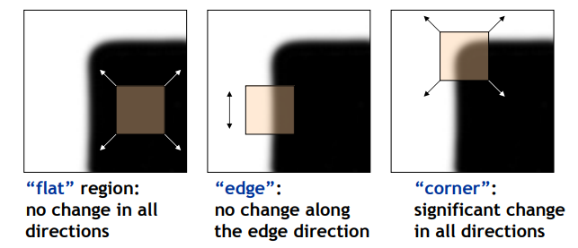

### 3.3 哈里斯探测器(Harris Detector)

Harris Detector 的原理是利用 sobel 计算出图片的 x, y 方向的梯度。。然后分别用 $I_x$ 和 $I_y$ 表示。如果在一个小窗口中发现了类似下图的梯度分布，则此处为一个角。

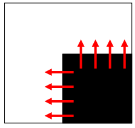

用公式来看就是：

$$M = \left[
    \begin{matrix}
        \sum I_x^2 & \sum I_x I_y \\
        \sum I_x I_y & \sum I_y ^2
    \end{matrix}
    \right]=
   \left[
    \begin{matrix}
         \lambda _1 & 0 \\
        0 & \lambda _2
    \end{matrix}
    \right] $$

但上面的情况比较特殊，因为组成角的边刚好分别与 x 和 y 轴平行。对于更一般的情况来说，我们需用使用下面的式子来判断，某个地方是否是拐角：

$$\theta = det(M) - k trace(M)^2 = \lambda _1\lambda _2 - k(\lambda _1 + \lambda _2)^2$$

其中 k 是可以人为控制的一个量。对于此式当 $\theta$ 大于0，则认为是拐角，否则不是。

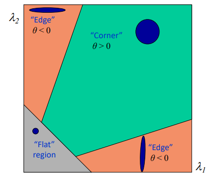

对于上面的 M 窗口，其反应函数是一个单位窗口，即：

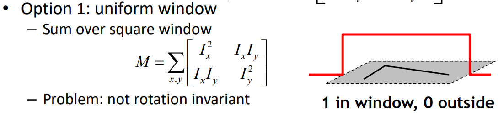

这样的函数太直了，判断边缘与xy轴平行的拐角还好，其他地方的角落判断起来就比较困难了。

但在此基础上乘以一个高斯函数，情况就会好一些：

$$M = g(\sigma)*
\left[
    \begin{matrix}
        I_x^2 &  I_x I_y \\
        I_x I_y &  I_y ^2  
    \end{matrix}
\right]$$

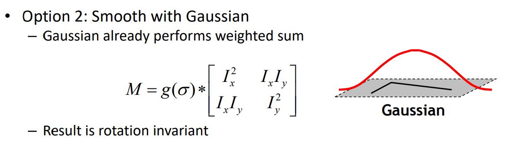

至此，我们完成了一部分的检测，可以做到下图中红色图片的样子了。

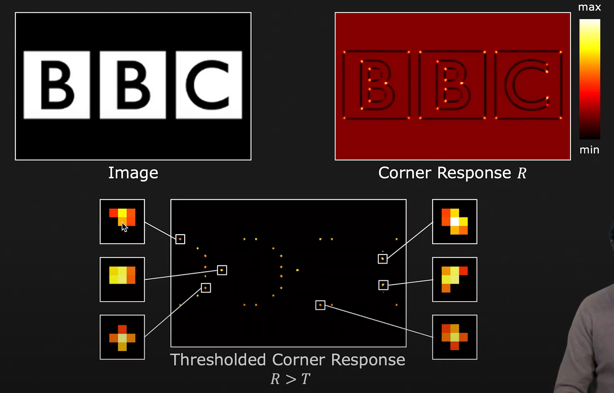

但如果将图2 进行二值化（即第三张图片），便可以看出来，其实我们检测出来的拐角，其实并不是一个像素点，而是多个像素点组成的。要进一步找到拐角，可以再使用非最大值抑制(non-maximal suppression)的方法。简单来说就是一个 Kernel。这个 Kernel 可以将非窗口最大值的中间点变为零。只有当窗口中间值是最大值的时候才会保留。

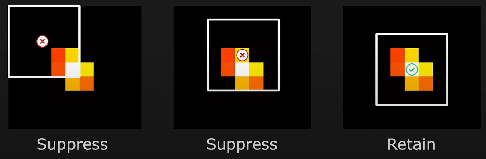

- 上篇：[CV3. 边缘检测 (Edge Detection)](https://zhuanlan.zhihu.com/p/446867045)
- 下篇：

