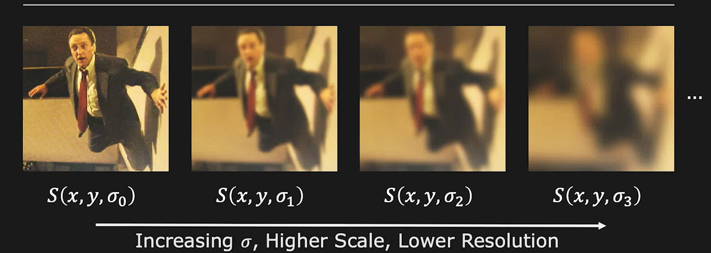

#! https://zhuanlan.zhihu.com/p/449929845
# CV5. 特征提取 (Features) -- 2

> 推荐课程：
> 
> 哥伦比亚大学的计算机视觉课程 First Principles of Computer Vision
> - [Youtube | First Principles of Computer Vision](https://www.youtube.com/playlist?list=PL2zRqk16wsdqXEMpHrc4Qnb5rA1Cylrhx)
> - [Web | First Principles of Computer Vision](https://fpcv.cs.columbia.edu/)

## 1. 尺度不变特征变换(Scale-invariant Feature Transform)

> 老实讲听完本校的这节的内容，我都还是云里雾里，然后看了斯坦福的讲义还是不太明白，最后是哥伦比亚大学的课程让我开悟了，感谢 Shree Nayar 教授！

### 1.1 动机

到目前为止，我们已经涵盖了单个图像中关键点的检测，但更广泛的应用需要在不同尺度的相似图像中进行此类检测。 例如，我们可能想从自动驾驶汽车的视频源中搜索行人，而无需事先了解行人的大小。 同样，我们可能希望使用以不同比例拍摄的照片来拼接全景图。 在这两种情况下，我们都需要在不同的尺度上独立检测相同的关键点。

对于 Harris Detector 来说，图片的尺寸变化对于检测有着很大的影响。比如下图对于检测窗口的大小，即不同分辨率的图像来说，大号的窗口更容易检测出这处是一个拐角，而小号的窗口则会认为此处是一条边。因此我们需要找到一个能让关键点检测不受图片尺寸限制的方法。

### 1.2 特征

尺度不变特征变换简称为 SIFT。通常来说对于一个尺寸可以发生变换的物体来说，我们通过寻找拐角的变不再适合了。但是假如将范围放大值一小个区域，那么寻找这样的区域作为我们的特征便相对容易。并且这样的区域通常包含了丰富的图片信息，并且是图片中比较独特的存在。对于这样的区域，我们称为斑点(Blob)。

对于斑点特征来说，在使用之前依然有一些问题需要解决：
- 找到斑点
- 确定斑点的大小
- 确定斑点的方向
- 最后将上面的斑点特征公式化

### 1.3 检测斑点 LoG

首先，我们先回顾以下高斯滤波。高斯滤波可以除去信号中的杂质，但于同时会使得被过滤的信号变得平滑。高斯滤波有一个参数 $\sigma$ 它决定了高斯滤波器的集中度，或者峰值高度。$\sigma$ 越大则高斯滤波的峰值越小，而滤波的强度也就越大，信号越平滑。

如果对于高斯滤波器进行拉普拉斯变换(LoG)，便会得到以下的图像：

对于其进行二次拉普拉斯变换(LoG^2)，效果如下：

此时的信号与这个新的滤波器相乘便会测到一个在拐点处出现峰值的图像。这样的图像对于我们找到斑点是有利的。

以一个 1D 的斑点为例：

图中的 Blob A, Blob B, Blob C 是同一个斑点在 x 轴上放大不同倍速的样子。分别对这三个斑点进行 LoG^2 则会出现图中红色信号的样子。其中最小的斑点 A 在变换之后突出的地方出现了一个峰值，而 B 和 C 则是在突出的地方有两个峰。那么如果我们要将 B 和 C 缩小回 A 的样子，其实只需要不断的增大 $\sigma$ 直到他们的 LoG^2 也只剩下一个波峰为止。因为高斯滤波器可以平滑掉信号突变的地方，而且 $\sigma$ 越大，信号就会越平滑，直到将 B 和 C 突起处的区域平滑成和 A 一样的一个小波峰为止。

$\sigma$ 是图片的放大特征，而 LoG^2 波峰的位置 x ，即图像特征所在的位置 x。

上面三个信号的放大倍数分别是 1，2，3倍。

用公式来表示就是：

$$(x*, \sigma *) = arg_{(x,\sigma)} |\sigma ^2 \frac{\partial ^2 n_{\sigma}}{\partial x^2} * f(x)$$

其中 
- x* 是特征的位置
- $\sigma *$ 是特征缩放的尺寸

那么对于二维的图像来说，随着 $\sigma *$ 的增加，图像会变得模糊。

从一维到二维 SIFT 除了升维之外，还需要对算法进行归一化，这里使用的算法叫做 Normalized Laplacian of Gaussian(NLoG):

图像的极值点，依然是特征所在的位置。

其算法的公式为：

$$S(x,y,\sigma) = n(x,y,\sigma)*I(x,y)$$

其中，S 为新的图像，n 为 NLoG 算法，I 为原来的图像。

其中 $\sigma$ 的增长是指数级的：

$$\sigma _k = \sigma _0 s^k, \ k = 0,1,2,3$$

其中：
- s 是一个常数
- $\sigma _0$ 是初始的尺寸

具体对我们计算有用的公式为：

$$(x*, y*, \sigma *) = arg_{(x,y,\sigma)} |\sigma ^2 \nabla^2 n_\sigma * I(x,y)|$$

其中 
- x*, y* 是特征的位置，
- $\sigma$* 是特征缩放的尺寸。

### 1.4 检测斑点 DoG

NLoG 是一个很费算力的算法，因为拉普拉斯变换很费算力。为了简化计算，我们可以使用差分高斯 Difference of Gaussian(DoG) 来近似 NLoG。两个算法之间近似相差 s-1 倍。

具体的计算方式是首先对图像进行不同 $\sigma$ 的高斯模糊，然后将相邻的两个 $\sigma$ 计算的结果做差，便得到了差分高斯的结果。

之后每三层进行对比，找到其中同一区域的最大极值点，并将该点作为一个特征点，该层的 $\sigma$ 为此点的放大倍数。这样我们就初步找到了图像中的 SIFT 特征点。然后再对这些特征点进行一次阈值筛查，去掉一些特征强度不是很大的点，进而确定下图片中的SIFT特征点。

但即使是一次次的 DoG 计算，这个运算量依然比较大，因此为了再次节约运算量，可以将一部分的高斯模糊，用降采样(Downsampling) 来代替。

为了解释降采样，首先简单的说一下图像。图像实际上就是对真实世界的采样。每一个采样点就是图像中的一个像素。那么降采样就是直接丢掉一分的像素信息，将图片的尺寸缩小。

每使用一次降采样，我们便称图片减少了一个 Octave。因此我们可以将图片分成一个个的 Octave，每一个 Octave 中我们又会使用高斯模糊来得到 DoG 所需的 Input。

经过以上的一系列计算，我们便得到了图像中的 SIFT 特征点：

## 2. 特征点的方向

经过上面的计算，我们已经可以得到图像中的 SIFT 特征点的位置了，下面我们再来找以下这些特征点的方向。

这里我们依然是用到了之间计算 Edge 时候用过的梯度(Gradients) 来计算特征点的角度。但这里我们不再在意梯度的大小，只关注梯度的方向。

对于一个 SIFT 来说，我们得到的特征是一个区域，即多个像素点。那么我们将一个区域中的像素点分成 $4\times 4$ 的窗口，每一个窗口中又包含 $4\times 4$ 个小格。

> 上面图像中只有 2*2 个窗口，但最好使用 4*4 个窗口

利用公式计算每一个小格中梯度的方向。

$$\theta = tan^{-1} (\frac{\partial I }{\partial y}/ \frac{\partial I }{\partial x})$$

将方向由360°等分为 8 份。然后利用直方图统计每一个窗口中方向出现的次数，并以出现频率最高的方向，最为该窗口的方向。并依次找到每一个窗口的方向，并利用相同的方法，找到整个特征的方向。

这样我们就可以借由特征的方向，找到两张相同物体的图片之间旋转了多少。

## 3. 特征对比

两张图片中的同一特征点的 L2 距离为：

$$d(H1,H2) = \sqrt{\sum_k(H_1(k)-H_2(k))^2}$$

特征点的相关性为：

$$d(H_1,H_2) = \frac{\sum _k[(H_1(k)-\bar{H_1})(H_2(k)-\bar{H_2})]}
{\sqrt{(\sum _k[(H_1(k)-\bar{H_1})^2}\sqrt{(\sum _k[(H_2(k)-\bar{H_2})^2}}$$

当 d = 1 时说明两个特征完美匹配。

重叠：

$$d(H_1,H_2) = \sum _k min(H_1(k),H_2(k))$$

由此便可以得到图像中的特征匹配：

并且这种匹配在杂乱的环境中依然很鲁棒：

图像拼接也可以由此算法完成：

但 SIFT 有一个很明显的缺点，那就是对于转换拍摄视角的鲁棒性并不太好。如下图，当拍摄视角绕着物体转动的时候，能够找到的特征点就越来越少了。

- 上篇：[CV4. 特征提取 (Features) -- 1](https://zhuanlan.zhihu.com/p/448798850)
- 下篇：