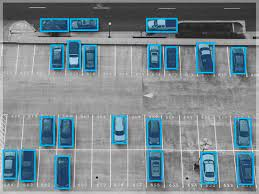
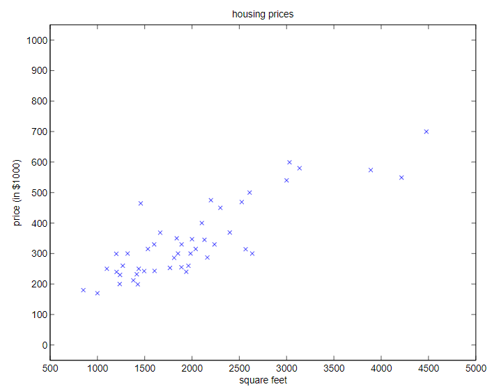
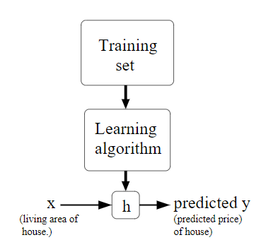
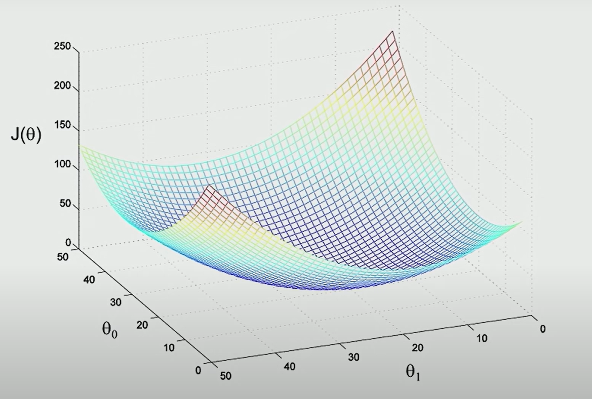
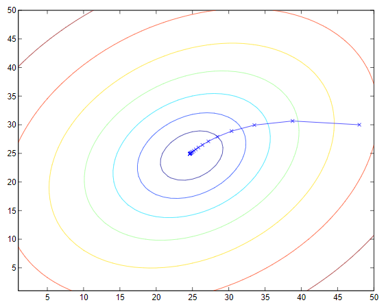
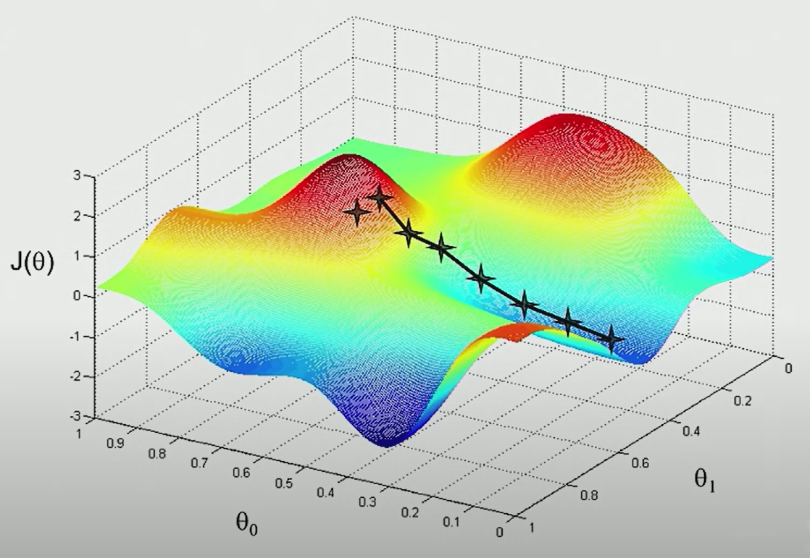
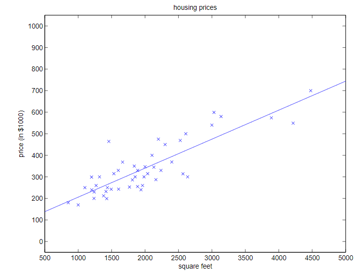

#! https://zhuanlan.zhihu.com/p/452328359
# ML1. 线性回归(Linear Regression) -1

> 线性回归是机器学习的数学基础，本节的内容给我的感觉是通过不断的梯度下降（迭代）而寻找最优解的过程，而这个所谓的最优解，并不是一定问题的最优解，而是当前模型在该问题中的全局最优解，或者局部最优解。

## 1. 监督学习(Supervised learning)

> ref: [维基百科](https://zh.wikipedia.org/wiki/%E7%9B%91%E7%9D%A3%E5%AD%A6%E4%B9%A0)

与监督学习(Supervised learning)相对应是无监督学习(Unsupervised learning)，分别对应机器学习中的两种比较好火的分支深度学习(Deep Learning)和强化学习(Reinforcement Learning)。（深度强化学习暂时不谈）那么监督到底是什么呢？这里并非指受人监督的学习，而是看喂给模型的数据是否有标注。有标注的就是监督学习，没有标注的就是强化学习。下图就是一张被标记好的数据。

*“一个监督式学习者的任务在观察完一些事先标记过的训练示例（输入和预期输出）后，去预测这个函数对任何可能出现的输入的输出。要达到此目的，学习者必须以"合理"（见归纳偏向）的方式从现有的资料中一般化到非观察到的情况。在人类和动物感知中，则通常被称为概念学习（concept learning）。”* 

### 1.1 例子

用预测房价作为例子。要做到预测房间，首先要知道影响房价的因素有哪些？比如，房价的大小，地区，有几个卧室等等。这些因素用专业一点的话说叫做特征(Features)。

下面列举一个波兰某市的房价：

|Living area(feet$^2$)|Price(1000$s)|
|--                   |--           |
|2104                 |400          |
|1600                 |330          |
|2400                 |369          |
|1416                 |232          |
|3000                 |540          |
|...                  |...          |

共47组数据，然后画出他们之间关系的表格。（看起来很像excel对不对，传统的回归问题确实如此，这在概率论里也学过）

我们要做的就是根据这些数据，找到一个函数(h)，使得所有数据到这函数的距离最近。并使用这个函数(h)去预测，它没有见过的数据。

为了方便以后使用，这里先提出各种符号的含义：各种特征(Featrues)会作为输入量(Input)，我们用 $x^{(i)}$ 来表示。输出量 $y^{(i)}$ 被称为目标值。两者在一起组成一对训练数据(training example) $(x^{(i)}, y^{(i)})$，大量的（n个）训练数据会组成训练集(training set)$\{(x^{(i)}, y^{(i)});\ i=1,...,n\}$。上标$(i)$代表了训练集中数据的顺序。对于模型来说，我们要做的就是将输入集$X$，通过某种函数映射到输出集$Y$。如果通过训练集，我们找到了一个函数$h(x):X\rightarrow Y$，具有较高的准确性，精准性。那么我们就称这是一个好的预测模型。

根据要求，模型可以分成回归模型和分类模型。回归模型就如房价的例子一样，找到一个贴合房价的函数。分类模型就是找到一个函数，可以将两组不同标签的数据分开。

## 2. 线性回归(Linear Regression)

### 2.1 引例

为了进一步的讲解，现在将之前的例子复杂化一点，添加一个新的特征，房间的数量，从而得到了一个二维输入量的表格：

|Living area(feet$^2$)|#bedrooms|Price(1000$s)|
|--                   |--       |--           |
|2104                 |3        |400          |
|1600                 |3        |330          |
|2400                 |3        |369          |
|1416                 |2        |232          |
|3000                 |4        |540          |
|...                  |...      |...          |

对于二维输入量来说，我们用符号表示就是$x\in \Reals^2 $，同时为 $x^{(i)}$ 添加一个下标 j 来表示特征号，住房面积为1，房间数量为2。那么就有 $x^{(i)}_1$ 和 $x^{(i)}_2$ 分别表示两个特征的输入。对于监督学习来说，在训练之前我们先确定一个函数模型（含有待确定的参数）。比如这里就先用一个线性模型：

$$h_{\theta}(x) = \theta_0 + \theta_1x_1 + \theta_2x_2$$

这里的$\theta_i$ 为称为参数(parameters) 也称为权重(weights)。参数化从 X 到 Y 映射的线性函数的空间。为了方便，我们一般用下面的式子来表示一个函数模型：

$$h(x) = \sum_{i=0}^{d}\theta_ix_i = \theta ^Tx$$

这里我们将 x 和 $\theta$ 都看作列向量，d 为输入量的维度（比如上面的例子中d=2）。其中$x_0 = 1$。关于$\theta ^Tx$，以后会讲到。

现在，给定一个训练集，我们如何选择或学习参数$\theta$？ 一种合理的方法是对于我们拥有的训练示例使h(x) 接近y。 为了公式化，我们将定义一个函数，该函数测量 $\theta$ 的每个值，$h(x^{(i)})$ 与对应的 $y^{(i)}$ 的接近程度。 由此我们可以定义一个代价函数：

$$J(\theta) = \frac{1}{2}\sum_{i=1}^n(h_{\theta}(x^{(i)})-y^{(i)})^2$$

这个公式看来就像我们所熟悉的最小二乘法的代价函数。

### 2.2 LMS 算法

在上面的公式中，我们想要找到能将$J(\theta)$ 最小化的$\theta$。我们可以使用一种搜索算法，该算法从先对 $\theta$ 进行“初始猜测”，并反复改变 $\theta$ 以使 $J(\theta)$ 变小，直到我们收敛到最小的 $J(\theta)$，并得出 $\theta$ 的值。 这种算法又叫梯度下降算法(gradient descent)，它从一些初始$\theta$开始，并重复执行更新：

$$\theta_j := \theta_j-\alpha\frac{\partial}{\partial \theta_j}J(\theta)$$

这里我们使用符号 `:=` 来表示赋值。公式中的 $j =0,...,d$，$\alpha$ 被称为学习速率(learning rate)，它决定了每一次迭代的步长。$\alpha$ 比较大会使我们的学习速度比较快，但也学习的比较粗糙，很可能找不到最优的答案。$\alpha$ 比较小则学习的速度比较慢，但找到的答案可能更优。这是一个自然的算法，它在 J 最陡的方向上一步一步地向下迈出。

上面的式子中含有偏微分，不利于我们编程，所以将偏微分展开（展开的过程不再写出），便得到了下面的式子：

$$\theta_j := \theta_j-\alpha \sum_{i=1}^n(y^{(i)}-h_{\theta}(x^{(i)}))x_j^{(i)}$$ 

这个公式会对每一个特征$\theta_j$ 不断重复，直到收敛。然后这个公式有一个缺点：它的每一次迭代都需要查看训练集中的每一个数据，因此需要花费较长的时间训练。这种方式也被称为批量梯度下降(batch gradient descent)。

利用python 或 matlab 很容易画出上面公式的三维图。如果使用类似等高线的轮廓图(contours)，便可以将三维图表简化为二维图表，便于观察。下面显示的椭圆是二次函数的轮廓。 还显示了梯度下降所采用的轨迹，它在（48,30）处初始化。 图中的 x（用线连接）表示梯度下降所经过的$\theta$的连续值。

在本例中，由于计算的模型是一个线性回归模型，所以只有一个全局最优值，因此无论初始值为多少，都可以找到本问题的最优解。但也有问题存在多个局部最优解，因此需要尝试多个初始值，才能够找到问题的全局最优解。

经过上面的一番过程，我们便得到了例题中的最优解：$\theta_0 = 71
.27$，$\theta_1 = 0.1345$。并可以在图中画出这条直线：

除了上面的算法之外，还有随机梯度下降法(incrementalgradient descent)，其算法表示如下：

Loop{
    for $i=1$ to n{
$$\theta_j := \theta_j-\alpha (y^{(i)}-h_{\theta}(x^{(i)}))x_j^{(i)}$$ 
    }
}

与上面的区别就是去掉了每一次迭代的求和。在这个算法中，我们反复运行训练集，每次遇到一个训练样例，我们只根据该单个训练样例的误差梯度来更新参数。通常，随机梯度下降比批量梯度下降更快地使$\theta$“接近”最小值。 

（但请注意，它可能永远不会“收敛”到最小值，并且参数 $\theta$将继续围绕 $J(\theta)$的最小值振荡；但实际上，最小值附近的大多数值都将是对真正最小值的合理近似。出于这些原因 ，特别是当训练集很大时，随机梯度下降通常是线性回归运算的首选。）

下篇：[ML1. 线性回归(Linear Regression) -2](https://zhuanlan.zhihu.com/p/454983290)