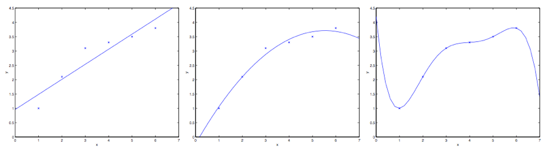

#! https://zhuanlan.zhihu.com/p/454983290
# ML1. 线性回归(Linear Regression) -2

> 回顾：
> 
> 上一节讲解了梯度下降法，就是通过不断的迭代，找到成本函数$J$的最小值。其中又讲到了随机梯度下降法和批量梯度下降法，其区别在于是否每一次迭代都要遍历所有的数据。

## 1. 法方程 (The normal equations)

除了之前梯度下降法，法方程也是一种计算成本函数 $J$ 的最小值的算法。这种方法就是通过求导的方法，找到导数为 0 位置的$\theta_j$，便是 $J$ 最小的位置了。

### 1.1 矩阵求导 (Matrix derivatives)

对于一个从 $m\times n$ 大小的矩阵映射到实数域的函数 $f: R^{m\times n} \rightarrow R$ 来说，其导数可以写为：

$$
\nabla_A f(A)=
\begin{bmatrix} 
\frac {\partial f}{\partial A_{11}} & \dots  & \frac {\partial f}{\partial A_{1n}} \\
\vdots  & \ddots & \vdots  \\ 
\frac {\partial f}{\partial A_{m1}} & \dots  & \frac {\partial f}{\partial A_{mn}} \\ 
\end{bmatrix}
$$

其中 $A$ 是一个 $m \times n$ 的矩阵。而梯度$\nabla_A f(A)$ 本身也是一个 $m \times n$ 的矩阵，其中第 $(i,j)$ 个元素是 $\frac {\partial f}{\partial A_{ij}} $ 。

假设 $ A =\begin{bmatrix} A_{11} & A_{12} \\ A_{21} & A_{22} \\ \end{bmatrix} $ 是一个 $2\times 2$  矩阵，然后给定的函数 $f:R^{2\times 2} → R$ 为:

$$ 
f(A) = \frac 32A_{11}+5A^2_{12}+A_{21}A_{22}
$$

其中的 $A_{ij}$ 表示的意思是矩阵 $A$ 的第 $(i,j)$ 个元素。则函数 $f$ 的梯度为：

$$ 
\nabla _A f(A) =\begin{bmatrix} \frac  32 & 10A_{12} \\ A_{22} & A_{21} \\ \end{bmatrix} 
$$

为了方便后面的计算，这里引入 **$trace$** 求迹运算，简写为 $“tr”$。对于一个给定的 $n\times n$ 方形矩阵 $A$，它的迹定义为对角项和：

$$ 
trA = \sum^n_{i=1} A_{ii}
$$

那么对于一个实数 $a$ 而言，它可以理解成一个 $1\tiems 1$ 的矩阵。那么就有 $tra = a$。为了便于理解也可以写成 $tr(a) = a$，但通常的写法都是不带括号的。

如果有两个矩阵 $A$ 和$B$，能够满足 $AB$ 为方阵，$trace$ 求迹运算就有一个特殊的性质：

$$trAB = trBA$$ 

因为这两者本质上都是将 $A B$ 两个矩阵中对应元素相乘后相加的结果。用公式表示就是：

$$trAB = \sum_{i=1}^n A_{i,:}B_{:,i}$$

在此基础上进行推论，就能得到类似下面这样的等式关系：

$$
trABC=trCAB=trBCA \\
trABCD=trDABC=trCDAB=trBCDA
$$

下面这些和求迹运算相关的等量关系也很容易证明。其中 $A$ 和 $B$ 都是方形矩阵，$a$ 是一个实数：

$$ 
trA=trA^T \\
tr(A+B)=trA+trB \\
tr a A=a trA
$$

接下来提出一些矩阵导数的等式关系，这些等式在以后的运算$J$ 的时候会用到。另外要注意等式$(4)$中的$A$ 必须是**非奇异方阵（non-singular square matrices**），而 $|A|$ 表示的是矩阵 $A$ 的行列式。

$$
\begin{aligned}
   \nabla_A tr AB & = B^T & \text{(1)}\\
   \nabla_{A^T} f(A) & = (\nabla_{A} f(A))^T &\text{(2)}\\
   \nabla_A tr ABA^TC& = CAB+C^TAB^T &\text{(3)}\\
   \nabla_A|A| & = |A|(A^{-1})^T &\text{(4)}\\
\end{aligned}
$$

### 1.2 最小二乘法回顾（Least squares recap）

接下来用矩阵导数这一工具来找到能让 $J(\theta)$ 最小的 $\theta$ 值。首先咱们把 $J$ 用矩阵-向量的记号来重新表述。

首先把训练集让当成一个 $m\times n$ 的矩阵。这个矩阵里面包含了训练样本的输入值作为每一行：

$$ 
X =\begin{bmatrix}
-(x^{(1)}) ^T-\\
-(x^{(2)}) ^T-\\
\vdots \\
-(x^{(m)}) ^T-\\
\end{bmatrix} 
$$

其中，每一行都为：

$$
[-(x^{(1)}) ^T-] = [(x^{(1)})_1, (x^{(1)})_2, ... , (x^{(1)})_n ]
$$

即输入值的 $n$ 个特征。

然后，设 $\vec{y}$ 是一个 $m$ 维向量（m-dimensional vector），其中包含了训练集中的所有目标值：

$$ 
y =\begin{bmatrix}
y^{(1)}\\
y^{(2)}\\
\vdots \\
y^{(m)}\\
\end{bmatrix} 
$$

又因为 $h_\theta (x^{(i)}) = (x^{(i)})^T\theta$ 那么成本函数 $J(\theta)$ 便可以写成：

$$
X\theta - \vec{y}  &=
\begin{bmatrix}
(x^{(1)})^T\theta \\
\vdots \\
(x^{(m)})^T\theta\\
\end{bmatrix} -
\begin{bmatrix}
y^{(1)}\\
\vdots \\
y^{(m)}\\
\end{bmatrix}\\
& =
\begin{bmatrix}
h_\theta (x^{1}) -y^{(1)}\\
\vdots \\
h_\theta (x^{m})-y^{(m)}\\
\end{bmatrix}\\
\end{aligned}
$$

对于向量 $\vec{z}$ ，则有 $z^T z = \sum_i z_i^2$ ，因此利用这个性质，可以推出:

$$
\begin{aligned}
\frac 12(X\theta - \vec{y})^T (X\theta - \vec{y}) &=\frac 12 \sum^m_{i=1}(h_\theta (x^{(i)})-y^{(i)})^2\\
&= J(\theta)
\end{aligned}
$$

最后，要让 $J$ 的值最小，就要找到函数对于$\theta$导数。结合等式$(2)$和等式$(3)$，就能得到下面这个等式$(5)$：

$$ 
\nabla_{A^T} trABA^TC =B^TA^TC^T+BA^TC \qquad \text{(5)}
$$

因此就有：

$$
\begin{aligned}
\nabla_\theta J(\theta) &= \nabla_\theta \frac 12 (X\theta - \vec{y})^T (X\theta - \vec{y}) \\
&= \frac  12 \nabla_\theta (\theta ^TX^TX\theta -\theta^T X^T \vec{y} - \vec{y} ^TX\theta +\vec{y}^T \vec{y})\\
&= \frac  12 \nabla_\theta tr(\theta ^TX^TX\theta -\theta^T X^T \vec{y} - \vec{y} ^TX\theta +\vec{y}^T \vec{y})\\
&= \frac  12 \nabla_\theta (tr \theta ^TX^TX\theta - 2tr\vec{y} ^T X\theta)\\
&= \frac  12 (X^TX\theta+X^TX\theta-2X^T\vec{y}) \\
&= X^TX\theta-X^T\vec{y}\\
\end{aligned}
$$

由此便推导出了**法线方程（normal equations）：**

$$ 
X^TX\theta =X^T\vec{y}
$$

所以让 $J(\theta)$ 取值最小的 $\theta$ 就是

$$
\theta = (X^TX)^{-1}X^T\vec{y}
$$

## 2. 概率解释（Probabilistic interpretation）

> 在本节中将会解释为什么选择线性回归模型，以及为何使用最小二乘法最为成本函数。

首先咱们假设目标变量和输入值存在下面这种等量关系：

$$ 
y^{(i)}=\theta^T x^{(i)}+ \epsilon ^{(i)}
$$

上式中 $ \epsilon ^{(i)}$ 是误差项，用于存放由于建模所忽略的变量导致的效果 （比如可能某些特征对于房价的影响很明显，但我们做回归的时候忽略掉了）也可以理解为随机的噪音信息（random noise）。进一步假设 $ \epsilon ^{(i)}$   是独立同分布的 (IID ，independently and identically distributed) ，服从高斯分布（Gaussian distribution），其平均值为 $0$，方差（variance）为 $\sigma ^2$。这样就可以把这个假设写成 $ \epsilon ^{(i)} ∼ N (0, \sigma ^2)$ 。然后 $ \epsilon ^{(i)} $  的密度函数就是：

$$ 
p(\epsilon ^{(i)} )= \frac 1{\sqrt{2\pi}\sigma} exp (- \frac  {(\epsilon ^{(i)} )^2}{2\sigma^2})
$$

那么对于 $x^{(i)}$ 来说，输出值为 $y^{(i)}$ 的概率为：

$$ 
p(y ^{(i)} |x^{(i)}; \theta)= \frac 1{\sqrt{2\pi}\sigma} exp (- \frac  {(y^{(i)} -\theta^T x ^{(i)} )^2}{2\sigma^2})
$$

这里的记号 $“p(y ^{(i)} |x^{(i)}; \theta)”$ 表示的是这是一个对于给定 $x^{(i)}$ 时 $y^{(i)}$ 的分布，用$\theta$ 代表该分布的参数。 注意这里不能用 $\theta(“p(y ^{(i)} |x^{(i)},\theta)”)$来当做条件，因为 $\theta$ 并不是一个随机变量。这个 $y^{(i)}$  的分布还可以写成$(y^{(i)} | x^{(i)}; \theta) ∼ N (\theta ^T x^{(i)}, \sigma^2)$。

给定一个矩阵 $X$，其包含了所有的$x^{(i)}$，然后再给定 $\theta$，那么 $y^{(i)}$ 的分布是什么？数据的概率以$p (\vec{y}|X;\theta )$ 的形式给出。在$\theta$取某个固定值的情况下，这个等式通常可以看做是一个 $\vec{y}$ 的函数（也可以看成是 $X$ 的函数）。当我们要把它当做 $\theta$ 的函数的时候，就称它为 **似然**函数（likelihood function)

$$
L(\theta) =L(\theta;X,\vec{y})=p(\vec{y}|X;\theta)
$$

结合之前对 $\epsilon^{(i)}$ 的独立性假设 （这里对$y^{(i)}$ 以及给定的 $x^{(i)}$ 也都做同样假设），就可以把上面这个等式改写成下面的形式：

$$
\begin{aligned}
L(\theta) &=\prod ^m _{i=1}p(y^{(i)}|x^{(i)};\theta)\\
&=\prod ^m _{i=1} \frac  1{\sqrt{2\pi}\sigma} exp(- \frac {(y^{(i)}-\theta^T x^{(i)})^2}{2\sigma^2})\\
\end{aligned}
$$

现在，给定了$y^{(i)}$ 和 $x^{(i)}$之间关系的概率模型了，用什么方法来选择咱们对参数 $\theta$ 的最佳猜测呢？最大似然法（maximum likelihood）告诉我们要选择能让数据的似然函数尽可能大的 $\theta$。也就是说，咱们要找的 $\theta$ 能够让函数 $L(\theta)$ 取到最大值。

除了找到 $L(\theta)$ 最大值，我们还以对任何严格递增的 $L(\theta)$ 的函数求最大值。如果我们不直接使用 $L(\theta)$，而是使用对数函数，来找**对数似然函数 $l(\theta)$** 的最大值，那这样对于求导来说就简单了一些：

$$
\begin{aligned}
l(\theta) &=\log L(\theta)\\
&=\log \prod ^m _{i=1} \frac  1{\sqrt{2\pi}\sigma} exp(- \frac {(y^{(i)}-\theta^T x^{(i)})^2}{2\sigma^2})\\
&= \sum ^m _{i=1}log \frac  1{\sqrt{2\pi}\sigma} exp(- \frac {(y^{(i)}-\theta^T x^{(i)})^2}{2\sigma^2})\\
&= m \log \frac  1{\sqrt{2\pi}\sigma}- \frac 1{\sigma^2}\cdot \frac 12 \sum^m_{i=1} (y^{(i)}-\theta^Tx^{(i)})^2\\
\end{aligned}
$$

因此，对 $l(\theta)$ 取得最大值也就意味着下面这个子式取到最小值：

$$ 
\frac 12 \sum^m _{i=1} (y^{(i)}-\theta^Tx^{(i)})^2
$$

到这里我们能发现这个子式实际上就是 $J(\theta)$，也就是最原始的最小二乘成本函数（least-squares cost function）。

总结一下也就是：在对数据进行概率假设的基础上，最小二乘回归得到的 $\theta$ 和最大似然法估计的 $\theta$ 是一致的。所以这是一系列的假设，其前提是认为最小二乘回归（least-squares regression）能够被判定为一种非常自然的方法，这种方法正好就进行了最大似然估计（maximum likelihood estimation）。（要注意，对于验证最小二乘法是否为一个良好并且合理的过程来说，这些概率假设并不是必须的，此外可能（也确实）有其他的自然假设能够用来评判最小二乘方法。）

另外还要注意，在刚才的讨论中，我们最终对 $\theta$ 的选择并不依赖 $\sigma^2$，而且也确实在不知道 $\sigma^2$ 的情况下就已经找到了结果。稍后我们还要对这个情况加以利用，到时候我们会讨论指数族以及广义线性模型。

## 3. 局部加权线性回归（Locally weighted linear regression）

假如问题还是根据从实数域内取值的 $x\in R$ 来预测 $y$ 。左下角的图显示了使用 $y = \theta_0 + \theta_1x$ 来对一个数据集进行拟合。我们明显能看出来这个数据的趋势并不是一条严格的直线，所以用直线进行的拟合就不是好的方法。

那么这次不用直线，而增加一个二次项，用$y = \theta_0 + \theta_1x +\theta_2x^2$ 来拟合。（看中间的图） 很明显，我们对特征补充得越多，效果就越好。不过，增加太多特征也会造成危险的：最右边的图就是使用了五次多项式 $y = \sum^5_{j=0} \theta_jx^j$ 来进行拟合。看图就能发现，虽然这个拟合曲线完美地通过了所有当前数据集中的数据，但我们明显不能认为这个曲线是一个合适的预测工具，比如针对不同的居住面积 $x$ 来预测房屋价格 $y$。先不说这些特殊名词的正规定义，咱们就简单说，最左边的图像就是一个**欠拟合(under fitting)** 的例子，比如明显能看出拟合的模型漏掉了数据集中的结构信息；而最右边的图像就是一个**过拟合(over fitting)** 的例子。（在本课程的后续部分中，当我们讨论到关于学习理论的时候，会给出这些概念的标准定义，也会给出拟合程度对于一个猜测的好坏检验的意义。）

正如前文谈到的，也正如上面这个例子展示的，一个学习算法要保证能良好运行，特征的选择是非常重要的。（等到我们讲模型选择的时候，还会看到一些算法能够自动来选择一个良好的特征集。）在本节，咱们就简要地讲一下局部加权线性回归（locally weighted linear regression ，缩写为LWR），这个方法是假设有足够多的训练数据，对不太重要的特征进行一些筛选。

在原始版本的线性回归算法中，要对一个查询点 $x$ 进行预测，比如要衡量$h(x)$，要经过下面的步骤：

1. 使用参数 $\theta$ 进行拟合，让数据集中的值与拟合算出的值的差值平方$\sum_i(y^{(i)} − \theta^T x^{(i)} )^2$最小(最小二乘法的思想)；
2. 输出 $\theta^T x$ 。

相应地，在 LWR 局部加权线性回归方法中，步骤如下：

1. 使用参数 $\theta$ 进行拟合，让加权距离$\sum_i w^{(i)}(y^{(i)} − \theta^T x^{(i)} )^2$ 最小；
2. 输出 $\theta^T x$。

上面式子中的 $w^{(i)}$ 是非负的权值。直观点说就是，如果对应某个$i$ 的权值 $w^{(i)}$ 特别大，那么在选择拟合参数 $\theta$ 的时候，就要尽量让这一点的 $(y^{(i)} − \theta^T x^{(i)} )^2$ 最小。而如果权值$w^{(i)}$  特别小，那么这一点对应的$(y^{(i)} − \theta^T x^{(i)} )^2$ 就基本在拟合过程中忽略掉了。

对于权值的选取可以使用下面这个比较标准的公式：$^4$

$$
w^{(i)} = exp(- \frac {(x^{(i)}-x)^2}{2\tau^2})
$$

>如果 $x$ 是有值的向量，那就要对上面的式子进行泛化，得到的是$w^{(i)} = exp(− \frac {(x^{(i)}-x)^T(x^{(i)}-x)}{2\tau^2})$，或者:$w^{(i)} = exp(− \frac {(x^{(i)}-x)^T\Sigma ^{-1}(x^{(i)}-x)}{2})$，这就看是选择用$\tau$ 还是 $\Sigma$。

要注意的是，权值是依赖每个特定的点 $x$ 的，而这些点正是我们要去进行预测评估的点。此外，如果 $|x^{(i)} − x|$ 非常小，那么权值 $w^{(i)} $就接近 $1$；反之如果 $|x^{(i)} − x|$ 非常大，那么权值 $w^{(i)} $就变小。所以可以看出， $\theta$ 的选择过程中，查询点 $x$ 附近的训练样本有更高得多的权值。（还要注意，当权值的方程的形式跟高斯分布的密度函数比较接近的时候，权值和高斯分布并没有什么直接联系，尤其是当权值不是随机值，且呈现正态分布或者其他形式分布的时候。）随着点$x^{(i)} $ 到查询点 $x$ 的距离降低，训练样本的权值的也在降低，参数$\tau$  控制了这个降低的速度；$\tau$也叫做**带宽参数**。

局部加权线性回归是一个**非参数** 算法。而更早之前看到的无权重的线性回归算法就是一种**参数** 学习算法，因为有固定的有限个数的参数（也就是 $\theta_i$ ），这些参数用来拟合数据。我们对 $\theta_i$ 进行了拟合之后，就把它们存了起来，也就不需要再保留训练数据样本来进行更进一步的预测了。与之相反，如果用局部加权线性回归算法，我们就必须一直保留着整个训练集。这里的非参数算法中的 非参数“non-parametric” 是粗略地指：为了呈现出假设 $h$ 随着数据集规模的增长而线性增长，我们需要以一定顺序保存一些数据的规模。

- 上篇：[ML1. 线性回归(Linear Regression) -1](https://zhuanlan.zhihu.com/p/452328359)
- 下篇：