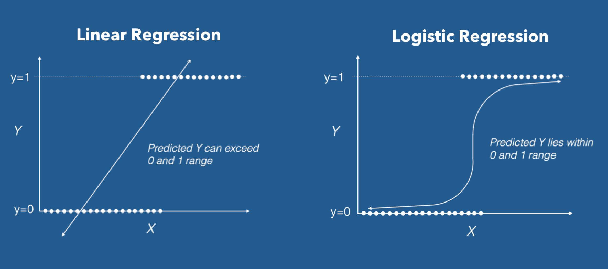

#! https://zhuanlan.zhihu.com/p/457618235
# ML2. 分类器类与逻辑回归(Logistic Regression)

逻辑回归可以用来解决分类问题，一个比较经典的例子是猫狗分类 (此例子属于深度学习的范围，因为处理图片需要用到卷积神经网络)。这里将问题简化为二值问题，具体如下图所示。我们需要做的就是找到一条线将这两个标签分开(后面将两个标签用数字 $0$ 和 $1$ 表示，即 $y \in \{0,1\}$)。 

## 1. 逻辑回归

大多数情况下，按照逻辑回归得出的直线很难将两个标签分清楚：

因此这里引入**逻辑函数 （Logistic function）**。具体的做法是改变假设函数$h_\theta (x)$ 的形式：

$$ 
h_\theta(x) = g(\theta^T x) = \frac  1{1+e^{-\theta^Tx}}
$$

其中有：

$$ 
g(z)= \frac 1 {1+e^{-z}}
$$

此函数被称为**双弯曲S型函数（sigmoid function)**,下图是 $g(z)$ 的函数图像：

之所以选择 sigmoid function 作为逻辑回归函数是因为它有很多便于计算的性质，比如其导数 $g'$:

$$
\begin{aligned}
g'(z) & = \frac d{dz}\frac 1{1+e^{-z}}\\
& = \frac  1{(1+e^{-z})^2}(e^{-z})\\
& = \frac  1{(1+e^{-z})} \cdot (1- \frac 1{(1+e^{-z})})\\
& = g(z)(1-g(z))\\
\end{aligned}
$$

那么，给定了逻辑回归模型了，如何找到最合适的 $\theta$ 呢？这里依然使用极大似然法来拟合参数。

首先假设：

$$
\begin{aligned}
P(y=1|x;\theta)&=h_{\theta}(x)\\
P(y=0|x;\theta)&=1- h_{\theta}(x)\\
\end{aligned}
$$

更简洁的写法是：

$$ 
p(y|x;\theta)=(h_\theta (x))^y(1- h_\theta (x))^{1-y}
$$

假设 $m$ 个训练样本都是各自独立生成的，那么就可以按如下的方式来写参数的似然函数：

$$
\begin{aligned}
L(\theta) &= p(\vec{y}| X; \theta)\\
&= \prod^m_{i=1}  p(y^{(i)}| x^{(i)}; \theta)\\
&= \prod^m_{i=1} (h_\theta (x^{(i)}))^{y^{(i)}}(1-h_\theta (x^{(i)}))^{1-y^{(i)}} \\
\end{aligned}
$$

然后还是跟之前一样，取个对数就更容易计算最大值：

$$
\begin{aligned}
l(\theta) &=\log L(\theta) \\
&= \sum^m_{i=1} y^{(i)} \log h(x^{(i)})+(1-y^{(i)})\log (1-h(x^{(i)}))
\end{aligned}
$$

为了使似然函数最大，可以使用类似梯度下降的方法，不过这里是找最大值，所以叫做**梯度上升法（gradient ascent）**。其公式为：

$$
\theta := \theta +\alpha \nabla _\theta l(\theta)
$$

假设只有一组样本$(x,y)$，则该公式的计算结果为：

$$
\begin{aligned}
\frac  {\partial}{\partial \theta_j} l(\theta) &=(y\frac  1 {g(\theta ^T x)}  - (1-y)\frac  1 {1- g(\theta ^T x)}   )\frac  {\partial}{\partial \theta_j}g(\theta ^Tx) \\
&= (y\frac  1 {g(\theta ^T x)}  - (1-y)\frac  1 {1- g(\theta ^T x)}   )  g(\theta^Tx)(1-g(\theta^Tx)) \frac  {\partial}{\partial \theta_j}\theta ^Tx \\
&= (y(1-g(\theta^Tx) ) -(1-y) g(\theta^Tx)) x_j\\
&= (y-h_\theta(x))x_j
\end{aligned}
$$

对于 $m$ 个样本，则有表达式：

$$ 
\theta_j := \theta_j + \alpha \sum _{i=1} ^m (y^{(i)}-h_\theta (x^{(i)}))x_j^{(i)}
$$

这个表达式看起来与之前线性回归的表达一模一样：

>Recap: 线性回归表达式：
> $$\theta_j := \theta_j + \alpha \sum _{i=1} ^m (y^{(i)}-h_\theta (x^{(i)}))x_j^{(i)}$$

其区别是其中 $h_\theta (x) $ 的表达式与线性回归中的不同。

## 2. 感知器学习算法（The perceptron learning algorithm）

看完上一节的小伙伴可能有个疑问，如果我们至是想让 $y \in \{0,1\}$，最简单的方法应该是用**阈值函数（threshold function）**：

$$
g(z)= \begin{cases} 1 &  if\quad z \geq 0  \\
0 &  if\quad z < 0  \end{cases}
$$

依然沿用之前的假设函数 $h_\theta(x) = g(\theta^T x)$，便可以得到下面的更新规则：

$$ 
\theta_j := \theta_j +\alpha(y^{(i)}-h_\theta (x^{(i)}))x_j^{(i)}
$$

这被称为**感知器学习算法**。

这种算法也可以作为分类器使用，但是它只会产生一个线性的分类，对于线附近的样本有分错的可能。即如下图所示：

因此现在很少使用这个感知器学习算法了。

## 3. 牛顿法 (Newton's Method)

之前我们一直使用梯度下降/上升 的方法来计算极大值或者极小值。但其实在 $\theta \in R^n$，其中 $n$ 较小的情况下，使用牛顿法可以更快速的得到结果。

这里举一个 $\theta \in R$ 的例子。对于函数 $l(\theta)$ 来说，其极值点的位置即其导数为 $0$ 的位置：

现在使得 $f(\theta)=l'(\theta)$，通过限制$\theta$的范围，使得$f(\theta)$ 中只包含一个我们想要的极值点。那么要找到 $f(\theta) = 0$ 的位置，可以通过求其导数 $f'(\theta)$ 与 $x$ 轴的交点来不断的靠近零点。

其迭代公式可以表示为：

$$
\theta := \theta - \frac {f(\theta)}{f'(\theta)}
$$

在 $n$ 很小的时候，牛顿法可以快速的找到极值点的位置，但在 $n$ 很大的时候，计算速度就不如使用梯度法了。

- 上篇：[ML1. 线性回归(Linear Regression) -2](https://zhuanlan.zhihu.com/p/454983290)
- 下篇：