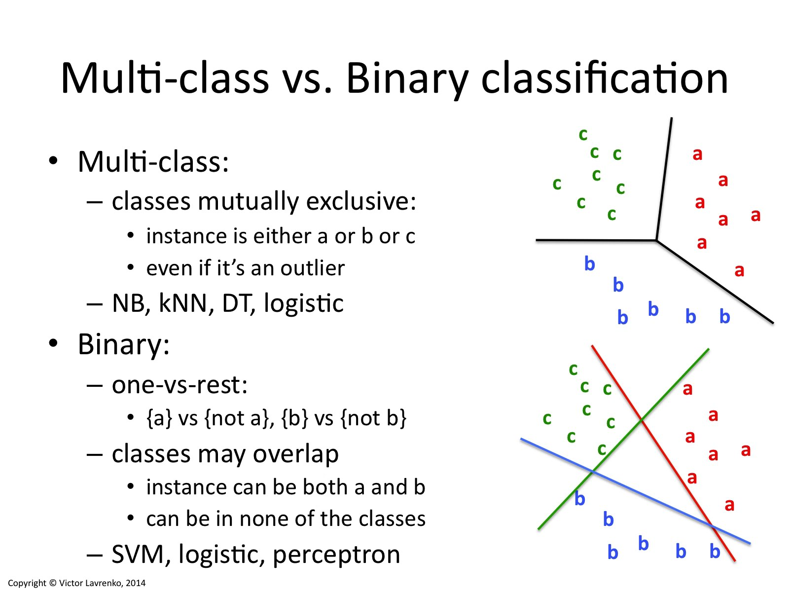
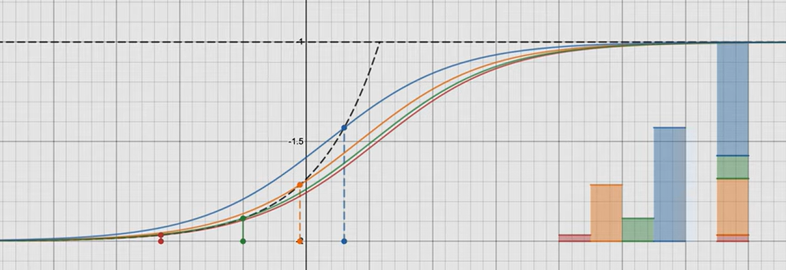
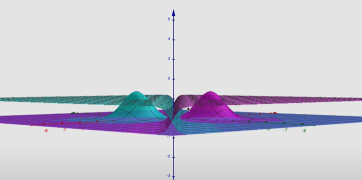

#! https://zhuanlan.zhihu.com/p/457975520
# ML3. 广义线性模型(Generalized Linear Models)

到目前为止，我们看过了回归的案例，也看了一个分类案例。在回归的案例中，我们得到的函数是 $y|x; \theta ∼ N (\mu, \sigma^2)$；而分类的案例中，函数是 $y|x; \theta ∼ Bernoulli(\phi)$，这里面的$\mu$ 和 $\phi$ 分别是 $x$ 和 $\theta$ 的某种函数。在本节，我们会发现这两种方法都是一个更广泛使用的模型的特例，这种更广泛使用的模型就叫做广义线性模型。我们还会讲一下广义线性模型中的其他模型是如何推出的，以及如何应用到其他的分类和回归问题上。

## 1. 指数族 (The exponential family)

> ref: [维基百科](https://en.wikipedia.org/wiki/Exponential_family)

在概率和统计中，指数族是某种形式的**概率分布的参数集**，如下所述。选择这种特殊形式是为了数学上的方便，基于一些有用的代数性质，以及一般性，因为指数族在某种意义上是非常自然的分布集来考虑。术语“**分布("distribution")**”和“**族(family)**”经常被松散地使用：具体来说，指数族是一个集合分布，其中特定分布随参数而变化；然而，一个参数分布族通常被称为“一个分布”（如“正态分布”，意思是“正态分布族”），所有指数族的集合有时被松散地称为“那个”指数族。它们是不同的，因为它们具有各种理想的属性，最重要的是存在足够的统计量。

指数族的表达式为：

$$ 
Fx(x;\theta) =\frac{1}{Z(\theta)}h(x)exp(t(x)\cdot\theta)
$$

其中：
- $x$ 是数据，是标量
- $h(x)$ 是一个关于 $x$ 的非负标量 ，且与 $\theta$ 无关。
- $t(x)$ 是一个可以测量所有与 $\theta$ 相关的 $x$ 的向量。
- $Z(\theta)$ 用于归一化，其表达式为：
  - $Z(\theta) = \int h(x)exp(t(x)\cdot \theta)v(dx)$
  - $v(dx)$ 是一个关于 $x$ 的测量式，用于在 $x$ 的域内求和。

指数族的表达式可以从正太分布推导出来：

关于 $x_i$ 对称的正太分布可以写成：

$$
\begin{aligned}
    \mathcal N(x_i|\mu, \sigma) &=  \frac{1}{\sigma \sqrt{2\pi}}exp(-\frac{(x_i-\mu)^2}{2\sigma^2}) \\
    &= \frac{1}{\sigma \sqrt{2\pi exp(\frac{\mu^2}{2\sigma^2})}}exp(
        \begin{bmatrix}
            x_i & x_i^2
        \end{bmatrix}
        \begin{bmatrix}
            \frac{\mu}{\sigma^2}\\ -\frac{1}{2\sigma^2}
        \end{bmatrix}
    )
\end{aligned}
$$

这里将向量中的两个值转换为 $\theta$:

$$
\begin{bmatrix}
            \frac{\mu}{\sigma^2}\\ -\frac{1}{2\sigma^2}
        \end{bmatrix} = \begin{bmatrix}
            \theta_1 \\ \theta_2
        \end{bmatrix}
$$

这样前面的式子转换成关于 $\theta$ 的函数：

${\sigma \sqrt{2\pi exp(\frac{\mu^2}{2\sigma^2})}} = Z(\theta_1, \theta_2)$ 

因此，外面就将关于 $\mu$ 和 $\sigma$ 的正太分布，转化成了关于 $\theta$ 的表达式：

$$
\theta_1^*,\theta_2^* = arg\quad max_{\theta_1,\theta_2} \prod_{i=1}^{n} \mathcal N(x_i|\theta_1,\theta_2)
$$

写出指数族的形式为：

$$
\mathcal N(x|\theta) = \frac{1}{Z(\theta)}\cdot 1 \cdot 
exp(\begin{bmatrix}
    x_i & x_i^2
    \end{bmatrix}\cdot \theta)
$$

其中 $h(x) = 1$, $t(x) = \begin{bmatrix}x_i & x_i^2\end{bmatrix}$。

指数组除了有上面的表达式外，还有其他的形式，下面的表达式在机器学习中更加常见：

$$ 
p(y;\eta) =b(y)exp(\eta^TT(y)-a(\eta)) \qquad 
$$

其中 $y$ 为数据，$\eta$ 为参数。

指数分布族里面还有很多其他的分布：
- 例如多项式分布（multinomial），这个稍后我们会看到；
- 泊松分布（Poisson），用于对计数类数据进行建模，后面再问题集里面也会看到；
- 伽马和指数分布（the gamma and the exponential），这个用于对连续的、非负的随机变量进行建模，例如时间间隔；
- 贝塔和狄利克雷分布（the beta and the Dirichlet），这个是用于概率的分布；
- 还有很多，这里就不一一列举了。

指数分布族还有很多非常好的性质：

- 分布的期望(expectation)为 $\mathbb{E}[t(x)|\theta] = \nabla_\theta log Z(\theta)$ 或者 $\mathbb{E} =  \frac{\partial}{\partial \eta}a(\eta)$。
- 幅度(variation)为 $\mathbb{V}[t(x)|\theta] = \nabla_\theta^2 log Z(\theta)$ 或者 $\mathbb{V} =  \frac{\partial^2}{\partial \eta^2}a(\eta)$。

## 2. 构建广义线性模型（Constructing GLMs）

设想一个分类或者回归问题，要预测一些随机变量 $y$ 的值，作为 $x$ 的一个函数。要导出适用于这个问题的广义线性模型 (Generalized Linear Model，缩写为 GLM)，就要对我们的模型、给定 $x$ 下 $y$ 的条件分布来做出以下三个假设：

-	$y | x; \theta ∼ Exponential Family(\eta)$ ——假设1
> 即给定 $x$ 和 $\theta, y$ 的分布属于指数分布族，是一个参数为 $\eta$ 的指数分布。
- 假设函数$h\theta(x)$ 为 $h_\theta (x) = E[y|x;\theta]$	——假设2
> 给定 $x$，目的是要预测对应这个给定 $x$ 的 $T(y)$ 的期望值。咱们的例子中绝大部分情况都是 $T(y) = y$，这也就意味着我们的学习假设 $h$ 输出的预测值 $h(x)$ 要满足 $h(x) = E[y|x]$。
- $\eta = \theta^T x$，如果 $\eta$ 是向量，则有$\eta_i = \theta_i^T x$。——假设3
> 自然参数 $\eta$ 和输入值 $x$ 线性相关的。

以上的三个假设，在 GLMs 中通常作为 **设计选择 design choice** 。

### 2.1 普通最小二乘法（Ordinary Least Squares）

这个就是我们最开始做的线性回归问题，使用的分布为高斯分布。带入指数族的概念即为，对于输入量 $x$ 来说 $y \sim \mathcal N(\mu, \sigma^2)$

即：

$$
\begin{aligned}
h_\theta(x)& = E[y|x;\theta] \\
& = \mu \\
& = \eta \\
& = \theta^Tx\\
\end{aligned}
$$

第一行的等式是基于假设2；第二个等式是基于定理当 $y|x; \theta ∼ \mathcal N (\mu, \sigma ^2)$，则 $y$ 的期望就是 $\mu$ ；第三个等式是基于假设1，以及之前我们此前将高斯分布写成指数族分布的时候推导出来的性质 $\mu = \eta$；最后一个等式就是基于假设3。

### 2.2 逻辑回归（Logistic Regression）

逻辑回归即二值问题，服从伯努利分布。因此在建模时就有 $y|x; \theta ∼ Bernoulli(\phi)$，其数学期望 $E [y|x; \theta] = \phi$，$\phi = 1/ (1 + e^{−\eta})$。那么其假设函数为：

$$
\begin{aligned}
h_\theta(x)& = E[y|x;\theta] \\
& = \phi \\
& = 1/(1+ e^{-\eta}) \\
& = 1/(1+ e^{-\theta^Tx})\\
\end{aligned}
$$

这里也解释了为什么之前会选择 $1/ (1 + e^{−z} )$ Sigmoid 函数作逻辑回归了。

再解释一点术语，这里给出分布均值的函数 $g$ 是一个关于自然参数的函数，$g(\eta) = E[T(y); \eta]$，这个函数也叫做**规范响应函数（canonical response function），** 它的反函数 $g^{−1}$ 叫做**规范链接函数（canonical link function）。** 因此，对于高斯分布来说，它的规范响应函数正好就是识别函数（identify function）；而对于伯努利分布来说，它的规范响应函数则是逻辑函数（logistic function）。

### Softmax 回归

> 此部分内容观看 [Youtube | Softmax Function Explained In Depth with 3D Visuals](https://www.youtube.com/watch?v=ytbYRIN0N4g&t=358s&ab_channel=ElliotWaite) 视频会有一个比较直观的理解。

依然是讨论分类问题，但现在要分超过两类的标签，我们依然可以借用之前二值逻辑回归的思想。先直观的理解一下，首先假设我们有3个类 {A,B,C}。我们分别对这个三个类进行二值逻辑回归，即 $y\in [\{0,1\}^k] , k =3$, 这时我们得到的分类图类似下图中 `Binary` 的情况，类之间可能出现重叠。

这时，我们就需要使用 Softmax 函数对其进行处理。首先对结果进行指数化 ($exp(\theta_c^Tx)$)将所有类的结果都转换成正数，然后归一化(Normalize, $\frac{e^{\theta_c^Tx}}{\sum_c e^{\theta_c^Tx}}$)，让所有结果加起来等于1。其过程大致如下图所示：

正式讲解其数学原理：

要对一个可能有 $k$ 个不同输出值的多项式进行参数化，就可以用 $k$ 个参数 $\phi_1,...,\phi_ k$ 来对应各自输出值的概率。不过这么多参数可能太多了，形式上也太麻烦，他们也未必都是互相独立的（比如对于任意一个$\phi_ i$中的值来说，只要知道其他的 $k-1$ 个值，就能知道这最后一个了，因为总和等于$1$，也就是$\sum^k_{i=1} \phi_i = 1$）。所以咱们就去掉一个参数，只用 $k-1$ 个：$\phi_1,...,\phi_ {k-1}$  来对多项式进行参数化，其中$\phi_i = p (y = i; \phi)，p (y = k; \phi) = 1 −\sum ^{k−1}_{i=1}\phi_ i$。为了表述起来方便，我们还要设 $\phi_k = 1 − \sum_{i=1}^{k−1} \phi_i$，但一定要注意，这个并不是一个参数，而是完全由其他的 $k-1$ 个参数来确定的。

要把一个多项式表达成为指数组分布，还要按照下面的方式定义一个 $T (y) \in R^{k−1}$:

$$
T(1)=
    \begin{bmatrix}
      1\\
      0\\
	  0\\
	  \vdots \\
	  0\\
    \end{bmatrix},
T(2)=
    \begin{bmatrix}
      0\\
      1\\
	  0\\
	  \vdots \\
	  0\\
    \end{bmatrix},
T(3)=
    \begin{bmatrix}
      0\\
      0\\
	  1\\
	  \vdots \\
	  0\\
    \end{bmatrix},
T(k-1)=
    \begin{bmatrix}
      0\\
      0\\
	  0\\
	  \vdots \\
	  1\\
    \end{bmatrix},
T(k)=
    \begin{bmatrix}
      0\\
      0\\
	  0\\
	  \vdots \\
	  0\\
    \end{bmatrix},
$$

这次和之前的样例都不一样了，就是不再有 $T(y) = y$；然后，$T(y)$ 现在是一个 $k – 1$ 维的向量，而不是一个实数了。向量 $T(y)$ 中的第 $i$ 个元素写成$(T(y))_i$ 。

现在介绍一种非常有用的记号。指示函数（indicator function）$1\{\cdot  \}$，如果参数为真，则等于$1$；反之则等于$0$（$1\{True\} = 1, 1\{False\} = 0$）。例如$1\{2 = 3\} = 0$, 而$1\{3 = 5 − 2\} = 1$。所以我们可以把$T(y)$ 和 $y$ 的关系写成  $(T(y))_i = 1\{y = i\}$。（往下继续阅读之前，一定要确保你理解了这里的表达式为真！）在此基础上，就有了$E[(T(y))_i] = P (y = i) = \phi_i$。

现在一切就绪，可以把多项式写成指数族分布了。写出来如下所示：

$$
\begin{aligned}
p(y;\phi) &=\phi_1^{1\{y=1\}}\phi_2^{1\{y=2\}}\dots \phi_k^{1\{y=k\}} \\
          &=\phi_1^{1\{y=1\}}\phi_2^{1\{y=2\}}\dots \phi_k^{1-\sum_{i=1}^{k-1}1\{y=i\}} \\
          &=\phi_1^{(T(y))_1}\phi_2^{(T(y))_2}\dots \phi_k^{1-\sum_{i=1}^{k-1}(T(y))_i } \\
          &=exp((T(y))_1 log(\phi_1)+(T(y))_2 log(\phi_2)+\dots+(1-\sum_{i=1}^{k-1}(T(y))_i)log(\phi_k)) \\
          &= exp((T(y))_1 log(\frac{\phi_1}{\phi_k})+(T(y))_2 log(\frac{\phi_2}{\phi_k})+\dots+(T(y))_{k-1}log(\frac{\phi_{k-1}}{\phi_k})+log(\phi_k)) \\
          &=b(y)exp(\eta^T T(y)-a(\eta))
\end{aligned}
$$

其中：

$$
\begin{aligned}
\eta &= 
    \begin{bmatrix}
      \log (\phi _1/\phi _k)\\
      \log (\phi _2/\phi _k)\\
	  \vdots \\
	  \log (\phi _{k-1}/\phi _k)\\
    \end{bmatrix}, \\
a(\eta) &= -\log (\phi _k)\\
b(y) &= 1\\
\end{aligned}
$$

这样咱们就把多项式方程作为一个指数族分布来写了出来。

与 $i (for\quad i = 1, ..., k)$对应的链接函数为：

$$ 
\eta_i =\log \frac  {\phi_i}{\phi_k}
$$

为了方便起见，我们再定义 $\eta_k = \log (\phi_k/\phi_k) = 0$。对链接函数取反函数然后推导出响应函数，就得到了下面的等式：

$$
\begin{aligned}
e^{\eta_i} &= \frac {\phi_i}{\phi_k}\\
\phi_k e^{\eta_i} &= \phi_i  \qquad\text{(7)}\\
\phi_k  \sum^k_{i=1} e^{\eta_i}&= \sum^k_{i=1}\phi_i= 1\\
\end{aligned}
$$

这就说明了$\phi_k = \frac  1 {\sum^k_{i=1} e^{\eta_i}}$，然后可以把这个关系代入回到等式$(7)$，这样就得到了响应函数：

$$ 
\phi_i = \frac  { e^{\eta_i} }{ \sum^k_{j=1} e^{\eta_j}}
$$

上面这个函数从$\eta$ 映射到了$\phi$，称为 **Softmax** 函数。

要完成我们的建模，还要用到前文提到的假设3，也就是 $\eta_i$ 是一个 $x$ 的线性函数。所以就有了 $\eta_i= \theta_i^Tx (for\quad i = 1, ..., k − 1)$，其中的 $\theta_1, ..., \theta_{k−1} \in R^{n+1}$ 就是我们建模的参数。为了表述方便，我们这里还是定义$\theta_k = 0$，这样就有 $\eta_k = \theta_k^T x = 0$，跟前文提到的相符。因此，我们的模型假设了给定 $x$ 的 $y$ 的条件分布为：

$$
\begin{aligned}
p(y=i|x;\theta) &=  \phi_i \\
&= \frac {e^{\eta_i}}{\sum^k_{j=1}e^{\eta_j}}\\
&=\frac {e^{\theta_i^Tx}}{\sum^k_{j=1}e^{\theta_j^Tx}}\qquad\text{(8)}\\
\end{aligned}
$$

这个适用于解决 $y \in\{1, ..., k\}$ 的分类问题的模型，就叫做 **Softmax 回归。** 这种回归是对逻辑回归的一种扩展泛化。

假设（hypothesis） $h$ 则如下所示:

$$
\begin{aligned}
h_\theta (x) &= E[T(y)|x;\theta]\\
&= E \left[
    \begin{array}{cc|c}
      1(y=1)\\
      1(y=2)\\
	  \vdots \\
	  1(y=k-1)\\
    \end{array}x;\theta
\right]\\
&= E \left[
    \begin{array}{c}
      \phi_1\\
      \phi_2\\
	  \vdots \\
	  \phi_{k-1}\\
    \end{array}
\right]\\
&= E \left[
    \begin{array}{ccc}
      \frac {exp(\theta_1^Tx)}{\sum^k_{j=1}exp(\theta_j^Tx)} \\
      \frac {exp(\theta_2^Tx)}{\sum^k_{j=1}exp(\theta_j^Tx)} \\
	  \vdots \\
	  \frac {exp(\theta_{k-1}^Tx)}{\sum^k_{j=1}exp(\theta_j^Tx)} \\
    \end{array}
\right]\\
\end{aligned}
$$

也就是说，我们的假设函数会对每一个 $i = 1,...,k$ ，给出 $p (y = i|x; \theta)$ 概率的估计值。（虽然咱们在前面假设的这个 $h_\theta(x)$ 只有 $k-1$ 维，但很明显 $p (y = k|x; \theta)$ 可以通过用 $1$ 减去其他所有项目概率的和来得到，即$1− \sum^{k-1}_{i=1}\phi_i$。）

最后，咱们再来讲一下参数拟合。和我们之前对普通最小二乘线性回归和逻辑回归的原始推导类似，如果咱们有一个有 $m$ 个训练样本的训练集 $\{(x^{(i)}, y^{(i)}); i = 1, ..., m\}$，然后要研究这个模型的参数 $\theta_i$ ，我们可以先写出其似然函数的对数：

$$
\begin{aligned}
l(\theta)& =\sum^m_{i=1} \log p(y^{(i)}|x^{(i)};\theta)\\
&= \sum^m_{i=1}log\prod ^k_{l=1}(\frac {e^{\theta_l^Tx^{(i)}}}{\sum^k_{j=1} e^{\theta_j^T x^{(i)}}})^{1(y^{(i)}=l)}\\
\end{aligned}
$$

要得到上面等式的第二行，要用到等式$(8)$中的设定 $p(y|x; \theta)$。现在就可以通过对 $l(\theta)$ 取最大值得到的 $\theta$ 而得到对参数的最大似然估计，使用的方法就可以用梯度上升法或者牛顿法了。

- 上篇：[ML2. 分类器类与逻辑回归(Logistic Regression)](https://zhuanlan.zhihu.com/p/457618235)
- 下篇：[ML4. 生成学习算法(Generative Learning algorithms)](https://zhuanlan.zhihu.com/p/458285940)