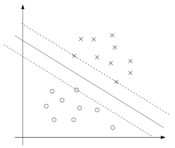

#! https://zhuanlan.zhihu.com/p/463908093
# ML5. 支持向量机 (Support Vector Machine)

> 此部分的内容参考了以下资料：
> - Youtube 视频： [The Kernel Trick - THE MATH YOU SHOULD KNOW!](https://www.youtube.com/watch?v=wBVSbVktLIY&ab_channel=CodeEmporium)
> - Youtube 视频：[Support Vector Machines: A Visual Explanation with Sample Python Code](https://www.youtube.com/watch?v=N1vOgolbjSc&ab_channel=ADashofData)
> GitHub 仓库：[muffin-cupcake
](https://github.com/adashofdata/muffin-cupcake)
> - cs229: [Lecture 6 - Support Vector Machines | Stanford CS229: Machine Learning](https://www.youtube.com/watch?v=lDwow4aOrtg&list=PLoROMvodv4rMiGQp3WXShtMGgzqpfVfbU&index=6&ab_channel=stanfordonline)
> - cs229: [Lecture 7 - Kernels | Stanford CS229: Machine Learning](https://www.youtube.com/watch?v=8NYoQiRANpg&t=1815s&ab_channel=stanfordonline)
> - cs229 中文笔记：[Stanford-CS-229-CN](https://github.com/cycleuser/Stanford-CS-229-CN)
> - Youtube 频道： StatQuest with Josh Starmer [Support Vector Machines Part 1 (of 3): Main Ideas!!!](https://www.youtube.com/watch?v=efR1C6CvhmE&ab_channel=StatQuestwithJoshStarmer)
> - Meduim 博客 [Support Vector Machine (SVM)](https://medium.com/@viveksalunkhe80/support-vector-machine-svm-88f360ff5f38)
>  - Meduim 博客 [The Kernel Trick in Support Vector Classification](https://towardsdatascience.com/the-kernel-trick-c98cdbcaeb3f)
> - 维基百科 [SVM](https://en.wikipedia.org/wiki/Support-vector_machine#History)
> - [SVM Kernel Functions – ‘Coz your SVM knowledge is incomplete without it](https://techvidvan.com/tutorials/svm-kernel-functions/)

## 1. 简介

支持向量机 (SVM) 是目前非常流行的机器学习算法之一。由 Vladimir Vapnik 与同事在 AT&T 贝尔实验室开发监督式学习模型。SVM 的原理简单来说， 就是找到一个两个类的分界线 (Margin)，并且分界线距离两个类的最近的点的距离相等。具体情况如下图所示：


SVM 是一个线性分类器，但通常现实中我们遇到的问题都是非线性的。为了解决这样的问题，SVM 引入了 Kernel 的概念，提升数据特征的维度，从而使得数据可以被一个超平面 (Hperplane) 分开。


由此我们便可以解决非线性的数据

## 2. SVM 原理详解 

### 2.1 边界 (Margins)

在分类问题中，常常会用到一些逻辑回归的激活函数，比如：Relu 和 Sigmoid。这里以 Sigmoid 为例，说明支持向量机的边界。


通常我们认为 Sigmoid 会将数据分为两类，$\{0, 1\}$。但在 SVM 通常将数据分为 $\{-1, +1\}$ 两类。这样的好处在于我们可以仅凭借符号 $\{-, +\}$来判断类别。再回到主题， 在`Sigmoid` 函数中， `|t|` 越大，我们就对于该值的分类就越确定。因此，我们希望当 `label = -1` 的时候， $\theta ^T x \ll 0$ 而 `label = +1` 的时候， $\theta ^T x \gg 0$。换言之，就是我们希望所有数据都尽可能远离分界线。


由上面的思想我们就可以在众多数据分界线中找到一个最佳的分界线。我们叫它：最大边距超平面 (maximal margin hyperplane)。


### 2.2 函数边界(Functional margins)

首先我们将分类器的数学表达式写出来：

$$
h_{w,b}(x)=g(w^Tx+b)
$$

这里的 $g$ 是符号分类。 当 $z \geq 0$，则 $g(z) = 1$；而反之若 $z ＜ 0$，则$g(z) = -1$。

下面我们用数学语言将训练集的函数边界表达出来：

$$
\hat\gamma^{(i)}=y^{(i)}(w^Tx+b)
$$

要注意，如果 $y^{(i)} = 1$，那么为了让函数边界很大（也就是说，我们的预测很可信并且很正确），我们就需要 $w^T x + b$ 是一个很大的正数。与此相对，如果 $y^{(i)} = -1$，那么为了让函数边界很大，我们就需要$w^T x + b$ 是一个（绝对值）很大的负数。而且，只要满足 $y^{(i)}(w^T x + b) \ge 0$，那我们针对这个样本的预测就是正确的。

给定一个训练集 $S = \{(x^{(i)},y^{(i)}); i = 1, ..., m\}$，我们将对应 $S$ 的函数边界 $(w, b)$ 定义为每个训练样本的函数边界的最小值。记作 $\hat \gamma$，可以写成：

$$
\hat\gamma= \min_{i=1,...,m}\hat\gamma^{(i)}
$$

但函数边界本身存在一些问题，$\hat\gamma$ 的大小是与 $(w, b)$ 成线性关系的，即 $(2w,2b) \rightarrow 2 \hat\gamma$。因此我们需要对其进行归一化，该部分的内容后面再讲。


### 2.3 几何边界 (geometric margins)

几何边界比较直观，就是我们上面看到的那个讲数据分开的超平平面。而我们所说的向量，就是一个垂直于边界且从边界指向数据的向量 $\gamma^{(i)}$。


怎么找到的 $\gamma^{(i)}$ 值呢？这样，$w/\parallel w\parallel $ 是一个单位长度的向量，指向与 $w$ 相同的方向。对于边界线上的所有 $x$ 都满足等式 $w^T x + b = 0$ ，所以有：

$$
w^T(x^{(i)}-\gamma^{(i)}\frac{w}{\parallel w\parallel })+b=0
$$

通过上面的方程解出来的 $\gamma^{(i)}$ 为：

$$
\gamma^{(i)}=\frac{w^Tx^{(i)}+b}{\parallel w\parallel }=(\frac{w}{\parallel w\parallel })^Tx^{(i)}+\frac{b}{\parallel w\parallel }
$$

这只是正向的表达式，加上 $y = -1$ 的表达式为：

$$
\gamma^{(i)}=y^{(i)}((\frac{w}{\parallel w\parallel })^Tx^{(i)}+\frac{b}{\parallel w\parallel })
$$

这里要注意，如果 $\parallel w\parallel  = 1$，那么函数边界(functional margin)就等于几何边界(geometric margin)——我们可以用这种方法来将两个边界记号联系起来。此外，几何边界是不受参数缩放的影响的；也就是说，如果我们把 $w$ 改为 $2w$，$b$ 改为 $2b$，那么几何边界并不会改变。稍后这个性质就会派上用场了。特别要注意的是，由于这个与参数缩放的无关性，当试图对某个数据集的 $w$ 和 $b$ 进行拟合的时候，我们就可以倒入一个任意设置的缩放参数来约束 $w$，而不会改变什么重要项；例如，我们可以设置 $\parallel w\parallel  = 1$，或者 $|w_1| = 5$，或者 $|w_1 +b|+|w_2| = 2$，等等都可以，这些都只需要对 $w$ 和 $b$ 进行缩放就可以满足了。

最后，给定一个训练集 $S = \{(x^{(i)}, y^{(i)}); i = 1, ..., m\}$，我们也可以我们将对应 $S$ 的几何边界 $(w, b)$ 定义为每个训练样本的几何边界的最小值：

$$
\gamma=\min_{i=1,...,m}\gamma^{(i)}
$$

### 2.4 最优边界分类器(optimal margin classifier)

> 此部分内容的数学推导被简化了，其数学推导用到了**拉格朗日对偶性(Lagrange duality)**

对于一个最优边界分类器，其应该满足以下约束条件：

$$
\begin{aligned}
min_{\gamma,w,b} \quad & \frac12 \parallel w\parallel ^2\\
&\\
s.t. \quad &y^{(i)}(w^Tx^{(i)}+b)\geq 1,\quad i=1,...,m\\
\end{aligned}
$$

这里的约束条件(constra_ints)可以写成下面的形式：

$$
g_i(w)=-y^{(i)}(w^Tx^{(i)}+b)+1\leq 0
$$

对于训练集中的每一个样本，都有这样的一个约束条件。要注意，通过 KKT 对偶互补条件可知，只有训练样本的函数边界确定为 $1$ 的情况下，才有 $\alpha_i \geq  0$ (这些样本对应的约束条件关系都是等式关系，也就是对应的 $g_i(w) = 0$)。如下图所示，其中用实线所表示的就是最大间隔分界超平面(maximum margin separating hyperplane)。



具有最小边界的样本点(points with the smallest margins)正好就是距离分类边界(decision boundary)最近的那些点；图中所示，一共有三个这样的点（一个是空心圆的负值，两个是叉号的正值），他们所处的位置与分类边界线(即实线)相平行的虚线上。因此，在这个优化问题中的最优解里面，只有这三个样本点所对应的 $\alpha_i$ 是非零的。这三个点在此问题中被称作**支持向量(support vectors)。** 这种现象就是，支持向量的规模(number of support vectors)可以比整个训练集的规模(size of the tra_ining set)更小。

通过拉格朗日对偶，我们可以讲之前的约束转换为：

$$
\begin{aligned}
w^Tx+b&= (\sum^m_{i=1}\alpha_i y^{(i)}x^{(i)})^Tx+b & \text{(1)}\\
&= \sum^m_{i=1}\alpha_i y^{(i)}\langle x^{(i)},x \rangle+b & \text{(2)}\\
\end{aligned}
$$

其中$\langle x^{(i)},x \rangle$ 表示 $x^{(i)}$ 与 $x$ 的内积，其等效于$x^{(i)T} x$

有了超平面的公式后，想要通过数据，得到这个超平面，在计算过程中我们还需要用到另外一个知识：**核技巧 (Kernel Trick)**

### 2.5 核 (Kernels)

在讲核之前，我们先来聊一下**特征映射(feature mapping)，**，对于我的输入量 $x$ 来说，特征映射 $\phi(x)$，可以写为：

$$
\phi(x)=\left[ \begin{aligned}& x\\ & x^2\\ & x^3 \end{aligned}\right]
$$

这样，我们就讲一个原本 $\mathbb{R}^1$ 映射为了 $\mathbb{R}^3$,从而提升了数据的维度。用一句比较中二的话来形容，就是实现了降维打击。由此便可以实现例如下面几种情况的分类问题：


那么现在我们就不再简单直接地利用 SVM(支持向量机算法)来处理原始的输入属性 $x$ 了，而是可以尝试着利用映射产生的新的特征 $\phi(x)$。那么，我们只需要简单回顾一下之前的算法，然后把所有的 $x$ 替换成 $\phi(x)$。

由于上面的算法可以整个用 $\langle x,z\rangle$ 的内积形式写出，这就意味着我们只需要把上面的所有内积都替换成 $\langle\phi(x),\phi(z)\rangle$ 的内积。更简洁地说，给定一个特征映射 $\phi$，那么就可以定义一个对应的**核(Kernel)，** 如下所示：

$$
K(x,z)=\phi(x)^T\phi(z)
$$

然后，只需要把上面的算法里用到的 $\langle x, z\rangle$ 全部替换成 $K(x, z)$，这样就可以了，我们的算法就开始使用特征映射 $\phi$ 来进行机器学习了。

核技巧为我们的特征映射提供了非常多良好的数学工具，极大的降低了模型的时间复杂度。下面据一个例子：

假设有 $x, z \in R^n$，设有：

$$
K(x,z)= (x^Tz)^2
$$

这个也可以写成下面的形式：

$$
\begin{aligned}
K(x,z)&=(\sum^n_{i=1}x_iz_i)(\sum^n_{j=1}x_jz_j)\\
&=\sum^n_{i=1}\sum^n_{j=1}x_ix_jz_iz_j\\
&=\sum^n_{i,j=1}(x_ix_j)(z_iz_j)\\
\end{aligned}
$$

因此，可见 $K (x, z) = \phi(x)^T \phi(z)$，其中特征映射 $\phi$ 给出如下所示(这个例子中的 $n = 3$) ：

$$
\phi(x)= \left[ \begin{aligned} &x_1x_1\\&x_1x_2\\&x_1x_3\\&x_2x_1\\&x_2x_2\\&x_2x_3\\ &x_3x_1\\&x_3x_2\\&x_3x_3 \end{aligned}   \right]
$$

到这里就会发现，计算高维度的 $\phi(x)$ 需要的计算量是 $O(n^2)$ 级别的，而计算 $K (x, z)$ 则只需要 $O(n)$ 级的时间，也就是与输入属性的维度呈线性相关关系。

与之相关的核(Kernel)可以设为：

$$
\begin{aligned}
K(x,z)&= (x^Tz+c)^2 \\
&= \sum^n_{i,j=1}(x_ix_j)(z_iz_j)+\sum^n_{i=1}(\sqrt{2c}x_i)(\sqrt{2c}z_i)+c^2\\
\end{aligned}
$$

（自己检验。）对应的特征映射为（此处依然以 $n = 3$ 为例）：

$$
\phi(x)= \left[ \begin{aligned} &x_1x_1\\&x_1x_2\\&x_1x_3\\&x_2x_1\\&x_2x_2\\&x_2x_3\\ &x_3x_1\\&x_3x_2\\&x_3x_3\\& \sqrt{2c}x_1\\& \sqrt{2c}x_2\\& \sqrt{2c}x_3\\&c\end{aligned}   \right]
$$

一般来说，我们常用的核类型有（核公式有兴趣的可以自行搜索）：
- 多项式核函数 (Polynomial Kernel Function)
- 高斯 RBF 核函数 (Gaussian RBF Kernel Function)
- Sigmoid 核函数 (Sigmoid Kernel Function)
- 双曲正切核函数 (Hyperbolic Tangent Kernel Function)
- 线性核函数 (Linear Kernel Function)
- 图核函数 (Graph Kernel Function)
- 字符串内核函数 (String Kernel Function)
- 树核函数 (Tree Kernel Function)

## 3. 代码实现

> 以上所讲的数学方法在 `sk-learn` 库中均有实现。

举一个比较现实的例子，我女朋友喜欢烘焙，我也喜欢吃。但我觉得松饼(Muffin)和纸杯蛋糕(Cupcake)吃起来味道都差不多，我女朋友说：不不不，他们之间的差别很大。我俩各执一词，最后决定找到 Muffin 和 Cupcake 的配方，用机器学习来告诉我们他们之间的区别是什么。


于是就有了以下的代码：

**Classifying Muffins and Cupcakes with SVM**

__Step 1:__ Import Packages


```python
# Packages for analysis
import pandas as pd
import numpy as np
from sklearn import svm

# Packages for visuals
import matplotlib.pyplot as plt
import seaborn as sns; sns.set(font_scale=1.2)

# Allows charts to appear in the notebook
%matplotlib inline

# Pickle package
import pickle
```

__Step 2:__ Import Data


```python
# Read in muffin and cupcake ingredient data
recipes = pd.read_csv('recipes_muffins_cupcakes.csv')
recipes
```


<div>
<style>
    .dataframe thead tr:only-child th {
        text-align: right;
    }

    .dataframe thead th {
        text-align: left;
    }

    .dataframe tbody tr th {
        vertical-align: top;
    }
</style>
<table border="1" class="dataframe">
  <thead>
    <tr style="text-align: right;">
      <th></th>
      <th>Type</th>
      <th>Flour</th>
      <th>Milk</th>
      <th>Sugar</th>
      <th>Butter</th>
      <th>Egg</th>
      <th>Baking Powder</th>
      <th>Vanilla</th>
      <th>Salt</th>
    </tr>
  </thead>
  <tbody>
    <tr>
      <th>0</th>
      <td>Muffin</td>
      <td>55</td>
      <td>28</td>
      <td>3</td>
      <td>7</td>
      <td>5</td>
      <td>2</td>
      <td>0</td>
      <td>0</td>
    </tr>
    <tr>
      <th>1</th>
      <td>Muffin</td>
      <td>47</td>
      <td>24</td>
      <td>12</td>
      <td>6</td>
      <td>9</td>
      <td>1</td>
      <td>0</td>
      <td>0</td>
    </tr>
    <tr>
      <th>2</th>
      <td>Muffin</td>
      <td>47</td>
      <td>23</td>
      <td>18</td>
      <td>6</td>
      <td>4</td>
      <td>1</td>
      <td>0</td>
      <td>0</td>
    </tr>
    <tr>
      <th>3</th>
      <td>Muffin</td>
      <td>45</td>
      <td>11</td>
      <td>17</td>
      <td>17</td>
      <td>8</td>
      <td>1</td>
      <td>0</td>
      <td>0</td>
    </tr>
    <tr>
      <th>4</th>
      <td>Muffin</td>
      <td>50</td>
      <td>25</td>
      <td>12</td>
      <td>6</td>
      <td>5</td>
      <td>2</td>
      <td>1</td>
      <td>0</td>
    </tr>
    <tr>
      <th>5</th>
      <td>Muffin</td>
      <td>55</td>
      <td>27</td>
      <td>3</td>
      <td>7</td>
      <td>5</td>
      <td>2</td>
      <td>1</td>
      <td>0</td>
    </tr>
    <tr>
      <th>6</th>
      <td>Muffin</td>
      <td>54</td>
      <td>27</td>
      <td>7</td>
      <td>5</td>
      <td>5</td>
      <td>2</td>
      <td>0</td>
      <td>0</td>
    </tr>
    <tr>
      <th>7</th>
      <td>Muffin</td>
      <td>47</td>
      <td>26</td>
      <td>10</td>
      <td>10</td>
      <td>4</td>
      <td>1</td>
      <td>0</td>
      <td>0</td>
    </tr>
    <tr>
      <th>8</th>
      <td>Muffin</td>
      <td>50</td>
      <td>17</td>
      <td>17</td>
      <td>8</td>
      <td>6</td>
      <td>1</td>
      <td>0</td>
      <td>0</td>
    </tr>
    <tr>
      <th>9</th>
      <td>Muffin</td>
      <td>50</td>
      <td>17</td>
      <td>17</td>
      <td>11</td>
      <td>4</td>
      <td>1</td>
      <td>0</td>
      <td>0</td>
    </tr>
    <tr>
      <th>10</th>
      <td>Cupcake</td>
      <td>39</td>
      <td>0</td>
      <td>26</td>
      <td>19</td>
      <td>14</td>
      <td>1</td>
      <td>1</td>
      <td>0</td>
    </tr>
    <tr>
      <th>11</th>
      <td>Cupcake</td>
      <td>42</td>
      <td>21</td>
      <td>16</td>
      <td>10</td>
      <td>8</td>
      <td>3</td>
      <td>0</td>
      <td>0</td>
    </tr>
    <tr>
      <th>12</th>
      <td>Cupcake</td>
      <td>34</td>
      <td>17</td>
      <td>20</td>
      <td>20</td>
      <td>5</td>
      <td>2</td>
      <td>1</td>
      <td>0</td>
    </tr>
    <tr>
      <th>13</th>
      <td>Cupcake</td>
      <td>39</td>
      <td>13</td>
      <td>17</td>
      <td>19</td>
      <td>10</td>
      <td>1</td>
      <td>1</td>
      <td>0</td>
    </tr>
    <tr>
      <th>14</th>
      <td>Cupcake</td>
      <td>38</td>
      <td>15</td>
      <td>23</td>
      <td>15</td>
      <td>8</td>
      <td>0</td>
      <td>1</td>
      <td>0</td>
    </tr>
    <tr>
      <th>15</th>
      <td>Cupcake</td>
      <td>42</td>
      <td>18</td>
      <td>25</td>
      <td>9</td>
      <td>5</td>
      <td>1</td>
      <td>0</td>
      <td>0</td>
    </tr>
    <tr>
      <th>16</th>
      <td>Cupcake</td>
      <td>36</td>
      <td>14</td>
      <td>21</td>
      <td>14</td>
      <td>11</td>
      <td>2</td>
      <td>1</td>
      <td>0</td>
    </tr>
    <tr>
      <th>17</th>
      <td>Cupcake</td>
      <td>38</td>
      <td>15</td>
      <td>31</td>
      <td>8</td>
      <td>6</td>
      <td>1</td>
      <td>1</td>
      <td>0</td>
    </tr>
    <tr>
      <th>18</th>
      <td>Cupcake</td>
      <td>36</td>
      <td>16</td>
      <td>24</td>
      <td>12</td>
      <td>9</td>
      <td>1</td>
      <td>1</td>
      <td>0</td>
    </tr>
    <tr>
      <th>19</th>
      <td>Cupcake</td>
      <td>34</td>
      <td>17</td>
      <td>23</td>
      <td>11</td>
      <td>13</td>
      <td>0</td>
      <td>1</td>
      <td>0</td>
    </tr>
  </tbody>
</table>
</div>


__Step 3:__ Prepare the Data


```python
# Plot two ingredients
sns.lmplot('Flour', 'Sugar', data=recipes, hue='Type',
           palette='Set1', fit_reg=False, scatter_kws={"s": 70});
```


    

    


```python
# Specify inputs for the model
# ingredients = recipes[['Flour', 'Milk', 'Sugar', 'Butter', 'Egg', 'Baking Powder', 'Vanilla', 'Salt']].as_matrix()
ingredients = recipes[['Flour','Sugar']].as_matrix()
type_label = np.where(recipes['Type']=='Muffin', 0, 1)

# Feature names
recipe_features = recipes.columns.values[1:].tolist()
recipe_features
```


    ['Flour', 'Milk', 'Sugar', 'Butter', 'Egg', 'Baking Powder', 'Vanilla', 'Salt']


__Step 4:__ Fit the Model


```python
# Fit the SVM model
model = svm.SVC(kernel='linear')
model.fit(ingredients, type_label)
```


    SVC(C=1.0, cache_size=200, class_weight=None, coef0=0.0,
      decision_function_shape=None, degree=3, gamma='auto', kernel='linear',
      max_iter=-1, probability=False, random_state=None, shrinking=True,
      tol=0.001, verbose=False)


__Step 5:__ Visualize Results


```python
# Get the separating hyperplane
w = model.coef_[0]
a = -w[0] / w[1]
xx = np.linspace(30, 60)
yy = a * xx - (model.intercept_[0]) / w[1]

# Plot the parallels to the separating hyperplane that pass through the support vectors
b = model.support_vectors_[0]
yy_down = a * xx + (b[1] - a * b[0])
b = model.support_vectors_[-1]
yy_up = a * xx + (b[1] - a * b[0])
```


```python
# Plot the hyperplane
sns.lmplot('Flour', 'Sugar', data=recipes, hue='Type', palette='Set1', fit_reg=False, scatter_kws={"s": 70})
plt.plot(xx, yy, linewidth=2, color='black');
```


    

    


```python
# Look at the margins and support vectors
sns.lmplot('Flour', 'Sugar', data=recipes, hue='Type', palette='Set1', fit_reg=False, scatter_kws={"s": 70})
plt.plot(xx, yy, linewidth=2, color='black')
plt.plot(xx, yy_down, 'k--')
plt.plot(xx, yy_up, 'k--')
plt.scatter(model.support_vectors_[:, 0], model.support_vectors_[:, 1],
            s=80, facecolors='none');
```


    <matplotlib.collections.PathCollection at 0x10b034f60>


    

    


__Step 6:__ Predict New Case


```python
# Create a function to guess when a recipe is a muffin or a cupcake
def muffin_or_cupcake(flour, sugar):
    if(model.predict([[flour, sugar]]))==0:
        print('You\'re looking at a muffin recipe!')
    else:
        print('You\'re looking at a cupcake recipe!')
```


```python
# Predict if 50 parts flour and 20 parts sugar
muffin_or_cupcake(50, 20)
```

    You're looking at a muffin recipe!
    


```python
# Plot the point to visually see where the point lies
sns.lmplot('Flour', 'Sugar', data=recipes, hue='Type', palette='Set1', fit_reg=False, scatter_kws={"s": 70})
plt.plot(xx, yy, linewidth=2, color='black')
plt.plot(50, 20, 'yo', markersize='9');
```


    

    


```python
# Predict if 40 parts flour and 20 parts sugar
muffin_or_cupcake(40,20)
```

    You're looking at a cupcake recipe!
    


```python
muffin_cupcake_dict = {'muffin_cupcake_model': model, 'muffin_cupcake_features': ['Flour','Sugar'], 'all_features': recipe_features}
```


```python
muffin_cupcake_dict
```


    {'all_features': ['Flour',
      'Milk',
      'Sugar',
      'Butter',
      'Egg',
      'Baking Powder',
      'Vanilla',
      'Salt'],
     'muffin_cupcake_features': ['Flour', 'Sugar'],
     'muffin_cupcake_model': SVC(C=1.0, cache_size=200, class_weight=None, coef0=0.0,
       decision_function_shape=None, degree=3, gamma='auto', kernel='linear',
       max_iter=-1, probability=False, random_state=None, shrinking=True,
       tol=0.001, verbose=False)}


```python
# Pickle
pickle.dump(muffin_cupcake_dict, open("muffin_cupcake_dict.p", "wb"))
```

- 上篇：[ML4. 生成学习算法(Generative Learning algorithms)](https://zhuanlan.zhihu.com/p/458285940)
- 下篇：[]()