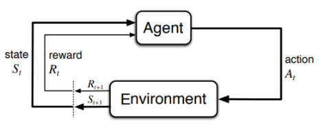
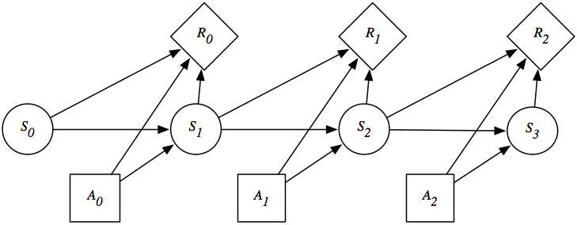

#! https://zhuanlan.zhihu.com/p/471626124
# DRL1. 马尔可夫决策过程 (Markov Decision Processes, MDP)

> 参考：
> - stanford cs221: [Lecture 7: Markov Decision Processes - Value Iteration](https://www.youtube.com/watch?v=9g32v7bK3Co&list=PLoROMvodv4rO1NB9TD4iUZ3qghGEGtqNX&index=7&t=3993s&ab_channel=stanfordonline)
> - Meduim Blog: [Reinforcement Learning : Markov-Decision Process (Part 1)](https://towardsdatascience.com/introduction-to-reinforcement-learning-markov-decision-process-44c533ebf8da)
> - Meduim Blog: [Reinforcement Learning : Markov-Decision Process (Part 2)](https://towardsdatascience.com/reinforcement-learning-markov-decision-process-part-2-96837c936ec3)
> - Web book: [Foundations of caputational agents](https://artint.info/html/ArtInt_224.html)
> - Book: [Reinforcement Learning: An Intorduction](http://incompleteideas.net/book/RLbook2020.pdf) - Chap 3


## 1. 强化学习简述

> 在开始本章学习之前，读者需先掌握搜索算法

### 1.1 概念描述

在强化学习中，我们的学习者和决策者被称为一个 **代理(Agent)** ，他会从所处的 **环境(Enviroment)** 中得知自己当然的 **状态(State)** 并做出 **动作(Actions)** 使自己到达下一个 状态。环境 会依照他的所作的动作和状态给代理一个 **奖励值(Reward)**。而我们想要是执行一系列动作，从而使得代理获得的最大的奖励值。要达成这个目的，我们要使用的第一个工具叫做 **马尔可夫决策过程 (Markov Decision Processes)**，简称  MDP。




> 本文只考虑有限 MDP


### 1.2 引例


在吃豆人游戏中，环境就是游戏本身。黄色的 pac-man 就是由我们代理控制的游戏角色。状态则是代理在环境中特定时间步长时所在的位置。每当代理执行操作的时候，都会得到一个奖励值，比如吃一个普通的豆奖励 9 分，如果走了一步但没有吃到豆则得 -1 分。如果被鬼撞到则会得 -10000 分。而我们要做的，就是让代理通过不断的试错，来学习游戏策略，最后找到能在吃豆人游戏不同地图都能获得高分的策略。

### 1.3 强化学习术语

在搜索问题中，我们已经遇到过两个术语，**状态** $s_t \in \mathcal S$ 和 **动作** $a_t\in \mathcal A(s)$。由这两个术语便可以使我们完成对地图的探索。


> 节点代表状态，箭头代表动作

在强化学习中，还有一个关键术语：**奖励** $R_{t+1} \in \mathcal R(s,a)$。这是环境依据代理的上一个状态和动作做出的奖励。由以上术语，代理可以生成一条如下样子的路径：



> 在有限 MDP 中，状态，动作，奖励集合中的元素都是有限的。

## 2. MDP

### 2.1 引理

为了更清楚的说明 MDP，我们先举一个例子：

我们现在玩一个骰子游戏，你有两个选择，摇骰子或退出，如果选择退出，你就能直接获得 $10，游戏结束。如果摇骰子你可以获得 $4。但如果摇到了 1 或 2，则游戏结束。如果是其他的，那么你便可以继续游戏下一轮的游戏。


### 2.2 转移概率和奖励

对于这个游戏来说，我们有两种状态，in or end。在 in 的状态下，我们有两种动作，stay or quit。如果做出 stay 的动作，我们有 $\frac{1}{3}$ 的概率达到状态 end，$\frac{2}{3}$ 的概率达到状态 in。我们称这个概率为 **转移概率(transition probabilities)**。到达状态 $s'$ 获得的奖励为 $r$

用一个表来总结上面的这段话就是：

|s|a|s'|T(s,a,s')|r(s,a,s')|
| - | - | - | - | - |
|in|quit|end|1|$10|
|in|stay|in|2/3|$4|
|in|stay|end|1/3|$4|

用概率论的公式来描述是 $T(s'|s,a)$，即在 $s$ 和 $a$ 发生的情况下，发生 $s'$ 概率。

此外，$T$ 还有一个性质:

$$
\sum_{s'\in states} T(s'|s,a) = 1
$$

在 $(s,a) \rightarrow s'$ 时的奖励也可以表示为概率的形式，$R(s'|s,a)$。

### 2.3 策略和效用

有了以上信息，我们还需要思考，如何通过一系列的动作获得最大的收益。这时我们就要让代理设计一套 **策略(policy)**， $\pi$。由它来告诉我们在每一个状态下应该做什么。类似于搜索算法中我们的路径，搜索算法中希望得到的是最小代价路径，而在强化学习中，我们希望得到的是最大收益策略。


对于一套策略来说，我们使用 **效用(utility)** 来衡量其好坏。效用就是这条策略产生的收益之和。

比如说，在骰子游戏中，我们连续选择了 3 次 stay 才结束游戏，那么其效用就是 $u_1 = 3\times 4 = 12$

但有时我们希望在最短的时间内获得最大的收益。假如每轮比赛的时间间隔是一周，那么我们就要考虑时间成本，我们将这个时间成本称为 **折扣系数(discount factor)**，用 $\gamma$ 表示，$0 \leq \gamma \leq 1$。

因此，我们的效用公式就变成了：

$$
u = r_1 + \gamma r_2 + \gamma^2 r_3 + \gamma^3 r_4 + ...
$$

这样的话，假如 $\gamma = 0.8$，我们还是连续选择了 3 次 stay 才结束游戏，那么效用就是：

$$
u_2 = 4 + 0.8 \times 4 + 0.8^2 \times 4 = 9.76
$$

### 策略评估

由于在执行策略的过程中，存在概率问题，所以同一个策略，可能会导致不同的效用。为了更好的衡量一个策略，我们引入另外两个值，一个是 **状态值，V值**，另一个是 **状态-动作值，Q值**。

- V值：$V_{\pi}(s)$ 是在状态 $s$ 时遵循策略 $\pi$ 可以获得的预期效用。

- Q值：$V_{\pi}(s,a)$ 为从状态 $s$ 采取行动 $a$，然后遵循策略 $\pi$ 的预期效用。


这两个值之间的关系式是：

$$
\begin{aligned}
&V_{\pi}(s) = 
\begin{cases}
    0 && if\, Isend(s)\\
    Q_{\pi}(s,\pi(s)) && otherwise
\end{cases}\\  
&Q_{\pi}(s,a) = 
\sum_{s'}T(s'|s,a)[r(s'|s,a)+\gamma V_{\pi}(s')]
\end{aligned}
$$

这个关系式也被称为贝尔曼期望函数(Bellman Expectation Equation)

下面，我们来计算一个给定策略的 V值 和 Q值。我们使用的思想，是迭代。先随便指定策略的 V值 和 Q值，然后通过一遍遍的重复策略获得奖励值，直到 V值 和 Q值 收敛于一定误差范围。

**算法：**

- 将所有的状态值初始化为：$V_{\pi}^{(0)}(s)\leftarrow 0$
- 通过下面的式子对 V值 进行迭代：

$$
\begin{aligned}
&V_{\pi}^{(t)}(s) = \sum_{s'}T(s'|s,\pi(s))[r(s'|s,\pi(s)) + \gamma V_{\pi}^(t-1)(s')]\\
&V_{\pi}^{(t)}(s) = Q^{(t-1)}(s,\pi(s))
\end{aligned}
$$

- 直到误差小于 $\epsilon$ 结束迭代：

$$
\max_{s\in states}|V_{\pi}^{(t)}(s)- V_{\pi}^{(t-1)}(s)| \leq \epsilon
$$


现在我们利用上面的算法来计算之前的骰子问题。现在我们不考虑折扣，来计算一下当策略一直为 "Stay" 的 V值：

$$
\begin{aligned}
&V_{\pi}^{(t)}(end) = 0\\
&V_{\pi}^{(t)}(in) = \frac{1}{3}(4 + V_{\pi}^{(t-1)}(end)) + \frac{2}{3}(4 + V_{\pi}^{(t-1)}(in))
\end{aligned}
$$

现在对其迭代 100 次


```python
V_end = 0
V_in_last = 0

for i in range (100):
    V_in = 1/3*(4 + V_end) + 2/3*(4 + V_in_last)
    V_in_last = V_in

print("Policy 'Stay' has a V value of {:.1f}".format(V_in+V_end))
```

    Policy 'Stay' has a V value of 12.0
    

### 2.4 最优策略和最优价值函数

至此，我们的我们已经可以对一个问题使用 MDP 建模了，并且有了评估模型策略的数值化方法。接下来，我们需要找到对于问题的最优策略。

**最优状态值函数**

在 MDP 中，根据不同的策略，存在许多不同的价值函数。最优状态值函数是一种与所有其他状态值函数相比产生最大值的状态值函数。其计算公式写作：

$$
v^*(s) = \max_{\pi} \, v_{\pi}(s)
$$

$v^*(s)$ 告诉我们可以从系统中获得的最大奖励是多少

**最优状态-动作值函数**

类似地，最优状态-动作价值函数告诉我们，如果我们处于状态 s 并从那里开始采取行动 a，我们将获得的最大奖励。

$$
q^*(s,a) = \max_{\pi} \, q_{\pi}(s,a)
$$

**最优策略**

一个策略比另一个策略更好，即该策略 $\pi$ 的任何一个状态值都大于等于其他任何一个策略 $\pi'$ 的状态值，我们就称策略 $\pi$ 为最优策略。

$$
\pi^*(s) = arg\max_{a\in Actions(s)}q^*(s,a)
$$

下篇：[]()
