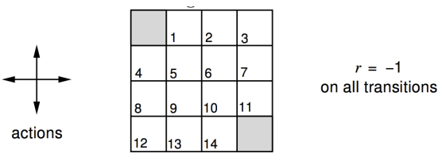
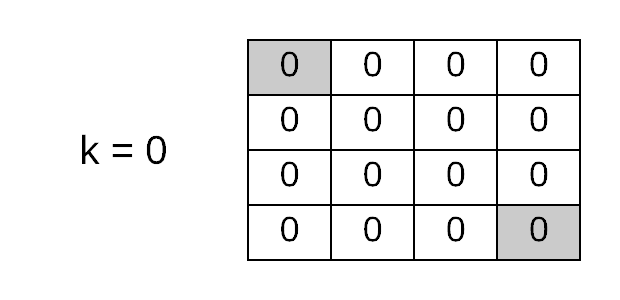
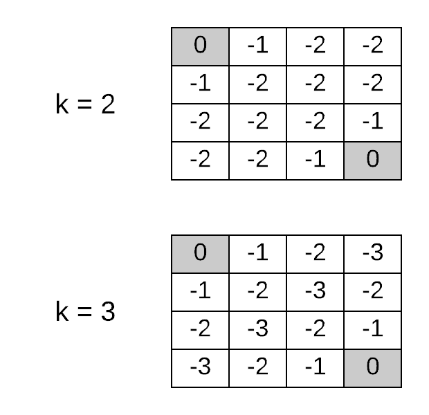
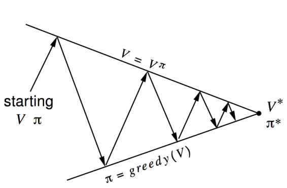
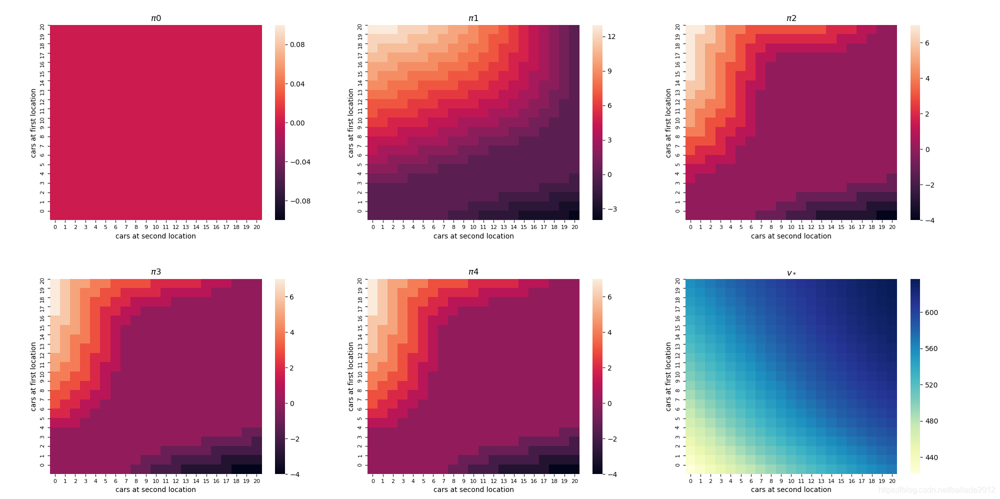
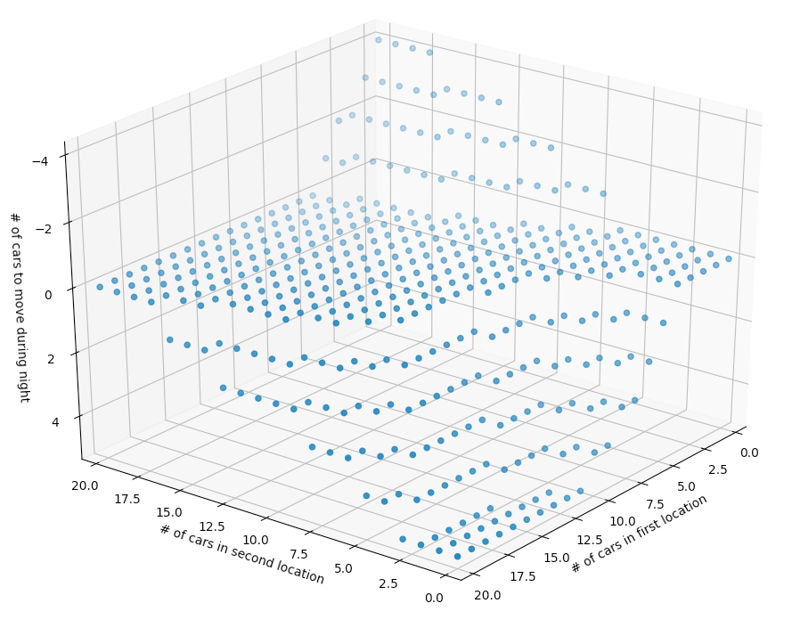
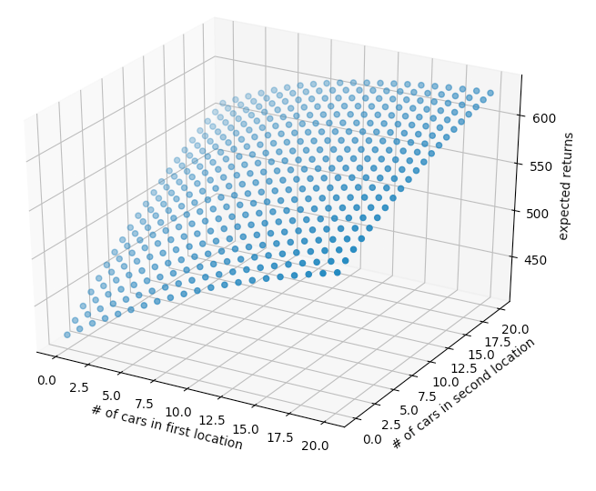

#! https://zhuanlan.zhihu.com/p/476488801
# DRL 2. 动态编程 (Dynamic Programming)

> 参考：
> - 2015 DeepMind RL 网课 [Lecture 3: Planning by Dynamic Programming](https://www.youtube.com/watch?v=Nd1-UUMVfz4&ab_channel=DeepMind)
>   - [网课课件](https://www.davidsilver.uk/wp-content/uploads/2020/03/DP.pdf)
> - Meduim Blog: [Dynamic Programming in RL](https://towardsdatascience.com/dynamic-programming-in-rl-52b44b3d4965)
> - Meduim Blog: [Disassembling Jack’s Car Rental Problem](https://medium.com/@jaems33/this-is-start-of-my-exploration-into-learning-about-reinforcement-learning-d505a68a2d6)

## 1. 简介

动态编程 (Dynamic Programming, DP) 是用于解决 马尔可夫决策过程 (Markov Decision Process, MDP) 的一种方法。DP 通过将复制的问题分解为一系列小问题，再通过不断的解决小问题得到解决方案。由于 MDP 的性质中包括：

- 贝尔曼方程给出递归分解，即重叠子问题 (Overlapping subproblems)
- 价值函数存储和重用解决方案，即最优子结构 (Optimal substructure)

DP 和强化学习的关键思想是使用价值函数来组织和构建对最佳搜索策略。我们想要获得最优策略，需要先找到满足贝尔曼最优方程的最优值函数：

$$\begin{aligned}v^*(s) &= \max_{a} \mathbb{E} [R_{t+1} + \gamma v^*(S_{t+1}) | S_t = s, A_t = a]\\&= \max_{a}\sum_{s',r}p(s',r|s,a)[r+\gamma v^*(s')]\end{aligned}$$

$$\begin{aligned}
    q^*(s,a) &= \mathbb{E}[R_{t+1} + \gamma \max_{a'}q^*(S_{t+1},a') | S_t=s, A_t =a ]\\
    &= \sum_{s',r}p(s',r| s, a)[r + \gamma \max_{a'} q^*(s',a')]
\end{aligned}$$


在使用 DP 之前我们默认 MDP 是已知的，即模型的原理我们已知。这时，我们可以利用 DP 和 MDP 完成预测和控制任务：

- 预测：
  - 输入：$MDP(\mathcal S,\mathcal A,\mathcal P,\mathcal R, \gamma)$ 和 策略 $\pi$
  - 输出：价值方程 $v_{\pi}$
- 控制：
  - 输入：$MDP(\mathcal S,\mathcal A,\mathcal P,\mathcal R, \gamma)$
  - 输出：最优价值方程 $v^*$ 和 最优策略 $\pi ^*$

## 2. 策略评估

### 2.1 引例

我们用一个例子来解释，假如我们现在有一个有个游戏，在游戏的网格地图中有两个灰色的方框，我们的任务就是使机器人到达这两个区域中的其中一个。此时我们创建一个随机策略的 MDP ($\gamma = 1$)，即：

$$
\pi(n|\cdot) = \pi(e|\cdot) = \pi(s|\cdot) = \pi(w|\cdot) = 0.25
$$

对于机器人来说，每走一步的奖励 $R = -1$，达到终点的奖励为 $R = 0$。



### 2.2 策略改善

> 下面只是给我们一个直观的理解，部分数据并不准确。

首先我们将所有网格的 V值 设置为 0。 然后通过贝尔曼方程对 V 进行迭代：

$$
\begin{aligned}
V_{k+1}(s) &\overset{\cdot}{=} \mathbb{E}_\pi[R_{t+1} + \gamma v_k(S_{t+1}) | S_t = s]  \\
& = \sum_{a\in \mathcal A} \pi(a|s) \sum_{s',r}p(s',r| s, a)[r + \gamma v_k(s')]\\
v^*(s) &= \max_{a} v(s')
\end{aligned}
$$



对于一个状态值 $v_t(s)$ 来说，我们首先找到其能够到达的所有子状态值 $v_{t+1}(s')$，选取其中最大的值，然后加上从 $s$ 到达 $s'$ 的奖励值 $-1$：

$$
v^∗(s) = max(0, 0, 0, 0) -1 = -1
$$

由此便得到了下图所示的状态值。


继续迭代，便可以得到一个收敛的最佳状态值表：



对于给定的一个策略，比如之前的随机策略，我们可以通过先评估策略：

$$
v_{\pi}(s) = \mathbb{E}[R_{t+1} + \gamma R_{t+2}+...| S_t = s]
$$

然后贪婪的向着 V值 大的方向不断改善策略：

$$
\pi ' = greedy(v_{\pi})
$$


### 2.3 策略迭代

但实际上数值状态迭代和策略改善是同时发生的，两者一起构成了策略迭代。其大致的过程如下图所示：



算法描述为：


## 3. 例子：《杰克的租车问题》

> 本例代码的 [Github 仓库](https://github.com/ShangtongZhang/reinforcement-learning-an-introduction/blob/master/chapter04/car_rental_synchronous.py)。本文中只展示了部分代码。

### 3.1 问题描述：

Jack 是一家汽车租赁公司的老板，他在北京和上海分别有一个汽车租赁点。两个地点的需求水平（每天的汽车租赁量）和退货率各不相同。由于我们其中一个地点的需求大于退货率，因此我们可以在一夜之间将汽车从一个地点转移到另一个地点。我们希望确保每个地段都有足够的汽车来最大化我们的回报。我们要解决的是，在给定每个地段特定数量的汽车的情况下，我们应该从一个地点移动到下一个地点的汽车数量，以及我们期望在这两个地点赚取多少？

**具体信息：**

- 每个位置只能容纳 20 辆汽车。
- 每次租车，我们赚取 10 美元（奖励）
- 每次我们一夜之间把汽车搬到另一个地方，我们都要花 2 美元（负奖励）。
- 我们可以在一夜之间移动的最大汽车数量是 5（行动）。
- 在任何给定日期，每个位置 ( n ) 请求和返回的汽车数量是**泊松随机变量**。
- 第一个和第二个位置的租赁请求的预期数量 (lambda)分别为 3 和 4。
- 第一个和第二个位置的预期退车数分别为 3 和 2。
- 因此，第二个位置的租赁比退货多，而第一个位置的租赁与退货的数量相同。
- 我们对未来回报的折扣率 (γ) 为 0.9。
- 时间步长是天（因此，一个迭代中的一个步骤可以被认为是一整天），**状态**是一天结束时每个位置的汽车数量，**动作**是在两个位置之间一夜移动的净汽车数量。

### 3.2 代码实现

我们首先将上面的参数输入进 python 程序


```python
import numpy as np
import matplotlib.pyplot as plt
import math 
import tqdm
import multiprocessing as mp
from functools import partial
import time
import itertools
```


```python
MAX_CARS = 20
MAX_MOVE_OF_CARS = 5
EXPECTED_FIRST_LOC_REQUESTS = 3
EXPECTED_SECOND_LOC_REQUESTS = 4
EXPECTED_FIRST_LOC_RETURNS = 3
EXPECTED_SECOND_LOC_RETURNS = 2
DISCOUNT_RATE = 0.9
RENTAL_CREDIT = 10
COST_OF_MOVING = 2
```

对于该问题来说，系统共有 $21 \times 21$ 个状态，(每个地方的车辆数从 0 到 20)。在开始的时候，我们首先将策略 和 V值 都初始化为 0。并创建一个列表用于存放所有的状态：


```python
policy = np.zeros((MAX_CARS + 1, MAX_CARS + 1))
stateVal = np.zeros((MAX_CARS + 1, MAX_CARS + 1))

states = []
for i in range(MAX_CARS + 1):
    for j in range(MAX_CARS + 1):
        states.append([i, j])
```

接下来我们创建可以产生的动作，在问题中，我们每个晚上最多只能移动 5 辆车。因此我们用一个范围为 -5 到 5 的变量来表示动作，+5 表示将 5 辆车从位置 1 移动到 位置 2，-5 表示将 5 辆车从位置 2 移动到 位置 1.


```python
actions = np.arange(-MAX_MOVE_OF_CARS, MAX_MOVE_OF_CARS + 1)
```

由于每天发生的事件（每个地方的租车数量和还车数量）服从泊松分布：

$$
\begin{aligned}
&P(x) = \frac{\lambda ^ x e^{-\lambda}}{x!}\\ &\text{where lambda is the mean of poisson distribution}\\ &\text{x is the possible event}
\end{aligned}
$$

因此我们利用字典创建一个泊松分布函数：


```python
pBackup = dict()

def poisson(n, lam):
    global poisson_cache
    key = n * 10 + lam
    if key not in poisson_cache.keys():
        poisson_cache[key] = math.exp(-lam) * math.pow(lam, n) / math.factorial(n)
    return poisson_cache[key]
```

由于泊松分布的事件有无数种，比如一天租用 100 辆车，这个的概率很小，但依然有可能发生。为了避免这样的事件发生，我们人为的设置泊松分布的上线为 11.


```python
POISSON_UPPER_BOUND = 11
```

模型准备好了，接下来我们来构建策略。我们首先创建一个在开始之前，我们将初始化一些变量。 `newStateVal` 最终将包含有关状态值的更新信息，这些信息将与我们在先前扫描中计算的状态值进行比较。 `improvePolicy` 是一个布尔值，用于检查我们是否应该在 while 循环中改进策略。


```python
newStateVal = np.zeros((MAX_CARS + 1, MAX_CARS + 1))
improvePolicy = False
```

我们的初始策略是一个 0 列表，即不移动车辆。接下来的策略评估阶段，我们通过每一次迭代后退一步的方式，来更新在当前策略下的最佳状态值。状态值和策略会不断迭代，直到最新的状态和策略和上一次的值相差小于 $\epsilon$


```python
for i, j in states:
    newStateVal[i, j] = expectedReturn([i, j], policy[i, j], stateVal)
if np.sum(np.absolute(newStateVal - stateVal)) < 1e-4:
    stateVal = newStateVal.copy()
    improvePolicy = True
    continue
```

> `expectedReturn( )` 方程将在最后演示

我们通过不断的 `argmax()` 来在最优价值函数下获取最贪婪的策略，一旦新策略中的行动可以获得更大的收益，我们就用最新的解决方案替换在位置 [i, j] 采取的先前行动。


```python
if improvePolicy == True:
    newPolicy = np.zeros((MAX_CARS + 1, MAX_CARS + 1))
        for i, j in states:
            actionReturns = []
            for action in actions:
                if ((action >= 0 and i >= action) or (action < 0 and j >= np.absolute(action))):
                    actionReturns.append(expectedReturn([i, j], action, stateValue))
                else:
                    actionReturns.append(-float('inf'))
            bestAction = np.argmax(actionReturns)
            newPolicy[i, j] = actions[bestAction]
        policyChanges = np.sum(newPolicy != policy)
        if policyChanges == 0:
            policy = newPolicy
            break
        policy = newPolicy
        improvePolicy = False
```

下面的函数是对于该问题的建模，并返回在一个状态下执行某个动作的奖励：


```python
def expectedReturn(state, action, stateValue):
    # Initiate and populate returns with cost associated with moving cars
    returns = 0.0
    returns -= COST_OF_MOVING * np.absolute(action)
    # Number of cars to start the day
    carsLoc1 = int(min(state[0] - action, MAX_CARS))
    carsLoc2 = int(min(state[1] + action, MAX_CARS))
    # Iterate over Rental Rates
    for rentalsLoc1 in range(0, POISSON_UPPER_BOUND):
        for rentalsLoc2 in range(0, POISSON_UPPER_BOUND):
            # Rental Probabilities
            rentalsProb = poisson(rentalsLoc1, EXPECTED_FIRST_LOC_REQUESTS) * poisson(rentalsLoc2, EXPECTED_SECOND_LOC_REQUESTS)
            # Total Rentals
            totalRentalsLoc1 = min(carsLoc1, rentalsLoc1)
            totalRentalsLoc2 = min(carsLoc2, rentalsLoc2)
            # Total Rewards
            rewards = (totalRentalsLoc1 + totalRentalsLoc2) * RENTAL_CREDIT
            # Iterate over Return Rates
            for returnsLoc1 in range(0, POISSON_UPPER_BOUND):
                for returnsLoc2 in range(0, POISSON_UPPER_BOUND):
                    # Return Rate Probabilities
                    prob = poisson(returnsLoc1, EXPECTED_FIRST_LOC_RETURNS) * poisson(returnsLoc2, EXPECTED_SECOND_LOC_RETURNS) * rentalsProb
                    # Number of cars at the end of the day
                    carsLoc1_prime = min(carsLoc1 - totalRentalsLoc1 + returnsLoc1, MAX_CARS)
                    carsLoc2_prime = min(carsLoc2 - totalRentalsLoc2 + returnsLoc2, MAX_CARS)
                    # Number of cars at the end of the day
                    returns += prob * (rewards + DISCOUNT_RATE * stateValue[carsLoc1_prime, carsLoc2_prime])
    return returns
```

**结果：**






