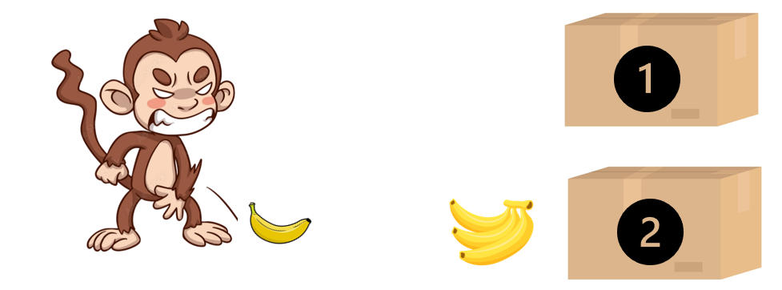

#! https://zhuanlan.zhihu.com/p/520062204
# DRL3. 探索与尽用 (exploration and exploitation)

> Reference:
> - [Reinforcement Learning: An introduction -- Richard S. Sutton](https://web.stanford.edu/class/psych209/Readings/SuttonBartoIPRLBook2ndEd.pdf)
> - [DeepMind x UCL RL Lectures 2 -- Hado van Hasselt](https://www.youtube.com/watch?v=aQJP3Z2Ho8U&list=PLqYmG7hTraZDVH599EItlEWsUOsJbAodm&index=2&t=1417s)

## 1. 多臂怪盗问题 (Multi-armed Bandits Problem)

这里，我们通过讨论多臂怪盗问题来间接的探讨强化学习中的探索与开发难题。多臂怪盗，可以被看做是一个简化的强化学习问题，在怪盗问题中，并不存在学习，只是单纯让 agent 做出对自己有利的选择。

### 1.1 引例

下面我举一个例子。假如我们让一只猴子从两个箱子里中选一个，其中一个箱子里有一根香蕉，另外一个箱子里可能有三根香蕉也可能只有一个香蕉皮，出现香蕉和香蕉皮的可能性均为百分之五十。而猴子并不知道箱子里的香蕉数量。

假设 A-1： 猴子第一次选择了一号箱子，他拿到了一根香蕉，他非常开心，于是以后每一次都选择一号箱子，并且稳定的拿到一根香蕉，他的平均收益为 1。

假设 A-2：猴子第一次选择了二号箱子，得到三根香蕉，他非常开心，于是以后的每次选择都会选二号箱子，虽然偶然只能得到香蕉皮，但猴子依然会坚定的选择一号箱子。最终他的平均收益为 1.5。

假设 A-3：猴子第一次选择了二号箱子，只得到了香蕉皮。猴子非常生气，于是以后的每一次都会选择一号箱子，并且稳定的得到一根香蕉。他的平均收益小于但接近 1.

假设 B-1：猴子第一次选择了一号箱子发现里面有一根香蕉，他很开心，但他依然好奇二号箱子有什么，于是第二次选择了二号箱子，发现里面有三根香蕉，于是猴子第三次依然选择了二号箱子，但这次只有一个香蕉皮，但二号箱子的平均收益还是比一号要高，所以猴子以后每次都会选择二号箱子。最终的平均收益趋近 1.5。

假设 B-2：猴子第一次选择了二号箱子，得到三根香蕉，他很开心，但他依然好奇一号箱子有什么，于是第二次选择了一号箱子，发现里面只有一根香蕉。由于二号箱子目前来说的收益更高，因此第三次猴子还是会选择二号箱子，虽然偶尔会拿到香蕉皮但总体收益还是高于一号箱子的。最终的平均收益接近1.5.

假设 C：这是一只更加富有探索性的猴子，前 6 次的选择都是一次 1 号，另外一次 2 号。在 6 次探索之后，他摸清楚了游戏规则。在之后的选择中，他都会选择收益平均较高二号箱子。

### 1.2 探索(exploring)与尽用(exploiting)

在上面例子中，猴子在当前情况下做出对自己最优利的选择的行为被称为尽用(exploiting)，即在当前的知识储备下，做出可以获得最高收益的行为，并在今后遇到相同情景的时候仍选择最高收益的行为。另外一种，在明知道一个行动的收益更高，但不去选择的行为被称为探索 (exploring)，这种行为虽然在当前没有获得最高的收益，但是会获得更多的知识储备，以优化当前模型，获得更好的策略。由于上面的情景非常简单，且会重复当前情景因此 agent 在少数探索之后就可以轻松的获取游戏的最优策略，但强化学习通常需要面对的情况要比上面的情景复杂很多，比如围棋游戏，当前的决策会对今后的决策产生印象，因此在训练 agent 学习围棋的过程即需要 exploring 也需要 exploiting，而如何使两者达到一个平衡状态是本文讨论的重点。

下面的内容会提供一些简单的方法来帮助我们达到探索与尽用的平衡。

## 2. 动作-价值 (Action-value)

在介绍算法之前，我们首先介绍一个概念：动作-价值 (Action-value)。在多臂怪盗问题中，我们只有一个场景，但是有多种选择。因此我们会对选择进行收益的评判，比如猴子引理里，选择二号箱子这个动作的平均就是 1.5，这就是此动作的价值。用更加概括的公式来表示就是：

$$q(a)=\mathbb{E}[R-t|A_t =a]$$

即一个动作能够产生的收益的期望。

而最佳价值就是能够产生最高收益的动作的平均价值：

$$V* = max_{a\in \mathcal{A}}q(a) = max_a \mathbb{E}[R_t | A_=a]$$

此外我们还要定义一个后悔值(Regret)，代表当前动作价值与最佳价值的：

$$\Delta a = V* - q(a)$$

我们用 $L_t$ 来表示后悔值的累计：

$$L_t = \sum_{n=1}^{t}V*-q(A_n) = \sum_{n=1}^t\Delta A_n$$

在多臂怪盗问题中，我们追求的是最高的累计收集，这与最低的总后悔值是完全等价的。

现在我们面临的最大问题是并不知道每一个动作的价值。因此我们需要定义一个动作价值的估算值 $Q_t(a)$

$$Q_t(a)=\frac{\sum_{n=1}^t\mathcal{I}(A_n=a)R_n}{\sum_{n=1}^t\mathcal{I}(A_n=a)}$$

其中 $\mathcal{I}$ 是一个指示方程：$I(True)=1, I(False)=0$，即我们在 t 步的时候是否选择了动作 a，如果选择了便记录一个 1，没有选择则记录为 0。

该累加值，我们使用 $N_t(a)$ 记录：

$$N_t(a)=\sum_{n=1}^t\mathcal{I}(A_n=a)$$

另外一种预计动作价值 $Q_t$ 的方法是累加法，即上一次的动作价值 $Q_{t-1}(A_t)$ 加上当前值与上一值的差。 

## 3. 算法

### 2.1 贪心算法(Greedy Algorithm)

贪心算法即一直选择当前状态下价值最高的动作：$A_t = argmax_a Q_t(a)$。由此构成的策略由公式表示为：

$$\pi_t(a) = \mathcal{I}(A_t = argmax_aQ_t(a))$$

但是这种算法有一个很大的弊端，其尽用远大于探索，导致结果往往会被卡在一个次最优点。并且这种受初始值影响的很大。如果初始值选择的好，那么贪心算法结果就很好，反之就很差。但我们只能随机的选取初始值，因此总体来说我们无法利用贪心算法得到很好的结果。

### 2.2 $\epsilon$-Greedy Algorithm 

要想改进这个算法，最简单的方式就是在贪心算法加入一些噪声 $\epsilon$。即，算法在 $\epsilon$ 概率下会产生并非当前最高价值的动作，即探索。该算法的公式表达也很简单，即：

$$
\pi _t(a) = 
\left \{
\begin{aligned}
    (1-\epsilon) + \epsilon/|A| \\
    \epsilon/|A| 
\end{aligned}
\right.
$$

因此该算法会持续的按照固定的 $\epsilon$ 值来探索，但这样的到了后期探索的差不多了，却很难将模型稳定的输出稳定下来。因此在实际应用中，我们常常会选择递减的 $\epsilon$。

### 2.3 策略梯度

除了之前两种基于动作价值的算法之外，我们还可以直接指定策略，这种算法被称为策略梯度。该算法的基本原理就是为每一个动作设置一个偏好值 $H_t(a)$，即在 t 时刻策略采取动作 a 的偏好。偏好并不等同与概率，通常我们还会使用 softmax 算法来计算当前动作被采用的概率：

$$
Pr\{A_t = a\} = \frac{e^{H_t(a)}}{\sum_{b=1}^k e^{H_t(b)}} = \pi _t(a)
$$

即动作 a 的偏好值的自然指数与其他所有动作偏好值的自然指数之和的比值。由此也就得出了我们的策略 $\pi _t$。其中动作偏好值 $H_t$ 就是策略参数的一种。对于更广义的策略参数，我们通常使用 $\theta$ 来表示。要是策略更新，就是使策略的参数更新，即使用梯度上升的方法：

$$
\theta _{t+1} = \theta _t + \alpha \nabla _{\theta} \mathbb{E} [R_t | \pi _{\theta _t}]
$$

用人话来说，就是当前的策略参数，加上在某个学习率 $\alpha$ 下的梯度变化乘以期望奖励。但是该公式的写法不方便计算，因此需要使用 log-likehood trik 对其变形，从而得到了下面的公式：

$$
\nabla _{\theta} \mathbb{E} [R_t | \pi _{\theta _t}] = \mathbb{E}[R_t \nabla _{\theta} log  \pi _{\theta _t}(A_t)]
$$

经过变现后，梯度变化被放进了期望里面，由此我们就可以通过采用来计算新的策略参数：

$$
\theta \doteq \theta + \alpha R_t  \nabla _{\theta} log  \pi _{\theta _t}(A_t)
$$

这也被称为随机梯度上升。相对于之前的动作值方法来说，其最大的好处就是，我们不用再估计值，而是可以直接使用随机采样的奖励来更新策略。

现在我们将参数 $\theta$ 简化为动作偏好值，在 softmax 下，我们的偏好值更新方法为：

$$
\begin{align}
H_{t+1}(A_t) &=  H_t(a) + \alpha R_t \frac{\alpha log \pi _t(A_t)}{\alpha H_t(a)} \\
&= H_t(a) + \alpha R_t (\mathcal{I}(a=A_t) - \pi _t (a))
\end{align}
$$

将 $\mathcal{I}$ 展开即为：

$$
\begin{align}
&H_{t+1}(A_t) =  H_t(A_t) + \alpha(R_t - \bar{R_t})(1 - \pi _t(A_t))\\
&H_{t+1}(A_t) =  H_t(a) + \alpha(R_t - \bar{R_t})\pi _t(a)\qquad \text{for all } a \neq A_t 
\end{align}
$$

上面公式的意思就是偏好值的更新是上一次动作的偏好值加上上一次动作所得到奖励（该奖励是一个采样值）减去平均奖励，乘以采取该动作的概率。该更新式为分为了两个部分，一个部分表示我们所关心的动作 a，另外一个部分是不采取动作 a 的情况。当采用动作 a 所得的分数高于其他动作的时候，动作 a 的偏好值就会增加，而其他动作的偏好值就会减少。反之同理。而在初始化的时候，我们通常会将所有动作的偏好值设置为 0 。

### 2.4 上确信边界 (UCB)

上确信边界(Upper Confidence Bounds) 是在动作造成的结果尚未明确时使用的方法。比如下图的四个高斯分布的动作价值函数：

在这些动作价值函数中，$\sigma$ 越大就说明这个动作的不确定性越大。而在面对不确定的情况的时候，我们通常是乐观面对，也就是说，如果一个动作的平均值与其上边界之和越大，我们则越有可能选择该动作。以上面的 蓝，红，黄 色动作为例，他们的均值相等，但是黄色的 $\sigma$ 最大，因此我们选择 $\sigma$ 的概率就要大约选择其他动作的概率。

$$
a_t = argmax_{a\in \mathcal{A}} Q_t(a) + U_t(a)
$$

其中 $U_t(a)$ 就是动作 a 的上边界。一个动作的上边界越大，则不确定性就越高。

此外还有以下关系：

$$
q(a) \leq Q_t(a) + U_t(a)
$$

即一个动作当前的平均价值加上其上边界是要大约该动作的确定价值的。由此我们可以引出 Hoeffding 不等式：

$$
P(\bar{X_n} + u \leq \mu) \leq e^{-2nu^2}
$$

其中，$X_1, ..., X_n \in [0,1]$，他们的均值为 $\mu = \mathbb{E}[X]$，而通过采样得出的均值为 $\bar{X_t} = \frac{1}{n}\sum_{i=1}^n X_i$。将上面的公式引入多臂怪盗问题则有：

$$
p(Q_t(a) + U_t(a) \leq q(a)) \leq e^{-2N_t(a)U_t(a)^2}
$$

也就是说，随着我们采样次数的增加，采样均值与真实均值之间的差会越来越小，从而使得我们选择该动作的可能性也越来越小。这意味UCB算法会让我们持续性的探索，但并不会过度探索。

如果套用 greedy 策略在动作选择上，则有：

$$
a_t = argmax_{a\in \mathcal{A}}Q_t(a) + c\sqrt{\frac{logt}{N_t(a)}}
$$

其中 c 是一个超参数。

### 2.5 Thompson 采样

此外还有一个基于概率的方法叫做 Thompson 采样，此方法年份已久(1933年提出)，但非常直观且好用。其动作就是采用贪心算法来获取 $A_t = argmax _{a\in \mathcal{A}} Q_t(a)$，但是其采样的方式却与 UCB 相似，基于概率。

- 上篇：[DRL 2. 动态编程 (Dynamic Programming)](https://zhuanlan.zhihu.com/p/476488801)
- 下篇：