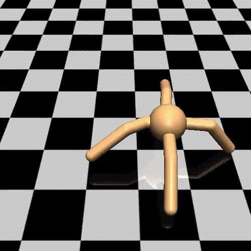

#! https://zhuanlan.zhihu.com/p/491871605
# PWG0. 配置 Gym 的 Anaconda 环境

> 以下操作均在 Linux 系统中完成，因此 Gym 对于 Windows 的支持并不友好。


```python
conda create -n gym python=3 pip
conda activate gym
conda config --append channels conda-forge
```

安装 Pytorch 的包。这里自行在 Pytorch 官网查看适合自己系统的安装方式。

安装 Tensorflow


```python
pip install --upgrade tensorflow
```

安装一些常用的基本库


```python
conda install ipython numpy scipy pandas matplotlib seaborn -y
conda install pytest psutil joblib tqdm mpi4py ipykernel -y
```

安装 Jupyter Notebook


```python
conda install -c conda-forge notebook
```

为环境配置 Jupyter Kernel


```python
python -m ipykernel install --user --name=gym
```

然后开始安装 gym，首先安装 gym 中的基本功能。


```python
pip install gym
```

【选择性安装】 安装 gym 中的 box2d


```python
conda install -c conda-forge gym-box2d
```

【选择性安装】然后安装 gym 中的 atari，这个在 linux 上不会报错。


```python
pip install gym[atari]
pip install gym[accept-rom-license]
```

【选择性安装】然后安装 MoJoCo



在 [MuJoCo Github Realease](https://github.com/deepmind/mujoco/releases)下载 MuJoCo 的安装包。并且在 `~/.mujoco/mujoco210` 路径下解压。


```python
mkdir -p .mujoco/mujoco210
tar -zxvf xxx.tar.gz
pip3 install -U 'mujoco-py'
python3 -c 'import mujoco_py'
pip3 install gym[mujoco]
```

安装 RL 的算法库


```python
pip install stable-baselines3[extra]
```

- 下篇：[PWG 1. 初识强化学习代码](https://zhuanlan.zhihu.com/p/484023706)
