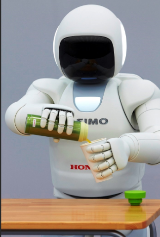
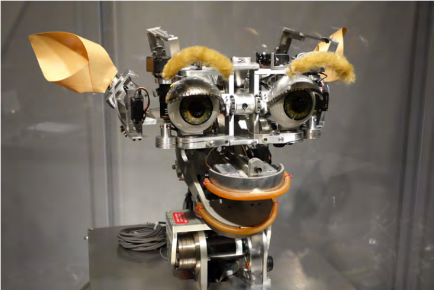
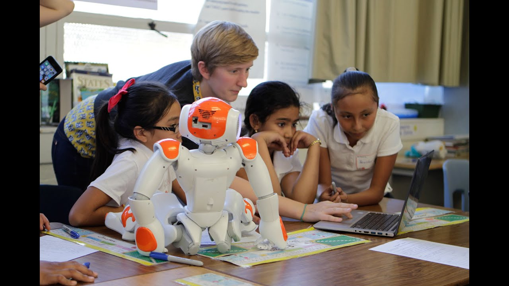
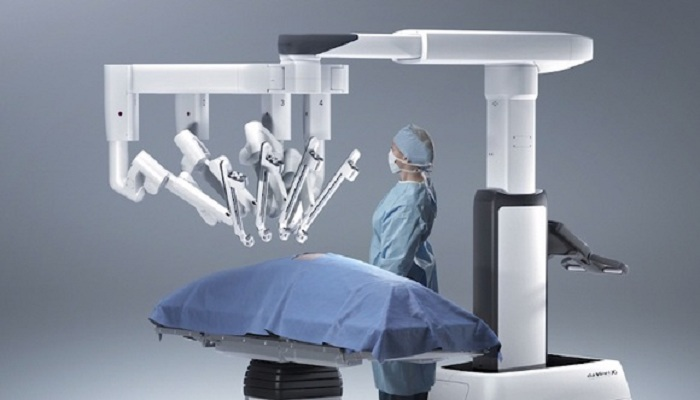

#! https://zhuanlan.zhihu.com/p/511862004
# HRI1. 人机交互简介 (Human-Robot-Interaction Intro)

## 1.1 什么是人机交互

机器人与其他类别的电子程序的不同之处在于，机器人是具有实际身体的。这个实际的身体，不单单是一个被架如腿或轮子的嵌入式主机，而是一个具有社会性的，需要与人进行交互的机器人。举一个例子来说，在办公室里有 2 个人，Tim 和 Tom。Tim 向机器人点了一杯咖啡后就回到了自己的办公桌。那么机器人就需要像一个服务生一样，具有记忆，感知，导航和运动能力才能将这杯咖啡送到 Tim 的办公桌。除此之外，这个机器人还需要懂得一些社交礼仪，比如当 Tim 收到咖啡后，礼貌性的说了 "Thanks!"，那么机器人也应该礼貌性的回复 "You're welcome!"。
在这里，我们所研究是人机交互就是研究机器人的社会行为，例如上面的递咖啡的例子中，Tim 期待的机器人，就是一个与人类服务生类似的存在。

更加具体的说，HRI 需要我们对于机器人的硬件和软件按照符合人机交互的方式进行设计。但这并不是一件简单的事情，HRI 的设计中包含了工程学，心理学，人类学，社会学方面的思考。

## 1.2 人机交互的发展

"social robot" 一词最早出现在 Sargent 1935 年出版的一本小说里，书中用 "social robot" 一词来形容一个人像机器人一样木讷的社交。后来在 1978 年的 "Interface Age" 杂志中，"social robot" 一次才有 HRI 中用来形容机器人具有社会行为的意思。

最早期的 HRI 研究始于 1997 年，当时这个领域非常小众，且只在 MIT 的 lab 的有一台可供研究的机器人 Kismet。这个机器人会眨眼睛，动嘴巴和脖子，并且可以基于人类的动作做出反应。

目前，HRI 的研究与教学成本已经大大降低，在此领域软银欧洲开发的 "NAO" 机器人做出了巨大的贡献。这个小小的人型机器人，以较低的成本和方便移动的特性走进了各个教室。

工业界目前也进入了 HRI 领域，并且研发出了各种辅助机器人，比如手术机器人达芬奇：

- 下篇：[HRI2. 人机交互的研究方法](https://zhuanlan.zhihu.com/p/511908732)