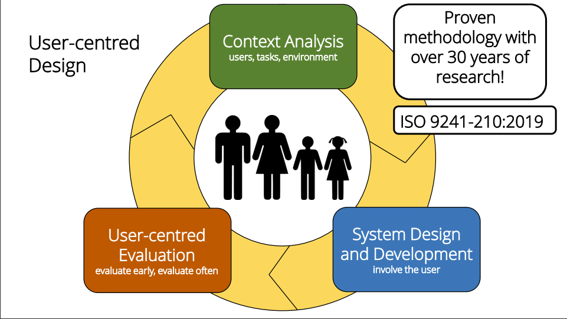
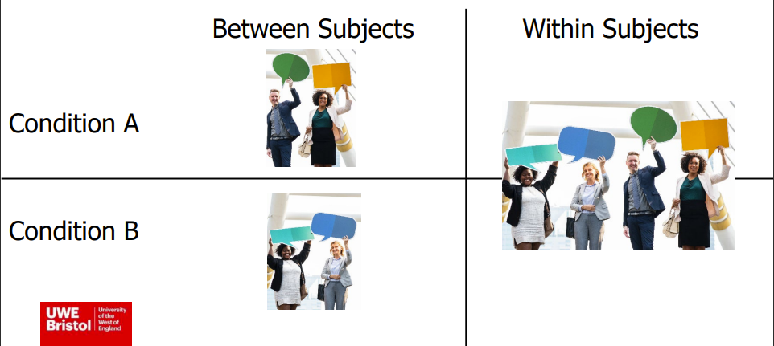
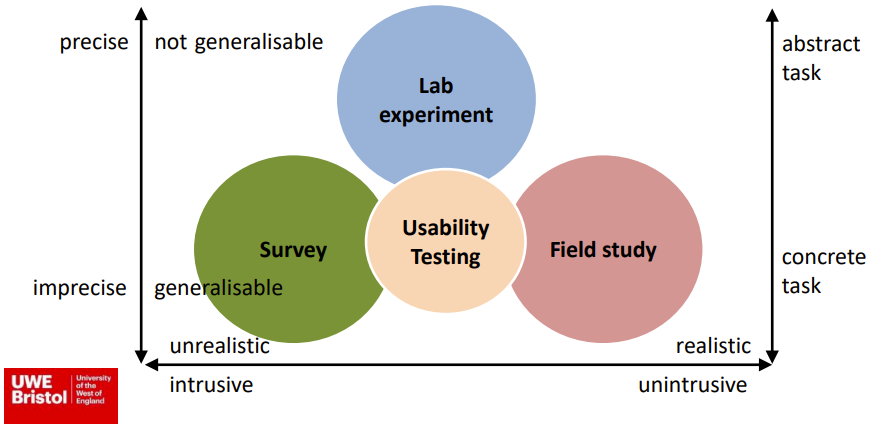

#! https://zhuanlan.zhihu.com/p/511908732
# HRI2. 人机交互的研究方法

## 1. 概述

由于人机交互中两个最重要的主体分别为人类和机器人，因此人机交互的研究方法大致上可以分为两类，以机器人为中心的研究，和以用户为中心的研究。

以机器人为中心的研究主要关心的是机器人的发展和技术上问题，在研究中，用户在研究中主要扮演的测试员，检查功能是否有用或高效。

在以用户为中心的研究中，则更关心人机交互过程中人类的体验。以用户为中心的研究，在产品研发环节有着广泛的应用。并有一套标准的研究模型 ISO 9241-210:2019。此模型是由 `场景分析`，`系统设计和研发`，`用户评估` 三个环节所构成的循环。

## 2. 定义研究问题和方法

### 2.1 探索实验还是认证实验？

HRI 以结果为导向可以分为探索性实验和认证性实验。探索性实验是搭建一个实验场景，但并没有一个确定的问题，比如："人们会怎样在家使用扫地机器人？"。而认证性实验则会提出一个假设，比如："人们认为机器人应该有性别"。通常我们在提出一个假设的时候，自己手中已经提前掌握了一些支撑性的论据，但这些论据无法完全支持假设，因此建立实验。

### 2.2 相关还是因果？

除了探索性或认证性之外，你还需要确认对实验中的感兴趣的变量之间建立相关性或因果关系。假如我们认为 "助教机器人会让青少年更爱学习"，那么其中的变量就是青少年是否拥有机器人，以及他们的学习时间。为了研究者两个变量之间的关系，我们需要将实验者分为两组（这两组样本应该具有相同特性，比如年龄范围，家庭条件等），一组拥有机器人，另一组只有课本，然后分别测量他们的学习时间。假如拥有机器人的一组学习时间更长，那么我们就可以说是机器人造成了青少年更爱学习。但我们无法说明是否拥有机器人与学习时间之间的相关性（因为机器人变量只有0和1的区别）。

## 3. 定性、定量和混合方法？

在提出研究问题的时候需要考虑使用定性，定量还算混合方法。比如之前的问题 "助教机器人会让青少年更爱学习" 就是一个定性方法。而 “一个仓库机器人一天可以放置 10 吨货物” 则是定量方法。

### 3.1 用户研究

用户研究即有用户参与的研究（不是所有研究都是由用户参与的）。举一个用户研究的例子，实验的假设是 “人们认为机器人应该有性别” 那么这个实验的变量有：机器人的性别（男，女，中，无）。由于实验参与者的性别可能也会影响到他们对于假设的判断，因此我们将实验者的性别设置为一个因变量（男，女，中）。在随后的实验中，我们查看不同性别的人对于认为的机器人性别。即用户研究，是研究人类对于和机器人交互的态度。

### 3.2 系统研究

系统研究则是研究机器人的技术能力。比如机器人的语音识别能力。假如在设计阶段，我们的数据集里只有成年人的声音，那么我们在系统研究实验中便可以找来一些小孩子，让他们与机器人进行互动，然后查看机器人对于小孩子的声音识别效果。

> 这里其实还有很多中研究形式，但这里不再一一介绍了，感兴趣的同学可以查看书籍 《Human–Robot Interaction: An Introduction -- Christoph Bartneck》。其余研究方式还有：
> - 对话研究
> - 观察研究
> - 种族研究
> - 单目标研究
> - 众包研究

## 4. 选择实验参与者和设计实验

### 4.1 实验实验参

实验者是 HRI 实验中的必要因素。那么谁可以被当作实验参与者则是一个重要的问题。实验中最常见的实验参与者是高校的学生，因为他们离实验室近。但是，我们也要考虑我们的实验问题是什么，如果我们需要研究 “机器人对于儿童的影响” 那么实验者就必须与实验目标一致。并且我们需要保证有足量且多样的实验参与实验，我们才能够保证实验结果的普适性。但是一般性的实验中，我们假认为学学生是具有多样性的普适人群，因此可以作为实验者。但在选择高校学生的时候，我们也要主要平衡参与者的性别，与学生的学术背景。因为通常一个学习工程类学科（尤其是机器人学）的学生对于机器人和机器人技术有着更高的兴趣和更快的理解能力。如果我们想要获取更多普通人对机器人的感受，则应该关注参与者的背景。最后一点是一定要保证有足量的实验参与者，少量的参与者往往会使数据存在偏差 (Bias)。

### 4.2 实验设计

通常来说，一个好的实验需要至少25个参与者每组，具体的数量依据实验本身而定。在  "between-subjects design" 中，实验者需要被随机分配到每个组里。两组实验的平均数可以进行相互对比。而在 "within-subjects design" 中，实验者需要参加每一组的实验，这样的一个人对不同的组的评价便可以进行对比。但是在第二种设计中，设计人员需要注意实验先后顺序对于参与者的影响，因此让实验者按照随机顺序参与实验组会减少误差。

有些时候，参与者会被要求填写调查问卷。调查问卷通常会被设置为多选题或者程度 (Likert scale)。程度一般被用于表示参与者对于描述的认可，一般分为五个等级。 1(非常同意)，5（非常不同意）。最后也有一些主观题，让参与者描述自己的想法或感受。

## 5. 定义交互场景

### 5.1 实验地点

通常来说，实验地点分为实验室和实地（比如在医院研究医疗机器人）。但通常情况下，机器人实验更多的还是在实验室中进行的，因为在实验室中，不可以预知的变量数更少，因此研究员可以对实验的场景，环境，时间，任务等有着更大的把握。但是实地实验更贴近机器人的日常应用环境，因此在实地实验的过程，研究员会发现更多的实验变量，甚至存在的隐患。因此实地实验也是非常重要的。

### 5.2 HRI 的时间背景

通常实验室中的 HRI 实验都是短期，15分钟左右的。但大多数人在实验前期（10min之内）对实验或机器人还不够了解，因此参与者前期的表现和后期的表现可能会存在差异。因此，很多产品级的机器人，需要以月甚至年为单位进行测试，从而探索在长期接触下，人类对于机器人的态度。

### 5.3 HRI 中互动的社会单位

目前来说，我们的实验都是一个实验者与一个机器人为单位进行的。但实际的应用场景中也存在有多人多机器人的情况。在这样的场景下，实验者的行为很有可能与单个机器人单独相处产生差异。

## 6.  实验的测量指标

在社科中实验指标通常被分为直接测量指标和间接测量指标。直接测量的指标包括在调查问卷里问一些实验变量。但要注意的是，有些情况下，实验者并不会填写自己的真实感受，例如，在被问到 “你在多大程度上同意机器人对你的生活会有好的影响？” 时，实验者可能会为了表现自己 “nice” 的一面而填写出比实际感受更好的答案。因此一些间接的测量指标也非常重要，比如在手术机器人中，测量手术进行的时间，因为通常较短的时间意味着手术更加高效，更好。因此一个好的实验需要一定的直接测量指标以及间接测量指标。

- 上篇：[HRI1. 人机交互简介 (Human-Robot-Interaction Intro)](https://zhuanlan.zhihu.com/p/511862004)
- 下篇：[HRI3. 机器人设计](https://zhuanlan.zhihu.com/p/512422142)