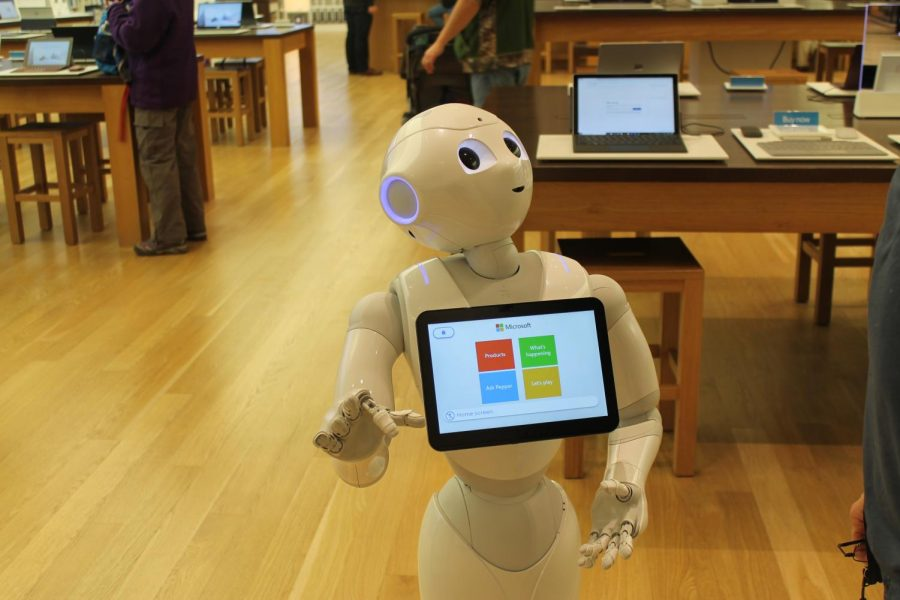

#! https://zhuanlan.zhihu.com/p/512422142
# HRI3. 机器人 设计

大多数的机器人设计过程是让工程师以功能的角度出发，比如一个扫地机器人，其外观，硬件和软件的设计都是围绕着清洁功能开展的。在完成设计之后，再交给社科的研究员研究他们的人机交互。但是，随着产品的发展，"outside-in" 的设计模型开始流行。这种设计模式是首先分析机器人的应用场景，使用人群，以用户为中心，先进行产品的外观设计，然后再进行软硬件设计。

## 1. 交互设计

在机器人的外观设计时要注意，如果机器人的外观像人，那么用户更加倾向于用人类的方式与机器人交互；如果机器人有手臂，那么用户期待机器人的手臂可以捡拾东西，或者握手；如果机器人有眼睛，那么用户则期待机器人可以看见并且理解视觉；如果机器人有耳朵，那么用户便期待机器人可以理解自然语言。。。

另外在设计的时候，尽量考虑模块化的设计，即每个模块具有单独的功能，模块之间可以相互整合，以避免重复性的设计。比如，一个扫地机器人的导航功能可以直接用到服务员机器人上。

## 2. 机器人的拟人化设计

你是否经历过这样的一些事：有些人将宠物视为自己的孩子，小孩会对玩具表现出拟人化的感情。那么人类在面对机器人的时候，尤其是面对外貌类似人类的机器人的时候，也可能会产生这些感情。

机器人的拟人化设计的时候有三个好处，有效性，社会性和认知性。首先有效性是因为对于目前的人类社会来说，机器人依然是一个比较陌生的存在，很多人在面对机器人的时候，不知道如何与其进行交互，比如下面的机械臂，大多数人并不知道如何与这样的机器人进行交互。

但是，在面对一个类人型的机器人的时候，我们会直观的认为使用与人交互的方式与机器人进行交互即可。

社会性是认为类人型的机器人会更容易被社会接受和尊重。

最后是认知性，通常来说，如果把机器人做的比较萌，人们往往不会期待机器人是博学或强壮的，降低人类对于机器人的预期有助于提升人机交互时的体验。

另外一种增加拟人性的设计方式是让机器人具有类似人类的行为。比如，让机器人具有和人类一样的语言能力和逻辑。在面对一个虚拟形象的时候，如果这个虚拟形象能够达到人类水平的语言能力，那么即使只是虚拟形象，也是惹人喜爱的。

**恐怖谷理论**

恐怖谷理论是指当机器人的外貌逐渐接近人的过程中，人的好感度会从会有类似下面的曲线一样的变化。对于工业机器人来说，人类不会有太多的好感，但与人类外形有超过 50% 而少于 70% 相似的时候，人类会对机器人有较多的好感。但是当机器人的外形于人类有 80% 相似度的时候，人们往往认为这样的机器人是恐怖的，像丧尸一样。因此，在工业设计的时候，一定要注意，如果无法让自己的机器人与健康的人类有 90% 的相似程度，就最好不要设计的太像人类。

## 3. 设计方法

通常在设计阶段会经历一下四个步骤的循环：

- 定义问题
- 创建交互方案
- 测试
- 分析

以上四个步骤循环进行，直到得出满意的方案。

### 3.1 工程设计过程

在工程设计的过程中，我们会现在模拟环境中测试机器人的效果，然后再将机器人在实际环境中进程测试，从而降低风险和成本。但，我们要知道，大多数情况，模拟的环境无法完全拟合现实，只能作为一个简化的模型来看待。

此外，我们在优化机器人的过程中需要知道自己应该优化到什么程度。因为很多情况下，优化是一件无止尽的事情，但往往我们只需要机器人刚好满足一项任务的条件即可。

### 3.2 以用户为中心的设计过程

在设计之初优先可虑机器人的使用场景和用户可以帮助我们完善机器人交互中的问题。在这个过程中，设计人员往往会快速建立原型，并交给目标用户体验，通过观察交互过程和得到的用户反馈来改进模型，然后再次验证。有些时候甚至会一次性做出多个原型，以找到一个较好的方案。

在测试阶段，机器人往往只会要求最直接的使用者来参与 HRI 实验。以医疗机器人为例，大多数情况下是由医生来操作医疗机器人的，但在某些情况下，其他的一些医疗人员也会与机器人发生交互。因此实验阶段应该邀请更广大的用户来参与。一个比较典型的以用户为中心的设计过程的例子，就是卡内基梅隆大学的 'snackbot'。

- 上篇：[HRI2. 人机交互的研究方法](https://zhuanlan.zhihu.com/p/511908732)
- 下篇：[HRI4. 语言交互(Verbal Interaction)](https://zhuanlan.zhihu.com/p/512465712)
