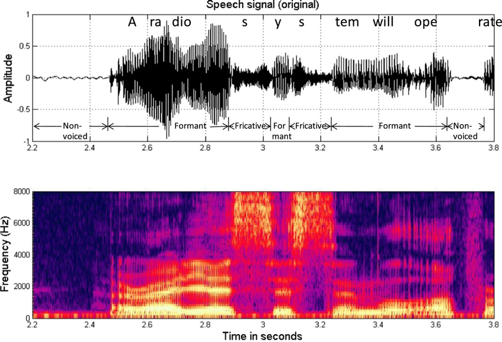

#! https://zhuanlan.zhihu.com/p/512465712
# HRI4. 语言交互（Verbal Interaction）

> 非技术向

## 1. 人与人的对话

语言是一个复杂的事情，比如在不同的情境下，一个词会有不同的意思，比如：“wocao”。人类理解语言的能力是与生俱来且会随着环境发生改变的。因此要想让机器人能够与人类进行正常的对话，并非易事。


###  1.1 言语成分

发声是语音的最小组成单元，字是能够传达意义的最小单元，而音节是组成字的发音的最小元素，改变音节，便会改变字的意义。此外还有对话填充词，比如 ‘啊’。单独出现的时候，他们往往没有太多含义，但是在情境中却能让人理解。

```
A: “我买了个表。”
B: “啊。”
A: “花了我 250 万。”
B：“卧槽！”
```

### 1.2  文字与语音

语言和文字还是有差异的。通常人们在文字中更加注重语法，但是在语音上语法会比较随意。在日常对话中，对话者可以很快的察觉到对方可能没有明白自己的意思，进而快速的更换描述方法。对于机器人而言，在与人的对话中，他们需要先将对方的语音转转变为文字，然后理解文字的意思，想出回答的话术，再将文字转成语音。

## 2. 语音识别

在机器人与人的对话场景中，人与机器人的声音收集系统会有一定距离。因此在 HRI 的实验中，对话的质量往往无法达到最佳。因从，在软件设计时，需要加入噪音过滤，以便加强人声。

### 2.1 语音识别的基础

通常机器人的麦克风收集到的信号是时域的音量，收集的频率为 16,000 HZ 左右。但时域的信号并不方便处理，因此还需要实时的将其转换为频域的信号。



早年语音识别的模型使用的是概率模型，如今大多数都会使用的深度神经网络模型进行处理。深度学习对 NLP 的影响是巨大的，但本文不深入探讨技术，仅讨论社科。

### 2.2 局限性

由于目前的模型都是数据驱动的，但是大多数的数据都是收集的成年人的声音，一些老人或者小孩的声音识别准确率还有待提升。另外对一些发音不标准的外国人来说，语音识别的准确率也不是很高。另外在嘈杂的环境中，一些非对话者的声音可能会被收录，并影响识别的准确率。

### 2.3 理解语言

目前来说，让机器人完全理解人类的语言还是一个挑战。但目前的人机交互中，机器人给人的感觉是，他能够理解我们的话语。但实际上机器人只是将中句子中的单词拆分成语义连词。然后检查这些词语是否包含命令，地点，任务，时间或日期。比如：“提醒我七点钟去接孩子”。在这句话中，句子就会被拆分成，命令：“提醒”，人物：“我”，时间：“七点钟”，事件：“接孩子”。通过程式化的方法，让人类在交互中，误以为机器人能过够理解自己的话术。

## 3. 对话管理

对话，即两者之间一来一话的讲话。机器人在处理对话的时候，需要储存前文的内容，才能正常的与人沟通。

### 3.1 基本原则

在人机交互过程，对话管理往往是被简化的。通常可以分为两个模板，一个是由机器人主导的对话，机器人会程式性的问使用者一些问题，用户则负责回答。另外一种是用户主导的对话，通常是用户提出一些需求，而机器人负责记录，或做出相应的反应。在这样的对话中，机器人只有在没有听清的时候才会发问。最后还有混合型的对话，这样的对话就会比较复杂。

一个简单的对话管理就是由程序员写好一个程序。该程序为一个树状的问题结构，机器人会根据用户当前的回答来选择下一个要问的问题。并一路进行下去。这样的程序符合有限状态机finite-state machines (FSMs),的设计理念。

更加先进的系统则会采用基于事件的对话管理，其允许对话被打扰，从而形成一个非线性的对话结构。比如一个订餐的机器人。该机器人会根据当前对话的状态来与用户进行对话。其状态包含，订餐者的需求，地点。假如订餐者选了披萨，则又会根据披萨的特征询问订餐者具体想要什么的披萨。此过程并不没有一个具体的代码流程，机器人会根据当前的状态，来寻找话术并指引对话到最终状态。比如下面的示例：

```
topic:~introduction ()
language:enu
concept:(greetings) ^rand[hi hello "hey there"]
concept:(wine) [red white] wine
concept:(alcohol) [beer ~wine]
u:(~greetings) ~greetings
u:(do you have _~drink) yes, I have $1
u:(I want to drink something) do you want ~alcohol?
```

An example of the dialogue it produces is as follows:
```
robot: Hey there.
user: Hello.
robot: Do you have white wine?
user: Yes, I have white wine
robot: I want to drink something.
user: Do you want beer?
robot: I want to drink something.
user: Do you want red wine?
```

## 4. 生成语言

之前生成语言的方法有连接型和参数型。连接型就是一个字一个字的发出来，但是在字与字之间使用平滑滤镜，让语音显的比较流畅。参数型则是从文本中产生声学语音参数。但现在基本都是用深度学习来训练AI由文字转变成语音，效果非常好。

- 上篇：[HRI3. 机器人设计](https://zhuanlan.zhihu.com/p/512422142)
- 下篇：