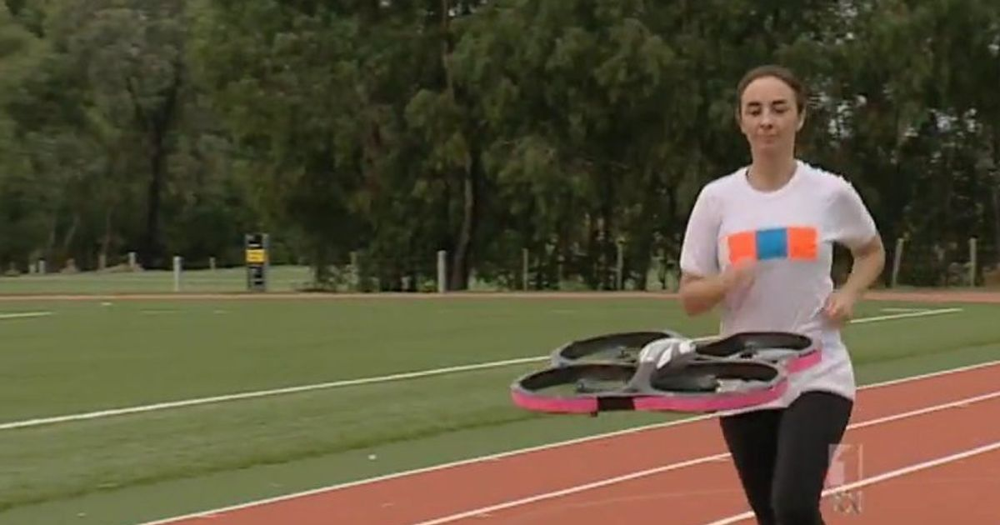
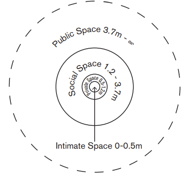
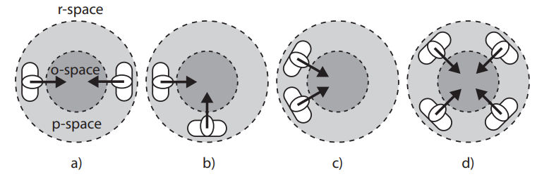
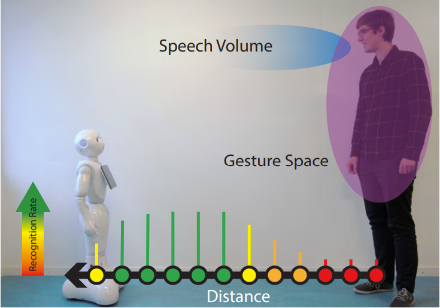

#! https://zhuanlan.zhihu.com/p/512990457
# HRI5. 空间交互(Spatial Interaction)

在 2012 的时候，有一个叫 "jogobot drone" 的无人机，它被用来作为跑步者的陪伴。这是一个典型的空间交互关系 HRI 研究。首先要我们需要知道跑步者希望无人机在他们前面还是后面，或者是并排，于是公司做了HRI实验，最终结果是跑步者更希望无人机可以在自己的视野里，最好是前面，这样的陪伴感会更好。由此出发，jogobot 开始研发机器人在跑步者前方的跟随模型和避障模式。

## 1. 空间在交互中的应用

在公共交通中，如果车上很空，人们往往会避免坐在一个陌生人的旁边，但是在拥挤的公交车上，人们大多还是会选择坐在，或站在陌生人的旁边。但依然会尽可能的避免眼神接触。因此在交互中，人们依然会保持私人空间感。

### 1.1 距离学

人们通常会为社交距离设置四个等级，分别是：小于0.5m 的亲密社交，0.5-1.2m 的私人社交。1.2-3.7m 的普通社交，以及 3.7m 以上的公共社交。不同的社交反应人与人之间关系的密切程度。破坏这种社交距离通常会令人感到不适。

### 1.2 群体社交

在群体社交中，如果社交中的人群围一圈，形成一个封闭的结构，那么其他的人则较难加入到该社交团体中，但如果这一圈人意识到了还有一个人想要加入进来，并且他们也愿意接受，则会打开这个封闭的结构，留出新人的位置，以发出邀请。

因此机器人在这样的群体社交场合中，通常需要知道，在一群人围成一圈交流的时候，即使人与人之间的距离足够让机器人通过，机器人也不应该选择该路径。

## 2. 机器人的空间交互

对于移动机器人来说，定位和建图技术（SLAM）尤为重要。机器人通过相机和 Lidar 等传感来获取地图信息有以及自己位置，被传感器检查到达信息，通常会被当作障碍物进行处理。进而在导航的过程中规划出一条能够避开障碍物的路线。

### 2.1 正确的社交距离

在之前的描述中没有考虑机器人与人的交互。现在我们假设一个场景，一个酒吧的服务机器人，在这个场景中，机器人需要和人进行交互，但这时一个人向机器人走来，机器人应该如何反应呢？

这里我们就应该和之前的距离学相结合，通常我们需要先识别出物体是否是人，假如是一个人的话，我们就需要考虑到和人之间的社交距离。通常机器人与人类的社交距离为普通社交。因此当一个人向机器人走来的时候，机器人会先检测此人与自己的社交距离，如何这个人在普通社交距离停下，则机器人会判断进入社交模式。但如果这个只是路过的，那么机器人也会继续完成自己的导航路径。

### 2.2 启动社交

所有的社交都需要有一个人来启动。正如刚才的例子，一个人走向酒吧机器人，并且停在了机器人的社交距离，这就是由人类开启的社交。如果想要让机器人开启社交，则需要设计一个接近动作，让机器人移动到人类的社交距离，并停留以表示社交意愿。

此外，社交距离在自动驾驶方面也非常重要。在 google 自动驾驶汽车成立的初期，高速测试阶段，自动驾驶汽车往往表现出令人反感的一面，有些时候它会停离前车很近的位置，有些时候又会很粗鲁的超车。为了更安全的和礼貌的驾驶，把社交距离纳入考量是非常重要的。

### 2.3 告知用户机器人的意图

家里有扫地机的同学可能遇到过，自己总是挡住了扫地机的路。假如我们知道机器人的路径，也许就可以主动的避开。在其他机器人上也相同，当一个送餐机器人可以将自己的的意图通知周围的人，比如在机器人被挡住的时候可以说：“不好意思，我需要将食物送给你后面桌子的客人”。这样机器人与人的交互就会很自然。

> “这”，“那” 之类的指代词对机器人来说其实是一件非常困难的事情。

- 上篇：[HRI4. 语言交互(Verbal Interaction)](https://zhuanlan.zhihu.com/p/512465712)