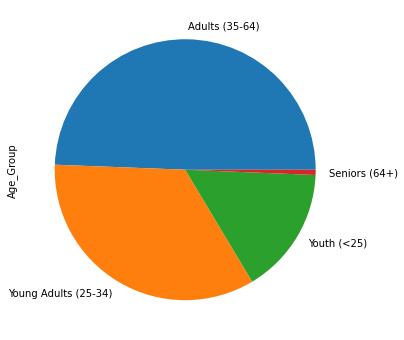

#! https://zhuanlan.zhihu.com/p/485106322
# DS 1. Pandas 数据分析

> 本文是实战导向的教程，使用 python 外加 Numpy, Pandas, Matplotlib, Seaborn, SK-learn 等 python 库。
> - 教程的来源为: [Youtube, FreeCodeCamp | Data Analysis with Python](https://www.youtube.com/watch?v=r-uOLxNrNk8&t=1s&ab_channel=freeCodeCamp.org)
> - 本文中所涉及的代码的 Github 地址为: [FreeCodeCamp-Pandas-Real-Life-Example
](https://github.com/ine-rmotr-curriculum/FreeCodeCamp-Pandas-Real-Life-Example/blob/master/Lecture_1.ipynb)
> - 数据集的地址：[sales_data.csv](https://github.com/Alexbeast-CN/Uob_Robotics/blob/main/Intro2AI/2DS/Lec1/sales_data.csv%20-%20sales_data.csv)
> 

现在我们被要求分析一下一家自动车网店的销售情况。店家给了我们一份 csv 文件，下面我们就要对文件中的数据进行可视化分析了。


## 1. 加载数据

首先导入 numpy, pandas, 和 matplotlib 库。然后使用 `pd.read_csv()` 将 `.csv` 文件导入 python。


```python
import numpy as np
import pandas as pd
import matplotlib.pyplot as plt

%matplotlib inline
```


```python
sales = pd.read_csv(
    './sales_data.csv',
    parse_dates=['Date'])
```


## 2. 查看数据

为了对数据有一个直观的印象，我们使用 `head()` 将数据的前几行进行打印出来：


```python
sales.head()
```

```
| Date | Day        | Month | Year     | Customer_Age | Age_Group | Customer_Gender | Country | State     | Product_Category | Sub_Category | Product    | Order_Quantity      | Unit_Cost | Unit_Price | Profit | Cost | Revenue |
|------|------------|-------|----------|--------------|-----------|-----------------|---------|-----------|------------------|--------------|------------|---------------------|-----------|------------|--------|------|---------|
| 0    | 2013-11-26 | 26    | November | 2013         | 19        | Youth (&lt;25)  | M       | Canada    | British Columbia | Accessories  | Bike Racks | Hitch Rack - 4-Bike | 8         | 45         | 120    | 590  | 360     | 950  |
| 1    | 2015-11-26 | 26    | November | 2015         | 19        | Youth (&lt;25)  | M       | Canada    | British Columbia | Accessories  | Bike Racks | Hitch Rack - 4-Bike | 8         | 45         | 120    | 590  | 360     | 950  |
| 2    | 2014-03-23 | 23    | March    | 2014         | 49        | Adults (35-64)  | M       | Australia | New South Wales  | Accessories  | Bike Racks | Hitch Rack - 4-Bike | 23        | 45         | 120    | 1366 | 1035    | 2401 |
| 3    | 2016-03-23 | 23    | March    | 2016         | 49        | Adults (35-64)  | M       | Australia | New South Wales  | Accessories  | Bike Racks | Hitch Rack - 4-Bike | 20        | 45         | 120    | 1188 | 900     | 2088 |
| 4    | 2014-05-15 | 15    | May      | 2014         | 47        | Adults (35-64)  | F       | Australia | New South Wales  | Accessories  | Bike Racks | Hitch Rack - 4-Bike | 4         | 45         | 120    | 238  | 180     | 418  |
```
> 列数太多摆不下了，只能用代码格式了

我们现在大概了解了数据的情况后，再使用 `shape()` 来查看一下数据集的大小：


```python
sales.shape
```


    (113036, 18)


这个数据集里共有 113036 条数据，每条数据都有 18 个特征值。但只有这个太抽象了，我们还是希望可以查看到数据集的更多信息，于是使用 `info()`：


```python
sales.info()
```

    <class 'pandas.core.frame.DataFrame'>
    RangeIndex: 113036 entries, 0 to 113035
    Data columns (total 18 columns):
     #   Column            Non-Null Count   Dtype         
    ---  ------            --------------   -----         
     0   Date              113036 non-null  datetime64[ns]
     1   Day               113036 non-null  int64         
     2   Month             113036 non-null  object        
     3   Year              113036 non-null  int64         
     4   Customer_Age      113036 non-null  int64         
     5   Age_Group         113036 non-null  object        
     6   Customer_Gender   113036 non-null  object        
     7   Country           113036 non-null  object        
     8   State             113036 non-null  object        
     9   Product_Category  113036 non-null  object        
     10  Sub_Category      113036 non-null  object        
     11  Product           113036 non-null  object        
     12  Order_Quantity    113036 non-null  int64         
     13  Unit_Cost         113036 non-null  int64         
     14  Unit_Price        113036 non-null  int64         
     15  Profit            113036 non-null  int64         
     16  Cost              113036 non-null  int64         
     17  Revenue           113036 non-null  int64         
    dtypes: datetime64[ns](1), int64(9), object(8)
    memory usage: 15.5+ MB
    

如果想要数据性的描述的话，使用 `sales.describe()`


```python
sales.describe()
```

| Day   | Year          | Customer_Age  | Order_Quantity | Unit_Cost     | Unit_Price    | Profit        | Cost          | Revenue       |
|-------|---------------|---------------|----------------|---------------|---------------|---------------|---------------|---------------|
| count | 113036.000000 | 113036.000000 | 113036.000000  | 113036.000000 | 113036.000000 | 113036.000000 | 113036.000000 | 113036.000000 | 113036.000000 |
| mean  | 15.665753     | 2014.401739   | 35.919212      | 11.901660     | 267.296366    | 452.938427    | 285.051665    | 469.318695    | 754.370360    |
| std   | 8.781567      | 1.272510      | 11.021936      | 9.561857      | 549.835483    | 922.071219    | 453.887443    | 884.866118    | 1309.094674   |
| min   | 1.000000      | 2011.000000   | 17.000000      | 1.000000      | 1.000000      | 2.000000      | -30.000000    | 1.000000      | 2.000000      |
| 25%   | 8.000000      | 2013.000000   | 28.000000      | 2.000000      | 2.000000      | 5.000000      | 29.000000     | 28.000000     | 63.000000     |
| 50%   | 16.000000     | 2014.000000   | 35.000000      | 10.000000     | 9.000000      | 24.000000     | 101.000000    | 108.000000    | 223.000000    |
| 75%   | 23.000000     | 2016.000000   | 43.000000      | 20.000000     | 42.000000     | 70.000000     | 358.000000    | 432.000000    | 800.000000    |
| max   | 31.000000     | 2016.000000   | 87.000000      | 32.000000     | 2171.000000   | 3578.000000   | 15096.000000  | 42978.000000  | 58074.000000  |


此外我们也可以获得单独某一列的数据描述，或每一列中的某一个数据特性的描述：


```python
sales['Unit_Cost'].describe()
```


    count    113036.000000
    mean        267.296366
    std         549.835483
    min           1.000000
    25%           2.000000
    50%           9.000000
    75%          42.000000
    max        2171.000000
    Name: Unit_Cost, dtype: float64


```python
sales['Unit_Cost'].median()
```


    9.0


如果想要查看非数字类型的描述的话，就只能回到之前的 `head()` 了。对于 `head` 中的列，我们也又类似于上面数字类型的操作，比如对字符串记数可以使用 `value_counts()`


```python
sales['Age_Group'].value_counts()
```


    Adults (35-64)          55824
    Young Adults (25-34)    38654
    Youth (<25)             17828
    Seniors (64+)             730
    Name: Age_Group, dtype: int64


## 3. 数据可视化

`Panda` 中继承了 `matplotlib` 的很多函数，因此我们可以使用使用 `.plot()` 就可以将数据可视化了，比如下方的箱体图：


```python
sales['Unit_Cost'].plot(kind='box', vert=False, figsize=(14,6))
```


    <AxesSubplot:>


    

    


修改参数 `kind = 'density'` 便可以画出数据的分布图：


```python
ax = sales['Unit_Cost'].plot(kind='density', figsize=(14,6)) # kde
```


    <AxesSubplot:ylabel='Density'>


    

    


并且我们也可以像使用 `matplotlib` 一样在图像中添加其他的内容：


```python
ax = sales['Unit_Cost'].plot(kind='density', figsize=(14,6)) # kde
ax.axvline(sales['Unit_Cost'].mean(), color='red')
ax.axvline(sales['Unit_Cost'].median(), color='green')
```


    <matplotlib.lines.Line2D at 0x2054e56cdc0>


    

    


`DataFrame.plot()` 中的 `kind` 参数共有如下几种类型：
- ‘line’ : 线图（默认）
- ‘bar’ : 垂直条形图
- ‘barh’ : 水平条形图
- ‘hist’ : 直方图
- ‘box’ : 箱形图
- ‘kde’ : 核密度估计图
- ‘density’ : 与 “kde” 相同
- ‘area’ : 面积图
- ‘pie’ : 饼图
- ‘scatter’ : 散点图（仅限 DataFrame）
- ‘hexbin’ : 六角饼图（仅限 DataFrame）


```python
ax = sales['Age_Group'].value_counts().plot(kind='bar', figsize=(14,6))
ax.set_ylabel('Number of Sales')
```


    Text(0, 0.5, 'Number of Sales')


    

    


```python
sales['Age_Group'].value_counts().plot(kind='pie', figsize=(6,6))
```


    <AxesSubplot:ylabel='Age_Group'>


    

    


## 4. 特征间的关系

通常在做数据分析之前，我们也会关系数据之间是否相关，这里使用函数 `corr()` （correlation 的缩写）。


```python
corr = sales.corr()

corr
```
| Day            | Year      | Customer_Age | Order_Quantity | Unit_Cost | Unit_Price | Profit    | Cost      | Revenue   |
|----------------|-----------|--------------|----------------|-----------|------------|-----------|-----------|-----------|
| Day            | 1.000000  | -0.007635    | -0.014296      | -0.002412 | 0.003133   | 0.003207  | 0.004623  | 0.003329  | 0.003853  |
| Year           | -0.007635 | 1.000000     | 0.040994       | 0.123169  | -0.217575  | -0.213673 | -0.181525 | -0.215604 | -0.208673 |
| Customer_Age   | -0.014296 | 0.040994     | 1.000000       | 0.026887  | -0.021374  | -0.020262 | 0.004319  | -0.016013 | -0.009326 |
| Order_Quantity | -0.002412 | 0.123169     | 0.026887       | 1.000000  | -0.515835  | -0.515925 | -0.238863 | -0.340382 | -0.312895 |
| Unit_Cost      | 0.003133  | -0.217575    | -0.021374      | -0.515835 | 1.000000   | 0.997894  | 0.741020  | 0.829869  | 0.817865  |
| Unit_Price     | 0.003207  | -0.213673    | -0.020262      | -0.515925 | 0.997894   | 1.000000  | 0.749870  | 0.826301  | 0.818522  |
| Profit         | 0.004623  | -0.181525    | 0.004319       | -0.238863 | 0.741020   | 0.749870  | 1.000000  | 0.902233  | 0.956572  |
| Cost           | 0.003329  | -0.215604    | -0.016013      | -0.340382 | 0.829869   | 0.826301  | 0.902233  | 1.000000  | 0.988758  |
| Revenue        | 0.003853  | -0.208673    | -0.009326      | -0.312895 | 0.817865   | 0.818522  | 0.956572  | 0.988758  | 1.000000  |


这样看似乎比较复杂，我们可以使用色谱图对其进行可视化：


```python
fig = plt.figure(figsize=(8,8))
plt.matshow(corr, cmap='RdBu', fignum=fig.number)
plt.xticks(range(len(corr.columns)), corr.columns, rotation='vertical');
plt.yticks(range(len(corr.columns)), corr.columns);
```


    

    


这上图中，颜色越蓝则特征之间的关系越大。对角线上是每个特征与本身的关系，因此是非常深的蓝色。

在上图的基础上，如果我们想要查看某两个特征之间的关系的话，还可以使用散点图。如果数据呈现出直线型，这说明这两者之间呈线性关系，如果如下图一样是比较散乱的，则没有太大的关系。


```python
sales.plot(kind='scatter', x='Customer_Age', y='Revenue', figsize=(6,6))
```


    <AxesSubplot:xlabel='Customer_Age', ylabel='Revenue'>


    

    


另外使用箱体图也可以直观的看出数据的之间的关系，比如从下面的年龄段和获利之间的关系中，我们就可以直观的看出不同年龄段的消费水平。


```python
ax = sales[['Profit', 'Age_Group']].boxplot(by='Age_Group', figsize=(10,6))
ax.set_ylabel('Profit')
```


    Text(0, 0.5, 'Profit')


    

    


## 5. 批量操作

**创建新的列**：

在数据量很多的情况下，我们使用 Excel 进行列操作往往会比较卡，但是使用 `pandas` 效果就会好很多：

比如说我们使用下面的公式来创建一个新列：

Calculated_Cost = Order_Quantity * Unit_Cost


```python
sales['Calculated_Cost'] = sales['Order_Quantity'] * sales['Unit_Cost']

sales['Calculated_Cost'].head()
```


    0     360
    1     360
    2    1035
    3     900
    4     180
    Name: Calculated_Cost, dtype: int64


**选择和查找**：

当我们要查找所哟来自 Kentucky 州的订单时，可以直接使用 `loc` 命令：


```python
sales.loc[sales['State'] == 'Kentucky']
```

```
| Date  | Day        | Month | Year     | Customer_Age | Age_Group | Customer_Gender | Country | State         | Product_Category | Sub_Category | Product         | Order_Quantity         | Unit_Cost | Unit_Price | Profit | Cost | Revenue | Revenue_per_Age | Calculated_Cost |
|-------|------------|-------|----------|--------------|-----------|-----------------|---------|---------------|------------------|--------------|-----------------|------------------------|-----------|------------|--------|------|---------|-----------------|-----------------|
| 156   | 2013-11-04 | 4     | November | 2013         | 40        | Adults (35-64)  | M       | United States | Kentucky         | Accessories  | Bike Racks      | Hitch Rack - 4-Bike    | 1         | 45         | 120    | 63   | 45      | 108             | 2.700           | 45  |
| 157   | 2015-11-04 | 4     | November | 2015         | 40        | Adults (35-64)  | M       | United States | Kentucky         | Accessories  | Bike Racks      | Hitch Rack - 4-Bike    | 1         | 45         | 120    | 63   | 45      | 108             | 2.700           | 45  |
| 23826 | 2014-04-16 | 16    | April    | 2014         | 40        | Adults (35-64)  | M       | United States | Kentucky         | Accessories  | Fenders         | Fender Set - Mountain  | 12        | 8          | 22     | 142  | 96      | 238             | 5.950           | 96  |
| 23827 | 2016-04-16 | 16    | April    | 2016         | 40        | Adults (35-64)  | M       | United States | Kentucky         | Accessories  | Fenders         | Fender Set - Mountain  | 14        | 8          | 22     | 165  | 112     | 277             | 6.925           | 112 |
| 31446 | 2014-04-16 | 16    | April    | 2014         | 40        | Adults (35-64)  | M       | United States | Kentucky         | Accessories  | Helmets         | Sport-100 Helmet, Blue | 29        | 13         | 35     | 537  | 377     | 914             | 22.850          | 377 |
| 31447 | 2016-04-16 | 16    | April    | 2016         | 40        | Adults (35-64)  | M       | United States | Kentucky         | Accessories  | Helmets         | Sport-100 Helmet, Blue | 31        | 13         | 35     | 574  | 403     | 977             | 24.425          | 403 |
| 79670 | 2014-04-16 | 16    | April    | 2014         | 40        | Adults (35-64)  | M       | United States | Kentucky         | Accessories  | Tires and Tubes | ML Mountain Tire       | 2         | 11         | 30     | 32   | 22      | 54              | 1.350           | 22  |
| 79671 | 2014-04-16 | 16    | April    | 2014         | 40        | Adults (35-64)  | M       | United States | Kentucky         | Accessories  | Tires and Tubes | ML Mountain Tire       | 21        | 11         | 30     | 336  | 231     | 567             | 14.175          | 231 |
| 79672 | 2016-04-16 | 16    | April    | 2016         | 40        | Adults (35-64)  | M       | United States | Kentucky         | Accessories  | Tires and Tubes | ML Mountain Tire       | 1         | 11         | 30     | 16   | 11      | 27              | 0.675           | 11  |
| 79673 | 2016-04-16 | 16    | April    | 2016         | 40        | Adults (35-64)  | M       | United States | Kentucky         | Accessories  | Tires and Tubes | ML Mountain Tire       | 18        | 11         | 30     | 288  | 198     | 486             | 12.150          | 198 |
```


**获取成人 (35-64) 销售组的平均收入**：


```python
sales.loc[sales['Age_Group'] == 'Adults (35-64)', 'Revenue'].mean()
```


    762.8287654055604


**有多少记录属于年龄组青年 (<25) 或成人 (35-64)？**


```python
sales.loc[(sales['Age_Group'] == 'Youth (<25)') | (sales['Age_Group'] == 'Adults (35-64)')].shape[0]
```


    73652


**获取美国销售组 Adults (35-64) 的平均收入**


```python
sales.loc[(sales['Age_Group'] == 'Adults (35-64)') & (sales['Country'] == 'United States'), 'Revenue'].mean()
```


    726.7260473588342


- 下篇：[DS2. Kaggle 入门 (Titanic Project Example)](https://zhuanlan.zhihu.com/p/485780305)
