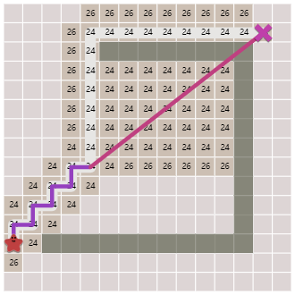

#! https://zhuanlan.zhihu.com/p/469512859
# AI 3. A* 搜索 (A* Search)

> 参考：
> - 一个非常直观的算法讲解视频：[A* (A Star) Search Algorithm - Computerphile](https://www.youtube.com/watch?v=ySN5Wnu88nE&t=735s&ab_channel=Computerphile)
> - Stanford cs221：[Lecture 6: Search 2 - A* | Stanford CS221: AI (Autumn 2019)](https://www.youtube.com/watch?v=HEs1ZCvLH2s&list=PLoROMvodv4rO1NB9TD4iUZ3qghGEGtqNX&index=6&ab_channel=stanfordonline)
> - GeeksforGeeks 博客：[A* Search Algorithm](https://www.geeksforgeeks.org/a-search-algorithm/)
> - Amitp 大佬的博客：[Amit’s A* Pages](http://theory.stanford.edu/~amitp/GameProgramming/)

## 1. 简介

A* 搜索算法通常用于寻路，比如在游戏中，寻找一条可以令对象从起点到达目标点的好路径 -- 避开障碍物，避开敌人，并最大限度地降低成本（燃料、时间、距离、设备、金钱等）。比如下图所示的从红心 $*$ 出移动到 X 的路径：


这是一个便于人类理解的二维地图，但对于计算机来说，该地图是由一组节点 (Nodes) 和 连接节点的边 (Edges) 组成的。下面的演示图只是地图表现方式的其中一种，更多的表现方式可以查看 [Amitp的地图表示博客](http://theory.stanford.edu/~amitp/GameProgramming/MapRepresentations.html)


对于上面的地图来说，我们将节点 i 用 $S_i$ 表示，开始节点为 $S_0$，终点为 $S_{e}$。节点 i 到下一个节点 j 的消耗 (Cost) 用 $C_ij$ 来表示（一个节点可能会连接多个不同的节点）。对于一个寻路算法来说，最直观的就是从 $S_0$每到一个节点都将该节点的所有连接点都探索清楚，直到找到 $S_{e}$。然后再比较每一个能到达终点的路径总消耗，从而找到总消耗最小的那条路径。这就是 Dijkstra's 算法的思路。但很明显，该算法的时间复杂度非常高。（因为需要探索的地图范围很大）


如果我们可以每一步都向着一个大致的正确方向迈进，这样我们的时间复杂度就会大大减小。而如何做到这一点，就是 A* 算法需要探究的事情。

> 为了更直观的理解各种不同搜索算法的区别可以查看 [Amitp 制作的动画效果演示](https://www.redblobgames.com/pathfinding/a-star/introduction.html)

## 2. 算法讲解

### 2.1 代价计算 (Cost calculation)

为了使得算法每一步都朝着正确的方向迈进，我们需要为一个节点设置两个代价，一个是从之前的节点，一路走来的代价，我们称其为 $PastCost(s)$。另一个为未来代价，是从该点到目标点可能需要的代价，$FutureCost(s)$。


但我们无法准确的得到未来代价，所以用启发式 $h(s)$ 表示，对该点未来代价的预测。

所以，对于每一个节点来说，都有一个综合代价值 $Cost(s)$，该值为该点的过去代价值与未来预测代价之和：

$$
Cost(s) = PastCost(s) + h(s)
$$

### 2.2 启发值

根据启发式(heuristic) 的算法，我们可以对每一个节点都设置一个启发值 $h(s)$，该启发值为该点离终点的预测距离 （依照实际问题选择距离的类型，$L_1, L_2$）。

以 $L_2$ 距离为例，假设节点 a 的坐标为 $(x_a, y_a)$，终点 e 的坐标为 $(x_{e}, y_{e})$。那么该点的启发值为：$\sqrt{(x_{e}-x_a)^2 + (y_{e}-y_a}^2)$。

终点的启发值 $h(s_{e}) = 0$。

一个启发式必须满足：

$$0 \leq h(s) \leq FutureCost(s)$$


因为只有这样，算法才会向着正确的方向前进，从而获得最优的解。

### 2.3 算法过程

使用 A* 的时候，算法会从起点开始，计算其能够到达的下一个点的综合代价，并且不断的向综合代价小的节点的子节点方向探索。





## 3. 代码实现

> - 完整的 python 代码：[implementation.py](https://www.redblobgames.com/pathfinding/a-star/implementation.py)
> - 完整的 c++ 代码：[implementation.cpp](https://www.redblobgames.com/pathfinding/a-star/implementation.cpp)
> - 如果想玩一些 demo 可以查看这个 [Javascript仓库和演示](https://github.com/anvaka/ngraph.path)

下面我主要讲解用 python 实现的 A*

### 3.1 创建地图


```python
from __future__ import annotations
# some of these types are deprecated: https://www.python.org/dev/peps/pep-0585/
from typing import Protocol, Dict, List, Iterator, Tuple, TypeVar, Optional
T = TypeVar('T')
```

地图实际上就是一个位置类型以及一个具有获取相邻位置的方法的类

#### 3.1.1 一个简单地图


```python
Location = TypeVar('Location')
class Graph(Protocol):
    def neighbors(self, id: Location) -> List[Location]: pass
```


```python
class SimpleGraph:
    def __init__(self):
        self.edges: Dict[Location, List[Location]] = {}
    
    def neighbors(self, id: Location) -> List[Location]:
        return self.edges[id]
```

现在我们可以利用上面的数据类型来创建一个如下所示的简单地图：


```python
example_graph = SimpleGraph()
example_graph.edges = {
    'A': ['B'],
    'B': ['C'],
    'C': ['B', 'D', 'F'],
    'D': ['C', 'E'],
    'E': ['F'],
    'F': [],
}

print('From Location C, we can go to: ', example_graph.neighbors('C'))
```

    From Location C, we can go to:  ['B', 'D', 'F']
    

#### 3.1.2 格子地图

除了上面的这种地图外，我们也会经常见到格子地图。

> 为了简化文章，一些函数没有直接表示，但会从 [implementation.py](https://www.redblobgames.com/pathfinding/a-star/implementation.py) 文件中直接调用

在格子地图，一般来说，一个点的东南西北四个点都是可以到达的邻居。但有一些例外需要被剔除，一些超出点图边界的点，比如 (-1,0)，和地图中的障碍物。然后将其他可以通行的点，储存为该点的 Edges。


```python
GridLocation = Tuple[int, int]

class SquareGrid:
    def __init__(self, width: int, height: int):
        self.width = width
        self.height = height
        self.walls: List[GridLocation] = []
    
    def in_bounds(self, id: GridLocation) -> bool:
        (x, y) = id
        return 0 <= x < self.width and 0 <= y < self.height
    
    def passable(self, id: GridLocation) -> bool:
        return id not in self.walls
    
    def neighbors(self, id: GridLocation) -> Iterator[GridLocation]:
        (x, y) = id
        neighbors = [(x+1, y), (x-1, y), (x, y-1), (x, y+1)] # E W N S
        # see "Ugly paths" section for an explanation:
        if (x + y) % 2 == 0: neighbors.reverse() # S N W E
        results = filter(self.in_bounds, neighbors)
        results = filter(self.passable, results)
        return results
```

下面我们来随便画一个地图：


```python
from implementation import *
g = SquareGrid(30, 15)
g.walls = DIAGRAM1_WALLS # long list, [(21, 0), (21, 2), ...]
draw_grid(g)
```

    __________________________________________________________________________________________
     .  .  .  .  .  .  .  .  .  .  .  .  .  .  .  .  .  .  .  .  . ###### .  .  .  .  .  .  . 
     .  .  .  .  .  .  .  .  .  .  .  .  .  .  .  .  .  .  .  .  . ###### .  .  .  .  .  .  . 
     .  .  .  .  .  .  .  .  .  .  .  .  .  .  .  .  .  .  .  .  . ###### .  .  .  .  .  .  . 
     .  .  . ###### .  .  .  .  .  .  .  .  .  .  .  .  .  .  .  . ###### .  .  .  .  .  .  . 
     .  .  . ###### .  .  .  .  .  .  .  . ###### .  .  .  .  .  . ###### .  .  .  .  .  .  . 
     .  .  . ###### .  .  .  .  .  .  .  . ###### .  .  .  .  .  . ############### .  .  .  . 
     .  .  . ###### .  .  .  .  .  .  .  . ###### .  .  .  .  .  . ############### .  .  .  . 
     .  .  . ###### .  .  .  .  .  .  .  . ###### .  .  .  .  .  .  .  .  .  .  .  .  .  .  . 
     .  .  . ###### .  .  .  .  .  .  .  . ###### .  .  .  .  .  .  .  .  .  .  .  .  .  .  . 
     .  .  . ###### .  .  .  .  .  .  .  . ###### .  .  .  .  .  .  .  .  .  .  .  .  .  .  . 
     .  .  . ###### .  .  .  .  .  .  .  . ###### .  .  .  .  .  .  .  .  .  .  .  .  .  .  . 
     .  .  . ###### .  .  .  .  .  .  .  . ###### .  .  .  .  .  .  .  .  .  .  .  .  .  .  . 
     .  .  .  .  .  .  .  .  .  .  .  .  . ###### .  .  .  .  .  .  .  .  .  .  .  .  .  .  . 
     .  .  .  .  .  .  .  .  .  .  .  .  . ###### .  .  .  .  .  .  .  .  .  .  .  .  .  .  . 
     .  .  .  .  .  .  .  .  .  .  .  .  . ###### .  .  .  .  .  .  .  .  .  .  .  .  .  .  . 
    ~~~~~~~~~~~~~~~~~~~~~~~~~~~~~~~~~~~~~~~~~~~~~~~~~~~~~~~~~~~~~~~~~~~~~~~~~~~~~~~~~~~~~~~~~~
    

#### 3.1.3 代价地图

常规的地图高速我每一个节点的 Edges 有哪些，而代价地图告诉我沿着每一条边移动的成本。因此，我们需要写一个函数，用于记录从一个节点到另一个节点的 Cost。


```python
class GridWithWeights(SquareGrid):
    def __init__(self, width: int, height: int):
        super().__init__(width, height)
        self.weights: Dict[GridLocation, float] = {}
    
    def cost(self, from_node: GridLocation, to_node: GridLocation) -> float:
        return self.weights.get(to_node, 1)
```

这里我们将代价简化了，使其只取决于 `to_node` 的权重。进而我们利用该上面的函数画一个简单的地图：


```python
diagram4 = GridWithWeights(10, 10)
diagram4.walls = [(1, 7), (1, 8), (2, 7), (2, 8), (3, 7), (3, 8)]
diagram4.weights = {loc: 5 for loc in [(3, 4), (3, 5), (4, 1), (4, 2),
                                       (4, 3), (4, 4), (4, 5), (4, 6),
                                       (4, 7), (4, 8), (5, 1), (5, 2),
                                       (5, 3), (5, 4), (5, 5), (5, 6),
                                       (5, 7), (5, 8), (6, 2), (6, 3),
                                       (6, 4), (6, 5), (6, 6), (6, 7),
                                       (7, 3), (7, 4), (7, 5)]}
                                    
draw_grid(diagram4, number = diagram4.weights)
```

    ______________________________
     .  .  .  .  .  .  .  .  .  . 
     .  .  .  .  5  5  .  .  .  . 
     .  .  .  .  5  5  5  .  .  . 
     .  .  .  .  5  5  5  5  .  . 
     .  .  .  5  5  5  5  5  .  . 
     .  .  .  5  5  5  5  5  .  . 
     .  .  .  .  5  5  5  .  .  . 
     . ######### 5  5  5  .  .  . 
     . ######### 5  5  .  .  .  . 
     .  .  .  .  .  .  .  .  .  . 
    ~~~~~~~~~~~~~~~~~~~~~~~~~~~~~~
    

### 3.2 A* 搜索

我们首先定义启发式的计算方式。由于目标在此格子地图中只能上下左右的移动，所以这里的启发式我们使用曼哈顿距离：

$$
L_1 = |x_1 - x_2| + |y_1 - y_2|
$$


```python
def heuristic(a: GridLocation, b: GridLocation) -> float:
    (x1, y1) = a
    (x2, y2) = b
    return abs(x1 - x2) + abs(y1 - y2)
```

对于搜索算法来说，我们主要使用的是一个有优先级的数列。将目前探索到的最接近终点（代价最小）的节点储存在优先队列的顶端。而后，我们每一次都将从队列顶端获取一个节点，并探索其 neighbors，直到队列顶端的节点为终点。


```python
def a_star_search(graph: WeightedGraph, start: Location, goal: Location):
    frontier = PriorityQueue()
    frontier.put(start, 0)
    came_from: Dict[Location, Optional[Location]] = {}
    cost_so_far: Dict[Location, float] = {}
    came_from[start] = None
    cost_so_far[start] = 0
    
    while not frontier.empty():
        current: Location = frontier.get()
        
        if current == goal:
            break
        
        for next in graph.neighbors(current):
            new_cost = cost_so_far[current] + graph.cost(current, next)
            # Avoid returning to the previous nodes 
            if next not in cost_so_far \
                or new_cost < cost_so_far[next]:

                # update the cost_so_far and came_from
                cost_so_far[next] = new_cost
                priority = new_cost + heuristic(next, goal)
                frontier.put(next, priority)
                came_from[next] = current
    
    return came_from, cost_so_far
```

下面我们快速验证一个 A* 算法：


```python
start, goal = (1, 4), (8, 3)
came_from, cost_so_far = a_star_search(diagram4, start, goal)
draw_grid(
    diagram4, 
    path=reconstruct_path(came_from, start=start, goal=goal),
    number = diagram4.weights
    )
print()
draw_grid(diagram4, number=cost_so_far, start=start, goal=goal)

```

    ______________________________
     .  .  .  @  @  @  @  .  .  . 
     .  .  .  @  5  5  @  @  .  . 
     .  .  .  @  5  5  5  @  @  . 
     .  @  @  @  5  5  5  5  @  . 
     .  @  .  5  5  5  5  5  .  . 
     .  .  .  5  5  5  5  5  .  . 
     .  .  .  .  5  5  5  .  .  . 
     . ######### 5  5  5  .  .  . 
     . ######### 5  5  .  .  .  . 
     .  .  .  .  .  .  .  .  .  . 
    ~~~~~~~~~~~~~~~~~~~~~~~~~~~~~~
    
    ______________________________
     5  4  5  6  7  8  9  10 11 12
     4  3  4  5  10 13 10 11 12 13
     3  2  3  4  9  14 15 12 13 14
     2  1  2  3  8  13 .  17 Z  . 
     1  A  1  6  11 .  .  .  .  . 
     2  1  2  7  12 .  .  .  .  . 
     3  2  3  4  9  .  .  .  .  . 
     4 ######### .  .  .  .  .  . 
     . ######### .  .  .  .  .  . 
     .  .  .  .  .  .  .  .  .  . 
    ~~~~~~~~~~~~~~~~~~~~~~~~~~~~~~
    

- 上篇：[AI 2. 搜索算法 (Search Algorithm)](https://zhuanlan.zhihu.com/p/467959715)
- 下篇：[]()
