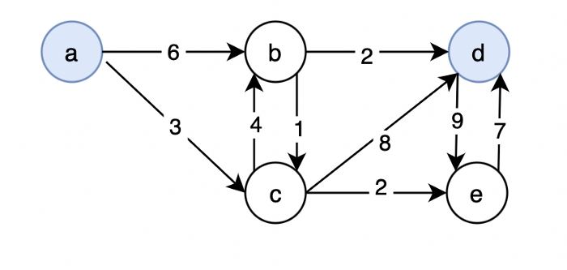
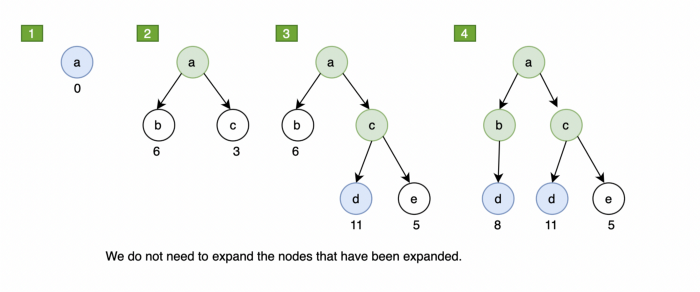

#! https://zhuanlan.zhihu.com/p/467959715
# AI 2. 搜索算法 (Search Algorithm)

> 参考：
> 
> - [Stanford Intro to AI Lec5](https://www.youtube.com/watch?v=aIsgJJYrlXk&list=PLoROMvodv4rO1NB9TD4iUZ3qghGEGtqNX&index=5&ab_channel=stanfordonline)


我们之前讲过的模型大多是基于反射的模型(reflex-based models)。在这种模型中，我们只需要找到一个符合问题描述的最佳答案即可。而在搜索问题中，我们需要一系列有顺序的答案。对于这样的问题，我们使用的模型叫做基于状态的模型 (state-based
model)。

下面举一个小学奥数题的例子：现在有农夫，白菜，山羊，和狼。他们要过河。河面上只有一条船，船只能载一个人和一个物品。但如果狼和羊在一起，而农夫不在，羊就会被狼吃掉。如果羊和白菜在一起，而农夫不在，白菜就会被羊吃掉。问，要让他们四个都安全过河，至少需要开船几次？


## 1. 树状搜索 (Tree search)

### 1.1 引例分析

为了解答上面的问题，我们可以使用一个叫做树状搜索的方法。首先我们列出农夫可以做的所有动作：

- 农夫自己过河
- 农夫自己从对岸回来
- 农夫和白菜一起过河
- 农夫和白菜一起从对岸回来
- 农夫和羊一起过河
- 农夫和羊一起从对岸回来
- 农夫和狼一起过河
- 农夫和狼一起从对岸回来

为了简化表达，用他们的首字母来代替以上的这些动作：


下面，我们对于该问题可能出现的所有状态进行树状搜索。初始状态是所有人和物都在河的左岸，我们用 `FCGW||` 来表示。我们希望达到的最终情况是 `||FCGW`。下面我们列出从初始情况开始，在上面列出的动作作用下，所有可能出现的情况。其中失败（羊和狼在一起，或羊和白菜在一起）的情况，会用红色标注出来。成功的情况 会用绿色标出来。


为了完成该问题，我们可以定义一些内容：
- $S_{start}$：初始状态
- $Actions(s)$：基于当前状态 $s$ 可以做的动作
- $Cost(s,a)$：状态 $s$ 下动作 $a$ 的代价
- $Succ(s,a)$: 状态 $s$ 下动作 $a$ 导致的下一个状态
- $IsFail(s)$: 判断该状态是否是失败的
- $IsEnd(s)$: 达到了最终状态

为了让我们找到最佳结果，我们使用回溯搜索法 (Backtracking search)。该方法就是让程序将所有可能的结果全部找出来，然后返回代价最小的那个结果。

### 1.2 代码实现

由于该问题的次数比较少，人类可以很轻松的解答出来，所以就不编程了。下面写一个次数多一些的例子：

我们要从 $1$ 号街区 到 $n$ 号街区。可以采取的行动有两种，一个是 `走路` 产生的效果是当前状态 $s+1$，代价是 `1`。另外一种是 `搭电车` 产生的效果是：当前状态 $s \times 2$，代价是 `2`。问从从 $1$ 到 $n$的最少次数。

下面开始设计程序：


```python
import sys
# Since the program will continue to recurse, 
# in order to prevent the number of program recursion from exceeding 
# the upper limit set by the system, 
# a relatively high upper limit is firstly set here.
sys.setrecursionlimit(10000)
```

下面开始为树状搜索模型构建元素。由于问题比较简单，所以之前所说的一些定义合并，只留下面的一些定义：
- $S_{start}$：初始状态
- $IsEnd(s)$: 达到了最终状态
- $succAndCost(s,a)$：这里记载了由当前状态通过某动作到达一下的状态。并记录该动作的消耗。


```python
### Model (search problem)

class TransportationProblem(object):
    def __init__(self, N, weights):
        # N = number of blocks
        # weights = specifies the costs of actions
        self.N = N
        self.weights = weights
    def startState(self):
        return 1
    def isEnd(self, state):
        return state == self.N
    def succAndCost(self, state):
        # Returns list of (action, newState, cost) triples
        result = []
        if state + 1 <= self.N:
            result.append(('walk', state + 1, self.weights['walk']))
        if 2 * state <= self.N:
            result.append(('tram', 2 * state, self.weights['tram']))
        return result
```

> 由于每更新一个状态，都会面临两个选择。 "Walk" or "Tram"，而这两个选择的限制是不可以超过 $N$，所以这里的 $succAndCost$ 是这样写的

我们用递归的方式实现回溯搜索：

算法思路如下：


```python
def backtrackingSearch(problem):
    # Best solution found so far 
    # (dictionary because of python scoping technicality)
    best = {
        'cost': float('inf'),
        'history': None
        }
    def recurese(state, history, totalCost):
        # At state, having undergone history, accmulated totalCost.
        # Explore the rest of the search space.
        if problem.isEnd(state):
            # update the best solution so far.
            if totalCost < best['cost']:
                best['cost'] = totalCost
                best['history'] = history
            return
        # Recurse on chidren
        for action, newState, cost in problem.succAndCost(state):
            recurese(newState, history + [(action, newState, cost)], totalCost + cost)
    recurese(problem.startState(), history = [], totalCost = 0)
    return (best['cost'], best['history'])
```

写一个打印结果的函数


```python
def printSolution(solution):
    totalCost, history = solution
    print(('totalCost:', totalCost))
    for item in history:
        print(item)
```

下面写一个主函数，来测试一下：


```python
problem = TransportationProblem(N = 300, weights = {'walk': 1, 'tram': 2})
solution = backtrackingSearch(problem)
printSolution(solution)
```

    ('totalCost:', 18)
    ('walk', 2, 1)
    ('walk', 3, 1)
    ('walk', 4, 1)
    ('tram', 8, 2)
    ('walk', 9, 1)
    ('tram', 18, 2)
    ('tram', 36, 2)
    ('walk', 37, 1)
    ('tram', 74, 2)
    ('walk', 75, 1)
    ('tram', 150, 2)
    ('tram', 300, 2)
    

> Time cost: 1m19.3s

简单分析一下该算法。我们通过回溯，所有可能的路径都探索出来，然后比较他们的代价。假如树的广度是 $b$，深度是 $D$。那么它的空间复杂度就是 $O(D)$，时间复杂度为 $O(b^D)$。

除了回溯搜索外，还有深度优先和广度优先的算法。这里贴出算法之间的比较但不做拓展：


> 拓展视频：
> - MIT 6.006 Introduction to Algorithms [13. Breadth-First Search (BFS)](https://www.youtube.com/watch?v=s-CYnVz-uh4&ab_channel=MITOpenCourseWare)
> - MIT 6.006 Introduction to Algorithms [14. Depth-First Search (DFS), Topological Sort](https://www.youtube.com/watch?v=AfSk24UTFS8&ab_channel=MITOpenCourseWare)

## 2. 动态编程 (Dynamic Programming)

为了降低计算的复杂度。我们使用另外一个方法，叫做动态编程法。

我们依然以上面的例子来说明。


对于之前的例子来说，我们将树的所有枝干都探索出来。这其中有着很多重复的节点，从这些相同的节点出发，生出来的枝干也是相同的，从这个优化观点出发，我们引出了动态编程。对于动态编程来说，我们只关注当前的状态 $s$，以及从当前状态可以达到的一下个状态$s'$，和此过程的代价 $cost(s,a)$。我们不需要关注当前状态 $s$ 是怎么来的。


其中 $FutureCost(s)$ 是一个递归函数，其算法为：

$$
FutrueCost(s)=
\left\{
    \begin{array}{lr}
    0 & if IsEnd(S)\\
    min_{a\in Action(s)}[Cost(s,a)]+FutureCost(Succ(s,a))&Otherwise
    \end{array}
\right.
$$

其算法的伪代码可以写作：


下面，我们使用该算法对上面的问题进行编程：


```python
def dynamicProgramming(problem):
    cache = {}  # state => futureCost(state), action, newState, cost
    def futureCost(state):
        # Base case
        if problem.isEnd(state):
            return 0
        if state in cache:  # Exponential savings!
            return cache[state][0]
        # Actually do work
        result = min((cost + futureCost(newState), action, newState, cost) \
            for action, newState, cost in problem.succAndCost(state))
        cache[state] = result
        return result[0]

    state = problem.startState()
    totalCost = futureCost(state)

    # Recover history
    history = []
    while not problem.isEnd(state):
        _, action, newState, cost = cache[state]
        history.append((action, newState, cost))
        state = newState

    return (totalCost, history)
```


```python
solution = dynamicProgramming(problem)
printSolution(solution)
```

    ('totalCost:', 18)
    ('walk', 2, 1)
    ('tram', 4, 2)
    ('tram', 8, 2)
    ('walk', 9, 1)
    ('tram', 18, 2)
    ('tram', 36, 2)
    ('walk', 37, 1)
    ('tram', 74, 2)
    ('walk', 75, 1)
    ('tram', 150, 2)
    ('tram', 300, 2)
    

> Time cost: 0.4s

做一个总结：

- 状态：是对过去行动的总结，且足以最优地选择未来行动。(Summary of past actions sufficient to choose future actions optimally)
- 动态编程：带有记忆的回溯搜索 (backtracking search with memoization)

## 3. 统一成本搜索 (Uniform cost search)

我们用例子来说明一下该算法。

假设我们需要再下面这张地图中从 $a$ 走到 $d$。



在出发之前，我们先准备一个列表用于存放我们已经走过的地方(explored)，这些被走过的地方不会再被经过。 并且我们每到一个地方就会记录这一路过来的代价 $cost$。从 $a$ 出发，所以抵达该点没有任何代价 $cost = 0$。当$a$ 能达到的下一个点都被列出后，$a$ 就可以被放入 `explored list` 中了。 假如我们同时有多个出发点，比如 $b$ 和 $c$ 都可以出发，则选择先从当前总代价小的那个点开始探索。

- $a$ 点可以到达的地方有两个， $b,  totalcost = 6$ 和 $c,  totalcost = 3$。 explored: $a$
- $c$ 可以到达： $b,  totalcost = 11$ 和 $c,  totalcost = 5$。explored: $a, \,d$
- $e$ 可以到达： $d,  totalcost = 12$。explored: $a, \,d, \,e$
- $b$ 可以到达：$d,  totalcost = 8$。explored: $a, \,d, \,e, \,b$



由此可以选出最佳路径为 $a\rightarrow b \rightarrow d, totalcost = 8$

- 上篇：[AI 1. K-means](https://zhuanlan.zhihu.com/p/466029135)
- 下篇：[AI 3. A* 搜索 (A* Search)](https://zhuanlan.zhihu.com/p/469363011)