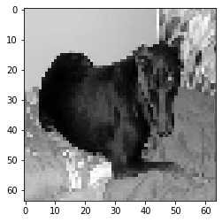
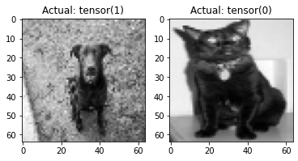

#! https://zhuanlan.zhihu.com/p/463301002
# Pytorch 5. 卷积神经网络(Convolutional Neural Networks)


关于卷积神经网络这里就不多介绍，直接步入正题。使用CNN对猫狗进行分类。

## 1. 获取数据

这里外面使用的数据来自 [Cat vs Dog Dataset](https://www.kaggle.com/c/dogs-vs-cats) 该数据集由一堆猫和狗的图像组成。不同的品种、年龄、大小（动物和图像）等。

下载数据集后，您需要提取它。我只是将它解压缩到您正在使用的目录中。

## 2. 准备数据集

这里我们要将刚才下载好的图片数据做成带有标签的数据集。


```python
import os
import cv2
import numpy as np
from tqdm import tqdm

# If we don't wanna reload the data every time we run the code,
# we can set REBUILD_DATA to False.
REBUILD_DATA = True
```

接下来我们要为数据集创建一个类。

我们下载的数据提取后，将获得 2 个目录。一个是猫，另一个是狗。类中设置的一些变量，包含了数据目录的位置。我们要遍历这两个目录，抓取图像，调整大小，缩放，将类转换为数字（cats = 0，dogs = 1），并将它们添加到我们的 `training_data` 中。

我们的模型需要大小和形状统一的图片。因此，我们将把图片统一为 $64 \times 64$。


```python
class DogsVSCats():
    IMG_SIZE = 64
    CATS = "PetImages/Cat"
    DOGS = "PetImages/Dog"
    TESTING = "PetImages/Testing"
    LABELS = {CATS: 0, DOGS: 1}
    training_data = []
    catcount = 0
    dogcount = 0

    def make_training_data(self):
        for label in self.LABELS:
            print(label)
            for f in tqdm(os.listdir(label)):
                if "jpg" in f:
                    # becasue some images are not good, we need to give a try.
                    try:
                        path = os.path.join(label, f)
                        # read the image from the path and convert it to grayscale.
                        img = cv2.imread(path, cv2.IMREAD_GRAYSCALE)
                        img = cv2.resize(img, (self.IMG_SIZE, self.IMG_SIZE))
                        self.training_data.append([np.array(img), np.eye(2)[self.LABELS[label]]])

                        if label == self.CATS:
                            self.catcount += 1
                        elif label == self.DOGS:
                            self.dogcount += 1  

                    except Exception as e:
                        pass
                        # Because I already know what's the error,
                        # I can just pass the error.
                        # print(label, f, str(e))

        # shuffle the data to avoid the bias.
        np.random.shuffle(self.training_data)
        np.save("training_data.npy", self.training_data)
        print("Cats: ", self.catcount)
        print("Dogs:", self.dogcount)

if REBUILD_DATA:
    dogsvcats = DogsVSCats()
    dogsvcats.make_training_data()
```

    PetImages/Cat
    

    100%|██████████| 12501/12501 [00:10<00:00, 1227.95it/s]
    

    PetImages/Dog
    

    100%|██████████| 12501/12501 [00:10<00:00, 1160.74it/s]
    C:\Users\Daoming Chen\AppData\Roaming\Python\Python39\site-packages\numpy\lib\npyio.py:528: VisibleDeprecationWarning: Creating an ndarray from ragged nested sequences (which is a list-or-tuple of lists-or-tuples-or ndarrays with different lengths or shapes) is deprecated. If you meant to do this, you must specify 'dtype=object' when creating the ndarray.
      arr = np.asanyarray(arr)
    

    Cats:  12476
    Dogs: 12470
    

构建数据一次后，我们会得到一个  `training_data.npy` 文件。这就是我们自己创建的数据库文件，要加载数据，只需要用下面的代码。同时我们可以查看一下数据库的大小，共有 `24946` 张图片。


```python
training_data = np.load("training_data.npy", allow_pickle=True)
print(len(training_data))
```

    24946
    

下面我们大致的看一下数据库里的东西是什么样的。`training_data` 的最外层用于记录数据的数量，再往里第一列为图片，第二列为标签。


```python
# the first element of the list is the image, the second is the label.
print(training_data[0])
```

    [array([[156,  54, 165, ..., 175,  38, 180],
            [ 49,  97,  69, ..., 179, 129, 157],
            [ 51,  77,  49, ..., 225, 180, 164],
            ...,
            [105,  88,  72, ..., 104,  71,  68],
            [145, 108,  51, ...,  86, 158,  86],
            [ 62, 178,  25, ..., 121, 145,  58]], dtype=uint8) array([0., 1.])]
    


```python
import matplotlib.pyplot as plt
# we can see what the image looks like.
plt.imshow(training_data[1][0], cmap="gray")
plt.show()
```


    

    


```python
# and the label is: array([1., 0.])
training_data[1][1]
```


    array([0., 1.])


下面我们来构建一个卷积神经网络(CNN)，这里我们创建的神经网络比较简单，是一个类似 `VGG16` 的结构，但是层数比 `VGG16` 要少很多。


这里我们创建了三个卷积层，每个卷积层都用 `nn.Sequential()` 函数串联了三种函数：

1. 二维卷积核 `nn.Conv2d`，关于该函数的用法可以查看[官方文档](https://pytorch.org/docs/stable/generated/torch.nn.Conv2d.html)。简单来说，包含了以下参数：

- in_channels ( int ) – 输入图像中的通道数
- out_channels ( int ) – 卷积产生的通道数
- kernel_size ( int or tuple ) – 卷积核的大小
- stride ( int or tuple , optional ) -- 卷积的步幅。默认值：1
- padding ( int , tuple或str , optional ) – 添加到输入的所有四个边的填充。默认值：0
- padding_mode (字符串,可选) – 'zeros', 'reflect', 'replicate'或'circular'. 默认：'zeros'
- dilation ( int or tuple , optional ) -- 内核元素之间的间距，( [可视化](https://github.com/vdumoulin/conv_arithmetic/blob/master/README.md) )。默认值：1
- groups ( int , optional ) -- 从输入通道到输出通道的阻塞连接数。默认值：1
- bias ( bool , optional ) – If True，向输出添加可学习的偏差。默认：True

2. `nn.ReLU()` 该函数是一个激活函数。
   
3. `nn.MaxPool2d` 叫做最大池化函数，该函数用于缩小图片尺寸，融合特征。

经过卷积层后，就和之前练习的 `preception` 类似了，由全连接层将所有的神经元连接起来。需要注意的是，全连接层的输入必须是一个一维的向量，因此这里我们需要知道卷积层结束后的数据的大小和形状。这里想要并不难，因为改变图片大小的只有 `padding` 和 `pooling layer`。

> [计算方法](https://datascience.stackexchange.com/questions/40906/determining-size-of-fc-layer-after-conv-layer-in-pytorch)

但计算总归是比较麻烦的，这里我写了一个可以查看最后一个卷积层输出的函数。


```python
import torch
import torch.nn as nn
import torch.nn.functional as F

class Net(nn.Module):
    def __init__(self):
        super().__init__() # just run the init of parent class (nn.Module)
        self.conv1 = nn.Conv2d(1, 32, 5) # input is 1 image, 32 output channels, 5x5 kernel / window
        self.conv2 = nn.Conv2d(32, 64, 5) # input is 32, bc the first layer output 32. Then we say the output will be 64 channels, 5x5 kernel / window
        self.conv3 = nn.Conv2d(64, 128, 5)

        x = torch.randn(64,64).view(-1,1,64,64)
        self._to_linear = None
        self.convs(x)

        self.fc1 = nn.Linear(self._to_linear, 512) #flattening.
        self.fc2 = nn.Linear(512, 2) # 512 in, 2 out bc we're doing 2 classes (dog vs cat).

    def convs(self, x):
        # max pooling over 2x2
        x = F.max_pool2d(F.relu(self.conv1(x)), (2, 2))
        x = F.max_pool2d(F.relu(self.conv2(x)), (2, 2))
        x = F.max_pool2d(F.relu(self.conv3(x)), (2, 2))

        if self._to_linear is None:
            self._to_linear = x[0].shape[0]*x[0].shape[1]*x[0].shape[2]
        return x

    def forward(self, x):
        x = self.convs(x)
        x = x.view(-1, self._to_linear)  # .view is reshape ... this flattens X before 
        x = F.relu(self.fc1(x))
        x = self.fc2(x) # bc this is our output layer. No activation here.
        return F.softmax(x, dim=1)


net = Net()
print(net)

```

    Net(
      (conv1): Conv2d(1, 32, kernel_size=(5, 5), stride=(1, 1))
      (conv2): Conv2d(32, 64, kernel_size=(5, 5), stride=(1, 1))
      (conv3): Conv2d(64, 128, kernel_size=(5, 5), stride=(1, 1))
      (fc1): Linear(in_features=2048, out_features=512, bias=True)
      (fc2): Linear(in_features=512, out_features=2, bias=True)
    )
    

接下来，我们已经准备好实际训练模型了，所以我们需要做一个训练循环。 为此，我们需要一个损失度量和优化器。 同样，我们将使用 Adam 优化器。 这一次，由于我们有 one_hot 向量，我们将使用 mse 作为我们的损失度量。 MSE 代表均方误差。


```python
import torch.optim as optim

optimizer = optim.Adam(net.parameters(), lr=0.001)
loss_function = nn.MSELoss()
```

现在我们想要迭代我们的数据，但我们也需要分批进行。 我们还希望将我们的数据分成训练组和测试组。


```python
X = torch.Tensor([i[0] for i in training_data]).view(-1,64,64)
X = X/255.0
y = torch.Tensor([i[1] for i in training_data])
```

上面，我们将特征集 (X) 和标签 (y) 从训练数据中分离出来。 然后，我们将 X 数据视为 (-1, 64, 64)，其中 64 来自图像大小。 现在，我们要分离出一些数据用于验证/样本外测试。

假设我们想使用 10% 的数据进行测试。 我们可以通过这样做来实现：


```python
VAL_PCT = 0.1  # lets reserve 10% of our data for validation
val_size = int(len(X)*VAL_PCT)
print(val_size)
```

    2494
    

下面我们将数据索引转换为一个 `int`，因为我们将使用这个数字将我们的数据分成组，所以它需要是一个有效的索引：


```python
train_X = X[:-val_size]
train_y = y[:-val_size]

test_X = X[-val_size:]
test_y = y[-val_size:]
print(len(train_X), len(test_X))
```

    22452 2494
    

最后，我们想要实际迭代这些数据以进行拟合和测试。我们先用 CPU 进行训练。首先需要决定批量大小和训练次数。如果遇到任何内存错误，请继续并降低批量大小。我现在要选择 100：


```python
BATCH_SIZE = 100
EPOCHS = 3

for epoch in range(EPOCHS):
    for i in tqdm(range(0, len(train_X), BATCH_SIZE)): # from 0, to the len of x, stepping BATCH_SIZE at a time. [:50] ..for now just to dev
        #print(f"{i}:{i+BATCH_SIZE}")
        batch_X = train_X[i:i+BATCH_SIZE].view(-1, 1, 64, 64)
        batch_y = train_y[i:i+BATCH_SIZE]

        net.zero_grad()

        outputs = net(batch_X)
        loss = loss_function(outputs, batch_y)
        loss.backward()
        optimizer.step()    # Does the update

    print(f"Epoch: {epoch}. Loss: {loss}")
```

    100%|██████████| 225/225 [01:02<00:00,  3.61it/s]
    

    Epoch: 0. Loss: 0.23123301565647125
    

    100%|██████████| 225/225 [01:03<00:00,  3.54it/s]
    

    Epoch: 1. Loss: 0.22352181375026703
    

    100%|██████████| 225/225 [01:05<00:00,  3.45it/s]

    Epoch: 2. Loss: 0.22343675792217255
    

    
    

代码应该相当明显，但基本上我们只是迭代 `train_X` 的长度，步长为 `BATCH_SIZE` 的大小。从那里，我们可以知道我们的 “批处理切片” 将从当前的 `i` 到 `i+BATCH_SIZE`。

下面我们来写一个验证代码：


```python
correct = 0
total = 0
with torch.no_grad():
    for i in tqdm(range(len(test_X))):
        real_class = torch.argmax(test_y[i])
        net_out = net(test_X[i].view(-1, 1, 64, 64))[0]  # returns a list, 
        predicted_class = torch.argmax(net_out)

        if predicted_class == real_class:
            correct += 1
        total += 1
print("Accuracy: ", round(correct/total, 3))
```

    100%|██████████| 2494/2494 [00:03<00:00, 680.94it/s]

    Accuracy:  0.729
    

    
    

这里给我们的准确率是 72.9%，还算不错，但训练过程中的 `Loss` 经过了 3 个 Epoch 都没有什么改变，且比较大。因此这个模型的训练并不太好。下面随便抓几个图片看一下：


```python
# randomly select a few images from the test set and plot them
plt.subplot(1,2,1)
plt.imshow(test_X[5], cmap="gray")
plt.title("Actual: " + str(test_y[5].argmax()))

plt.subplot(1,2,2)
plt.imshow(test_X[2], cmap="gray")
plt.title("Actual: " + str(test_y[2].argmax()))

plt.show()

print(torch.argmax(net(test_X[5].view(-1, 1, 64, 64))[0]))
print(torch.argmax(net(test_X[2].view(-1, 1, 64, 64))[0]))

# cat = tensor(0) dog = tensor(1).

```


    

    


    tensor(1)
    tensor(0)
    
- 上篇： [Pytorch 4. 训练神经网络 (Training our Neural Network)](https://zhuanlan.zhihu.com/p/462610796)
- 下篇： []()