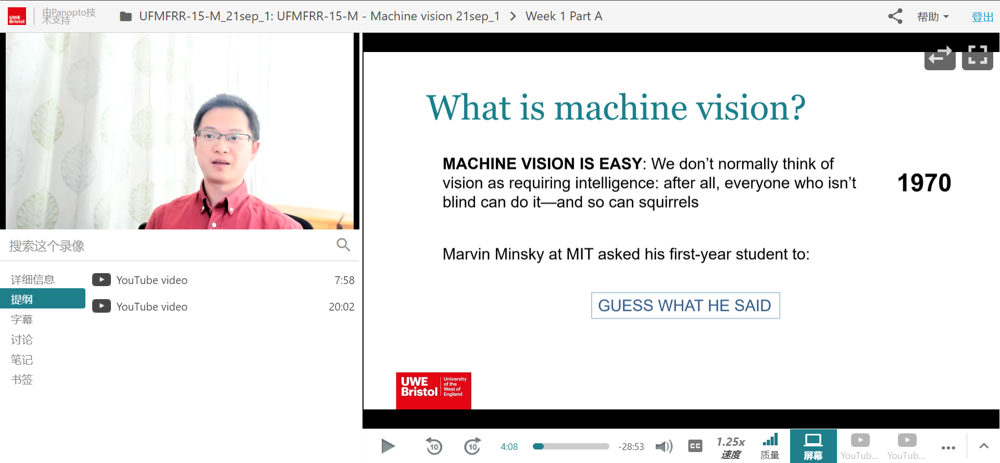
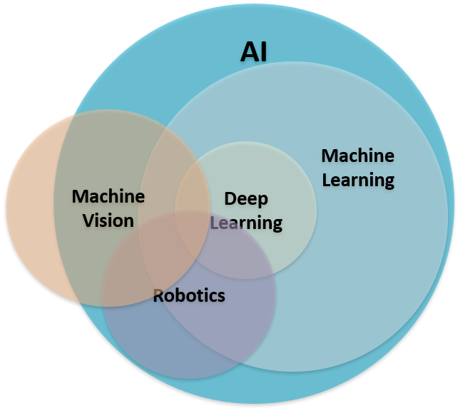
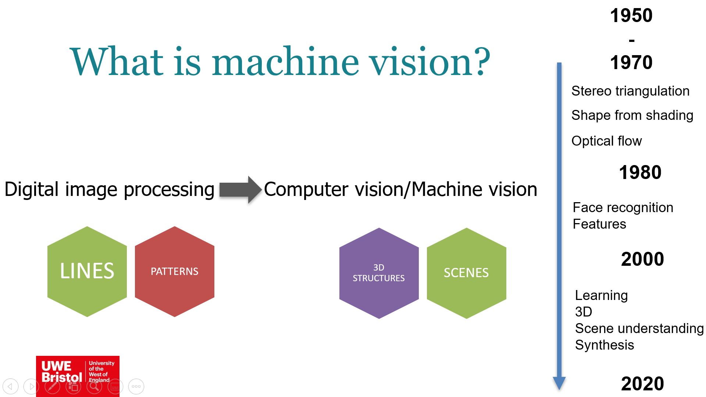

#! https://zhuanlan.zhihu.com/p/421190397
# Week1. An intro to Machine vision

> 老实说，这是我上课体验最好的一门课程。首先老师是一位华人，而且英文发音标准（说话能让人听懂这很基本，但也非常重要），其次课件做的很好，虽然是网课，但视频页面的设计真的很棒！给 Dr. Wenhao 点赞~

## 课程资料

所有与课程相关内容都可以在[我的网盘](https://pan.baidu.com/s/182t9rC2QVHQeeHii2jQ2yg)中获得。提取码：okoc

## What is machine vision

Fig1. 关系图

> 机器视觉(MV)是一个多项杂糅在一起的学科，它需要运用 AI 技术，尤其是 Deep Learning & Machine Learning。同时 MV 也是机器人学的一部分。在机器人领域运用广泛。

MV 并不是一门简单的学科。因为机器无法像人类一样理所当然的理解他所看到的是什么。人类花费了70年的时间，才逐渐形成了一个较为合理的计算机视觉方法论。

Fig2. 时间轴

从一开始的识别图像中的线、图形，到后来的面部识别，特征识别以及近二十年来 AI 技术爆发而带来的 3D 图像，图像语义分析。这使得机器视觉从单纯的数字图像处理，演变到如今的计算机视觉（CV）和机器视觉（MV）。

那么，到底 MV 是什么？下面有一些定义：

1. MV recovers useful information about a scene from its two-dimensional projections (Jain, 1995).
2. MV is an enterprise that uses statistical methods to disentangle data using models constructed with the aid of geometry, physics, and learning theory(Forsyth, 2002).
3. MV is an inverse problem, in which we seek to recover some unknowns given insufficient information to fully specify the solution (Szeliski, 2010).

> 上面定义给我的感觉就是，MV正在变得越来越复杂...

## Tutorial 

> 周五会更新这部分的内容