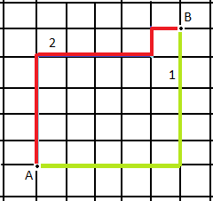
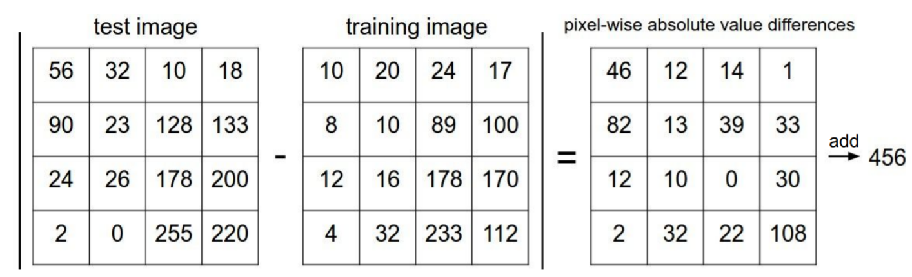
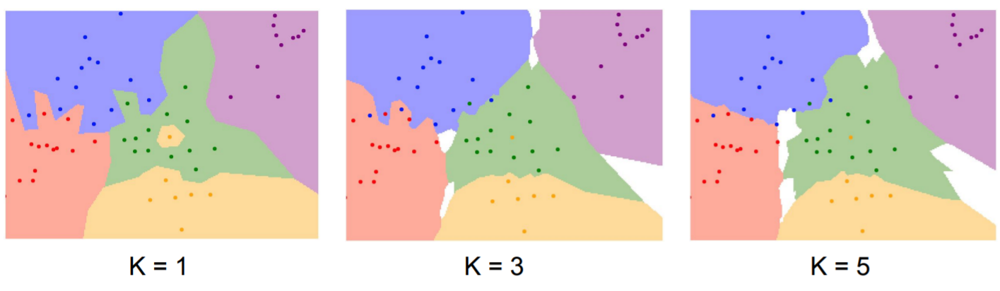
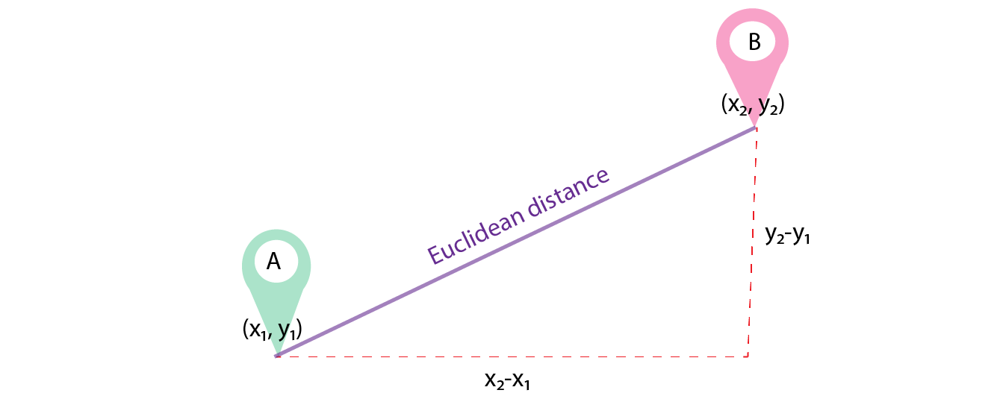
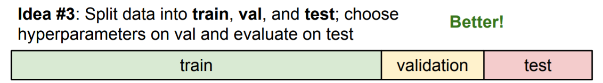
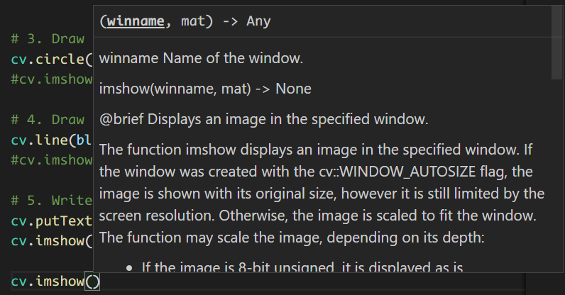
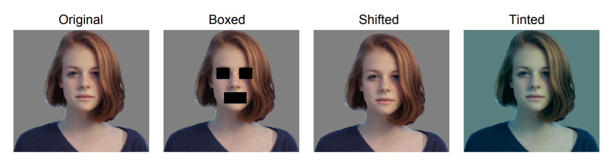
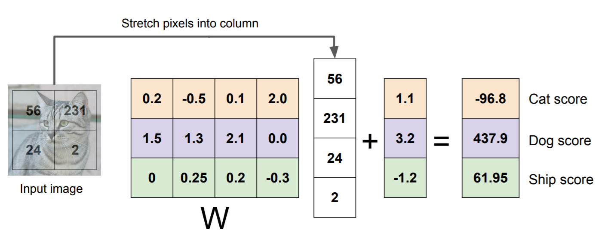

#! https://zhuanlan.zhihu.com/p/428291683
# Lec2. Image Classification

> 课程资料：
> - [视频资料 Lec2 on youtube](https://www.youtube.com/watch?v=OoUX-nOEjG0&list=PL3FW7Lu3i5JvHM8ljYj-zLfQRF3EO8sYv&index=2)
> - [ppt](http://cs231n.stanford.edu/slides/2017/cs231n_2017_lecture2.pdf)
> -[中文笔记(上)](https://zhuanlan.zhihu.com/p/20894041?refer=intelligentunit)
> - [中文笔记(下)](https://zhuanlan.zhihu.com/p/20900216?refer=intelligentunit)
> - [官方笔记](https://cs231n.github.io/classification/)

图片分类是 CV 的核心，主要做的就是让计算机将图片与语义标签对应。对于 CV 来说，以下挑战需要我们通过算法来克服：
- 同一对象在照片中的不同角度、形态
- 照片的不同光线情况
- 对象特征的不完整性
- 背景图案的干扰

另外 CV 与其他的算法学科不同的是，我们没有办法轻易的写出一个对象识别的 API，而是需要通过 ML，DL 或者 RL 通过数据驱动(Data Driven) 的方式来完成任务。

## 1. Nearest Neighbor

> 一些常用的数据集：
> - [CIFAR10](https://www.cs.toronto.edu/~kriz/cifar.html)

### 1.1 Distance Metric (距离测量)

> 如字面意思，距离测量，就是用来检测两点之间的距离。

比如：L1 distance/Manhattan distance。曼哈顿距离用来计算在格子图中两点之间的距离长度。



> ref: [Kunal Gohrani's blog](https://medium.com/@kunal_gohrani/different-types-of-distance-metrics-used-in-machine-learning-e9928c5e26c7#id_token=eyJhbGciOiJSUzI1NiIsImtpZCI6Ijg1ODI4YzU5Mjg0YTY5YjU0YjI3NDgzZTQ4N2MzYmQ0NmNkMmEyYjMiLCJ0eXAiOiJKV1QifQ.eyJpc3MiOiJodHRwczovL2FjY291bnRzLmdvb2dsZS5jb20iLCJuYmYiOjE2MzU3MjgzMzEsImF1ZCI6IjIxNjI5NjAzNTgzNC1rMWs2cWUwNjBzMnRwMmEyamFtNGxqZGNtczAwc3R0Zy5hcHBzLmdvb2dsZXVzZXJjb250ZW50LmNvbSIsInN1YiI6IjEwMzkwNTI5NzcyOTYxNDI5OTgwNiIsImVtYWlsIjoidGltLmNoZW5kYW9taW5nQGdtYWlsLmNvbSIsImVtYWlsX3ZlcmlmaWVkIjp0cnVlLCJhenAiOiIyMTYyOTYwMzU4MzQtazFrNnFlMDYwczJ0cDJhMmphbTRsamRjbXMwMHN0dGcuYXBwcy5nb29nbGV1c2VyY29udGVudC5jb20iLCJuYW1lIjoiREFPTUlORyBDSEVOIiwicGljdHVyZSI6Imh0dHBzOi8vbGgzLmdvb2dsZXVzZXJjb250ZW50LmNvbS9hLS9BT2gxNEdoZUxjTlN0YUI1UGxqTGEzUHVZUHBHTlFMbEtCOVRLRkw4YkZZbz1zOTYtYyIsImdpdmVuX25hbWUiOiJEQU9NSU5HIiwiZmFtaWx5X25hbWUiOiJDSEVOIiwiaWF0IjoxNjM1NzI4NjMxLCJleHAiOjE2MzU3MzIyMzEsImp0aSI6IjQ1YzBlOGQ1MzUxYzMwZWUzYzhlNWU0MTIyOWUyMTM1MWJlNjU4MTcifQ.MDFVD2qO7lqTvLH9RVqY837Cl-7CGhtEj42cKAE2BQ_hVueIDpEqVJt1TKkhY4vk4qgphLw7On0R_s2w5aiV5rRERGmp-a2bGa3curldK5fPhwkyQlvgSY_1yzAYaP4Yom8GVPDJcdcYUj6wUHt7M3uezwEXgXfDriAIp5sH0OwjLMS1R2yRcB3LebIE_s-U53fXpBZSkK1JVAf0SOQYLVPSHmuSoHrYatVzwUtTZPZ-JAK8wN48bSvae525g3vQk-oI-GMnRaBycdWMsepSZh7EU7ud9KiuhDz4JZRN_gbeyc2O-rvyNQLB7EfpTF6dmqbknAnhf3bP90h1rqgVpA)

公式：

$$d_1(I_1,I_2) = \sum_{p}|I_1^p - I_2^p|$$

在 CV 应用就是，用测试图片的每一个像素依此减去训练图片的每一个像素再对其求绝对值，然后将生成的矩阵元素求和。如下图：



L1 distance 的 python 代码如下：

```py
import numpy as np

class NearestNeighbor(object):
  def __init__(self):
    pass

  def train(self, X, y):
    """ X is N x D where each row is an example. Y is 1-dimension of size N """
    # the nearest neighbor classifier simply remembers all the training data
    self.Xtr = X
    self.ytr = y

  def predict(self, X):
    """ X is N x D where each row is an example we wish to predict label for """
    num_test = X.shape[0]
    # lets make sure that the output type matches the input type
    Ypred = np.zeros(num_test, dtype = self.ytr.dtype)

    # loop over all test rows
    for i in range(num_test):
      # find the nearest training image to the i'th test image
      # using the L1 distance (sum of absolute value differences)
      distances = np.sum(np.abs(self.Xtr - X[i,:]), axis = 1)
      min_index = np.argmin(distances) # get the index with smallest distance
      Ypred[i] = self.ytr[min_index] # predict the label of the nearest example

    return Ypred
```

> ref:[cs213n Official Notes](https://cs231n.github.io/classification/#nearest-neighbor-classifier)


### 1.2 K-Nearest Neighbors

上面介绍的 L1 distance 算法属于 K-nearest Neighbors 算法。实际执行的时候，情况如下：



上图的语义解释就是对于一个点附近 K 个最近点的情况来判断区域颜色，随着 K 的增大，区域颜色判断标准变得越来越严格。

除了之前介绍的 L1 distance 算法外，还有很多其他的算法，比如 L2(Eudlidean) distance 欧式距离：

$$d_2(I_1,I_2) = \sqrt{\sum_{p}(I_1^p - I_2^p)^2}$$



> [KNN demo 网页互动](http://vision.stanford.edu/teaching/cs231n-demos/knn/)

### 1.3 Setting Hyperparameters 

设置超参的推荐方法是设置3个集，一个训练集，一个验证集和一个测试集。



另外一种设置超参的方式叫交叉验证。它是将训练数据分散放入多个文件夹中，分别将其中其中的一个文件夹作为验证集，进行多次重复，最后取平均值：



完成验证后会将数据用下面的表格展示出来。图中横坐标是 K 值的大小，纵坐标是验证的准确率。黑点是每一次验证的结果，蓝线是平均后的结果。那么从下图来看，当 K=7 时结果最好。


但是由于深度学习的成本比较高，所以上面那种方法在实践中并不常见。

### 1.4 Defect of K-Nearest Neighbor 

实际上 Nearest Neighbor 分类器并不会在实际中使用，因为其准确性和测试速度都不如卷积神经网络(CNN)。后者长时间的训练，一旦完成训练会快速的完成新的测试。

由于 Nearest Neighbor 比较的是像素之间的差异，因此很多人眼能看出来的差异通过 L2 Distance 计算却没有差异，比如：



上图的4个图像通过 L2 Distance 计算结果相同。


### 1.5 小结：

其实我们稍微想想就能感觉到，单单凭借像素之间的区别来分类是一件很扯的事情。因此这项技术对于图像分类来说一般也只有40%的准确率。

那么KNN这么废，我们为什么还要学呢？因为它给我们提供了一个基础的图像分类的概念，即通过像素组合的距离之间的差异来识别物体。通过这个方法，我们可以轻易的区别出不同颜色点集的部落。这为我们提供了一个对于低维度的图像识别的思想和方案。

## 2. Linear Classification

> 此部分为下一讲的先导内容

学习过了 KNN ，了解了其缺点之后，我们来学点有用的东西。线性分类器。

这类分类器使用了神经网络的概念（有点像是搭积木）通过图像特征，使用一些算法，来达成语义上的匹配。其公式为：

$$Label = f(x,W) = Wx + b$$

其中：
- x 为图片信息向量
- W 为每一个标签在公式中的权重矩阵
- b 为偏差

举个例子：我们需要识别图像种类有3种，猫，狗，和船。现在我们有一个 2x2 的图像，为了识别它，我们要使用上面的公式$Label = f(x,W) = Wx + b$。那么首先我们将图片压缩为 4x1 向量，然后乘以权重矩阵（每一行都是一个物种标签，每一列是图片每一个像素的权重）。两者相乘再加上一个偏差，便得到了这个图像对应标签的得分情况。一般来说，我们选择得分高的标签作为该图像的识别结果。（下图只是过程的示例）



对我们来说，需要做的就是找到一个合适的 W 和 b，让识别结果有较高的准确性，这其实是一个不小的挑战。

