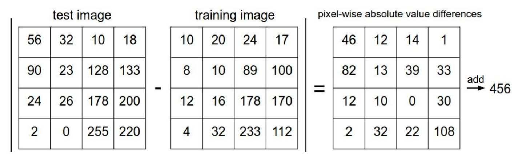
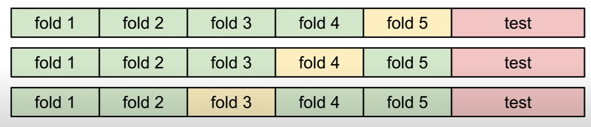

#! https://zhuanlan.zhihu.com/p/425297752
# Opencv-python-tutorial -- 1

> 本章笔记基于 Youtube 博主 FreeCodeCamp.org 上传的视频 [OpenCV Course - Full Tutorial with Python【B站转载】](https://www.bilibili.com/video/BV14g411c7wk?from=search&seid=15618549448588400575&spm_id_from=333.337.0.0)

## 1. Install

在安装好最新版本的 python 后在 `cmd` 中进行python库的安装 `pip install`

- `pip install numpy`
- `pip install opencv-contrib-python`
- `pip install caer`
- `pip install matplotlib` (非必须)



> 本篇文章建议在ide中进行练习，比如在 `vscode`, `pycharm`。 当然`colab`也是不错的选择。

## 2. Reading images & Video

首先准备一些图片。

然后创建 `read.py` 文件。

```py
# 导入 opencv 库，并使用 namespace: cv
import cv2 as cv
# 使用 opencv 导入图片，括号中可以输入绝对路径或者相对路径。
# 在 vscode 中导入文件夹，可以帮助你快速的找到文件的相对路径
# 但如果报错的话，则最好使用图片的据对路径。
# 使用 img 变量保存导入的图片。
img = cv.imread('路径')
# imshow 用来展示图片，其两个参数分别为：'重新赋予的图片名称'，变量
cv.imshow('pic1', img)
# 等待按键，当按下任意键后，以最短的时间结束程序
# 如果不添加这一行，图片打开后很快又被关掉
cv.waitKey(0)
```

> 但这里有一个问题，当图片尺寸超出屏幕尺寸的时候，展示的图片并不会自动缩放。

出了读取图片，opencv 还可以读取视频。

```py
capture = cv.VideoCapture('路径')

while True:
    # 视频被一帧一帧的读取出来
    isTrue, frame = capture.read()
    cv.imshow('video',frame)
    # if d is pressed after 20s 
    if cv.waitKey(20) & 0xFF == ord('d'):
        break

capture.release()
cv.destroyAllWindows()
```

> 关于 API 中的参数，在 vscode 中都会有提示，如下所示：



## 3. Resizing and Rescaling Frames

想要缩放图片或者视频或者直播视频的尺寸，我们需要写一个函数来实现这个功能：

```py
def rescaleFrame(frame, scale=0.5):
    # 图片的第一维是高度
    height = int(frame.shape[0]*scale)
    # 图片的第二维是宽度
    width = int(frame.shape[1]*scale)
    # 将修改后的图片信息存入一个变量
    dimensions = (width,height)
    # 并返回修改后的图片返回。注意由于函数 resize()，只能接受int类型，所以要对上面的 hieght 和 width 进行类型限制
    return cv.resize(frame,dimensions, interpolation=cv.INTER_AREA)
```

然后只需要调用这个函数，并输出就可以了。

```py
img = cv.imread('C:/Users/Daoming Chen/Documents/GitHub/cnblog_style/pics/1.png')
img_resize = rescaleFrame(img)
cv.imshow('pic1', img_resize)
```

## 4. Drawing shapes and Putting text

> 此部分共有 5 小节，全部以代码 + 注释的方式呈现

```py
import numpy as np
import cv2 as cv

blank = np.zeros((500,500,3),dtype='uint8')
#cv.imshow('blank', blank)

# 1. paint the image a certain color
# Remember different from we normally use rgb images
# in opencv the color sequence is bgr
blank[200:300,300:400] = 203,192,255
#cv.imshow('pink',blank)

# 2. Draw a Rectangle
# 由长方形的两个角画出这个长方形
#cv.rectangle(blank,(0,0),(250,250),(203,192,255),thickness=2)
#cv.imshow('Rectangle',blank)

# 当然也可以利用原图片的大小来画我们的长方形
cv.rectangle(blank,(0,0),(blank.shape[1]//2,blank.shape[0]//2),(203,192,255),thickness=-1)
#cv.imshow('Rectangle',blank)


# 3. Draw a circle
cv.circle(blank, (blank.shape[1]//2, blank.shape[0]//2),40,(173,216,230),thickness=3)
#cv.imshow('Circle',blank)

# 4. Draw a line
cv.line(blank, (0,0) ,(blank.shape[1]//2, blank.shape[0]//2),(255,255,255),thickness=3)
#cv.imshow('line',blank)

# 5. Write text
cv.putText(blank,'Hello World',(250,400),cv.FONT_HERSHEY_TRIPLEX, 1.0, (255,255,255),2)
cv.imshow('text',blank)


cv.waitKey(0)
```


## 5. Basic of opencv

> 此部分提供了对于图片的基本处理方法

```py
import cv2 as cv

img = cv.imread('Machine vision\week2\pics/1.jpg')
cv.imshow('org',img)

# 1. Converting to grayscale
gray = cv.cvtColor(img,cv.COLOR_BGR2GRAY)
#cv.imshow('gray',gray)

# 2. Blur
# ksize for blue has to be odd number (1,3,5..)
blur = cv.GaussianBlur(img,(3,3),cv.BORDER_DEFAULT)
#cv.imshow('Blur',blur)

# 3. Edge Cascade
canny = cv.Canny(img,125,175)
#cv.imshow('Cannt',canny)

# 4. 扩张 the image
dilated = cv.dilate(canny, (3,3), iterations=3)
#cv.imshow('dilated',dilated)

# 5. 侵蚀
eroded = cv.erode(dilated,(3,3),iterations=1)
#cv.imshow('eroded',eroded)

# 6. resize
resized = cv.resize(img,(500,500),interpolation=cv.INTER_CUBIC)
#cv.imshow('resize',resized)

# 7. Cropping
cropped = img[30:500,100:400]
cv.imshow('cropped',cropped)

cv.waitKey(0)
```

## 6. Transform

> 此部分介绍了图像的变换，平移，旋转，反转。

```py
import cv2 as cv
import numpy as np

img = cv.imread('Machine vision\week2\pics/1.jpg')
cv.imshow('org',img)

# 1. Translation
# 将图片上下左右移动

def translate(img, x, y):
    transMat = np.float32([[1,0,x],[0,1,y]])
    demensions = (img.shape[1], img.shape[0])
    return cv.warpAffine(img, transMat, demensions)

# -x --> Left
# -y --> Up
# x --> Right
# y --> Down

translated = translate(img, -100, -100)
#cv.imshow('translate',translated)

# 2. Rotation
# 旋转图片

def rotate(img, angle, rotPoint=None):
    (hight, width) = img.shape[:2]

    if rotPoint is None:
        rotPoint = (width//2,hight//2)
    
    rotMat = cv.getRotationMatrix2D(rotPoint, angle, 1.0)
    dimension = (width,hight)

    return cv.warpAffine(img, rotMat, dimension)

rotated = rotate(img,45)
#cv.imshow('rotate',rotated)

# 3. Flipping (反转)

flip1 = cv.flip(img, 1)
flip2 = cv.flip(img, -1)
cv.imshow('flip1',flip1)
cv.imshow('flip2',flip2)


cv.waitKey(0)
```

## 7. Contour Detection

> 此部分的内容为轮廓识别，看起来和直接使用 `canny` 的效果很像

```
import cv2 as cv
import numpy as np

img = cv.imread('Machine vision\week2\pics\cats.jpg')
cv.imshow('cats',img)

blank = np.zeros(img.shape[:2], dtype='uint8')

gray = cv.cvtColor(img,cv.COLOR_BGR2GRAY)
# blur = cv.blur(gray,(3,3),cv.BORDER_DEFAULT)
# canny = cv.Canny(blur,125, 175)
# cv.imshow('canny',canny)

ret, thresh = cv.threshold(gray, 125, 255, cv.THRESH_BINARY)
cv.imshow('thresh',thresh)

contours, hierarchies = cv.findContours(thresh,cv.RETR_LIST, cv.CHAIN_APPROX_SIMPLE) 

# To draw all the contours on the blank pic.
# use -1 to represente all
cv.drawContours(blank, contours, -1,(255,255,255),thickness=2)
cv.imshow('Contour Drawn', blank)

cv.waitKey(0)
```

## 8. Color Space

> 计算机有很多种色域，比如 `opencv` 使用的 `BGR`，我们常用的 `RGB`色域，以及 `HSV` `LAB`等等。下面将使用 `opencv`进行色域之间的转换。

```py
import cv2 as cv
import matplotlib.pyplot as plt

img = cv.imread('Machine vision\week2\pics\cats.jpg')
cv.imshow('cats',img)

# what does a BGR image looks like in RGB 
# plt.imshow(img)
# plt.show()

# 1. BGR to GRAY
gray = cv.cvtColor(img,cv.COLOR_BGR2GRAY)
# cv.imshow('gray',gray)

# 2. BGR to HSV
hsv = cv.cvtColor(img, cv.COLOR_BGR2HSV)
# cv.imshow('hsv',hsv)

# 3. BRG to L*A*B
LAB = cv.cvtColor(img, cv.COLOR_BGR2LAB)
# cv.imshow('LAB',LAB)

# 4. BGR to RGB
RGB = cv.cvtColor(img, cv.COLOR_BGR2RGB)
# cv.imshow('RGB',RGB)

plt.imshow(RGB)
# plt.show()

cv.waitKey(0)
```

## 9. Color Channel

> 此部分的内容是将图片的三原色通道拆解，并重新组合

```py
import cv2 as cv
import matplotlib.pyplot as plt
import numpy as np

img = cv.imread('Machine vision\week2\pics\cats.jpg')
cv.imshow('cats',img)

blank = np.zeros(img.shape[:2], dtype='uint8')

b,g,r = cv.split(img)

# 三个通道的图片展示出来都是色度图，但三者之间有所区别
# 黑色的地方表示这里的所含的通道的颜色少，白色反之。
# 比如蓝天在蓝色通道图中看来来就比较白。
# cv.imshow('Blue',b)
# cv.imshow('Green',g)
# cv.imshow('Red',r)

# 将3个通道合成彩色图片
merged = cv.merge([b,g,r])
# cv.imshow('merged image',merged)

# 将单个颜色通道与黑色背景融合
blue = cv.merge([b,blank,blank])
green = cv.merge([blank,g,blank])
red = cv.merge([blank,blank,r])

cv.imshow('blue',blue)
cv.imshow('green',green)
cv.imshow('red',red)


cv.waitKey(0)
```