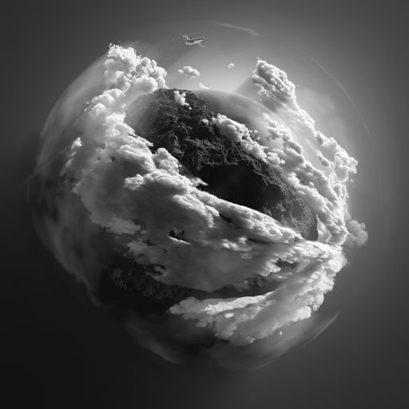

#! https://zhuanlan.zhihu.com/p/426575079
# Opencv-python-tutorial -- 2

## 1. Blurring （模糊）

```py
import cv2 as cv

img = cv.imread('Machine vision\week2\pics/1.jpg')
cv.imshow('org',img)

# average 
# 此方法的原理就是将一个方形矩阵中间格周边的格子求平均后放在中心的像素上。
average = cv.blur(img,(3,3))
cv.imshow('average blur', average)
```


```py
# Gaussian Blur
# 与 average 唯一不同的是高斯模糊使用了加权平均
Gaussian = cv.GaussianBlur(img,(3,3),0)
cv.imshow('Gaussian blur', Gaussian)
```


```py
# Median Blur
# Median 直接选取了中间像素的值
Median = cv.medianBlur(img,3)
cv.imshow('Median blur', Median)
```


```py
# Bilateral 
# Bilateral 的方法与
Bilateral = cv.bilateralFilter(img, 5, 15, 15)
cv.imshow('Bilateral', Bilateral)

# 模糊程度排名：
# Average > Gaussian > Median > Bilateral

cv.waitKey(0)
```


## 2. Bitwise (bit 逻辑)

```py
import cv2 as cv
import numpy as np

blank = np.zeros((400,400),dtype='uint8')

rectangle = cv.rectangle(blank.copy(),(30,30),(370,370),255, -1)
circle = cv.circle(blank.copy(),(0,0),200,255,-1)

cv.imshow('rectangle',rectangle)
cv.imshow('circle',circle)
cv.imwrite('Machine vision\week3\pics/rectangle.jpg',rectangle)
cv.imwrite('Machine vision\week3\pics/circle.jpg',circle)
```


```py
# bitwise AND --> Intersecting regins
bitwise_and = cv.bitwise_and(rectangle,circle)
cv.imshow('bitwise_and',bitwise_and)
cv.imwrite('Machine vision\week3\pics/bitwise_and.jpg',bitwise_and)
```


```py
# bitwise OR --> Non-Intersecting regins and Intersecting regins
bitwise_or = cv.bitwise_or(rectangle,circle)
cv.imshow('bitwise_or',bitwise_or)
cv.imwrite('Machine vision\week3\pics/bitwise_or.jpg',bitwise_or)
```


```py
# bitwise XOR --> Non-Intersecting regins
bitwise_xor = cv.bitwise_xor(rectangle,circle)
cv.imshow('bitwise_xor',bitwise_xor)
cv.imwrite('Machine vision\week3\pics/bitwise_xor.jpg',bitwise_xor)
```


```py
# bitwise NOT --> Invert black and white
bitwise_not = cv.bitwise_not(rectangle)
cv.imshow('bitwise_not',bitwise_not)
cv.imwrite('Machine vision\week3\pics/bitwise_not.jpg',bitwise_not)
```


## 3. Mask （遮罩）

```py
import cv2 as cv
import numpy as np

img = cv.imread('Machine vision\week2\pics/1.jpg')
cv.imshow('org',img)
cv.imwrite('Machine vision\week3\pics/img.jpg',img)
```


```py
blank = np.zeros(img.shape[:2],dtype='uint8')
mask = cv.circle(blank, (img.shape[1]//2,img.shape[0]//2),200,255,-1)
cv.imshow('mask',mask)
cv.imwrite('Machine vision\week3\pics/mask.jpg',mask)
```


```py
# 注意这里传的前两个参数都是原图
masked = cv.bitwise_and(img,img,mask=mask)
cv.imshow('masked',masked)
cv.imwrite('Machine vision\week3\pics/masked.jpg',masked)

cv.waitKey(0)
```


## 4. Histogram Computation （直方图）

> 灰色图片的直方图在摄影用一般用来展示图片的曝光度。

灰色图片的直方图：

```py
import cv2 as cv
import matplotlib.pyplot as plt
import numpy as np

img = cv.imread('Machine vision\week2\pics/1.jpg')

gray = cv.cvtColor(img,cv.COLOR_BGR2GRAY)
cv.imshow('gray',gray)
cv.imwrite('Machine vision\week3\pics/gray.jpg',gray)
```


```py
#创建图片的遮罩
blank = np.zeros(img.shape[:2],dtype='uint8')
circle = cv.circle(blank,(img.shape[1]//2,img.shape[0]//2),200,255,-1)
mask = cv.bitwise_and(gray,gray,mask=circle)
cv.imshow('mask',mask)
cv.imwrite('Machine vision\week3\pics/mask.jpg',mask)
```


```py
# Grayscale histogram
# 这里是画出灰度图的像素集中度，[0,256] 为从黑到白
gray_hist = cv.calcHist([gray],[0],None,[256],[0,256])
mask_hist = cv.calcHist([mask],[0],None,[256],[0,256])

# 使用 plt 画出直方图
plt.figure()
plt.subplot(1,2,1)
plt.title('Histogram of Gray')
plt.xlabel('Bin')
plt.ylabel('# of pixels')
plt.plot(gray_hist)
plt.xlim([0,256])

plt.subplot(1,2,2)
plt.title('Histogram of Mask')
plt.xlabel('Bin')
plt.ylabel('# of pixels')
plt.plot(gray_hist)
plt.xlim([0,256])
plt.show()


cv.waitKey(0)
```


> 直方图对于彩色图片来说，会呈现图像的色彩的亮度。

```py
plt.figure()
plt.title('Histogram of color')
plt.xlabel('Bin')
plt.ylabel('# of pixels')
colors = ('b', 'g', 'r')
for i,col in enumerate(colors):
    hist = cv.calcHist([img],[i],None,[236],[0,256])
    plt.plot(hist,color=col)
    plt.xlim([0,256])
plt.show()
```


## 5. Threshold

> 用于控制亮度的阈值。

```py
import cv2 as cv
import matplotlib.pyplot as plt
import numpy as np

img = cv.imread('Machine vision\week2\pics/1.jpg')
gray = cv.cvtColor(img,cv.COLOR_BGR2GRAY)
cv.imshow('gray',gray)

# Simple Thresholding
# If pixel value is larger than 125, it will be set to 255.
# If lower than 125, it will be set 0.
# 最后一个参数用于控制图片呈现的样式
# 图像编程了一个二进制非黑即白的图像
threshold, thresh = cv.threshold(gray,125,255,cv.THRESH_BINARY)
cv.imshow('Simple_threshold',thresh)
cv.imwrite('Machine vision\week3\pics/Simple_threshold.jpg',thresh)
```


```py
# Inver Thresholding
# 将之前图片的黑白颠倒
threshold, thresh_inv = cv.threshold(gray,125,255,cv.THRESH_BINARY_INV)
cv.imshow('Simple_threshold_inv',thresh_inv)
cv.imwrite('Machine vision\week3\pics/Simple_threshold_inv.jpg',thresh_inv)
```


```py
# Adaptive Thresholding
adapt_thresh = cv.adaptiveThreshold(gray,255,cv.ADAPTIVE_THRESH_MEAN_C,cv.THRESH_BINARY,11,3)
cv.imshow('Simple_threshold_inv',adapt_thresh)
cv.imwrite('Machine vision\week3\pics/adapt_thresh.jpg',adapt_thresh)

cv.waitKey(0)
```


## 6. Edge Detection

```py
import cv2 as cv
import matplotlib.pyplot as plt
import numpy as np

img = cv.imread('Machine vision\week3\pics/bristol.jpg')
gray = cv.cvtColor(img,cv.COLOR_BGR2GRAY)
cv.imshow('gray',gray)
cv.imwrite('Machine vision\week3\pics/bristol_gray.jpg',gray)
```


```py
# Laplcaian
lap = cv.Laplacian(gray,cv.CV_64F)
lap = np.uint8(np.absolute(lap))
cv.imshow('Laplcaian',lap)
cv.imwrite('Machine vision\week3\pics/lap.jpg',lap)
```


```py
# Sobel

sobelx = cv.Sobel(gray,cv.CV_64F,1,0)
sobely = cv.Sobel(gray,cv.CV_64F,0,1)

cv.imshow('Sobel_x',sobelx)
cv.imshow('Sobel_y',sobely)
cv.imwrite('Machine vision\week3\pics/sobelx.jpg',sobelx)
cv.imwrite('Machine vision\week3\pics/sobely.jpg',sobely)
```


```py
combined_sobel = cv.bitwise_or(sobelx,sobely)
cv.imshow('combined_sobel',combined_sobel)
cv.imwrite('Machine vision\week3\pics/combined_sobel.jpg',combined_sobel)
```


```py
# Canny
canny = cv.Canny(gray,125,175)
cv.imshow('canny',canny)
cv.imwrite('Machine vision\week3\pics/canny.jpg',canny)

cv.waitKey(0)
```

