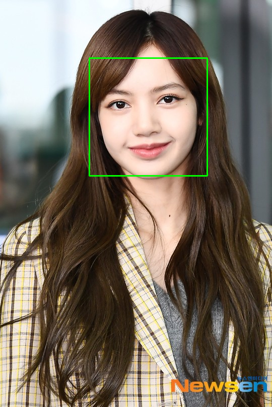

#! https://zhuanlan.zhihu.com/p/427681879
# Opencv-python-tutorial -- 3

## 1. Face detection with haar cascades

本章的主要内容是使用 `Opencv` 做人脸识别。 要做到人脸识别其实挺难的，一般来说需要用到机器学习，将大量的标记好的图片数据喂给机器学习框架，让其调整内部参数，以达到目标胜率（成功率）。但好在 `Opencv` 作为一个开源了很多年的计算机视觉库，这样的工作他们当然也做过了，所以我们可以直接从 `Opencv` 的 `GitHub` [数据集](https://github.com/opencv/opencv/tree/master/data) 中找到我们需要拿来用就可以了。

针对本次课程，我们用到的 `pre trained` 数据集是: [haarcascade_frontalface_default](https://github.com/opencv/opencv/blob/master/data/haarcascades/haarcascade_frontalface_default.xml)

将这个 `xml` 文件中的内容复制到本地的文件中。

对于`CascadeClassifier`分类器来说判断图片是否是人脸主要是依据 `gray contour pics`（灰度轮廓图），所以在传图像的时候，需要将图像转换为灰度图，再传给函数 `detetMultiScael()`，进行人脸数量的识别。代码如下：

```py
import cv2 as cv

img = cv.imread('Machine vision\week4\pics/Lisa.jpg')
gray = cv.cvtColor(img,cv.COLOR_BGR2GRAY)
cv.imshow('Lisa_gray',gray)

haar_cascade = cv.CascadeClassifier('Machine vision\week4/harr_face.xml')

# By changing the value of minNeighbor according to the face pixel area,
# we can get a better result. But cascade is sensetive to noise, it's not
# an advanced method but a popular one.
faces_rect = haar_cascade.detectMultiScale(gray, scaleFactor=1.1,minNeighbors=15)

print(f'Number of faces found = {len(faces_rect)}')

for(x,y,w,h) in faces_rect:
    cv.rectangle(img,(x,y),(x+w,y+h),(0,255,0),thickness=2)

cv.imshow('Face_detect',img)

cv.waitKey(0)
```



```
Number of faces found = 1
```

看上去还不错，那么我们来小总结一下：

上方程序主要用到了两个函数，一个是分类器函数 `CascadeClassifier()`，另外一个是识别函数 `detectMultiScale()`。
- CascadeClassifier() 需要输入一个预先训练好的数据集，然后输出一个分类器对象，上方程序中的对象是 `haar_cascade`
- 对 `haar_cascade` 对象使用 `detectMultiScale()` 识别函数，作为一个调参侠，要对这个函数的参数了然于胸，下面列举一些重要的参数和推荐值：
  - `scaleFactor` 指定图像大小在每个图像比例下缩小多少的参数。
你的模型训练过程中定义一个固定的大小，可以再 `xml` 文件中找到。这意味着在图像中如果存在此大小的人脸，就会被检测到。通过重新缩放输入图像，您可以将较大的人脸调整为较小的人脸，使其可被算法检测到。
`1.05` 是一个很好的可能值，这意味着您使用一小步来调整大小，即将大小减少 5%，您增加了找到与模型匹配的大小的机会以进行检测。这也意味着该算法的工作速度较慢，因为它更彻底。您可以将其增加到 1.4 以加快检测速度，但可能会完全遗漏某些人脸。
  - `minNeighbors` 指定每个候选矩形应保留多少附近的参数
该参数会影响检测到的人脸的质量。值越高，检测次数越少，但质量越高。3~6物有所值。
   - `minSize` 最小可能的对象大小。小于该值的对象将被忽略。
此参数确定您要检测的大小。你来决定！通常，这[30, 30]是人脸检测的良好开端。
   - `maxSize` 最大可能的对象大小。大于此值的对象将被忽略。
此参数确定您要检测的大小。再次，你决定！通常，您不需要手动设置它，默认值假设您要检测的人脸大小没有上限。

> ref: [Question: 'Recommended values for OpenCV detectMultiScale() parameters' on stackoverflow](https://stackoverflow.com/questions/20801015/recommended-values-for-opencv-detectmultiscale-parameters)

经过以上成功的测试，现在我们加大难度，对 `Black Pink` 四个人进行检测使用参数如下：

```py
faces_rect = haar_cascade.detectMultiScale(gray, scaleFactor=1.05,minNeighbors=6,minSize=[80,80])
```


> 经过多次的把胳膊肘当作人脸的不当调参后，终于找到了合适的参数，成功将四位的面容不多不少的检测出来了。

对于视频来说，我们也可以使用此方法进行检测，非常简单，只需要将视频的每一帧当作一张图片来检测，再逐帧播放就好了。

## 2. Face Recognition

本节的内容是使用 `Opencv` 自带的 `Face Recognitor` 深度学习框架对于不同人的脸进行识别。

这里我们准备了 Black Pink 组合成员每人个20张照片，作为训练集，以及另外每人10张作为测试集。

首先写一个程序训练 AI 的识别功能：
```py
import os
import cv2 as cv
import numpy as np

Black_pink = ['Jisoo','Jennie','Lisa','Rose']

haar_cascade = cv.CascadeClassifier('Machine vision\week4/harr_face.xml')

DIR = r'C:/Users/Daoming Chen/Documents/GitHub/Uob_Robotics/Machine vision/week4/Face Recognizor/train'

features = []
labels = []

def create_train():
    for person in Black_pink:
        path = os.path.join(DIR, person)
        label = Black_pink.index(person)

        for img in os.listdir(path):
            img_path = os.path.join(path,img)

            img_array = cv.imread(img_path)
            if img_array is None:
                continue 
                
            gray = cv.cvtColor(img_array, cv.COLOR_BGR2GRAY)

            faces_rect = haar_cascade.detectMultiScale(gray, scaleFactor=1.1, minNeighbors=4)

            for (x,y,w,h) in faces_rect:
                faces_roi = gray[y:y+h, x:x+w]
                features.append(faces_roi)
                labels.append(label)

create_train()
print('Training done ---------------')

features = np.array(features, dtype='object')
labels = np.array(labels)

face_recognizer = cv.face.LBPHFaceRecognizer_create()

# Train the Recognizer on the features list and the labels list
face_recognizer.train(features,labels)

face_recognizer.save('face_trained.yml')
np.save('features.npy', features)
np.save('labels.npy', labels)
```

然后测试训练结果：
```py
import numpy as np
import cv2 as cv

haar_cascade = cv.CascadeClassifier('Machine vision/week4/harr_face.xml')

Black_pink = ['Jisoo','Jennie','Lisa','Rose']

face_recognizer = cv.face.LBPHFaceRecognizer_create()
face_recognizer.read('face_trained.yml')

img = cv.imread('Machine vision/week4/Face Recognizor/test/Rose/1.jpg')

gray = cv.cvtColor(img, cv.COLOR_BGR2GRAY)

# Detect the face in the image
faces_rect = haar_cascade.detectMultiScale(gray, 1.1, 4)

for (x,y,w,h) in faces_rect:
    faces_roi = gray[y:y+h,x:x+w]

    label, confidence = face_recognizer.predict(faces_roi)
    print(f'Label = {Black_pink[label]} with a confidence of {confidence}')

    cv.putText(img, str(Black_pink[label]), (20,20), cv.FONT_HERSHEY_COMPLEX, 1.0, (0,255,0), thickness=2)
    cv.rectangle(img, (x,y), (x+w,y+h), (0,255,0), thickness=2)

cv.imshow('Detected Face', img)

cv.waitKey(0)
```

结果还是能够接受的：


```
Label = Rose with a confidence of 77.41009254574078
```


```
Label = Lisa with a confidence of 121.3902802985011
```


```
Label = Jennie with a confidence of 51.10702824297346
```


```
Label = Jisoo with a confidence of 69.63685142148553
```

也有失败的时候，而且还不少：


```
Label = Jennie with a confidence of 129.4630254307873
```

最后给了 AI 一个终极挑战：


```
Label = Rose with a confidence of 67.03205529303399
Label = Jisoo with a confidence of 80.29899824875896
Label = Jennie with a confidence of 79.41507069872958
Label = Jennie with a confidence of 63.28132174720105
```

这里没有认出来 Lisa，感觉是我的训练集的图片质量问题导致的。

> 一点小总结，对于训练集的图片来说，图片大小是非常关键的因素，本次训练中并没有保证所有图片的大小一致所有在测试环节出现了不少问题。不过总体结果我还是很满意的。