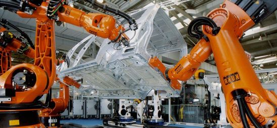

#! https://zhuanlan.zhihu.com/p/460582634
# 机器人动力学(Dynamics) -1

## 1. 简介

机器人的动力学模型解释了当力作用与系统时会产生的影响。这对于机器人的仿真与控制都是重要的。动力学机器人与运动学机器人在应用上的对比就是工业机器人与协助机器人。通常来说，力控的存在，协作机器人做视为安全的机器人，而工业机器人通常较为危险，人类不可以靠近。

由理论力学的基础可以得到，对于一个固定底座的多轴机器人，其动力学方程可以写成：

$$
M(q)\ddot{q} + b(q,\dot{q}) + q(q) = \tau + J_c(q)^TF_c
$$

其中：

- $M(q) \in \mathbb{R}^{n_q\times n_q}$  -- 广义质量矩阵
- $q,\dot{q},\ddot{q} \in \mathbb{R}^{n_q}$  -- 广义位置、速度和加速度向量
- $b(q,\dot{q}) \in \mathbb{R}^{n_q}$ -- 离心力项
- $g(q) \in \mathbb{R}^{n_q}$ -- 引力项
- $\tau \in \mathbb{R}^{n_q}$ -- 外部广义力
- $F_c \in \mathbb{R}^{n_c}$ -- 外部笛卡尔力
- $J_c(q) \in \mathbb{R}^{n_c \times n_q}$ -- 对应于外力的几何雅可比行列式

这上面的公式可以给我们一个大体的印象，就是说动力学是与速度，加速度，力，和扭矩有关的。在计算的时候，一般会用到两种计算方法：**拉格朗日法(Lagrange Method)** 和 **牛顿欧拉法 (Newton-Eulermethod)**

## 2. 拉格朗日方程(Lagrange Method)

拉格朗日方法的主要思想是从能量的角度出发，利用动能和势能相减得到拉格朗日：

$$
\mathcal L(\theta, \dot{\theta}) = \mathcal K(\theta, \dot{\theta}) - \mathcal P(\theta)
$$

其中：

- $\mathcal K(\theta, \dot{\theta})$ 代表的是动能
- $\mathcal P(\theta)$ 代表的是势能

对于机器人来说，由于不同姿态下机械臂的惯量不同，因此 $\mathcal K$ 是一个与 $\theta$ 有关的方程。

$$
\begin{aligned}
& \frac{d}{dt}\frac{\partial \mathcal L}{\partial \dot{\theta}} - \frac{\partial \mathcal L}{\partial \theta} = \tau  \\
& \xRightarrow{}
\frac{d}{dt}\frac{\partial \mathcal K}{\partial \dot{\theta}}-
\frac{\partial \mathcal K}{\partial \theta} + \frac{\partial \mathcal P}{\partial \theta} = \tau
\end{aligned}
$$

下面我们来看一个简单的例题：

For link 1:
$$
\left\{
    \begin{array}{lr}
       K_1 = \frac{1}{2}m_1 l_1^2\dot{\theta_1^2}\\
       P_1 = m_1gl_1sin\theta_1
    \end{array}
\right.
$$

For link 2:
$$
\begin{aligned}
&\left\{
    \begin{array}{lr}
       x_2 = l_1cos\theta_1 + l_2cos(\theta_1 + \theta_2)\\
       y_2 = l_1sin\theta_1 + l_2sin(\theta_1 + \theta_2)
    \end{array}
\right.
\\ \,
\\
&\left\{
    \begin{array}{lr}
       \dot{x_2} = -l_1(sin\theta_1)\dot{\theta_1} - l_2sin(\theta_1 + \theta_2)
       (\dot{\theta_1} + \dot{\theta_2})\\
       \dot{y_2} = l_1(cos\theta_1)\dot{\theta_1} + l_2cos(\theta_1 + \theta_2)
       (\dot{\theta_1} + \dot{\theta_2})
    \end{array}
\right.
\\ \,
\\
&\because \dot{x_2^2} + \dot{y_2^2} = \dot{v_2^2} \\
&\therefore v_2^2 = l_1^2\dot{\theta_1^2} + l_2^2(\dot{\theta_1^2} + 2\dot{\theta_1}+\dot{\theta_2} + \dot{\theta_2^2}) + 2l_1l_2cos\theta_2(\dot{\theta_1^2} + \dot{\theta_1}\dot{\theta_2})
\\ \,
\\
&\left\{
    \begin{array}{lr}
       K_2 = \frac{1}{2}m_2v_2^2\\
       P_2 = m_2gl_1sin\theta_1 + m_2gl_2sin(\theta_1 + \theta_2)
    \end{array}
\right.
\end{aligned}
$$

Lagrange: 

$$
\begin{aligned}
   \mathcal L &= \mathcal K - \mathcal P\\
   &= \frac{1}{2}(m_1+m_2)l_1^2\dot{\theta_1^2} + \frac{1}{2}m_2l_2^2(\dot{\theta_1^2} + m_2\dot{\theta_1}+\dot{\theta_2} + \dot{\theta_2^2}) + 2l_1l_2cos\theta_2(\dot{\theta_1^2} + \dot{\theta_1}\dot{\theta_2})\\
   &\quad - (m_1+m_2)gl_1sin\theta_1 - m_2gl_2sin(\theta_1 + \theta_2)
\end{aligned}
$$

Dynamic Equations for link 1:

$$
\begin{aligned}
\frac{\partial \mathcal L}{\partial \dot{\theta_1}} &= 
(m_1+m_2)l_1^2\dot{\theta_1} + m_2l_2^2\dot{\theta_1} + m_2l_2^2\dot{\theta_2} \\ 
&\quad+ 2m_2l_1l_2(cos\theta_2)\dot{\theta_1} + m_2l_1l_2(cos\theta_2)\dot{\theta_2}
\\ \,
\\
\frac{d}{dt}\frac{\partial \mathcal L}{\partial \ddot{\theta_1}} &= 
[(m_1+m_2)l_1^2 + m_2l_2 + 2m_2l_1l_2cos\theta_2]\ddot{\theta_1}\\
&\quad +(m_2l_2 + m_2l_1l_2cos\theta_2)\ddot{\theta_2}\\
&\quad -2m_2l_1l_2(sin\theta_2)\ddot{\theta_1}\ddot{\theta_2} - m_2l_1l_2(sin\theta_2)\ddot{\theta_2^2}
\\ \,
\\
\frac{\partial \mathcal L}{\partial {\theta_1}} &= 
-(m_1+m_2)gl_1cos\theta_1 - m_2gl_2cos(\theta_1 + \theta_2)
\\ \,
\\
\tau_1 &= [(m_1+m_2)l_1^2 + m_2l_2^2 + m_2l_2^2 + 2m_2l_1l_2cos\theta_2]\ddot{\theta_1}\\
&\quad +(m_2l_2^2+m_2l_1l_2cos\theta_2)\ddot{\theta_2^2} - 2m_2l_1l_2(sin\theta_2)\dot{\theta_1}\dot{\theta_2}\\
&\quad -m_2l_1l_2(sin\theta_2)\dot{\theta_2^2} + (m_1+m_2)gl_1cos\theta_1 + m_2gl_2cos(\theta_1+\theta_2)
\end{aligned}
$$

Dynamic Equations for link 2:

$$
\begin{aligned}
    \frac{\partial \mathcal L}{\partial \dot{\theta_2}} &=
    m_2l_2^2\dot{\theta_1} + m_2l_2^2\dot{\theta_2} + m_2l_1l_2(cos\theta_2)\dot{\theta_1}
    \\ \,
    \\
    \frac{d}{dt}\frac{\partial \mathcal L}{\partial \ddot{\theta_2}} &= 
    m_2l_2^2\ddot{\theta_1} + m_2l_2^2\ddot{\theta_2} + m_2l_1l_2(cos\theta_2)\ddot{\theta_1} - m_2l_1l_2(sin\theta_2)\dot{\theta_1}\dot{\theta_2}
    \\ \,
    \\
    \frac{\partial \mathcal L}{\partial {\theta_2}} &=
    -m_2l_1l_2(sin\theta_2)(\dot{\theta_1^2}+\dot{\theta_1}\dot{\theta_2})\\
    &\quad - m_2gl_2cos(\theta_1+\theta_2)
    \\ \,
    \\
    \tau_2 &= (m_2l_2^2 + m_2l_1l_2cos\theta_2)\ddot{\theta_1} + m_2l_2^2\ddot{\theta_2}\\
    & \quad + m_2l_1l_2(sin\theta_2)\dot{\theta_1^2} + m_2l_2gcos(\theta_1 + \theta_2)
\end{aligned}
$$

Rearrange:

$$
\begin{aligned}
\tau_1 &= D_{11}\ddot{\theta_1} + D_{12}\ddot{\theta_2} + D_{111}\dot{\theta_1} + D_{122}\dot{{\theta_2}} + D_{112}\dot{\theta_1}\dot{\theta_2} +D_{121}\dot{\theta_2}\dot{\theta_1} + D_1 \\
\tau_2 &= D_{21}\ddot{\theta_1} + D_{22}\ddot{\theta_2} + D_{211}\dot{\theta_1} + D_{222}\dot{{\theta_2}} + D_{212}\dot{\theta_1}\dot{\theta_2} +D_{221}\dot{\theta_2}\dot{\theta_1} + D_2 \\
\end{aligned}
$$

其中：

- $D_{ii}$: effective inertia at joint i ($D_{ii}\ddot{\theta_i}$)
- $D_{ij}$: coupling inertia between joints i and j ($D_{ij}\ddot{\theta_i}$ or $D_{ij}\ddot{\theta_j}$)
- $D_{ijj}\dot{\theta_j^2}$: centripetal force acting at joint i due to a velocity at joint j
- $D_{ijk}\dot{\theta_j}\dot{\theta_k}+D_{ijk}\dot{\theta_k}\dot{\theta_j}$: Coriolis force acting at joint i due to a velocity at joint j and k
- $D_i$: gravity force at joint i

动力学比较烦就是其计算复杂，以及高度的耦合(Coupling)。

- 上篇：[Lec6. 轨迹规划 (Trajectory Plan)](https://zhuanlan.zhihu.com/p/445941991)
- 下篇：[机器人动力学 (Dynamics) -2](https://zhuanlan.zhihu.com/p/460840272)