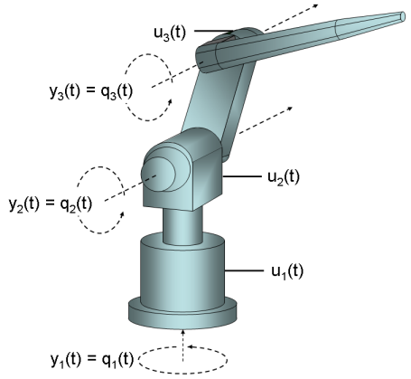
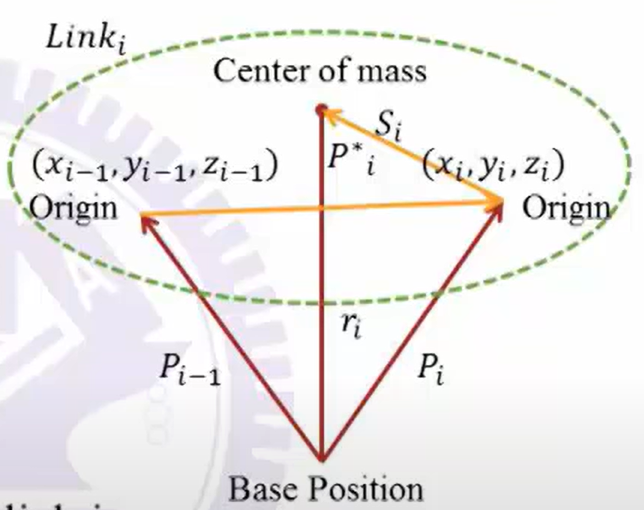
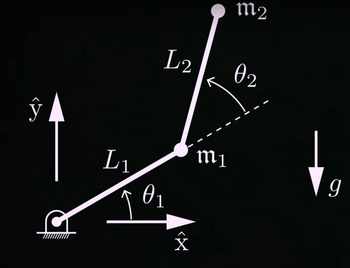

#! https://zhuanlan.zhihu.com/p/460840272
# 机器人动力学 (Dynamics) -2

## 1. 牛顿-欧拉方程 (Newton-Euler equations)

牛顿-欧拉方程描述了刚体的组合平移和旋转动力。传统上，牛顿-欧拉方程是使用列向量和矩阵将刚体的欧拉两个运动定律组合成一个具有 6 个分量的单个方程。这些定律将刚体重心的运动与作用在刚体上的力和扭矩（或力矩）之和联系起来。

对于原点与物体质心重合的坐标系，可以用矩阵形式表示为：

$$
\begin{bmatrix}
    F\\\tau
\end{bmatrix}=
\begin{bmatrix}
    mI_3 & 0\\
    0 & I_{cm}
\end{bmatrix}
\begin{bmatrix}
    a_{cm} \\ \alpha
\end{bmatrix} +
\begin{bmatrix}
    0 \\ \omega\times J_{cm}\omega
\end{bmatrix}
$$

其中：

- $F$: 作用在质心上的总力
- $m$: 物体的质量
- $I_3$: $3\times3$的单位矩阵
- $a_{cm}$: 质心加速度
- $v_{cm}$: 质心速度
- $\tau$: 围绕质心作用的总扭矩
- $J_{cm}$: 关于质心的转动惯量
- $\omega$: 物体的角速度
- $\alpha$: 物体的角加速度

在多轴机器人系统中，一段机械臂其关节的扭矩，除了受到本身自己的影响外，还会受到其前后两端机械臂的影响。因此在做动力学的时候，通常会将三段力放在一起考虑。

对于下图的link来说：

上图中的两个 Origin 分别是一个 link 上前后两端的 joint。由牛顿欧拉公式便可以写出此段 link 的受力：

$$
\begin{aligned}
F_i &= f_i -f_{i+1}\\
\,
\\
N_i &= [n_i+(P_{i-1}-r_i)\times f_i]-[n_{n+1}+(P_i-r_i)\times f_{r+1}]\\ 
&= (n_i-n_{i+1})+(P_{i-1}-r_i)\times f_i - (P_i-r_i) \times f_{i+1}\\
&= (n_i-n_{i+1})+(P_{i-1}-r_i)\times F_i - P_i^* \times f_{i+1}\\
&= (n_i-n_{i+1})+(P_i^*+S_i)\times F_i - P_i^* \times f_{i+1}\\
\end{aligned}
$$

$$
\begin{aligned}
    &\left\{
    \begin{array}{lr}
       f_i = F_i + f_{i+1}\\
       n_i = N_i + n_{i+1} + P_i^*\times f_{i+1} + (P_i^*+S_i)\times F_i
    \end{array}
    \right. \\
    \,
    \\
    &\left\{
    \begin{array}{lr}
       \tau _i = n_i^t \vec{Z}_{i-1}, \qquad R\\
        \tau _i = f_i^t \vec{Z}_{i-1}, \qquad P\\
    \end{array}
    \right.
\end{aligned}
$$

- $f_i$: 第 i 个关节受到前一段的外力
- $n_i$: 第 i 个关节受到前一段的扭矩
- $F_i$: 第 i 段关节受到的合力
- $N_i$: 第 i 个关节受到的合扭矩

依然拿之前的两轴机器人做为例题：

For link 1:

$$
\begin{aligned}
    &\omega_i = \dot{\theta_1}, \qquad \dot{\omega_i} = \ddot{\theta_1}\\
    &v_{ci} = \omega_i \times S_i + v_i\\
    &\dot{v}_{ci} = \dot{\omega}_i \times S_i + \omega_i \times(\omega_i \times S_i) +\dot{v_i}\\
    &\dot{v}_i+1 = \dot{\omega}_{i+1}\times P_{i+1}^* + \omega_{i+1}\times(\omega_{i+1}\times P_{i+1}^*) + \dot{v}_i,\qquad R\\
    \,
    \\
    &\dot{v}_1 = \dot{\omega}_{1}\times P_{1}^* + \omega_{1}\times(\omega_{1}\times P_{1}^*) + \dot{v}_0\\
    & \dot{v}_0 = 
    \begin{bmatrix}
        0\\g\\0
    \end{bmatrix}\\
    \,
    \\
    &\dot{v}_1 = \dot{\omega}_1\times
    \begin{bmatrix}
        l_1c_1\\l_1s_1\\0
    \end{bmatrix}+
    \omega_1\times (\omega_1\times
    \begin{bmatrix}
        l_1c_1\\l_1s_1\\0
    \end{bmatrix})+\dot{v}_0\\
    &\quad =\begin{bmatrix}
        -l_1s_1\ddot{\theta}_1-l_1c_1\dot{\theta}_1^2\\
        l_1c_1\ddot{\theta}_1-l_1s_1\dot{\theta}_1^2 + g\\
        0
    \end{bmatrix}\\
    \,
    \\
    &F_1 = m_1\dot{v}_1, \qquad N_1 = \begin{bmatrix}
        0\\0\\0
    \end{bmatrix}\\
\end{aligned}
$$

For link 2:
$$
\begin{aligned}
    &\omega_2 = \dot{\theta}_1 + \dot{\theta}_2\\
    &\dot{\omega_2} = \ddot{\theta}_1 + \ddot{\theta}_2\\
    &\dot{v}_2 = \dot{\omega}_2\times P_2^* + \omega_2\times [\omega_2\times P_2^*] + \dot{v}_1\\
    &\quad = \begin{bmatrix}
        -l_2s_{12}(\ddot{\theta}_1 + \ddot{\theta}_2)\\
        l_2c_{12}(\ddot{\theta}_1 + \ddot{\theta}_2)\\
        0
    \end{bmatrix}+
    \begin{bmatrix}
        -l_2c_{12}(\dot{\theta}_1 + \dot{\theta}_2)^2\\
        -l_2s_{12}(\dot{\theta}_1 + \dot{\theta_2})^2\\
        0
    \end{bmatrix}+
    \begin{bmatrix}
        -l_1s_1\ddot{\theta}_1 - l_1c_1\dot{\theta}_1^2\\
        l_1c_1\ddot{\theta}_1 -l_1s_1\dot{\theta}_1^2 + g\\
        0
    \end{bmatrix}\\
    \,
    \\
    &F_2 = m_2\dot{v}_2, \qquad N_2 = \begin{bmatrix}
        0\\0\\0
    \end{bmatrix}
\end{aligned}
$$

Force calculation:

$$
\begin{aligned}
    &f_2 = F_2 + f_3\\
    &n_2 = \begin{bmatrix}
        l_2c_{12}\\
        l_2s_{12}\\
        0
    \end{bmatrix}\times
    F_2=
    \begin{bmatrix}
        0\\0\\
        m_2[l_1l_2c_2\ddot{\theta}_1+l_1l_2s_2\dot{\theta}_1^2]+m_2l_2gc_{12} + m_2l_2^2(\ddot{\theta}_1 + \ddot{\theta}_2)
    \end{bmatrix}\\
    &f_1 = F_1 + f_2\\
    &n_1 = n_2 + P_1^*\times f_2 + P_1^*\times F_1= n_2 + 
    \begin{bmatrix}
        l_1c_1\\l_1s_1\\0
    \end{bmatrix}\times f_2 +
    \begin{bmatrix}
        l_1c_1\\l_1s_1\\0
    \end{bmatrix}\times F_1\\
    &\quad =\begin{bmatrix}
        0\\0\\
        m_2l_1^2\ddot{\theta}_1-m_2l_1l_2s_2(\dot{\theta}_1+\dot{\theta}_2)^2+m_2l_1l_2c_2(\ddot{\theta_1}+\ddot{\theta_2})+m_2l_1gc_1
    \end{bmatrix}
\end{aligned}
$$

至此两轴的牛顿欧拉法计算就结束了。我们可以观察到，牛顿欧拉是从机械臂的末端开始计算的，一直算到第一轴。

- 上篇：[机器人动力学(Dynamics) -1](https://zhuanlan.zhihu.com/p/460582634)
