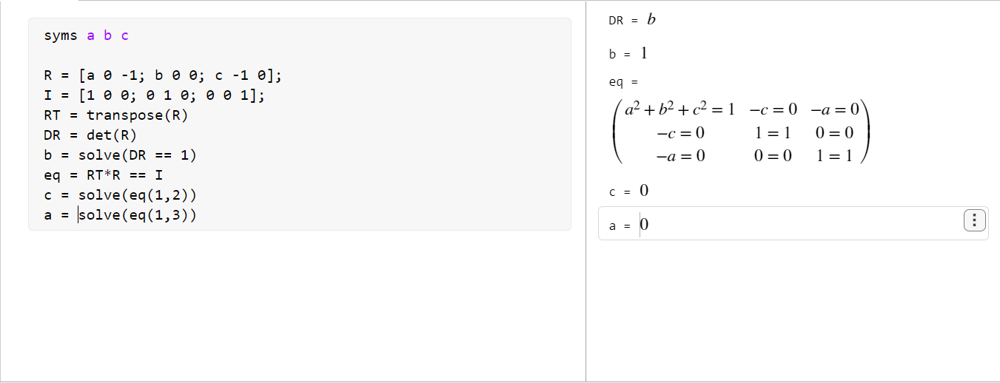

# Week2 Tutorial 

> 关于此 tutorial 的编程使用的是 Matlab online 中的 live script 完成

## Walk Through Week2

> 感觉题目都比较基础，就拿一道例题做吧。
### 
 
### Q1

> 利用旋转矩阵的性质来做此题：
> - 正交性 $RR^T = I$ 
> - 行列式为1
> - 每个列向量都是单位向量且相互正交

```Matlab
syms a b c 

R = [a 0 -1; b 0 0; c -1 0];
I = [1 0 0; 0 1 0; 0 0 1];
RT = transpose(R)
DR = det(R)
b = solve(DR == 1)
eq = RT*R == I
c = solve(eq(1,2))
a = solve(eq(1,3))
```



### Q2

