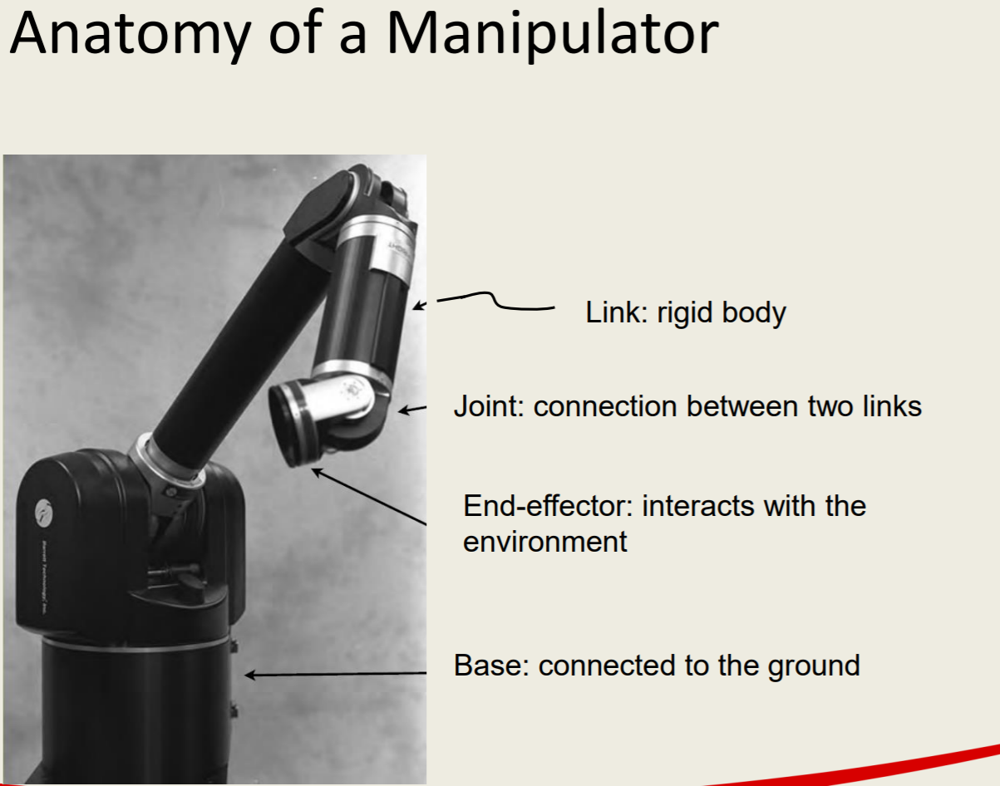
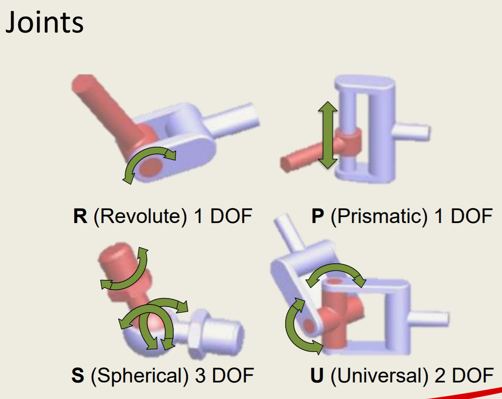
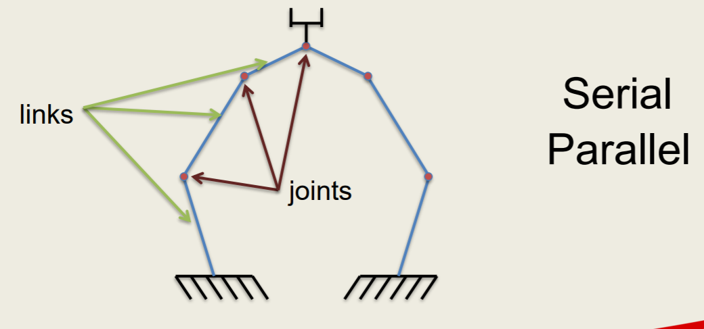
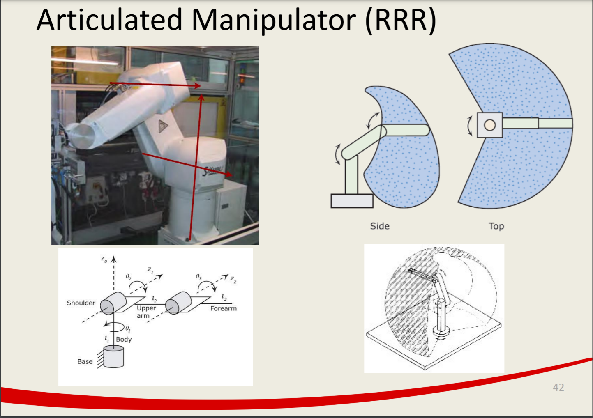

#! https://zhuanlan.zhihu.com/p/420409297
# Lec1. Intro to the concept of kinematics

> 本课程主要介绍了机器人运动学。使用DH矩阵计算运动学的正逆解，以及使用 Matlab 来做机器人末端执行器的运动仿真。课程相关内容可在[此处查看](链接：https://pan.baidu.com/s/1ZJyGgTrQg-uERRLKwN2W3g) - 提取码：hq65 

> 本来想认真学这门课的，但这课真的让人一言难尽。超烂的中东英语以及让我看到就难受的本科机械知识。我的本科学的让我很不爽，因为我觉得机械本是一个重实践的课程，然而学校居然让学生以课本上的知识为主，上课听讲 + 做题 + 考试。这样的授课模式到了 布里斯托 机器人专业 的硕士阶段 居然还要再来一次。我可真是谢谢了。

> 哎，气归气。分还是要拿的，多少做了一些笔记。以及我大概若真的对于这门课程感兴趣的同学，请直接查看课程资料。想偷懒的同学，看看笔记就好了。

**本门课程需要解决的关键问题：**

- When each joint is moved this much where would the end effector be?
- How do I move each joint to place the end effector there?
- How do I move each joint so the end effector is moving at a given velocity?
- How to generate a trajectory of the arm?
- How to control end effector’s force?
- How to control the end effector’s position, velocity and acceleration/force?

**一个机械臂的组成：**

**一些概念性的知识：**

- DOF
  - 机构的自由度（DOF 或 DOF）是定义其配置的独立参数的数量
- Joints
  - 
- KINEMATIC CHAINS
  - 一个机构可以链接一个或多个运动链连接基座和末端执行器
  - 运动链：由关节连接在一起的刚体系统。
  - 
  - Open loop or close loop 
- Mobility
  - 定义机制配置的参数数量
  - $ M = d(n - g - 1) + \sum_{i=0}^{g} f_i $
  - d = 6 for spatial mechanisms, d = 3 for planar
  - n : number of links including the ground link,
  - g : is the total number of joints
  - f_i : is the degrees of freedom in joint i
- Workspace
  - 工作区是末端执行器可到达的点集
  - 
- Manipulation
- Kinematics vs Inverse Kinematics
  - 由运动方式到最终运动到达的位置（坐标），称为：正向运动学
  - 由要运动到的坐标，求解运动，称为：逆运动学
