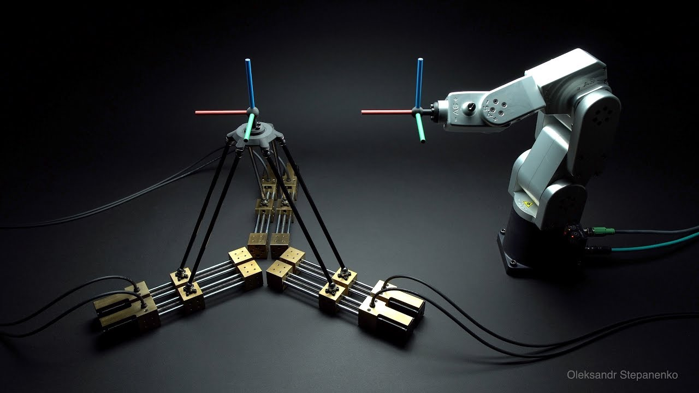
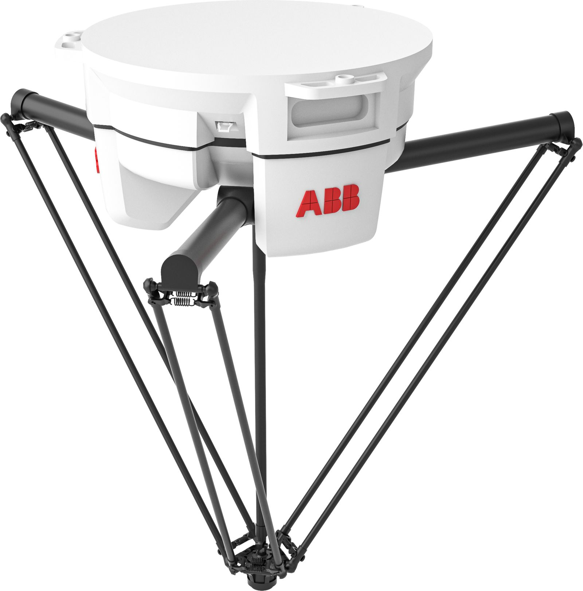
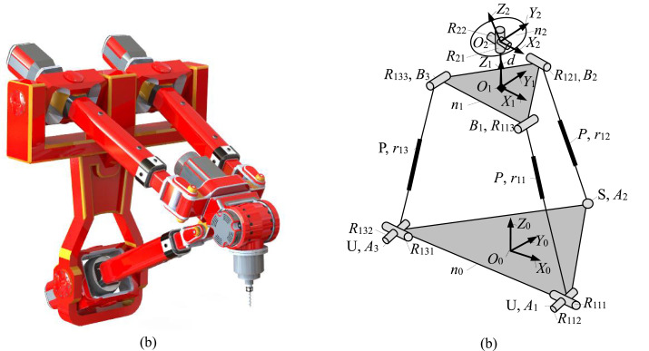
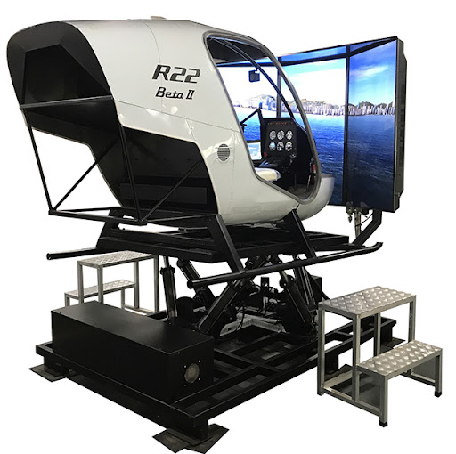
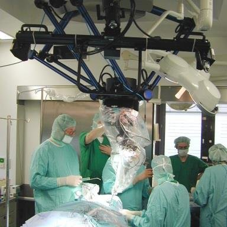

#! https://zhuanlan.zhihu.com/p/438810752
# 并联机器人(Parallel Robot) -- 1

## 1. 串联机器人与并联机器人对比

### 1.1 串联机器人

我相信大家最常见到的机器人就是串联机器人。也就是我们所说的机械臂。串行机械手的特点是工作空间大、灵巧性高，但也有几个固有的缺点。 这些缺点（相对于并联机器人）包括：

- 精度低
- 力控能力差 
- 有效载荷重量比低
- 电机不在底座上
- 大量运动部件导致高惯性

串联机器人的低精度源于累积的关节误差和链接中的挠度。低有效载荷重量比源于是因为每个执行器都需要支撑后继链节的重量。高惯量是由于大量的运动部件串联起来，从而形成高惯量的长梁。

此外串联机器人在进行逆向运动学的时候，往往会出现多个解。从而提升了控制的复杂程度。

### 1.2 并联机器人

由于这些问题的存在，工程师又开发出了并联机器人。由于其输出连杆的运动是通过同时驱动运动链的末端来实现的。 类似地，输出连杆所承载的载荷由各种运动链支撑； 因此，这种架构被称为并行架构。相比于串联机器人的开放形运动学，并联机器人的结构可以使用封闭运动学来计算。这样的好处是，在求解逆向运动学时只有一个解存在。

并联机械手有几个优点和缺点： 

- 缺点是：
  - 工作空间有限
  - 灵巧性低
  - 直接运动学解决方案复杂
  - 工作空间内部和包络上都出现奇点
- 优点是：
  - 高刚性和
  - 高有效载荷重量比
  - 高精度
  - 运动部件的低惯性
  - 高敏捷性
  - 逆运动学问题的简单解决方案

负载由多个运动链分担的事实导致高有效载荷重量比和刚度。 高精度源于共享而不是累积的关节误差。 基于并联机器人的优缺点，可以得出结论，此类机器人适用于包括对有限工作空间、高精度、高敏捷性以及轻巧紧凑的机器人的要求。

### 1.3 混合形

除了单纯的串联和并联外，还有混合形机器人。它是在并联机器人的基础上为其添加了一个灵巧的串联关节。

## 2. 并联机器人的应用

除了上面展示的 ABB Delta 工业机器人之外，并联机器人通常用于模拟飞行器平台之类的项目上。

除此之外，并联机器人在医疗方面也有较多的应用。由于并联机器人的敏捷性，精准性以及小工作范围的特性使得并联机器人可以在手术场景中大展身手。

下篇：[并联机器人(Parallel Robot) -- 2]()