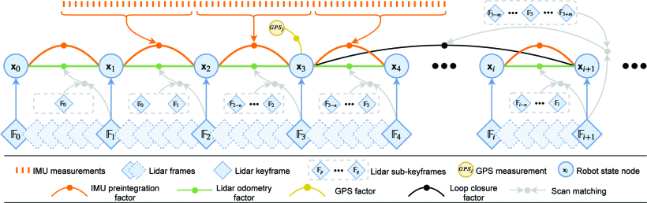

#! https://zhuanlan.zhihu.com/p/420382484
# 论文阅读 【LIO-SAM】

> 非常感谢 [@robot L] 发表的[LIO-SAM 论文阅读笔记](https://www.zhihu.com/people/robot-l-88)https://zhuanlan.zhihu.com/p/153394930 对我的阅读提供了巨大的帮助。

## Motivation

Although the existing lidar odometry and mapping (LOAM) method has provided a solution for simultaneous localization and mapping (SLAM), its saving data in a global voxel map method makes it hard to perform loop closure detection and incorporate other absolute measurements. Another limitation of LOAM is its scan-matching-based method, which causes drift in large-scale tests. The motivation of this paper is to solve these problems with a framework called tightly-coupled lidar inertial odometry via smoothing and mapping (LIO-SAM).

## Contribution

- A tightly-coupled lidar inertial odometry framework built atop a factor graph suitable for multi-sensor fusion and global optimization.
- An efficient, local sliding window-based scan-matching approach enables real-time performance by registering selectively chosen new keyframes to a fixed-size set of prior sub-keyframes.
 

## Content

The core idea for this method can be illustrated with the following graph.

Fig1. The system structure of LIO-SAM.

An overview of the proposed system is shown in Figure 1. The system receives sensor data from a 3D lidar, an IMU and optionally a GPS. We seek to estimate the state of the robot and its trajectory using the observations of these sensors. This state estimation problem can be formulated as a maximum a posteriori (MAP) problem. We use a factor graph to model this problem, as it is better suited to perform inference when compared with Bayes nets. With the assumption of a Gaussian noise model, the MAP inference for our problem is equivalent to solving a nonlinear least-squares problem. Note that the proposed system can incorporate measurements from other sensors without loss of generality, such as elevation from an altimeter or heading from a compass.

We introduce four types of factors along with one variable type for factor graph construction. This variable, representing the robot’s state at a specific time, is attributed to the nodes of the graph. The four types of factors are: (a) IMU preintegration factors, (b) lidar odometry factors, (c) GPS factors, and (d) loop closure factors. A new robot state node x is added to the graph when the change in robot pose exceeds a user-defined threshold. The factor graph is optimized upon the insertion of a new node using incremental smoothing and mapping with the Bayes tree (iSAM2) [19]. The process for generating these factors is described in the following sections.

### IMU Preintegration Factor

IMU can give us measurements of angular velocity and acceleration . The IMU bias is jointly optimized alongside the lidar odometry factors in the graph. IMU preintegration method is used to obtain the relative body motion between two timesteps.

### Lidar Odometry Factor

they use a method called Keyframe selection, which is widely used in the visual SLAM field, to reduce computation. How is keyframe choosed? They start with a robot state x0, then robot start to move. When the pose exceeds the a user-defined threshold, then a keyframe is captured. Any thing between two frame we just discard it. That's how the robot state x is estimated. As for the map, a method called sliding window is used here. It chose a few sub-keyframes between the keyframes and use the data from these frames to compute the transformation. 

### GPS Factor

In practice, we only add a GPS factor when the estimated position covariance is larger than the received GPS position covariance to adjust local map.

### Loop Closure Factor

Thanks to the utilization of a factor graph, loop closures can also be seamlessly incorporated into the proposed system, as opposed to LOAM and LIOM.