# Daoming Chen's report

> Student Name: Daoming Chen
> Student number: 2132643

## Week 1

### Seminars: Robotics challenges and opportunities in the nuclear sector -- Prof. Tom B Scott

Robots that work in the nuclear field is called hot robot. The reason for letting robots work in the nuclear field is less cost, more output, reduced risk for humans, and saving time. Many types of robots are employed here to do tasks like nuclear waste store scanning, hot spot detect and 3D mapping the hazard area. Lidar SLAM technology is significantly used in hot robots. Many of the projects are to use robots to provide 3D point cloud maps about a hazard area. Then find where the hot spot region is based on the radiation map. 

### Seminars: Robots with simulation-based internal models -- Alan Winfield

An internal model is a centralized or distributed mechanism for a robot to simulate itself and the environment inside itself. The internal model is used for a robot to control itself accurately and precisely. The picture below shows the flowchart of the consequence engine. Experiments like avoiding collision in the dynamic environment can be done by using the consequence engine. It can achieve ethical tasks like preventing people from encountering danger. Another application of the consequence engine is a chatbot. It let robots tell stories to each other and explain themselves.

 
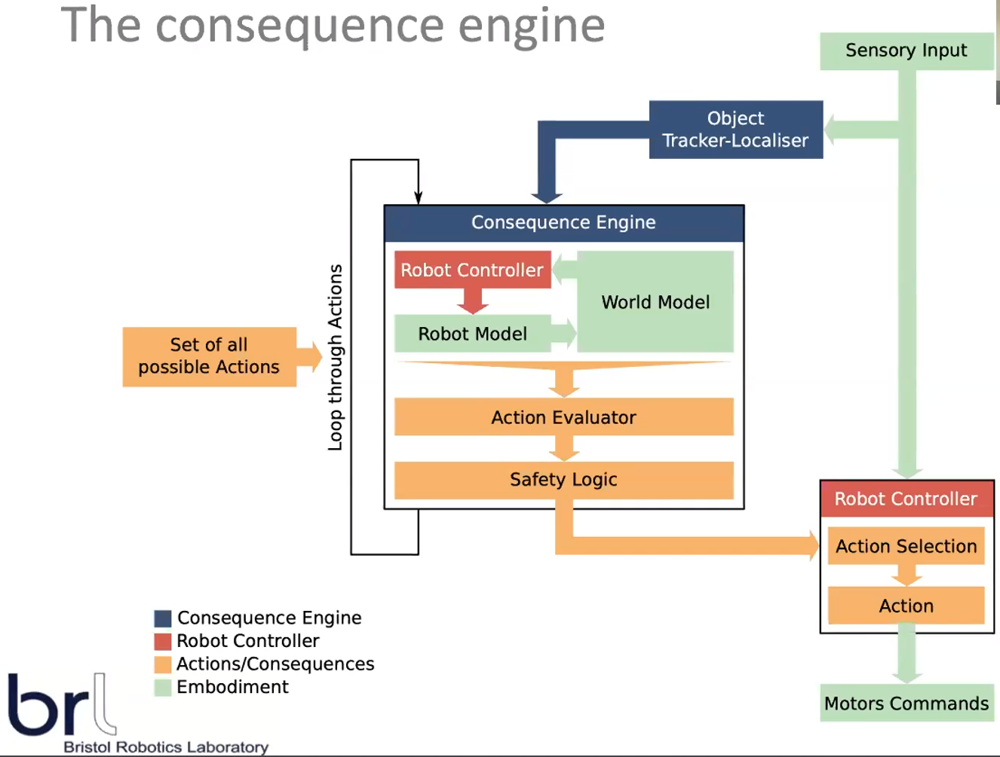

 Fig1. Flowchart of consequence engine

### Paper: LIO-SAM: Tightly-coupled Lidar Inertial Odometry via Smoothing and Mapping -- Tixiao Shan

This paper proposed a Lidar SLAM framework called LIO-SAM based on Lidar Odometry and Mapping (LOAM) framework. Using factor map as its core system structure, LIO-SAM makes the fusion of absolute measurement available to seamlessly adjust the robot's trajectory. The keyframe selection method helped reduce computation, which makes the framework faster than others. LIO-SAM can provide more accurate maps during the tests with the sliding window method and the scan match method used during Lidar scanning. When comparing LIO-SAM with other SLAM frameworks by testing them in 5 datasets, LIO-SAM can always prove itself to be the best, and that makes it stand out.

### Group Reading: Tues 12th Oct 2021. Robust Autonomous Navigation of a Small-Scale Quadruped Robot in Real-World Environments -- Thomas Dudzik

> I'm the only one presented in my group this week, so here is another paper I read.

This paper proposed a small-scale quadruped robot -- MIT Mini Cheetah Vision. A motion and path plan system that is built for small robots with limited computing power. The robot can autonomously plan a path in the real world and run with a speed of 1m/s. The figure below shows that the framework for state estimation is a two-tiered hierarchical structure. The two highers are high-level planning and low-level locomotion control. As for motion control, methods like Regularized Predictive Control (RPC) to find reaction forces, Whole-Body Impulse Control (WBIC) to control the joints, A* to plan path. 

 
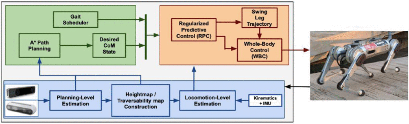

Fig2. High-Level System Architecture

## Week 2

### Seminars: Machine Vision in the composites industry: Polarised light or deep learning -- Gary Atkinson

Although computer vision is widely used in industrial detection, it is still struggling with carbon fiber detection. The challenge is that the surface of carbon fiber is black and shiny, which makes defect detection hard. However, the polarisation of light could be a solution to this problem. Because carbon fiber structure has two phases, we can use polarised light to separate these two phases in a picture, making global defect detection feasible. We can detect and even classify local defects from an angle graph by applying the deep learning method. 

 
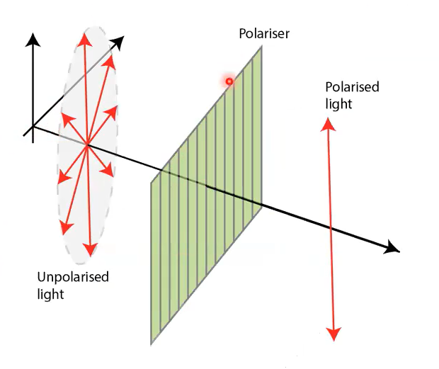

Fig3. The graph of polarised light

### Seminars: Morphological Computation: the hidden superpower of soft bodies -- Helmut Hauser

Morphology which gets inspired by nature can be a crucial principle to build intelligent machines. Even if there is no controller, sensor, or brain, things can only react intelligently to the changing environment by morphology. The challenge is how to build a body that can improve interaction with the environment and facilitate learning and control. A few projects based on the theory, like spider's web, sensing skin, and jellyfish robot. The next level of this theory is to figure out logical function in morphology. This area will engage with chemical and biological knowledge to build robots that can perform locomotion logically.

 
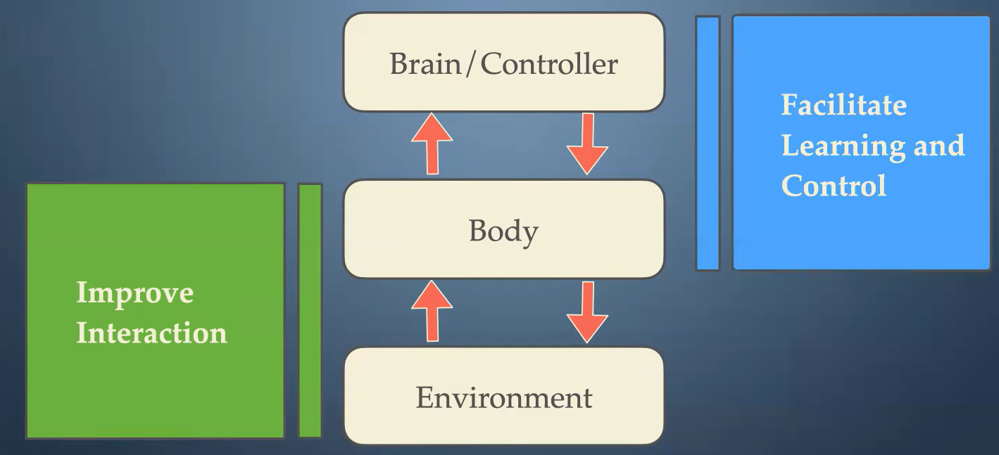

Fig4. The key structure of morphological robot

### Paper: ORB-SLAM3: An Accurate Open-Source Library for Visual, Visual-Inertial, and Multi-Map SLAM -- Carlos Campos

ORB-SLAM3 is an open-sourced visual-inertial SLAM framework. ORB-SALM3's mapping accuracy is 2-5 times better than the old ORB-SLAM2, and it's proved to be the best visual SLAM framework. They novelty proposed a multiple map system that can start a new map when features are lost. The new map can be seamlessly merged with the previous map, which makes this ORB-SLAM3 more robust. The graph below shows all data from the camera, and IMU will go through the tracking thread to decide a keyframe, which forms the local map. Then after place recognition, loop correction, and map merging, they become part of the entire map. 

 
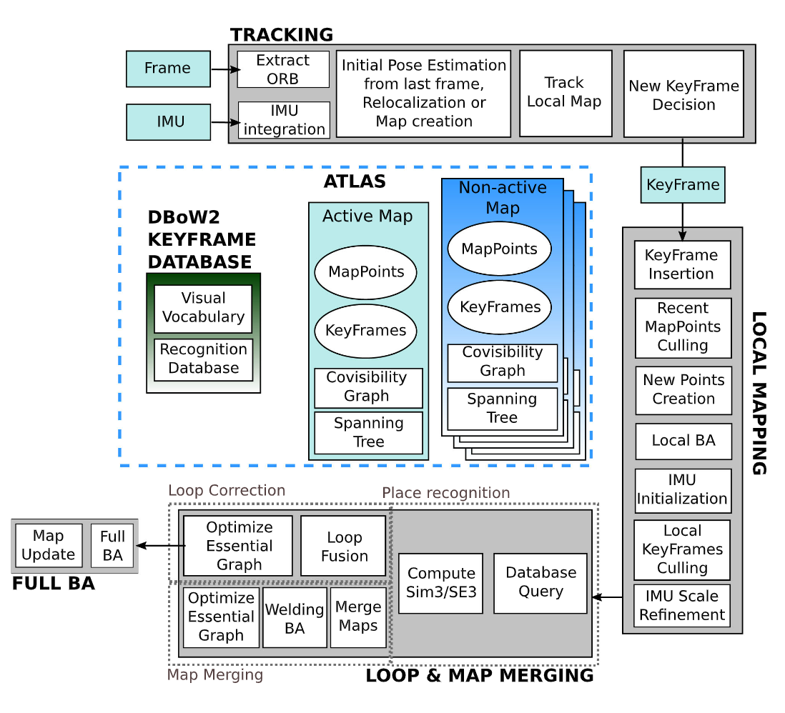

 Fig5. Main system components of ORB-SLAM3

### Group Reading: Design of a Low-Cost Miniature Robot to Assist the COVID-19 Nasopharyngeal Swab Sampling -- written by Shuangyi Wang, presented by Shiqi Gao

This paper proposed a low-cost COVID nasopharyngeal swab sampling(np) robot. The robot has a 2-DOF gripper with an integrated force sensor and a 6-DOF arm with an inertial measurement unit(IMU). By limiting the motor's current and using variable-monitor software, the robot can work safely. The robot cost 55USD and weighed 0.25Kg making it stand out. The robot was tested on a commercial nasopharynx phantom and three pig noses, and the results proved the implementation safety. But I think something is missing from this paper. They didn't address how the robot finds a nostril, which I think might be hard for the robot. 

 
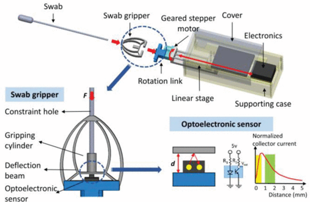

 Fig6. 2-DOF Active End-effector 

 

 
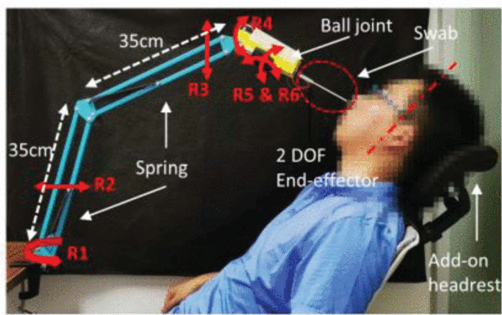

 Fig7. Implementation of the robot  

## Week3

### Seminars: Robot learning for dexterous manipulation -- Dandan Zhang

The seminar introduced reinforcement learning for building intelligent robots to complex tasks and adapting different scenes in a shorter time and with fewer data. The challenge is to overcome the current limitations like the black-box effect, large data requirements, lack of generalizability. The solution to this challenge is called an explainable learning algorithm. This method uses a hierarchy structure, as it is shown in Fig 8, to improve training procedures. What impressed me the most is robustly shown in Fig9. Except for the case study of pouring drink, the explainable learning algorithm can also be applied in other fields like a medical robot, industrial robot, etc.

 
 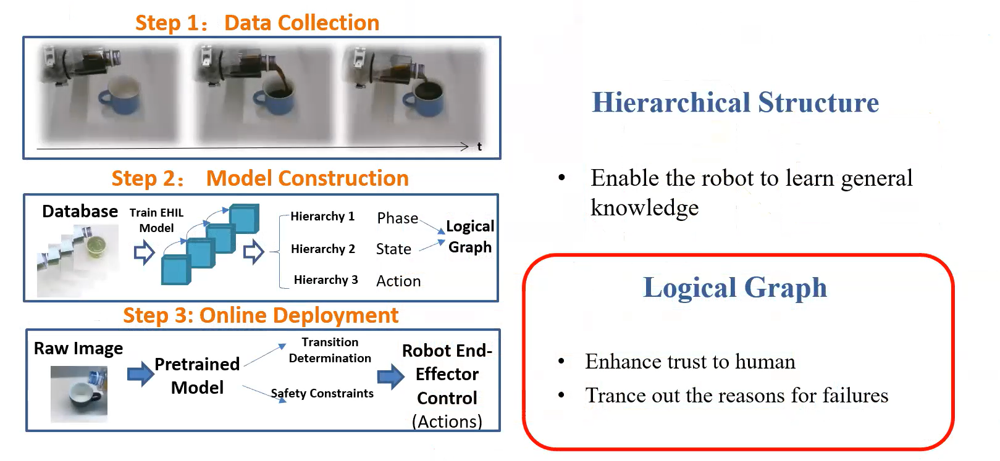

 Fig8. The hierarchy structure of explainable learning 

 

 
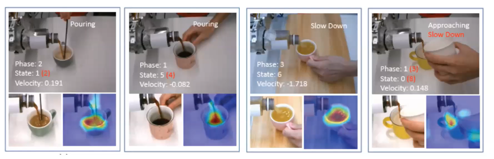

 Fig9. Task with human interfere 

### Seminars: From AI to Robot Dexterity: A Revolution Happening Now -- Prof. Nathan Lepora

Robot dexterity with AI is a valuable field that may level up the entire robotic industry. A group led by Prof. Lepora is now working on tactile robotics in BRL. Prof. Lepora is working on soft biomimetic touch with AI, which is an excellent approach to robot dexterity. Another project called skin-like touch sensors can provide accurate force feedback when the sensor is touched. A 3D-printed tactile hand can pinch irregular fragile objects without breaking them. A sim-to-real deep reinforcement learning for tactile robots can cut down the training effort for robots. 

### Paper: Simultaneous Localization and Mapping: A Survey of Current Trends in Autonomous Driving -- Guillaume Bresson

Simultaneous Localization and Mapping (SLAM) has a long history of development. Recent solutions are acceptable but still have some limitations. A critical limit is the drift of the map when SLAM is applied in long-term tests. The possible techniques for this challenge are decomposing the global map into a fusion of small-size maps and multi-sensor fusion. For single-vehicle SLAM, the challenges are 1. how to reduce drift by recognizing the same object in different views. 2. How to locate in the previously built map using object recognition. Centralized SLAM and decentralized SLAM are both possible approaches for multi-vehicle SLAM, but both are challenging. Future SLAM may use more Deep learning methods to build semantic maps.

### Reading Group: Continuum Robots for Medical Applications: A Survey -- -- written by Jessica Burgner, presented by Zhengri Xu

The precision and continuum make the robotic system an excellent solution to perform minimally invasive surgery. Compared to traditional rigid robots, Continuum robots have more flexibility and agility, which makes continuum robots essential in minimally invasive surgery. Nowadays, continuum medical robots usually are composed of many small discrete joints, and by applying standard Denavit–Hartenberg (D–H) parameter tables to simulate the kinetics model. However, the challenge kinemics model is the complexity, accuracy, and computational expense. Many medical areas like neurosurgery, otolaryngology, etc., are demanding continuum robots. However, there are still challenges like instrumentation, visualization, OR integration,  human-machine interactions, and force sensing requiring researchers to solve.

# Week 4

## Seminars: Evolutionary Swarm Robotics -- Matt Studley

Swarm robots are a group of robots working on a big project without a global controller. Robots can work distributively and parallel to each other. This strategy can provide lower cost and fault tolerance in mass production. However, the challenge is how to build a rule for robots to interact with each other and finish the project. One approach for this problem is to use machine learning to simulate evolution, which means deriving a better robot behavior by machine learning iterating. Running simulations on many individual robots in a swarm and allowing them to share an optimal controller with a smaller number of neighbors can speed up the evolution without a global controller. 

## Seminars: Evolutionary Swarm Robotics -- Matt Studley

## Paper: Algorithm and hardware implementation for visual perception system in autonomous vehicle: A survey -- WeijingShi

Autonomous vehicles norally need hardwares like, LIDAR, camera, GPS, GPU, FPGA, radar, ultra-sonic combined with machine learning algorithms for process data to achieve SLAM and navigation. 

https://www.sciencedirect.com/science/article/pii/S0167926017303218#s0035

## Reading Group: The SPIR: An Autonomous Underwater Robot for Bridge Pile Cleaning and Condition Assessment -- written by Khoa Le, presented by Yuehang YU

This paper proposed an autonomous underwater robot called SPIR that can navigate and do SLAM. This robot can do divers' tasks like inspecting and removing marine from wharf piles. The challenge for the robot is to keep stable while working in a turbulent underwater environment. To overcome this problem, the robot has four grasping arms to keep itself stick on the pile, as illustrated in figure 10. As fig 11 shows, the robot's power and jet generator are onshore to reduce its weight. The results in figure 12 show that navigation and grasping pile performance is good, but it struggled with finding the target. 

 
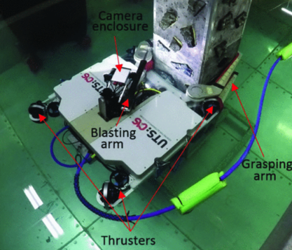

 Fig10. SPIR and the main components 

 

 
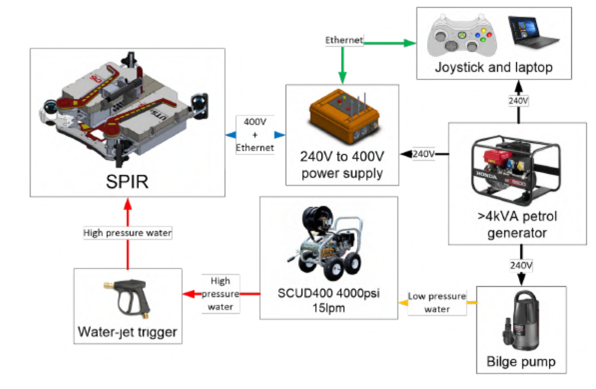

 Fig11. An overview of the SPIR system 

 
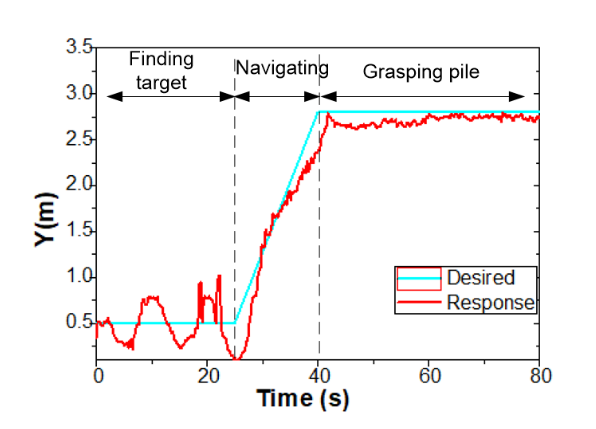

 Fig12. Navigation towards the target pile 

