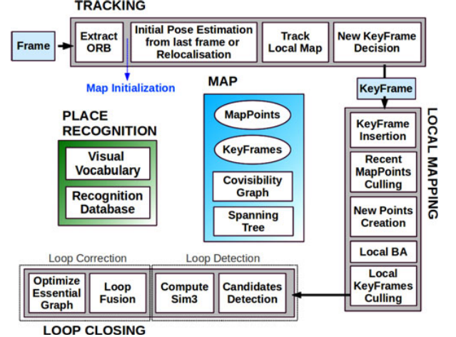
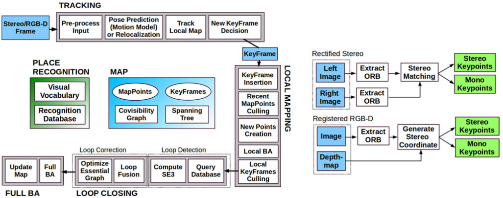

# Daoming Chen's report

> Student Name: Daoming Chen
> Student number: 2132643

## Week 3

### Seminars:

#### Mon 11th October 2021. Robotics challenges and opportunities in the nuclear sector -- Prof. Tom B Scott

Robots that work in the nuclear field is called hot robot. The reason for letting robots work in the nuclear field is less cost, more output, reduced risk for humans, and saving time. Many types of robots are employed here to do tasks like nuclear waste store scanning, hot spot detect and 3D mapping the hazard area.

One challenge in this area is the automation and robustness of the robots. Since the robots are working in hazardous areas, engineers can't fix them when they lose control. Another challenge is the mapping accuracy. If the robot can't provide an accurate environment map, it's hard to complete its tasks without human assistance.

#### Mon 11th October 2021. Robots with simulation-based internal models -- Alan Winfield

An internal model is a centralized or distributed mechanism for a robot to simulate itself and its surroundings using a simulator inside a robot. The internal model is used for a robot to control itself accurately and precisely. It can train robots to do tasks like avoiding collision in a dynamic environment. 

One challenge of this field is to simulate the dynamic environment and make decisions in real-time. In the real world, the robot may have planed a path, but it needs to change its move very quickly due to the changing environment. But if the robot can change its mind, then when it faces many tasks simultaneously, the robot may keep changing its mind and fail all the missions.

### Group Reading:

#### Tues 12th Oct 2021. Paper: LIO-SAM: Tightly-coupled Lidar Inertial Odometry via Smoothing and Mapping -- Tixiao Shan

LIO-SAM is a Lidar SLAM framework using factor map as its system structure. The paper discovered that when tightly-coupled lidar with IMU, the accuracy of SLAM is increased. The factory map and keyframe selection method can help reduce the redundant data processing volume, which allows the framework to run in real-time.

I think LIO-SAM is an excellent framework because it allows GPS to be an optional trajectory-adjust device. It's closer to real-world situations where vehicles can rely on GPS and Lidar to obtain their location and mapping the environment. However, it's still hard to handle a highly dynamic environment like a city road.

#### Tues 12th Oct 2021. Robust Autonomous Navigation of a Small-Scale Quadruped Robot in Real-World Environments -- Thomas Dudzik

> I'm the only one presented in my group this week, so here is another paper I read.

This paper proposed a small-scale quadruped robot -- MIT Mini Cheetah Vision. The challenge for this project is to build a motion and path plan system based on visual perception for low computing power small robots. But the team devised a 2-hierarchy control structure to achieve path plan and locomotion control tasks.

It's essential but challenging engineering to equip the previous blind Mini Cheetah robot with vision. Now, the robot can make higher-level path plan decisions to increase the success of Mini Cheetah running in complex real-world terrain. However, I think the robot can perform better if a pre-train neural network is applied to the robot.

## Week 4

### Seminars:

#### Mon 18th Oct 2021. Machine Vision in the composites industry: Polarised light or deep learning -- Gary Atkinson

Although computer vision is widely used in industrial detection, it is still struggling with carbon fiber detection. The challenge is that the surface of carbon fiber is black and shiny, which makes defect detection hard. However, the polarisation of light could be a solution to this problem. Because carbon fiber structure has two phases, we can use polarised light to separate these two phases in a picture, making global defect detection feasible. We can detect and even classify local defects from an angle graph by applying the deep learning method. 

 

Fig3. The graph of polarised light

####  Mon 18th Oct 2021. Morphological Computation: the hidden superpower of soft bodies -- Helmut Hauser

Morphology which gets inspired by nature can be a crucial principle to build intelligent machines. Even if there is no controller, sensor, or brain, things can only react intelligently to the changing environment by morphology. The challenge is how to build a body that can improve interaction with the environment and facilitate learning and control. A few projects based on the theory, like spider's web, sensing skin, and jellyfish robot. The next level of this theory is to figure out logical function in morphology. This area will engage with chemical and biological knowledge to build robots that can perform locomotion logically.

 

Fig4. The key structure of morphological robot

### Group Reading: 

#### Tues 19th Oct 2021. ORB-SLAM3: An Accurate Open-Source Library for Visual, Visual-Inertial, and Multi-Map SLAM -- Carlos Campos

ORB-SLAM3 is an open-sourced visual-inertial SLAM framework. ORB-SALM3's mapping accuracy is 2-5 times better than the old ORB-SLAM2, and it's proved to be the best visual SLAM framework. They novelty proposed a multiple map system that can start a new map when features are lost. The new map can be seamlessly merged with the previous map, which makes this ORB-SLAM3 more robust. The graph below shows all data from the camera, and IMU will go through the tracking thread to decide a keyframe, which forms the local map. Then after place recognition, loop correction, and map merging, they become part of the entire map. 

 

 Fig5. Main system components of ORB-SLAM3

#### Tues 19th Oct 2021. Design of a Low-Cost Miniature Robot to Assist the COVID-19 Nasopharyngeal Swab Sampling -- written by Shuangyi Wang, presented by Shiqi Gao

This paper proposed a low-cost COVID nasopharyngeal swab sampling(np) robot. The robot has a 2-DOF gripper with an integrated force sensor and a 6-DOF arm with an inertial measurement unit(IMU). By limiting the motor's current and using variable-monitor software, the robot can work safely. The robot cost 55USD and weighed 0.25Kg making it stand out. The robot was tested on a commercial nasopharynx phantom and three pig noses, and the results proved the implementation safety. But I think something is missing from this paper. They didn't address how the robot finds a nostril, which I think might be hard for the robot. 

 

 Fig6. 2-DOF Active End-effector 

 

 

 Fig7. Implementation of the robot  

## Week 5

### Seminars:

#### Mon 25th Oct 2021. Robot learning for dexterous manipulation -- Dandan Zhang

The seminar introduced reinforcement learning for building intelligent robots to complex tasks and adapting different scenes in a shorter time and with fewer data. The challenge is to overcome the current limitations like the black-box effect, large data requirements, lack of generalizability. The solution to this challenge is called an explainable learning algorithm. This method uses a hierarchy structure, as it is shown in Fig 8, to improve training procedures. What impressed me the most is robustly shown in Fig9. Except for the case study of pouring drink, the explainable learning algorithm can also be applied in other fields like a medical robot, industrial robot, etc.

 
 

 Fig8. The hierarchy structure of explainable learning 

 

 

 Fig9. Task with human interfere 

#### Thur 28th Oct 2021. From AI to Robot Dexterity: A Revolution Happening Now -- Prof. Nathan Lepora

Robot dexterity with AI is a valuable field that may level up the entire robotic industry. A group led by Prof. Lepora is now working on tactile robotics in BRL. Prof. Lepora is working on soft biomimetic touch with AI, which is an excellent approach to robot dexterity. Another project called skin-like touch sensors can provide accurate force feedback when the sensor is touched. A 3D-printed tactile hand can pinch irregular fragile objects without breaking them. A sim-to-real deep reinforcement learning for tactile robots can cut down the training effort for robots. 

### Group Reading: 

#### Tues 26th Oct 2021. Simultaneous Localization and Mapping: A Survey of Current Trends in Autonomous Driving -- Guillaume Bresson

Simultaneous Localization and Mapping (SLAM) has a long history of development. Recent solutions are acceptable but still have some limitations. A critical limit is the drift of the map when SLAM is applied in long-term tests. The possible techniques for this challenge are decomposing the global map into a fusion of small-size maps and multi-sensor fusion. For single-vehicle SLAM, the challenges are 1. how to reduce drift by recognizing the same object in different views. 2. How to locate in the previously built map using object recognition. Centralized SLAM and decentralized SLAM are both possible approaches for multi-vehicle SLAM, but both are challenging. Future SLAM may use more Deep learning methods to build semantic maps.

#### Tues 26th Oct 2021. Continuum Robots for Medical Applications: A Survey -- -- written by Jessica Burgner, presented by Zhengri Xu

The precision and continuum make the robotic system an excellent solution to perform minimally invasive surgery. Compared to traditional rigid robots, Continuum robots have more flexibility and agility, which makes continuum robots essential in minimally invasive surgery. Nowadays, continuum medical robots usually are composed of many small discrete joints, and by applying standard Denavit–Hartenberg (D–H) parameter tables to simulate the kinetics model. However, the challenge kinemics model is the complexity, accuracy, and computational expense. Many medical areas like neurosurgery, otolaryngology, etc., are demanding continuum robots. However, there are still challenges like instrumentation, visualization, OR integration,  human-machine interactions, and force sensing requiring researchers to solve.

## Week 7

### Seminars: 
#### Mon 8th Nov 2021. Evolutionary Swarm Robotics -- Matt Studley

Swarm robots are a group of robots working on a big project without a global controller. Robots can work distributively and parallel to each other. This strategy can provide lower cost and fault tolerance in mass production. But, setting a rule for robots to interact with each other and finish the project is a big challenge. One approach for this problem is to use machine learning to simulate evolution, which means deriving a better robot behavior by machine learning iterating. Running simulations on many individual robots in a swarm and allowing them to share an optimal controller with a few neighbors can speed up the evolution without a global controller. 

#### Mon 8th Nov 2021. Robotics Ethical, Legal, Societal -- Matt Studley

Technology is neutral with no ethics. But when humans apply technology to the world, there are feedbacks on ourselves. Because the world we are living in is a dynamic system. As for robots, before creating, the roboticists should think of the effect the robot might have on humans. Ethical, legal, and societal are three types of problems. From an ethical view, We expect robots should promote human wellbeing without harming humans and ruining anyone's rights. From a societal aspect, robots may cause layoffs in the industry, and that will cause significant problems in our society. The further problem is that we have no legal system set for now. 

### Group Reading: 

####  Tues 9th Nov 2021. Algorithm and hardware implementation for visual perception system in autonomous vehicles: A survey -- WeijingShi

Autonomous vehicles' hardware can typically be divided into preception systems and computing systems. In preception systems, cameras can capture important objects as videos in real-time. LIDAR can measure the environment's depth preciser than cameras. Radar and ultrasonic act as fail-safe and prevent an accident from happening. To process the massive data from sensors, a powerful computing system is required. CPUs are no doubt needed, and GPUs are required to speed up image process algorithms, sometimes CNN. FPGAs can enhance computation efficiency and minimize energy consumption over CPU and GPU. All those hardware combined with software,  algorithms, and AI formed the fundamentals of autonomous vehicles.

#### Tues 9th Nov 2021. The SPIR: An Autonomous Underwater Robot for Bridge Pile Cleaning and Condition Assessment -- written by Khoa Le, presented by Yuehang YU

This paper proposed an autonomous underwater robot called SPIR that can navigate and do SLAM. This robot can do divers' tasks like inspecting and removing marine from wharf piles. The challenge for the robot is to keep stable while working in a turbulent underwater environment. As for that, the robot is designed to have four grasping arms to keep itself stick on the pile, as illustrated in figure 10. As fig 11 shows, the robot's power and jet generator are onshore to reduce its weight. The results in figure 12 show that navigation and grasping pile performance is good, but it struggled with finding the target. 

 

 Fig10. SPIR and the main components 

 

 

 Fig11. An overview of the SPIR system 

 

 Fig12. Navigation towards the target pile 

## Week 8

### Seminars:

#### Mon 15th Nov 2021. Robot Skill Learning and Human Robot Share Control -- Prof. Chenguang Yang

This seminar introduced how robots can co-work with humans and take advantage of human's intelligence and robot strength.
By applying reinforcement learning, robots can imitate human motion and force from teaching. The teaching method can be either by hand or through a joystick, and the force loaded on the manipulator can be feedback as an impedance to the operator. The challenge in this field is to give better sensory feedback to human operators, be more adaptable to different human operators, and be more general to different performing environments. That requires the system to have better sensor fusion ability, more advanced reinforcement learning method. 

#### Thur 18th Nov 2021. Two Case Study of Aerial Robotics -- Tom Richardson

The professors' research mainly focused on novel sensing and novel control system for aerial robotics. The first case study is giraffe conservation in Cameroon. The challenge, in this case, is using drones to cover a 1600 square km area and fully automated discovery and identification of individual animals. The second case is sampling volcanic ash in Guatemala. The challenge is to let UAVs collect samples within the eruptions. The team has achieved 3D mapping of the volcano's geography by a single flight. The problem for now is that the pre-planned missions can't reacte to dynamic envirnoment in real time, which requires human intervention. 

## Group Reading:

#### Tues 16th Nov 2021. Software Architecture for Humanoid Robots with Versatile Task Performing Capabilities -- written by Hyeong-Seok Jeon, presented by Lin Yuan

> I don't think this paper is worth reading.

#### Tues 16th Nov 2021. ORB-SLAM: A Versatile and Accurate Monocular SLAM System -- Raúl Mur-Artal

ORB-SLAM is a visual SLAM system developed from Parallel Tracking and Mapping (PTAM) SLAM. The challenge is to solve real-time SLAM with loop closure and occlusion processing at limited computational speed. However, ORB-SLAM uses ORB feature points and keyframes selection and delete method to keep the mapping procedure stable. When tracking is failed, a recovery mechanism allows the SLAM procedure back on track. Fig13 illustrates the structure of the ORB-SLAM system, which can be divided into tracking, mapping, loopback, partial mapping, location recognition modules. In conclusion, it solved the loop closure, processing occlusion, relocation, and keyframe management problems that PTAM suffers. In addition, it increased the accuracy.

 

 Fig13. ORB-SLAM system overview 

## Paper: ORB-SLAM2: An Open-Source SLAM System for Monocular, Stereo, and RGB-D Cameras -- Raúl Mur-Artal

ORB-SLAM2 is an improved SLAM system based on ORB-SLAM. The monocular ORB-SLAM has the problem of scale, so the author thought of using the stereo camera to solve the problem of monocular scale estimation. As Fig14 illustrated, the system is mainly divided into three parts, tracking, mapping, looping. The tracking part will unify the sensors so that regardless of whether the input is RGB-D or stereo image, it is finally converted into a monocular point for processing. From code view, the system has changed a lot in their program, like using pangolin instead of ROS to display results which saves time for compiling.

 

 Fig14. ORB-SLAM2 system overview 
