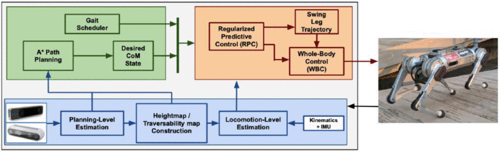

#! https://zhuanlan.zhihu.com/p/433219043
# 机器人领域论文阅读 -- 1

## 1. 具有基于仿真的内部模型的机器人 -- Alan Winfield

内部模型是机器人模拟自身和自身内部环境的集中式或分布式机制。 内部模型用于机器人准确和精确地控制自己。 下图显示了结果引擎的流程图。 在动态环境中避免碰撞等实验可以通过使用结果引擎来完成。 它可以完成道德任务，例如防止人们遇到危险。 结果引擎的另一个应用是聊天机器人。 它让机器人互相讲故事并解释自己。

 

 Fig1. Flowchart of consequence engine

## 2. LIO-SAM：通过平滑和映射紧密耦合的激光雷达惯性里程计 -- Tixiao Shan

本文基于激光雷达测距和建图（LOAM）框架提出了一种称为LIO-SAM的激光雷达SLAM框架。 LIO-SAM以因子图为核心体系结构，融合绝对测量，无缝调整机器人轨迹。 关键帧选择方法有助于减少计算，这使得该框架比其他框架更快。 LIO-SAM 可以通过滑动窗口方法和激光雷达扫描过程中使用的扫描匹配方法在测试过程中提供更准确的地图。 通过在 5 个数据集中测试 LIO-SAM 与其他 SLAM 框架进行比较时，LIO-SAM 总能证明自己是最好的，这让它脱颖而出。

## 3. 真实环境中小型四足机器人的稳健自主导航

本文提出了一种小型四足机器人——MIT Mini Cheetah Vision。 为计算能力有限的小型机器人构建的运动和路径规划系统。 机器人可以在现实世界中自主规划路径，以1m/s的速度奔跑。 下图显示了状态估计的框架是一个两层的层次结构。 两个更高的是高级规划和低级运动控制。 至于运动控制，方法有正则化预测控制（RPC）来寻找反作用力，全身脉冲控制（WBIC）来控制关节，A*来规划路径。

 

Fig2. High-Level System Architecture
