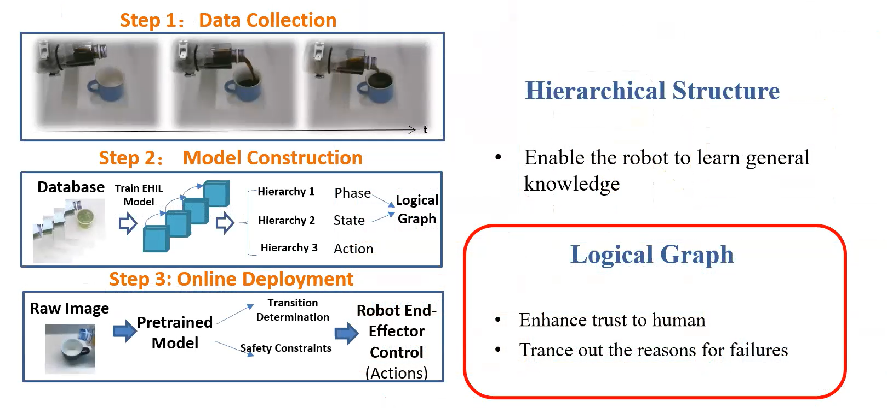

#! https://zhuanlan.zhihu.com/p/436031712
# 机器人领域论文阅读 -- 3

## 1. 灵巧操作的机器人学习 -- Dandan Zhang

研讨会介绍了强化学习，用于构建智能机器人以应对复杂的任务，并在更短的时间内以更少的数据适应不同的场景。 挑战在于克服当前的限制，如黑盒效应、大数据要求、缺乏普遍性。 这一挑战的解决方案称为可解释学习算法。 该方法使用层次结构，如图 8 所示，以改进训练过程。 给我印象最深的是图。 除了倒饮料的案例研究，可解释学习算法还可以应用于其他领域，如医疗机器人、工业机器人等。

## 2. 从人工智能到机器人灵巧：一场正在发生的革命 -- Prof. Nathan Lepora

机器人与人工智能的灵巧性是一个有价值的领域，可以提升整个机器人行业的水平。 由 Lepora 教授领导的一个小组现在正在 BRL 中研究触觉机器人。 Lepora 教授正在研究使用 AI 的软仿生触摸，这是提高机器人灵巧性的绝佳方法。 另一个名为类皮肤触摸传感器的项目可以在触摸传感器时提供准确的力反馈。 3D 打印的触觉手可以捏住不规则的易碎物体而不会破坏它们。 触觉机器人的模拟到真实深度强化学习可以减少机器人的训练工作。

## 3. 同时定位和测绘：自动驾驶当前趋势调查 -- Guillaume Bresson

同时定位与地图构建（SLAM）有着悠久的发展历史。 最近的解决方案是可以接受的，但仍有一些限制。 当 SLAM 应用于长期测试时，一个关键的限制是地图的漂移。 应对这一挑战的可能技术是将全局地图分解为小尺寸地图和多传感器融合的融合。 对于单车 SLAM，挑战在于 1. 如何通过在不同视图中识别同一物体来减少漂移。 2.如何使用物体识别在之前构建的地图中定位。 集中式 SLAM 和分散式 SLAM 都是多车 SLAM 的可能方法，但都具有挑战性。 未来的 SLAM 可能会使用更多的深度学习方法来构建语义图。

## 4. 用于医疗应用的连续性机器人：一项调查 -- Jessica Burgner

精度和连续性使机器人系统成为执行微创手术的绝佳解决方案。 连续性机器人具有更高的灵活性和敏捷性，这使得连续性机器人在微创手术中必不可少。 如今，连续体医疗机器人通常由许多小的离散关节组成，并通过应用标准的 Denavit-Hartenberg (D-H) 参数表来模拟动力学模型。 然而，运动学模型的挑战在于复杂性、准确性和计算成本。 许多医学领域，如神经外科、耳鼻喉科等，都需要连续体机器人。 然而，仍然存在诸如仪器、可视化、OR 集成、人机交互和力传感等挑战需要研究人员解决。