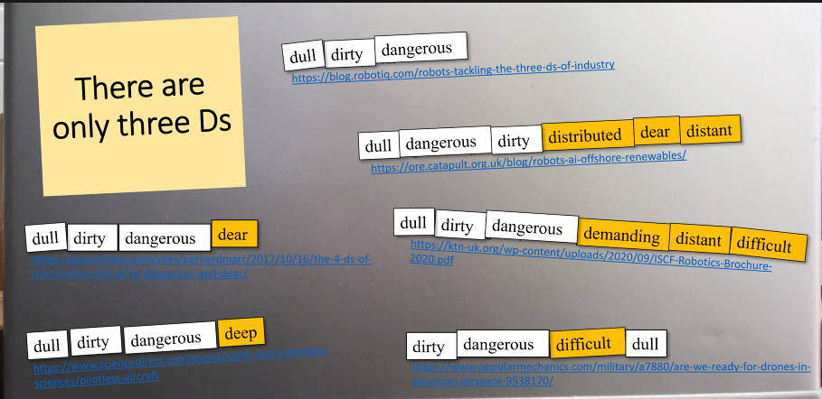

# Week2. 机器人学研究的技能和方法

## Part1: Don't know the title

### Behavior tree

### supervising Swarms

Spread out -> two groups <-> repeat. Easy ex of behavior tree.

### Safe flight automation (Drones)

### Coordinated Tasking

### Vaguely-formed ideas

We build systems/subsystems, not a single machine. If one fails, another one will work.

## Part2: Personal view on robotics

### Robots do roles, but humans do jobs

我们什么时候需要一个机器人？

