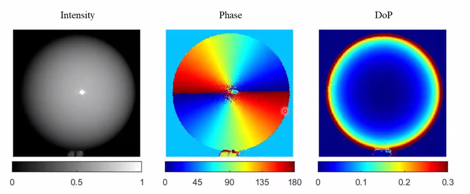
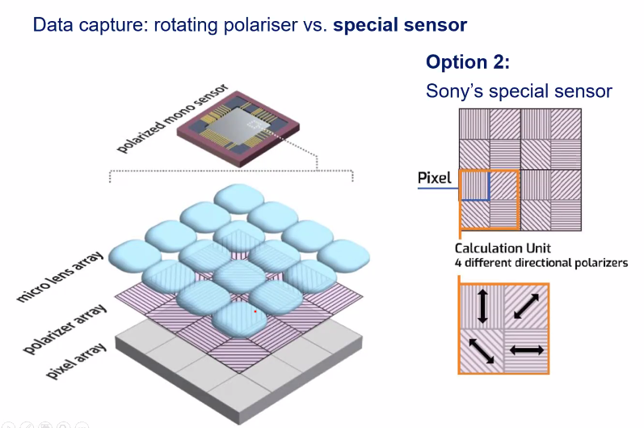
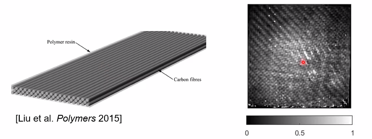
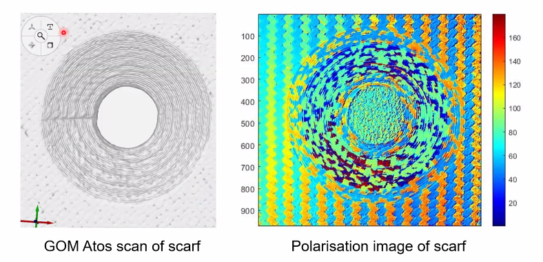
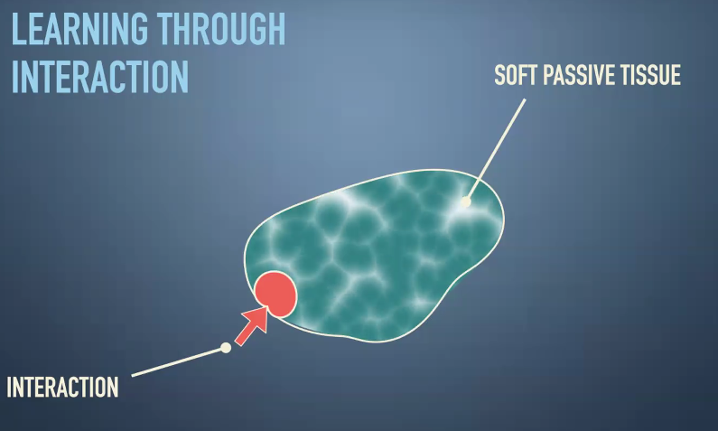

# seminar

## Machine Vision in the composites industry, Polarised light or deep learning-- Gary Atkinson:

> 总而言之就是计算机视觉在工业检测方面的应用。这个已经应用的很广泛了，我之前实习的企业就做这个，技术已经很成熟了。但有一点我不太熟悉的地方是 Polarisation of light，感觉这个是很光学的内容。

### 1. Computer vision and industry

#### 1.1 Definition 

Take known shapes and materials to render 

Extract information from an image

#### 1.2 Applications

E.g., Carbon fiber inspection

#### 2.1 Polarisation of light

Three parameters of light polarisation state, these parameters contains a lot of information

- Intensity, I
- Phase, $\phi$
- Degree, $\rho$

#### 2.3 Polarsation data capture

#### 2.4 Polarisaton for 3D capture

Estimate surface from photo

#### 3.1 Carbon fiber defects

#### 3.3 Carbon fiber local defects

- Apply CNN to detect local defects

#### 3.4 Next steps 

- Classification of defect types

## Morphological Computation -- Helmut Hauser

> 这个老师是研究的是软体机器人，生物机器人，机器人形态学。这个应该算是机械的一个分支，也是比较有趣的研究方法。

### 1. Spider's Web as a computer 

### 2. Sensing Skin

Use a "cloth" to detect force

### 3. Jelly Fish

### 4. Growing and healing robot

> 这个听起来有点科幻。。。是将机器人的理论带入生物学和化学中。

