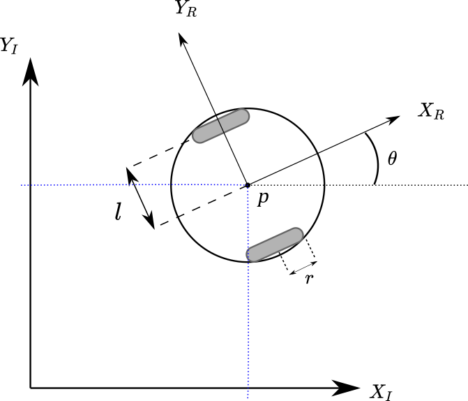

#! https://zhuanlan.zhihu.com/p/425715294
# Lec5. Odometry 里程计 

在机器人中实现里程计的方法有很多，其中最基础的一个就是基于电机编码器 (Encoder)，实现的里程计。实现里程计的目的主要是为了估计机器人的状态（位置和角度）。但基于编码器的里程计并不精确，并且难以实现闭环，因而难以消除累计误差。但如果实现了里程计，我们便可以使机器人：
- 转向特定角度
- 移动到特定位置
- 保持直线行驶
- 估计行驶的距离
- 等等。


## Lab

###  运动学

里程计的运动学模型其实很好理解。对于我们的机器人来说，机器人外壳的几何尺寸是固定不变的，更具体的说，是机器人的两个车轮之间的距离是不变的，车轮的直径也是固定不变。因而，当机器人的两个轮子发生运动的时候，对于里程计而言就可以记录为机器人直行了多少，以及机器人原地旋转了多少。直行是相对来说比较好理解的，当两个轮子的速度一定的时候，便是在直行了。学过差速理论的你一定知道，机器人在转弯的时候，可以理解为机器人是在原地旋转的基础上为其添加了一个前进的速度。这样，就比较好理解里程计是如果将小车的运动拆解为直行和原地旋转了。



机器人坐标系公式整理：

- $\dot{X_{R}} = \frac{r\phi_{l}}{2} + \frac{r\phi_{r}}{2}$

- $\dot{Y_{R}} = 0$

- $\dot{\theta_{R}} = \frac{r\phi_{l}}{2 l} - \frac{r\phi_{r}}{2 l}$

其中：

- $\dot{X_{R}}$ 表示机器人前进的距离
- $\dot{\theta_{R}}$ 表示机器人转动角度
- $r$ 为机器人车轮的半径
- $l$ 为轮距的一般
- $\phi_{l}$ 和 $\phi_{r}$ 分别为左轮和右论旋转的角度，由编码器获得。

现在将机器人坐标转换为世界坐标，以获取机器人在世界坐标系上的位置。首先将机器人的起点作为世界坐标的原点。于是便有了：


世界坐标系跟随机器人的状态进行更新，每一次都在前一个点位的基础上加上新的机器人坐标系传给世界坐标系的值。

$X_{I}^{\;t+1} = X_{I}^{\;t} + ( \;\dot{X_{R}} \; cos \; \theta_{I}^{\;t}\; )$

$Y_{I}^{\;t+1} = Y_{I}^{\;t} + (\;\dot{X_{R}}\; sin \;\theta_{I}^{\;t}\; )$ 

$\theta_{I}^{\;t+1} = \theta_{I}^{\;t} + \dot{\theta_{R}}$

### Coding

关于编程部分，老师的教案给出了很明确的思路，索性这里就直接复制过来了。

首先创建一个结构体用于采集数据：

```c
struct Kinematics_s {

  // Left wheel
  float l_last_angle;  // angular position of wheel in last loop()
  float l_delta_angle; // calucated difference in wheel angle.

  // Right wheel
  float r_last_angle;  // angular position of wheel in last loop()
  float r_delta_angle; // calucated difference in wheel angle.

  float x;             // Global x position of robot
  float y;             // Global y position of robot
  float th;            // Global theta rotation of robot.

}; // A semi-colon finishes the definition.
```

在 setup() 函数中，对结构体初始化：

```c
oid setup() {
  // Existing setup code...
  // ...

  // Get initial rotations for the left and 
  // right wheels
  wb_robot_step(TIME_STEP);

  float l = wb_position_sensor_get_value(left_position_sensor);
  float r = wb_position_sensor_get_value(right_position_sensor);

  // Set initial values for the struct
  // ...
  // pose.x = ???
  // pose.y = ???
  // etc...


}
```

由`e-puck`机器人手册找到机器人的结构参数，并设置为全局变量。

创建一个更新函数，用于实现上述算法：

```c
void updateKinematics() {

  // Get current wheel angular positions

  // Use current and last wheel angular positions
  // to determine l_delta_angle and r_delta_angle

  // Since current value has been used, save the current
  // left and right angles into  l_last_angle and 
  // r_last_angle for the next iteration.

  // Apply delta_angle within the kinematic equations provided.
  // 1) Work out forward contribution of motion
  // 2) Work out theta contribution of rotation

  // Update the X, Y and th values.
  // You can reference the struct in global scope.
  // pose.x  = ????;
  // pose.y  = ????;
  // pose.th = ????;
}
```

从内部loop()实现对运动更新函数的调用（updateKinematics()）。

### Testing

令人难过的是，机器人总是存在误差，目前我还没有完全弄好，下次再进行更新。
